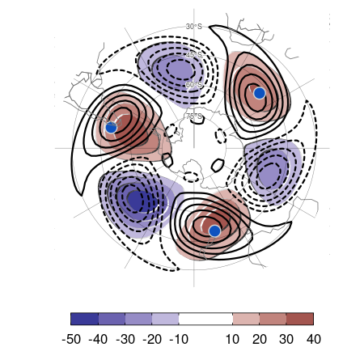
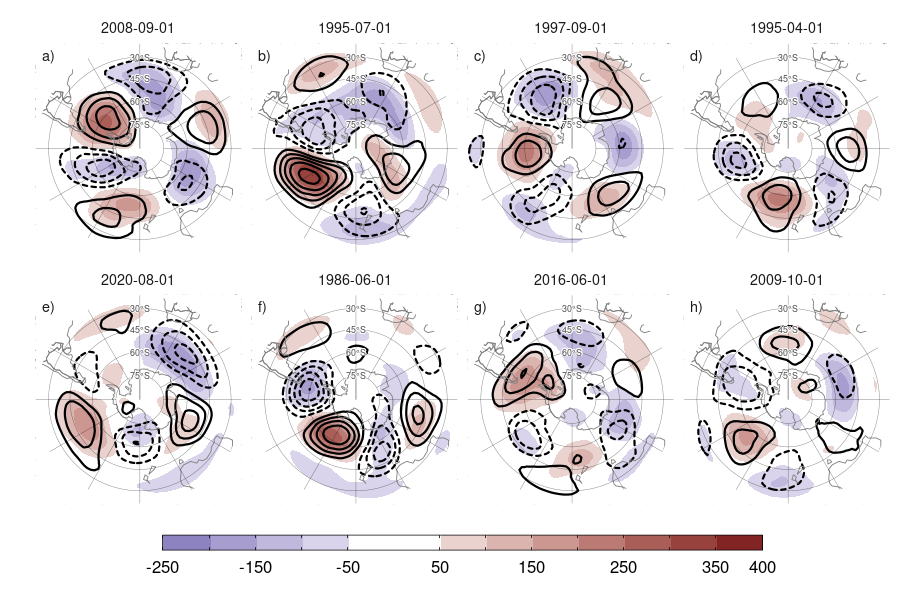
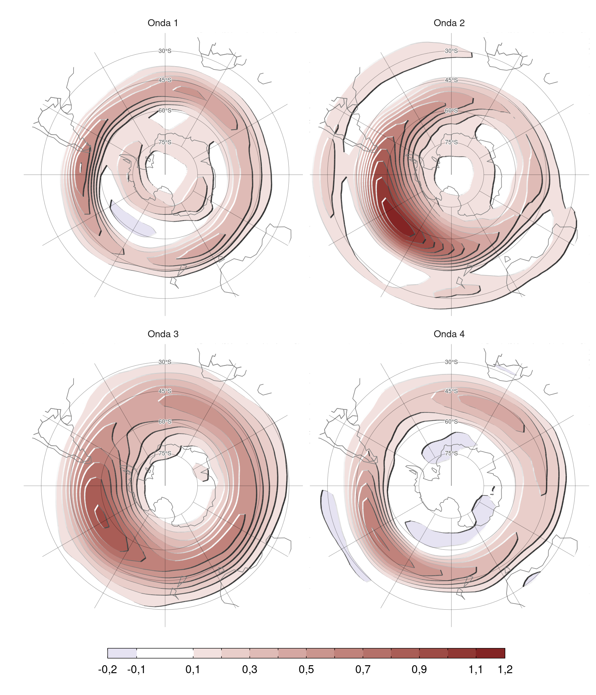

# Exploración de índice de onda 3

La [Introducción](#intro) introdujo conceptualmente algunos aspectos problemáticos de las metodologías e índices normalmente utilizados en la literatura para estudiar la circulación zonalmente asimétrica el hemisferio sur.
Este capítulo analiza empíricamente en más detalle el índice propuesto por @raphael2004 (R04, desde ahora) y la amplitud de la onda calculada a partir de Fourier.

## Métodos

### Datos

Utilizamos datos mensuales de altura geopotencial, del European Centre for Medium-Range Weather Forecasts Reanalysis versión 5 (ERA5) [@hersbach2020]. Estos datos se utilizaron a una resolución espacial de 2,5° de longitud por 2,5° de latitud. 
Utilizamos datos del período post-satelital (1979--2020) para minimizar posibles problemas causados por cambios en la cobertura de datos.

### Índice R04

El índice R04 era, hasta hace poco, el único índice establecido en la literatura para cuantificar la actividad de la onda zonal 3 del hemisferio sur.
Se calcula como el promedio de las anomalías zonales estandarizadas del promedio móvil de tres meses de altura geopotencial en 49ºS y en 500 hPa en tres ubicaciones elegidas para coincidir aproximadamente con los máximos climatológicos de la onda 3 según @vanloon1972: 50ºE, 166ºE y 76ºO.
El promedio móvil de tres meses se aplica para evitar que el índice sea sensible al ciclo estacional de la localización de la onda 3 climatológica.

### Envolvente

Para cuantificar la actividad de las ondas zonales, calculamos la envolvente de las ondas siguiendo a @irving2015.
Primero se calcula la transformada de Fourier de las anomalías de geopotencial en un círculo de latitud determinado, luego se le aplica la transformada inversa sólo al espectro positivo y finalmente se toma el doble de la amplitud de este resultado complejo.

(ref:envolvente-ejemplo-cap) Anomalías zonales de altura geopotencial en 500 hPa en septiembre de 1989 (contornos, líneas sólidas indican valores positivos y líneas punteadas indican valores negativos) y envolvente de ondas zonales (sombreado).

La Figura \@ref(fig:envolvente-ejemplo) muestra un ejemplo de la envolvente de la altura geopotencial en 500 hPa en septiembre de 1989
Las anomalías zonales de altura geopotencial son intensas al sur de Australia y Nueva Zelanda. 
La envolvente captura esa región.

## Software

El análisis de datos se realizó utilizando el lenguaje de programación R [@rcoreteam2020], con los paquetes data.table [@dowle2020] y metR [@campitelli2020].
Los gráficos se hicieron con ggplot2 [@wickham2009].

Los datos de reanálisis fueron descargados con el paquete ecmwfr [@hufkens2020], los datos de CMIP y DAMIP se descargaron con el paquete rcmip6 [@rcmip6] y los índices del ENSO y el dipolo del Índico, con el paquete rsoi [@albers2020].

La tesis se compiló utilizando knitr y rmarkdown [@xie2015; @allaire2020].

## Resultados

(ref:raphael-regr-cap) Mapa de regresión entre R04 y la anomalía zonal de altura geopotencial en 500 hPa (sombreado) y onda 3 del campo medio de altura geopotencial en 500 hPa (contornos; valores positivos en línea llena y nagativos en línea punteada). En azul se indican la ubicación de los puntos usado para calcular R04.

La Figura \@ref(fig:raphael-regr) muestra las ubicaciones definidas por @raphael2004 para calcular el índice y el mapa de regresión entre R04 y el campo de anomalías zonales de altura geopotencial en 500 hPa.
Se observa que representa una onda 3 relativamente pura con una amplitud ligeramente más alta en la región del Pacífico.
Sin embargo, se puede notar que los máximos al sur de Nueva Zelanda y sobre el pasaje de Drake se encuentran más al sur que los puntos usados de referencia.

La onda 3 descrita por R04 coincide bien con la onda 3 climatológica (contornos negros en la Fig \@ref(fig:raphael-regr)).
Esto es por construcción, ya que al usar puntos fijos cercanos a estos máximos climatológicos, R04 busca medir la similitud del campo de anomalías zonales de altura geopotencial con la onda 3 climatológica.

(ref:pseudo-raphael-cap) Relación entre la anomalía zonal de altura geopotencial en los tres puntos utilizados por R04 y la amplitud de la proyección de la geopotencial en 50ºS, 500 hPa con la onda 3 climatológica.

La Figura \@ref(fig:pseudo-raphael) muestra la relación entre la proyección de la altura geopotencial en 50ºS con la onda 3 climatológica en esa latitud y la anomalía zonal de altura geopotencial promediada en las tres ubicaciones de R04 --esto no es exactamente el índice R04 ya que éste se calcula a partir de un promedio móvil de 3 meses y una estandarización previa al promediado.
Ambas series son casi idénticas, con una correlación de 0.97 (CI: 0.96 -- 0.97).
Esto ilustra que el índice R04 no es un índice de la amplitud de al onda 3, sino un índice de cuánto se parecen la altura geopotencial en 50ºS a la onda 3 media en 50ºS.

Si bien la Figura \@ref(fig:raphael-regr) muestra que R04 está asociado con una onda 3 relativamente pura, no es sorprendente que un índice basado en el promedio de 3 puntos esté altamente correlacionado con regiones cercanas a esos puntos.
Esto no demuestra que éste sea un patrón físicamente coherente.

Para investigar la consistencia física de R04 se puede analizar la covariabilidad entre las tres regiones utilizadas para calcularlo.

<table class=" lightable-classic-2" style='font-family: "Arial Narrow", "Source Sans Pro", sans-serif; width: auto !important; margin-left: auto; margin-right: auto;'>
<caption>(\#tab:raphael-correlation)Correlación entre la anomalía zonal de geopotential en los tres puntos considerados por Raphael.</caption>
 <thead>
  <tr>
   <th style="text-align:center;">  </th>
   <th style="text-align:center;"> 50°E </th>
   <th style="text-align:center;"> 165°E </th>
   <th style="text-align:center;"> 75°O </th>
  </tr>
 </thead>
<tbody>
  <tr>
   <td style="text-align:center;"> 50°E </td>
   <td style="text-align:center;"> 1.00 </td>
   <td style="text-align:center;"> 0.15 </td>
   <td style="text-align:center;"> -0.13 </td>
  </tr>
  <tr>
   <td style="text-align:center;"> 165°E </td>
   <td style="text-align:center;"> 0.15 </td>
   <td style="text-align:center;"> 1.00 </td>
   <td style="text-align:center;"> 0.04 </td>
  </tr>
  <tr>
   <td style="text-align:center;"> 75°O </td>
   <td style="text-align:center;"> -0.13 </td>
   <td style="text-align:center;"> 0.04 </td>
   <td style="text-align:center;"> 1.00 </td>
  </tr>
</tbody>
</table>

La Tabla \@ref(tab:raphael-correlation) muestra la matriz de correlación entre la anomalía zonal de altura geopotencial en las ubicaciones utilizada para calcular el índice R04, indicadas por su longitud.
Las correlaciones son muy cercanas a cero, e incluso la correlación entre el punto de 75ºO y 50ºE es negativa.
Esto indica que los puntos no son covariantes y sugiere que no representan un patrón coherente.

(ref:cor-puntos-cap) Regresión entre la anomalía zonal de altura geopotencial en 500 hPa e índices R04 usando combinaciones de 1 y 2 puntos. En cada panel, los puntos azules son los puntos usados para calcular el índice y los negros, los excluidos.

La Figura \@ref(fig:cor-puntos) muestra los campos de regresión de anomalía zonal de altura geopotencial con índices pseudo-R04 computados utilizando sólo un punto (fila a) o promedios de dos puntos (fila b).
No hay un patrón coherente asociado a los puntos individuales.
Las combinaciones de dos puntos se asocian a anomalías positivas en los dos puntos relevantes y negativas entre los mismos --esperable ya que se trata de anomalías zonales-- pero, crucialmente, no hay una asociación positiva con el tercer punto no incluido en el índice.

(ref:raphael-top8-cap) Anomalía zonal de altura geopotencial (sombreado) y anomalía mensual de la anomalía zonal de altura geopotencial (contornos, valores positivos en línea sólida y valores negativos en línea punteada) en 500 hPa para los 8 meses con mayor y menor valor del índice R04. Los puntos azules indican las ubicaciones usadas en el índice R04.

Finalmente, las Figuras \@ref(fig:raphael-top8-1) y \@ref(fig:raphael-top8-2) muestran la anomalía zonal y la anomalía mensual de la anomalía zonal de altura geopotencial en los los 8 meses con mayor y menor valor del índice, respectivamente.
En pocos casos se observa un patrón de onda 3 bien marcado; por ejemplo, en abril de 2003 y noviembre de 1985 (paneles f y g) se observan tres zonas de anomalías positivas cercanas a las ubicaciones utilizadas para calcular R04 y tres zonas de anomalías negativas entre las mismas.
En octubre de 2009 (panel o) se observa lo contrario.
En casos para los cuales el índice es positivo no hay siquiera anomalías positivas en los tres puntos, como en noviembre de 2018 (panel b) diciembre de 1998 (panel e).
En los casos negativos, parece haber un patrón de onda tipo PSA algo más definido, sin embargo, tampoco en estos casos hay buena consistencia entre los puntos.

De este análisis se desprende que el índice propuesto por @raphael2004 no parece representar un fenómeno distintivo de onda 3.

Otra forma de medir la onda 3 es computando la amplitud de fourier de esta onda a lo largo de un circulo de latitud.
El modelo de fourier también asume que la onda 3 tiene una amplitud constante a lo largo de todo el círculo de latitud y que no presenta propagación meridional.
Esta medida no mide exactamente lo mismo que R04, ya que es sensible a la amplitud de la onda 3 sin importar dónde este localizada.
Esto puede observarse en la Figura \@ref(fig:fase-histogram), donde se observa que la localización de la onda 3 varía considerablemente.

(ref:fase-histogram-cap) Histograma de la fase de la onda 3 de altura geopotencial en 500 hPa.

Por otro lado, la onda 3 de la altura geopotencial no es idéntica a la onda 3 de las anomalías mensuales de altura geopotencial.
Dado que la variable relevante para estudiar la variabilidad, los impactos, los forzantes y las tendencias son las anomalías con respecto a la media, desde ahora vamos a analizar las anomalías mensuales.

(ref:zw3-top8-cap) Igual que la Figura \@ref(fig:raphael-top8), pero para los 8 meses con mayor amplitud de la onda 3 de la anomalía mensual de altura geopotencial en 500 hPa.

La Figura \@ref(fig:zw3-top8) es equivalente a la Figura \@ref(fig:raphael-top8) pero para los 8 meses con mayor amplitud de la onda 3 de anomalía mensual de altura geopotencial en 500 hPa.
Se observa que una amplitud alta se asocia a una onda 3 relativamente clara, pero que su amplitud no es constante en todo el hemisferio.
Por ejemplo, la mayor amplitud de la onda 3 se observa en septiembre de 2008 (panel a).
Las anomalías zonales tienen mayor intensidad y se encuentran más al sur en la zona del pacífico y al este de Sudamérica que en el Índico y al sur de Australia.

(ref:envelope-regr-cap) Regresión entre la amplitud de las ondas 1 a 4 y la envolvente de todas las ondas zonales de las anomalías de altura geopotencial.

Esta diferencia longitudinal en la amplitud de las ondas puede capturarse a partir de la envolvente de las ondas.
La Figura \@ref(fig:envelope-regr) muestra la regresión entre la amplitud de las ondas 1 a 4 y la envolvente de todas las ondas zonales de las anomalías de altura geopotencial.
Se observa que la amplitud de la onda 1 se asocia a mayor actividad de onda en una banda aproximadamente zonalmente simétrica, indicando que la onda 1 contribuye con las anomalías zonales aproximadamente en todas las longitudes.
Las ondas 2 y 3, en cambio, contribuyen a las anomalías mensuales de altura geopotencial principalmente en el Pacífico sur.
Esto es consistente con lo observado en casos particulares en la Figura \@ref(fig:zw3-top8) y sugiere que la onda 3 es más localizada que un modelo sinusoidal puro.

## Conclusiones

De este análisis concluimos que ni el modelo de @raphael2004 ni el modelo de Fourier son adecuados para estudiar la onda 3 en el hemisferio sur.
Es necesario un modelo que permita detectar cambios en la fase, modulación zonal de la amplitud y propagación meridional.
En el próximo capítulo presentamos un índice basado en Funciones Empíricas Ortogonales Complejas (cEOF) que resuelve estos problemas.
