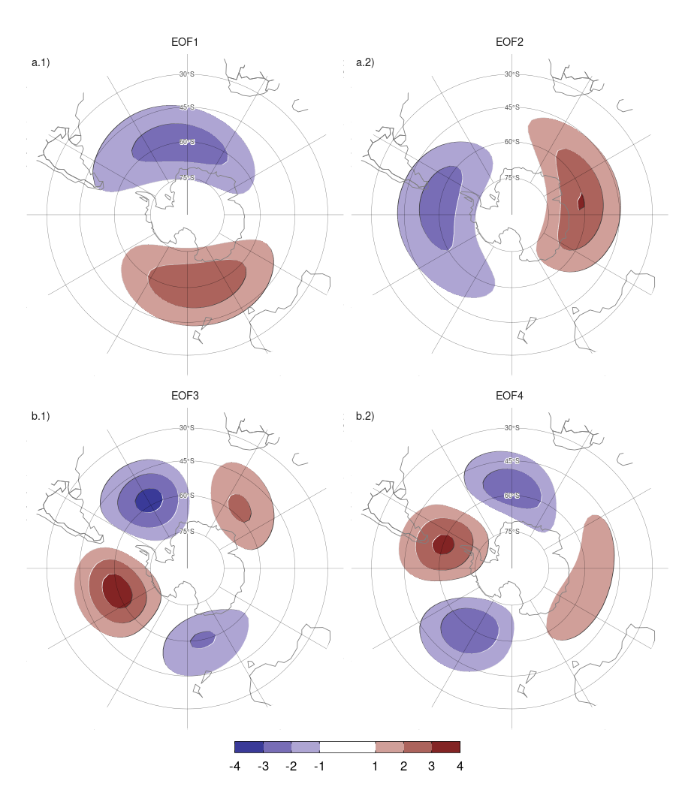
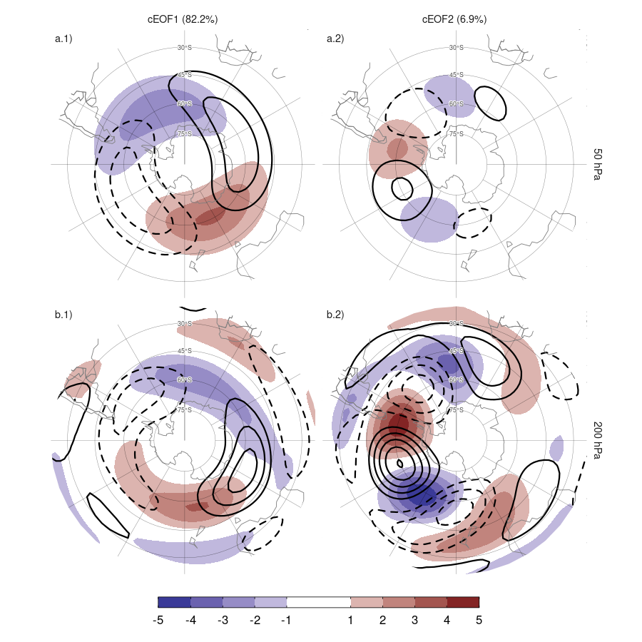
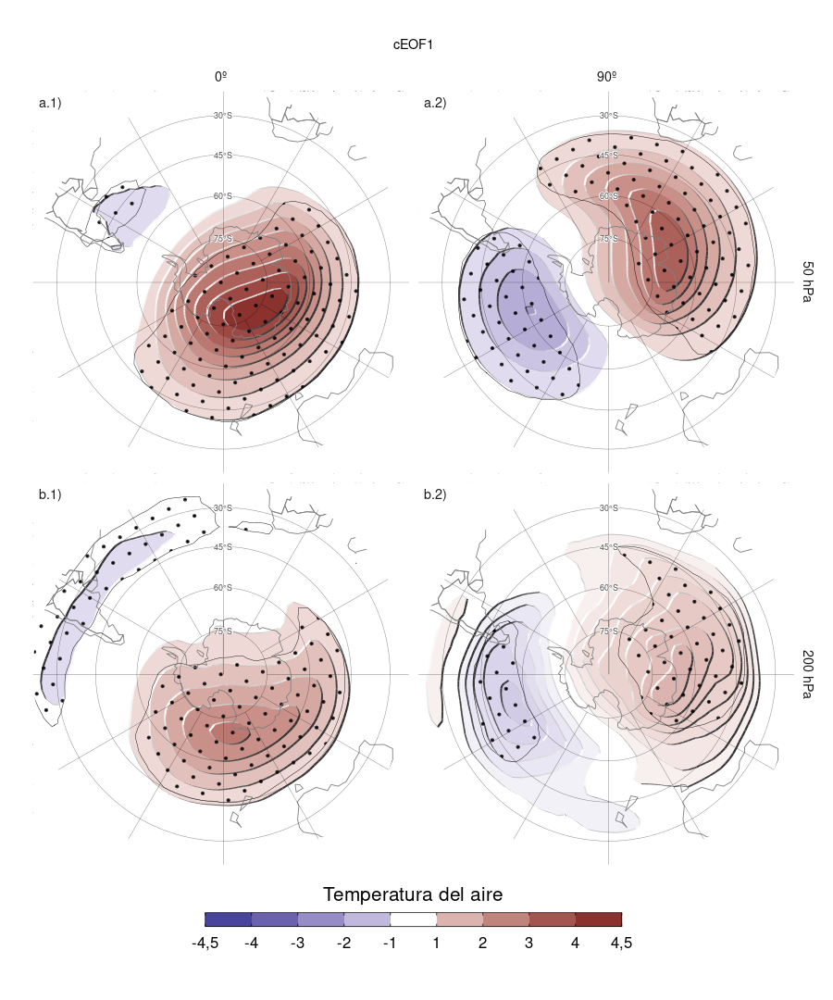
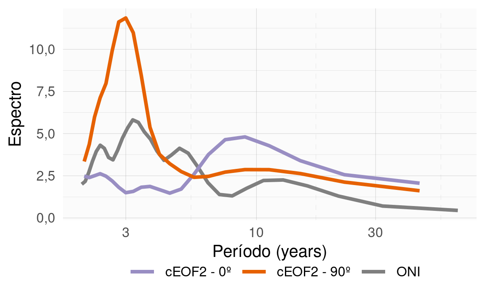
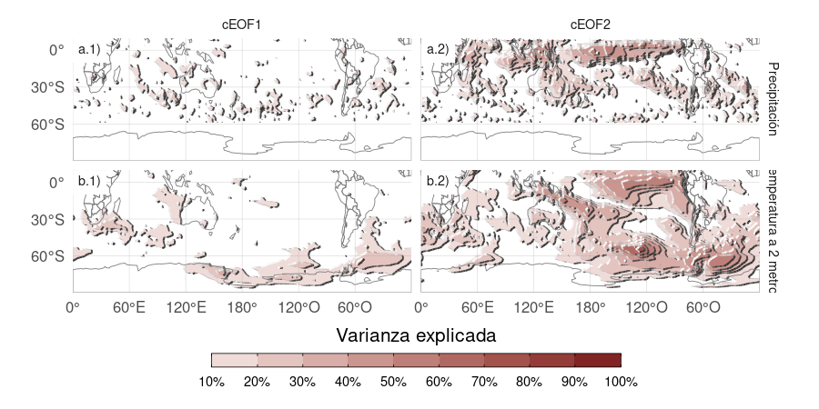

# Modos de variabilidad de la circulación zonalmente asimétrica en primavera {#ceofs}

## Introducción

Dadas las deficiencias de los índices analizados previamente, es necesaria una metodología alternativa para caracterizar la circulación zonalmente asimétrica.
Se propone el uso de cEOFs [@horel1984], ya que éstas permiten caracterizar modos de variabilidad con amplitud y fase variable en el tiempo y con una estructura espacial más compleja que la que presentan ondas sinusoidales constantes por cada círculo de latitud.

En este capítulo el estudio se restringe al trimestre septiembre-octubre-noviembre (SON) ya que durante esta estación las teleconexiones sobre Sudamérica son más intensas [@cazes-boezio2003] y es de interés de esta tesis estudiar las características de la circulación del hemisferio sur de influencia en esa región.
Muchas de las características de los patrones que se obtienen a través de cEOF son similares en los otros trimestres a excepción del trimestre diciembre-enero-febrero, en el cual las ondas zonales están menos organizadas.

Se analizó el nivel de 200 hPa dado que, como se mencionó en la Introducción, es alrededor de este nivel donde se encuentra el máximo de la amplitud de la onda 3 [@campitelli2018b].
Asimismo, dada la importancia de la variabilidad estratosférica en modular la propagación de las ondas, también se incluye el nivel de 50 hPa.

## Métodos

### Datos

Se utilizan datos mensuales de ERA5 al igual que en el capítulo anterior.
Además de la altura geopotencial, se utilizan datos de temperatura del aire y relación de mezcla de ozono y los 37 niveles estándard del reanálisis, temperatura del aire a 2 metros y columna total de ozono (CTO).
La mayor parte del análisis utiliza datos del período post-satelital (1979--2020), aunque también en algunos resultados se extienden hasta 1940 para examinar las tendencias a largo plazo.

El análisis también utiliza la función corriente en 200 hPa que se derivó a partir de la vorticidad de ERA5 utilizando la subrutina de FORTRAN FISHPACK [@fishpack], y con los flujos horizontales de actividad de onda que se calcularon siguiendo el método descrito por @plumb1985.

Para analizar la influencia del océano superficial en la circulación, se utiliza datos mensuales de Temperatura de la Superficie del Mar (TSM) del conjunto Extended Reconstructed Sea Surface Temperature (ERSST) v5 [@huang2017] con una resolución de 2º.

También se utiliza la precipitación mensual del CPC Merged Analysis of Precipitation [CMAP, @xie1997], con una resolución de 2,5º.
Este conjunto de datos de lluvia integra información de diversas fuentes, incluyendo observaciones de pluviómetros, estimaciones inferidas por satélite y el reanálisis NCEP-NCAR.

Además, se incorporaron índices climáticos en nuestro análisis.
El Índice del ENSO Oceánico [ONI, @bamston1997] utilizando en forma operativa por el Climate Prediction Center de la NOAA y el Índice del Dipolo del Índico [DMI, @saji2003] del Global Climate Observing System Working Group on Surface Pressure.

### Regresiones

Para cuantificar la asociación entre múltiples índices o índices multivariados y otras variables meteorológicas se utilizó regresión lineal múltiple.
Para obtener los coeficientes lineales de una variable $Z$ (altura geopotencial, temperatura, precipitación, etc.) con un índice de variables X e Y se ajustó la ecuación

```{=tex}
\begin{equation}
Z(\lambda, \phi, t) = \alpha(\lambda, \phi) \operatorname{X} + \beta(\lambda, \phi) \operatorname{Y} + X_0(\lambda, \phi) + \epsilon(\lambda, \phi, t)
(\#eq:multiple-regression-sam)
\end{equation}
```

donde $\lambda$ y $\phi$ son la longitud y la latitud, $t$ es el tiempo, $\alpha$ y $\beta$ son los coeficientes de regresión lineal, $X_0$ y $\epsilon$ son la constante y los términos de error.
A partir de esta ecuación, $\alpha$ representa la asociación (lineal) de $Z$ con la variabilidad de $X$ que no se explica por la variabilidad de $Y$; es decir, es proporcional a la correlación parcial de $Z$ y $X$, controlando el efecto de $Y$, y viceversa para $\beta$.

Para las regresiones estacionales, se promediaron la variables para cada año y trimestre (DEF, MAM, JJA, SON) antes de calcular la regresión.

La significancia estadística de los campos de regresión se evaluó ajustando los p-valores mediante el control de la Tasa de Falso Descubrimiento [FDR, @benjamini1995; @wilks2016] para evitar resultados engañosos derivados del elevado número de regresiones [@walker1914; @katz1991].

Se calcularon las tendencias lineales mediante mínimos cuadrados ordinarios y el intervalo de confianza del 95% se calculó asumiendo una distribución t con los grados de libertad de los residuos apropiados.

Se calcularon las estimaciones de probabilidad de densidad utilizando un kernel gaussiano de anchura óptima según @sheather1991.

### EOF

Se calcularon los EOFs haciendo la descomposición en valores singulares de la matriz de datos.
Se ponderaron los valores por la raíz cuadrada del coseno de la latitud para tener en cuenta el área representada por cada punto de grilla [@chung1999].

La Figura \@ref(fig:eof-naive) muestra las cuatro primeras EOFs de las anomalías zonales de altura geopotencial de SON en 50 hPa al sur de 20º S.
Se puede observar que los dos primeros EOFs representan un patrón de  onda zonal 1 con los centros  ubicados en fase de cuadratura, es decir, girados en 1/4 de longitud de onda (90º en el espacio de frecuencias). 
Esto implica que  la onda 1 es un patrón no estacionario (es decir, un patrón con características espaciales similares donde la localización de los máximos varía).
Esto se debe a que los EOFs estándar sólo pueden representar patrones estacionarios [@horel1984], mientras que pueden representar patrones no estacionario solamente a partir de la combinación de pares de EOFs.
La amplitud de esta onda 1 podría medirse entonces como $\sqrt{\mathrm{PC1}^2 + \mathrm{PC2}^2}$ y su fase como $\tan^{-1} \left ( \frac{\mathrm{PC2}}{\mathrm{PC1}} \right )$ (donde PC1 y PC2 son las series temporales asociadas a cada EOF).
Lo mismo sucede con el siguiente par de EOFs (EOF3 y EOF4), los cuales representan un mismo patrón con una escala espacial menor.
Esto se fundamenta en la inspección visual cualitativa de estos patrones espaciales y sólo funciona correctamente si ambas fases aparecen claramente divididas en estos dos EOFs, lo cual no está garantizado por construcción.

Las series temporales del Patrón del Pacífico-Sudamérica 1 y 2 (PSA1 y PSA2) fueron computadas como el segundo y tercer EOF de la anomalía de altura geopotencial trimestral en 500 hPa usando todos los trimestres siguiendo a @mo2001.

### Funciones ortogonales complejas (cEOF) {#ceof-metodo}


Una alternativa para representar ondas que varían en su fase es utilizando el análisis de cEOF [@horel1984].
Cada cEOF es un conjunto de estructuras espaciales y series temporales con valores en el plano complejo (es decir, con una parte real y una imaginaria) de la forma

```{=tex}
\begin{align}
E_{(\lambda, \phi, p)} &= (E_{r(\lambda, \phi, p)} +  iE_{i(\lambda, \phi, p)}) \\
T_{(t)} &= (T_{r(t)} +  iT_{i(t)})
(\#eq:ceof-equation)
\end{align}
```

donde $E_{(\lambda, \phi)}$ es la componente espacial del cEOF, que depende de la longitud ($\lambda$), la latitud ($\phi$) y el nivel de presión ($p$) y que tiene una parte real $E_r$ y una imaginaria $E_i$. 
$T_{(t)}$ es la parte temporal del cEOF, al cual también tiene una parte real $T_{r(t)}$ y una imaginaria $T_{i(t)}$
La contribución de cada cEOF al campo original se obtiene como la parte real del producto entre las componentes espacial y temporal.


(ref:eof-naive-cap) Patrones espaciales de los primeros EOFs de las anomalías zonales de altura geopotencial en 50 hPa al sur de 20ºS. Para el período 1979--2020. Unidades arbitrarias.

<div class="figure" style="text-align: center">

<p class="caption">(\#fig:eof-naive)(ref:eof-naive-cap)</p>
</div>

Las componentes real e imaginaria del patrón espacial complejo son la representación de dos patrones espaciales que están desplazados 1/4 de longitud de onda, similar a EOF1 y EOF2 en la Figura \@ref(fig:eof-naive).
En este trabajo la parte real e imaginaria de cada cEOF se referirán como la fase de 0º y la fase de 90º respectivamente.
El campo real reconstruido por cada cEOF es la combinación lineal de los dos campos espaciales ponderados por sus respectivas series temporales.
Esto es análogo a cómo cualquier onda sinusoidal de fase y amplitud arbitraria puede construirse mediante la suma de un seno y un coseno de diferente amplitud pero fase fija.
Esto permite que los cEOF representen patrones ondulatorios que cambian tanto su fase como su amplitud.


<div class="figure" style="text-align: center">

<p class="caption">(\#fig:ejemplo-reconstruccion)(ref:ejemplo-reconstruccion-cap)</p>
</div>

(ref:ejemplo-reconstruccion-cap) Ejemplo idealizado de las dos fases del patrón espacial de un cEOF (fila superior) y cuatro reconstrucciones para distintos valores de sus series temporales.

Un ejemplo idealizado se presenta en la Figura \@ref(fig:ejemplo-reconstruccion), la cual representa la parte espacial de las fases de 0º y 90º de un cEOF hipotético en el panel superior y cuatro reconstrucciones de la variable original en el panel inferior. 
Cuando la serie temporal de la fase de 0º es positiva y la serie temporal de la fase 90º es cercana a cero, entonces las anomalías zonales de altura geopotencial son similares al patrón espacial de la fase de 0º (panel b).
Del mismo modo, cuando la serie temporal de la fase 0º es cercana a cero y la serie la serie temporal de la fase de 90º es positiva, entonces las anomalías zonales de altura geopotencial se parecen a la fase de 90º (panel d).
Cuando ambas fases de la serie temporal son distintas a cero, entonces las anomalías zonales de altura geopotencial tiene los máximos en una localización intermedia (paneles c y e).

El signo de los EOF tradicionales no está determinado unívocamente, por lo que se puede multiplicar cada EOF por -1 (tanto su serie temporal como su patrón espacial) y obtener una descripción igualmente válida.
Este cambio de signo en los números reales corresponde a una rotación en el plano complejo de 0 o $\pi$.
De forma similar, los cEOF no tienen un argumento (entendiendo los números complejos como una magnitud y un argumento) definido, por lo que pueden rotarse en el plano complejo con cualquier ángulo entre 0 y $2\pi$ [@horel1984]; esto es una multiplicación por $\cos(\alpha) + i\sin(\alpha)$ con $\alpha$ cualquier número real entre 0 y $2\pi$.

El procedimiento para calcular los cEOF es similar al de computar los EOF con la única diferencia de que los datos de entrada primero se convierten en su señal analítica.
Ésta señal es un número complejo cuya parte real es la serie original y cuya parte imaginaria son los datos originales desplazados 90º en cada frecuencia espectral, es decir, su transformada de Hilbert.
La transformada de Hilbert suele entenderse en términos de una señal variable en el tiempo, pero las ondas zonales son estructuras con forma de onda en el sentido zonal.
Por esto se calculó la transformada de Hilbert de las anomalías zonales de altura geopotencial variable en cada longitud; es decir, calculada para cada nivel, tiempo y latitud.
Dado que cada círculo de latitud es un dominio periódico, este procedimiento no sufre efectos de borde.

(ref:hilbert-ejemplo-cap) Ejemplo de cálculo de la función analítica de la señal de anomalías zonales de altura geopotencial (m) en 50ºS en SON de 1982. Las anomalías zonales (línea verde en panel e) se pueden descomponer en un número de ondas zonales (paneles a, b, c y d muestran las primeras 4 en verde). La transformada de Hilbert de las anomalías zonales de altura geopotencial (línea naranja en panel e) es la suma de las ondas zonales desplazadas en 1/4 de longitud de onda (líneas naranjas en paneles a, b, c, y d).

<div class="figure" style="text-align: center">

<p class="caption">(\#fig:hilbert-ejemplo)(ref:hilbert-ejemplo-cap)</p>
</div>

La Figura \@ref(fig:hilbert-ejemplo) ilustra la señal analítica con las anomalías zonales de geopotencial de SON en 1982 en 50hPa y 50ºS donde la línea verde es la señal original y la línea naranja es la transformada de Hilbert.
En los paneles superiores la señal está dividida en las ondas zonales 1 a 4 donde se ve con claridad como la transformada de Hilbert es la misma señal pero desplazada 1/4 de longitud de onda.


(ref:corr-ceof-splitted-cap) Coeficiente de determinación ($r^2$) entre la magnitud de las series temporales de los primeros tres cEOFs computados de forma separada en 50 y 200 hPa (p-valores menores a 0,01 en negrita).

<table class=" lightable-classic" style='font-family: "Arial Narrow", "Source Sans Pro", sans-serif; margin-left: auto; margin-right: auto;'>
<caption>(\#tab:corr-ceof-splitted)(ref:corr-ceof-splitted-cap)</caption>
 <thead>
<tr>
<th style="empty-cells: hide;border-bottom:hidden;" colspan="1"></th>
<th style="border-bottom:hidden;padding-bottom:0; padding-left:3px;padding-right:3px;text-align: center; " colspan="3"><div style="border-bottom: 1px solid #ddd; padding-bottom: 5px; ">50 hPa</div></th>
</tr>
  <tr>
   <th style="text-align:left;"> 200 hPa </th>
   <th style="text-align:right;"> cEOF1 </th>
   <th style="text-align:right;"> cEOF2 </th>
   <th style="text-align:right;"> cEOF3 </th>
  </tr>
 </thead>
<tbody>
  <tr>
   <td style="text-align:left;"> cEOF1 </td>
   <td style="text-align:right;font-weight: bold;"> 0,29 </td>
   <td style="text-align:right;"> 0,01 </td>
   <td style="text-align:right;"> 0,03 </td>
  </tr>
  <tr>
   <td style="text-align:left;"> cEOF2 </td>
   <td style="text-align:right;"> 0,00 </td>
   <td style="text-align:right;font-weight: bold;"> 0,59 </td>
   <td style="text-align:right;"> 0,02 </td>
  </tr>
  <tr>
   <td style="text-align:left;"> cEOF3 </td>
   <td style="text-align:right;"> 0,00 </td>
   <td style="text-align:right;"> 0,00 </td>
   <td style="text-align:right;"> 0,01 </td>
  </tr>
</tbody>
</table>

Se calcularon los cEOFs de las anomalías zonales de geopotencial en los niveles de 50 y 200 hPa al sur de 20ºS por separado en el período 1979--2020.
La Tabla \@ref(tab:corr-ceof-splitted) muestra el coeficiente de determinación de la magnitud de las series temporales de los cEOF entre 50 y 200 hPa.
Una correlación significativa entre la magnitud de los respectivos cEOF1 y cEOF2 en cada nivel.
Los patrones espaciales de los cEOF de 50 hPa y 200 hPa también son similares (no se muestra).

Tanto la similitud del patrón espacial como la alta correlación temporal de los cEOF calculados a 50 hPa y 200 hPa sugieren que se trata, en gran medida, de modos de variabilidad conjunta.
Esto motivó calcular los cEOF en ambos niveles conjuntamente.
El resultado es que cada cEOF tiene una componente espacial que depende de la longitud, la latitud y el nivel, y una componente temporal que sólo depende del tiempo.
Dada las diferencias de magnitud entre la variabilidad de la altura geopotencial en 50 hPa y 200 hPa, se estandarizaron las variables de cada nivel por su desvío estándar.

Como se mencionó anteriormente, el argumento de los cEOF no está determinado unívocamente y se le puede sumar una constante real arbitraria.
Para facilitar la interpretación y permitir la reproducibilidad, se define el argumento de cada cEOF de modo que alguna de las dos fases esté alineada con alguna variable significativa de nuestro análisis.
Este procedimiento no crea correlaciones espurias, sólo toma una relación existente y la alinea con una fase específica.

Un análisis preliminar mostró que el cEOF1 está estrechamente relacionado con la onda zonal 1 de la Columna Total de Ozono (CTO) y el cEOF2 está estrechamente relacionado con el ENSO.
Por lo tanto, se eligió el argumento del cEOF1 de forma que la serie temporal correspondiente al cEOF1 de 0º tenga la máxima correlación con la onda zonal 1 del CTO entre 75°S y 45°S.
Del mismo modo, se eligió  el argumento del cEOF2 de modo que el coeficiente de determinación entre el ONI y el cEOF2 de 0º sea mínimo, lo que también casi maximiza la correlación con el cEOF2 de 90º.


Si bien los cEOFs se calcularon para el período 1979--2020, se extendieron las series temporales complejas hasta el periodo 1950--1978 proyectando las anomalías zonales mensuales de altura geopotencial normalizadas por nivel al sur de 20ºS sobre los patrones espaciales correspondientes.

## Resultados

### Caracterización espacio-temporal de los cEOFs principales

Las Figuras \@ref(fig:ceofs-1) y \@ref(fig:extended-series) muestran las partes espacial y temporal de los dos primeros cEOFs de las anomalías zonales de la altura geopotencial en 50 hPa y 200 hPa, calculados conjuntamente en ambos niveles.
El primer modo (cEOF1) explica el 82,2% de la varianza de las anomalías zonales, mientras que el segundo modo (cEOF2) explica una fracción menor (6,9%).
En los patrones espaciales (Fig. \@ref(fig:ceofs-1)), las fases de 0º y 90º están en cuadratura por construcción, de modo que cada cEOF describe un único patrón ondulatorio cuya amplitud y fase está controlada por la magnitud y fase de su serie temporal.

(ref:ceofs-1-cap) Patrones espaciales de los dos primeros cEOF de las anomalías zonales de altura geopotencial de SON en 50 (columna a) y 200 (columna b) hPa para el período 1979--2020. El sombreado corresponde a la fase 0º y los contornos, a la fase 90º. La proporción de varianza explicada por cada modo con respecto a la media zonal está indicada entre paréntesis. Unidades arbitrarias.

<div class="figure" style="text-align: center">

<p class="caption">(\#fig:ceofs-1)(ref:ceofs-1-cap)</p>
</div>


(ref:extended-series-cap) Series temporales de los dos primeros cEOF de las anomalías zonales de altura geopotencial de SON en 50 y 200 hPa para el período 1940--2020. El cEOF1 (fila a) y cEOF2 (fila b) separados en la fase 0º (columna 1) y la fase 90º (columna 2). Las líneas oscuras muestran la tendencia lineal mediante un suavizado de regresión local. Las líneas negras horizontales y verticales muestran el valor medio y el rango de cada serie, respectivamente. La proporción de varianza explicada por cada modo con respecto a la media zonal está indicada entre paréntesis. Unidades arbitrarias.

<div class="figure" style="text-align: center">

<p class="caption">(\#fig:extended-series)(ref:extended-series-cap)</p>
</div>


El cEOF1 (Fig. \@ref(fig:ceofs-1) columna 1) presenta un patrón de onda 1 con amplitud máxima en latitudes altas y en altura.
En 50 hPa la fase de 0º del cEOF1 tiene el máximo de la onda 1 en 150ºE y en 200 hPa el máximo se sitúa en torno a 175ºE indicando un desplazamiento hacia el oeste con la altura.
El cEOF2 (Fig. \@ref(fig:ceofs-1) columna 2) muestra también una estructura de onda zonal con amplitud máxima en latitudes altas, pero con escalas espaciales más cortas.
En particular, la estructura dominante a ambos niveles es una onda 3 pero con mayor amplitud en el sector del océano Pacífico.
No hay cambio de fase o desplazamiento aparente con la altura, pero la amplitud del patrón se reduce considerablemente en la estratosfera, lo que es coherente con el hecho de que el cEOF2 calculado por separado para 200 hPa explica un porcentaje mayor de la varianza que el cEOF2 calculado por separado para 50 hPa (11% vs. 3%, respectivamente).
Esto sugiere que este modo barotrópico está asociado principalmente con la variabilidad troposférica.


No se encontró una correlación significativa entre las series temporales del cEOF1 y el cEOF2 en ninguna fase (no se muestra).
Ambos cEOF muestran variabilidad interanual pero no muestran evidencia de variabilidad decadal (Fig. \@ref(fig:extended-series)).
Debido a que los campos que entran en el algoritmo de cEOF son anomalías con respecto a la media zonal en lugar de la media temporal, las series temporales de los cEOF tienen media temporal no nula.
Sin embargo, la media temporal de cEOF2 es casi cero, lo que indica que sólo el cEOF1 incluye variabilidad que se proyecta significativamente sobre el campo anómalo zonal medio.
Esto es coherente con el hecho de que el campo medio zonalmente anómalo de la altura geopotencial es muy similar al cEOF1 ($r^2$ = 98%) y no es similar al cEOF2 ($r^2$ = 0%).

La fase de 0º del cEOF1 evidencia una variación a largo plazo, con valores generalmente negativos al comienzo del período y positivos al final (Fig. \@ref(fig:extended-series)a.1, p-valor de la tendencia lineal = 0,0024).
Esta tendencia positiva parece haber desparecido luego de 2000 a indica un aumento de la magnitud de la onda zonal 1 de latitudes altas.
Por otra parte, no se encuentran tendencias significativas en ninguna de las fases de cEOF2.

### Mapas de regresión a partir de los cEOF

#### Altura geopotencial

En la sección anterior se mostraron los patrones espaciales de los cEOF obtenidos a partir de las anomalías zonales de altura geopotencial.
En esta sección se calculan campos de regresión entre las series temporales de los cEOF y las anomalías temporales de altura geopotencial para describir la influencia de los cEOF en las anomalías temporales.


(ref:eof1-regr-gh-cap) Regresión de anomalías de altura geopotencial en SON (m) con la fase de 0º (columna 1) y de 90º (columna 2) del cEOF1 en 50 hPa (fila a) y 200 hPa (fila b) para el período 1979--2020. Estos coeficientes fueron obtenidos a partir de una regresión múltiple incluyendo ambas fases. Áreas con puntos marcan regiones donde el p-valor es menor que 0,01 ajustado por FDR.

<div class="figure" style="text-align: center">

<p class="caption">(\#fig:eof1-regr-gh)(ref:eof1-regr-gh-cap)</p>
</div>

La Figura \@ref(fig:eof1-regr-gh) muestra los mapas de regresión de anomalías de altura geopotencial en SON asocaidas al cEOF1.
En 50 hPa (Fig. \@ref(fig:eof1-regr-gh) fila a), la fase de 0º del cEOF1 está asociada a un centro de anomalías positivas sobre la Antártida con su centro sobre el Mar de Ross.
Por otro lado, el centro de anomalías positivas asociado a la fase de 90º está corrido hacia Antártida Oriental y tiene un patrón de onda 1 más evidente.

En 200 hPa (Fig. \@ref(fig:eof1-regr-gh) fila b) la fase de 0º del cEOF1 muestra un único centro de anomalías positivas que abarca la Antártida Occidental rodeado de anomalías opuestas en latitudes más bajas, con su centro desplazado ligeramente hacia el este en comparación con las anomalías de niveles superiores.
La fase de 90º muestra un patrón mucho más simétrico zonalmente que se asemeja al patrón de anomalías características de la fase negativa del SAM [@fogt2020].
En ambas fases las anomalías negativas en latitudes bajas son débiles y no son estadísticamente significativas

Por lo tanto, la magnitud y la fase del cEOF1 están asociadas a la magnitud y la fase de una onda zonal principalmente en la estratosfera.

(ref:eof2-regr-gh-cap) Igual que la Figura \@ref(fig:eof1-regr-gh) pero para el cEOF2.

<div class="figure" style="text-align: center">

<p class="caption">(\#fig:eof2-regr-gh)(ref:eof2-regr-gh-cap)</p>
</div>

La Figura \@ref(fig:eof2-regr-gh) muestra los mapas de regresión de las anomalías de altura geopotencial para el cEOF2.
Tanto en 50 como en 200 hPa se observan patrones similares a los de la Figura \@ref(fig:ceofs-1) columna 2.
Las anomalías de regresión asociadas con la fase de 0º del cEOF2 están desfasadas 1/4 de longitud de onda con respecto a las asociadas con la fase de 90º.
Todos los campos tienen una onda zonal dominante 3 limitada al hemisferio occidental, sobre los océanos Pacífico y Atlántico.

En 50 hPa (Fig. \@ref(fig:eof2-regr-gh) fila a) también se destaca un monopolo sobre el polo con signo negativo en la fase de 0º y signo positivo en la fase de 90º.
Este monopolo podría indicar fortalecimiento del vórtice polar asociado a valores positivos de la fase de 0º del cEOF2 y debilitamiento asociado a valores negativos de la fase de 0º del cEOF2.
Sin embargo, estas anomalías no son estadísticamente significativas, indicando que su magnitud es baja en comparación a la variabilidad estratosférica y que esta característica no debe sobreinterpretarse.

En 200 hPa (Fig. \@ref(fig:eof2-regr-gh) fila b) el tren de ondas es robusto ya que los centros son estadísticamente significativos, con anomalías insignificantes por fuera de este patrón.
La localización de las anomalías no varía en la vertical, lo cual vuelve a confirmar que se trata de un modo barotrópico equivalente.

El cEOF2 representa entonces un tren de ondas de estructura barotrópica equivalente muy similar al de los patrones PSA [@mo2001].
Comparando la localización de la anomalía positiva cerca de 90ºO en la columna 2 de la Figura \@ref(fig:eof2-regr-gh) con las Figuras 1.a y b de @mo2001, el mapa de regresión de la fase de 0º podría identificarse con el PSA2, mientras que la fase 90º se asemeja al PSA1.
Por otro lado, ambos modos muestran relación con patrones anulares semejantes al SAM.
Se estudiará la relación entre los cEOF y el PSA con más detalle en la sección \@ref(psa).

#### Temperatura y Ozono

(ref:eof1-regr-t-cap) Igual que la Figura \@ref(fig:eof1-regr-gh) pero para la temperatura del aire (K).

<div class="figure" style="text-align: center">

<p class="caption">(\#fig:eof1-regr-t)(ref:eof1-regr-t-cap)</p>
</div>


(ref:t-vertical-cap) Regresión de anomalías zonales de temperatura (sombrado, K) y razón de mezcla de ozono (contornos, valores negativos en línea punteada, etiquetas en partes por mil millón en masa) promediados entre 75°S y 45°S en SON con la fase de 0º (a) y de 90º (b) del cEOF1 para el período 1979--2020.
 

<div class="figure" style="text-align: center">

<p class="caption">(\#fig:t-vertical)(ref:t-vertical-cap)</p>
</div>

Se evaluó la señal de la variabilidad de los cEOF en la temperatura del aire.
La Figura \@ref(fig:eof1-regr-t) muestra los mapas de regresión de las anomalías de esta variable en 50 hPa y 200 hPa con el cEOF1.
La distribución de los coeficientes de regresión de la temperatura en 50 hPa y en 200 hPa refleja la que muestran los mapas de regresión de la altura geopotencial en 50 hPa (Fig. \@ref(fig:eof1-regr-gh)).
Es decir, anomalías positivas de ambas variables ubicadas en las mismas regiones, lo que es indicio del carácter dinámico de los procesos que las vinculan.
En ambos niveles, la fase de 0º está asociada con anomalías positivas sobre el Polo Sur con su centro desplazado ligeramente hacia 150ºE (Fig. \@ref(fig:eof1-regr-t) columna 1).
Por otro lado, los mapas de regresión de las anomalías de temperatura con la fase de 90º muestran un patrón de onda 1 más claro con su máximo alrededor de los 60ºE.

La Figura \@ref(fig:t-vertical) muestra la distribución vertical de los coeficientes de regresión del cEOF1 con las anomalías zonales de la temperatura del aire y de la razón de mezcla de ozono, ambas promediadas entre 75°S y 45°S.
Las anomalías zonales de temperatura asociadas al cEOF1 muestran un claro patrón de onda 1 tanto para la fase de 0º como para la de 90º en toda la atmósfera por encima de 250 hPa con una inversión de signo por encima de 10 hPa.
Como resultado del balance hidrostático, este es el nivel en el que la anomalía geopotencial tiene máxima amplitud (no se muestra).

Los valores máximos de la regresión con el ozono coinciden con los valores mínimos de temperatura por encima de 10 hPa y con los máximos por debajo de 10 hPa (Fig. \@ref(fig:t-vertical)).
Por lo tanto, la onda zonal 1 de ozono está correlacionada negativamente con la onda zonal 1 de temperatura en la estratosfera superior, y positivamente en la estratosfera baja.
Este cambio de fase es típicamente observado en las anomalías de ozono forzadas por ondas planetarias que alcanzan la estratosfera.
En la estratosfera superior, dominada por procesos fotoquímicos, las temperaturas frías inhiben la destrucción de ozono, explicando el comportamiento opuesto para ambas variables, tal y como se dilucidó con modelos químicos dinámicos [@hartmann1979; @wirth1993; @smith1995].
Por otro lado, en la estratosfera baja, dominada por la advección, las anomalías de ozono están desfasadas 1/4 de longitud de onda con el transporte horizontal y vertical, que a su vez están desfasados 1/4 de longitud de onda con las anomalías de temperatura, resultando anomalías del mismo signo para la respuesta de ambas variables [@hartmann1979; @wirth1993; @smith1995].


(ref:o3-regr-cap) Regresión de las anomalías de Columna Total de Ozono (CTO, sombreado, unidades Dobson) con la fase de 0º (a) y de 90º (b) del cEOF1 para el período 1979--2020. En contornos, la anomalía zonal media de de CTO (contornos negativos en líneas punteadas, unidades Dobson). Áreas con puntos marcan regiones donde el p-valor es menor que 0,01 ajustado por FDR.

<div class="figure" style="text-align: center">

<p class="caption">(\#fig:o3-regr)(ref:o3-regr-cap)</p>
</div>

(ref:wave1-o3-cap) Relación entre la amplitud y la fase de la onda zonal 1 de la Columna Total de Ozono promediada entre 75°S y 45°S y la amplitud y la fase del cEOF1 para SON en el período 1979--2020.


Los mapas de regresión de las anomalías de CTO con el cEOF1 (Fig. \@ref(fig:o3-regr)) muestran patrones de onda zonal 1 en ambas fases del cEOF1.
La posición climatológica del mínimo de ozono durante la primavera no está centrada sobre el Polo Sur, sino que está desplazada hacia el mar de Weddell [ej, @grytsai2011]; este desplazamiento se traduce en una onda 1 de la CTO.
Así, el campo de regresión de la fase de 0º del cEOF1 (Fig. \@ref(fig:o3-regr)a) coincide con la posición climatológica de esta onda 1 del mínimo de ozono, mientras que el campo para la fase de 90º está defasado en 90º cEOF1.
La correlación temporal entre la amplitud de la onda 1 de CTO y la amplitud del cEOF1 es 0,79 (CI: 0,63 -- 0,88), mientras que la correlación entre sus fases es -0,85 (CI: -0,92 -- -0,74).
La correlación entre las dos ondas es -0,87 (CI: -0,93 -- -0,77).
Esto implica que el cEOF1 está fuertemente relacionado con la variabilidad del ozono del hemisferio sur.

### PSA {#psa}

(ref:psa-eof2-cap) Coeficiente de correlación entre las series temporales de las fases de 0º y 90º del cEOF2 con los modos PSA1 y PSA2 para el período 1979--2020. Los intervalos de confianza de 95% se muestran en paréntesis. Estimaciones significativas con p-valor menor a 0,01 en negrita.

<table class=" lightable-classic" style='font-family: "Arial Narrow", "Source Sans Pro", sans-serif; margin-left: auto; margin-right: auto;'>
<caption>(\#tab:psa-eof2)(ref:psa-eof2-cap)</caption>
 <thead>
  <tr>
   <th style="text-align:left;"> PC </th>
   <th style="text-align:left;"> 0º </th>
   <th style="text-align:left;"> 90º </th>
  </tr>
 </thead>
<tbody>
  <tr>
   <td style="text-align:left;"> PSA1 </td>
   <td style="text-align:left;"> 0,15 (CI: -0,16 -- 0,44) </td>
   <td style="text-align:left;font-weight: bold;"> 0,74 (CI: 0,56 -- 0,85) </td>
  </tr>
  <tr>
   <td style="text-align:left;"> PSA2 </td>
   <td style="text-align:left;font-weight: bold;"> 0,77 (CI: 0,61 -- 0,87) </td>
   <td style="text-align:left;"> 0,25 (CI: -0,06 -- 0,52) </td>
  </tr>
</tbody>
</table>

Dada la similitud entre las estructuras asociadas al cEOF2 (Fig. \@ref(fig:eof2-regr-gh)) y los patrones del PSA, se estudió la relación entre ellos con mayor profundidad.
La Tabla \@ref(tab:psa-eof2) muestra las correlaciones entre las series temporales del PSA1 y el PSA2 y las series temporales de las fases de 0º y 90º del cEOF2.
Como se anticipaba visualmente en la Figura \@ref(fig:eof2-regr-gh), existen   correlaciones positivas altas entre el PSA1 y la fase de 90º, y entre el PSA2 y la fase de 0º cEOF2.
Por otro lado, no existe una relación significativa entre el PSA1 y la fase de 0º ni entre el PSA2 y la fase de 90º cEOF2.
En consecuencia, el cEOF2 representa bien tanto la estructura espacial como la evolución temporal de los modos PSA, por lo que es posible establecer una asociación entre sus dos fases y los dos modos PSA.
Es decir, la fase del cEOF2 que tiene máxima correlación con el ENSO es la que tiene máxima correlación con el PSA1 y la fase del cEOF2 que tiene mínima correlación con el ENSO es la que tiene máxima correlación con el PSA2 (no se muestra).

(ref:phase-histogram-cap) Histograma de la distribución de fases del cEOF2 para el periodo 1979--2020. Los intervalos están centrados en 90º, 0º, -90º, -180º con un ancho del intervalo de 90º. Las pequeñas líneas verticales cerca del eje horizontal marcan los valores de cada trimestre SON.

<div class="figure" style="text-align: center">

<p class="caption">(\#fig:phase-histogram)(ref:phase-histogram-cap)</p>
</div>

La Figura \@ref(fig:phase-histogram) muestra un histograma para cada trimestre con la distribución de la fase del cEOF2, donde se marcan también las observaciones con líneas verticales en el eje horizontal.
El cEOF2 tiene una fase similar a $\pm$ 90º en un 62% de los años, indicando que es la fase más común.
Esta preferencia de fase está de acuerdo con @irving2016 que encontró una distribución bimodal en la variabilidad tipo PSA (comparación de la Figura \@ref(fig:phase-histogram) con la Figura 6 de @irving2016).

Estos resultados sugieren entonces que el cEOF2 permite caracterizar la variabilidad del PSA de forma alternativa al EOF tradicional propuesto por @mo2001, entre otros autores.
De esta forma, con la metodología de cEOF se puede caracterizar al PSA como un continuo de ubicaciones, en vez de como dos modos estacionarios separados, como surge de la metodología de EOF.


### Fuentes de variabilidad tropical {#fuentes-ceof}


(ref:psi-sst-explained-variance-cap) Porcentaje de varianza de las anomalías de TSM (fila a) y de las anomalías zonales de función corriente (fila b) explicada por el cEOF1 (columna 1) el cEOF2 (columna 2).

<div class="figure" style="text-align: center">

<p class="caption">(\#fig:psi-sst-explained-variance)(ref:psi-sst-explained-variance-cap)</p>
</div>

Para evaluar si la variabilidad de los cEOF analizados está relacionada con fuentes de variabilidad en la banda tropical se calculó la regresión de distintas fases de los cEOFs con las anomalías de TSM y con las anomalías zonales de función corriente en 200 hPa.
La Figura \@ref(fig:psi-sst-explained-variance) muestra la varianza de cada variable explicada por cada cEOF a partir de la regresión lineal múltiple de ambas fases. 

El cEOF2, en cambio, se asocia con una gran proporción de la variabilidad tropical tanto de las anomalías de TSM como de las de función corriente (Fig. \@ref(fig:psi-sst-explained-variance) columna 2).
Este modo comparte más de un 50% de la varianza con las TSM en el Pacífico central , sugiriendo la influencia del ENSO.
En cuanto a la función corriente, en el Pacífico el modo explica más del 50% de la varianza en la región del cambio de fecha y sobre Indonesia.
También explica gran parte de la varianza en al oeste y al este de la Península Antártica, llegando a más del 80% sobre el mar de Amundsen.


(ref:sst-psi-2-cap) Regresión de (columna 1) TSM (K) y (columna 2) anomalías zonales de función corriente ($m^2/s\times10^-7$) y sus vectores de acción de onda con diferentes fases del cEOF2 (indicado con la flecha) en el período 1979--2020. Áreas con puntos marcan regiones donde el p-valor es menor que 0,01 ajustado por FDR.

<div class="figure" style="text-align: center">

<p class="caption">(\#fig:sst-psi-2)(ref:sst-psi-2-cap)</p>
</div>

La Figura \@ref(fig:sst-psi-2) muestra los mapas de regresión de las anomalías de la temperatura de la superficie del mar (TSM) y de la función de corriente a 200 hPa con las series temporales normalizadas de cada fase del cEOF2.
Además de los mapas de regresión para las fases de 0º y 90º, se incluyen las regresiones correspondientes para dos fases intermedias (correspondientes a 45º y 135º).
Para esto, se rotaron los cEOF en 1/4 de longitud de onda multiplicando las series temporales complejas por $cos(\pi/4) + i\sin(\pi/4)$ y calculando la regresión sobre esas series temporales rotadas.

La fase de 90º (Fig. \@ref(fig:sst-psi-2) fila b) está asociada a fuertes anomalías positivas de la TSM en el Pacífico central y oriental y a anomalías negativas en una zona que atraviesa el norte de Australia, Nueva Zelanda y la Zona de Convergencia del Pacífico Sur (SPCZ) (Fig. \@ref(fig:sst-psi-2).b1).
Este patrón es muy similar al patrón del ENSO positivo canónico [@bamston1997].
De hecho, existe una correlación significativa y muy alta entre el ONI y la serie temporal de la fase de 90º del cEOF2 (0,76 (CI: 0,6 -- 0,87)).
Además del patrón similar al ENSO del Pacífico, también hay anomalías positivas en el océano Índico occidental y valores negativos en el océano Índico oriental, lo que se asemeja al patrón DMI en su fase positiva [@saji1999].
Consistentemente, la correlación entre la fase de 90º del cEOF2 y el DMI es 0,62 (CI: 0,38 -- 0,77).
Sin embargo, la correlación semiparcial es de 0,21 (p-valor = 0,18), indicando que el DMI explica poca varianza de la fase de 90º del cEOF2 por sí mismo.
Esto puede observarse en la Figura \@ref(fig:euler), donde se ilustra la partición de la varianza de la fase de 90º del cEOF2, el DMI y el ONI.
El DMI explica, independientemente, sólo un 4.5% de la varianza, mientras que el ONI explica un 24.8% por sí mismo.

<div class="figure" style="text-align: center">

<p class="caption">(\#fig:euler)(ref:euler-cap)</p>
</div>

(ref:euler-cap) Diagrama de Euler mostrando la proporción de la varianza de cada serie (DMI, ONI y la fase de 90º del cEOF2) explicada por las demás (p.ej. la región común entre DMI y ONI es la varianza del DMI explicada por el ONI y viceversa).

La fase de 90º del cEOF2 está asociada a anomalías de la función corriente que emanan de los trópicos (Fig. \@ref(fig:sst-psi-2).b2), tanto del sector del Pacífico Central como del Océano Índico.
Esta respuesta atmosférica es consistente con el efecto combinado del ENSO y el DMI sobre los extratrópicos: con anomalías de la TSM que inducen convección tropical anómala en ambas cuencas oceánicas, que a su vez excita ondas de Rossby que se propagan meridionalmente hacia latitudes más altas [p.ej. @mo2000; @cai2011; @nuncio2015].

Sin embargo, el cEOF2 no está asociado a los mismos patrones de anomalía de las TSM tropicales en todas sus fases.
Los paneles d1 y d2 de la Figura \@ref(fig:sst-psi-2) muestran que la fase de 0º del cEOF2 no está asociada a ninguna anomalía significativa de las TSM ni de la función corriente en los trópicos.
Tampoco la correlación entre la fase de 0º del cEOF2 y el ENSO es significativa (0 (CI: -0,3 -- 0,31)).
Las filas a y c de la Fig.\@ref(fig:sst-psi-2) muestran que las fases intermedias siguen asociadas con anomalías significativas de la TSM sobre el Océano Pacífico, pero en lugares ligeramente diferentes.
La fase de 135º está asociada a anomalías de la TSM en el Pacífico central (Fig.\@ref(fig:sst-psi-2)a.1), mientras que la fase de 45º (Fig.\@ref(fig:sst-psi-2)c.1) está asociada a anomalías de la TSM que corresponden aproximadamente a los "sabores" de ENSO del Pacífico central y del Pacífico oriental, respectivamente [@kao2009].
Ambas fases también están asociadas a trenes de onda que se generan cerca de Australia y se propagan hacia los extratrópicos, aunque menos intensos que los asociados a la fase de 90º.

(ref:enso-phase-cap) Valores del ONI en SON y la fase del cEOF2 en el período 1979--2020. Los años en los cuales la magnitud del cEOF2 es mayor o menor que la mediana se muestran como diamantes naranja o círculos verdes respectivamente. La línea negra representa el ajuste ONI \~ sen(fase) computado por cuadrados mínimos pesados por la magnitud del cEOF2.

<div class="figure" style="text-align: center">

<p class="caption">(\#fig:enso-phase)(ref:enso-phase-cap)</p>
</div>

Para explorar la relación entre el forzante tropical y las fases del cEOF2 con más profundidad, la Figura \@ref(fig:enso-phase) muestra la relación entre los valores del ONI y de la fase del cEOF2 para cada SON entre 1979 y 2020, destacando los años en los que la magnitud del cEOF2 está por encima de la mediana.
En los años con ONI positivo, la fase cEOF2 se sitúa mayoritariamente en torno a la fase de 90º; mientras que en los años con ONI negativo, en torno a la fase de -90º.
Por otra parte, en los años con ENSO neutro, la fase del cEOF2 es mucho más variable.
La línea negra de la Figura \@ref(fig:enso-phase) es un ajuste sinusoidal de la relación entre el ONI y la fase del cEOF2.
El $r^2$ correspondiente al ajuste es 0,57, estadísticamente significativo con p-valor < 0,001, lo que indica una relación aproximadamente sinusoidal entre estas dos variables.


<div class="figure" style="text-align: center">

<p class="caption">(\#fig:fft-ceof-era5)(ref:fft-ceof-era5-cap)</p>
</div>

(ref:fft-ceof-era5-cap) Espectro de Fourier para cada fase de 0º del cEOF2 (línea azul), fase de 90º del cEOF2 (línea naranja) y el ONI (línea gris).

Otra evidencia de la relación entre el ENSO y la fase del cEOF2 es que tanto el ONI como la fase de 90º del cEOF2 tienen un pico de periodicidad alrededor de 3 años (Fig. \@ref(fig:fft-ceof-era5).
Esto muestra que la principal escala de variabilidad de esta fase está íntimamente relacionada con el ENSO.

La correlación entre la magnitud absoluta del ONI y la amplitud del cEOF2 es 0,45 (CI: 0,17 -- 0,66).
Sin embargo, esta relación está determinada principalmente por los tres años con los eventos ENSO más intensos del periodo (2015, 1997, y 1982), los cuales coinciden con los tres años con la magnitud del cEOF2 más grande (no se muestra).
Si se eliminan esos años, la correlación deja de ser significativa (0,04 (CI: -0,28 -- 0,35)).
Además, incluso utilizando todos los años, la correlación de Spearman -que es robusta frente a los valores atípicos- tampoco es significativa (0,2, p-valor = 0,21).
Por lo tanto, aunque la localización de las anomalías tropicales de la TSM parece tener un efecto en la definición de la fase del cEOF2, la relación entre la magnitud del cEOF2 y el ONI sigue siendo incierta y podría ser sólo evidente en eventos ENSO muy fuertes, que son escasos en el registro observacional histórico.

Se puede concluir que el tren de ondas representado por el cEOF2 está asociado tanto con la variabilidad interna de la atmósfera como forzado por las TSM tropicales.
En el primer caso, el tren de ondas tiene poca preferencia de fase.
Sin embargo, cuando el cEOF2 es excitado por la variabilidad de la TSM tropical, tiende a permanecer fijo en la fase de 90º.

(ref:sst-psi-1-cap) Igual que la Figura \@ref(fig:sst-psi-2) pero para el cEOF1.

<div class="figure" style="text-align: center">

<p class="caption">(\#fig:sst-psi-1)(ref:sst-psi-1-cap)</p>
</div>

La Figura \@ref(fig:sst-psi-1) muestra las mismas regresiones que la Figura \@ref(fig:sst-psi-2) pero para el cEOF1.
Como anticipó la Figura \@ref(fig:psi-sst-explained-variance), el cEOF1 no está asociado con anomalías significativas de TSM ni de función corriente en los trópicos.
En vez de eso, las fases de 0º y 90º están asociadas a flujos de actividad de onda que se propagan zonalmente en los extratrópicos cerca de de 60ºS, excepto por un flujo hacia el ecuador desde la costa de la Antártida alrededor de 150ºE en la fase de 0º.
Esto sugiere que la variabilidad de cEOF1 está impulsada principalmente por la variabilidad interna de las latitudes medias y altas.

### Impactos en superficie {#impactos}

<div class="figure" style="text-align: center">

<p class="caption">(\#fig:pp-t2m-r2)(ref:pp-t2m-r2-cap)</p>
</div>

(ref:pp-t2m-r2-cap) Igual que la Figura \@ref(fig:psi-sst-explained-variance) pero para Temperatura a 2 metros y precipitación.

Teniendo en cuenta el impacto que producen regionalmente tanto las variaciones de la temperatura cerca de superficie como la precipitación, en esta sección se explora la influencia de los modos cEOF sobre estas dos variables.
La Figura \@ref(fig:pp-t2m-r2) muestra la varianza de la temperatura del aire a 2 metros y de la precipitación explicada por cada cEOF.

La varianza explicada por el cEOF1 para ambas variables es muy baja en la mayoría de las regiones, excepto para el extremo norte de la Península Antártica, el norte del Mar de Weddell y la costa del Mar de Ross (Fig.\@ref(fig:pp-t2m-r2)a.1). 
Por otro lado, la varianza explicada por el cEOF2 es superior al 50% en algunas regiones para ambas variables (Fig. \@ref(fig:pp-t2m-r2) columna 2).
Para la temperatura del aire a 2 metros, hay valores altos en el Pacífico tropical y en la región que forma un arco entre Nueva Zelanda y el Atlántico Sur.
Sobre los continentes, hay valores moderados de alrededor del 30% de varianza explicada en el sur de Australia, el sur de Sudamérica y la Península Antártica.
En cuanto a las precipitaciones, los valores asociados con este modo son elevados en los trópicos.
En latitudes más altas, se observan valores moderados sobre el este de Australia y algunas regiones del sur de Sudamérica.


Dado que el cEOF1 tiene una señal relativamente débil en las variables de superficie exploradas, se analizó con mayor profundidad la influencia del cEOF2 sobre estas dos variables.
En la Figura \@ref(fig:pp-temp-2) se muestran los mapas de regresión de las anomalías de precipitación (columna 1) y de temperatura del aire a 2 metros (columna 2) para diferentes fases del cEOF2 normalizado.

(ref:pp-temp-2-cap) Regresión de la precipitación (correlación, columna 1) y la temperatura de 2 metros (K, sombreado) y la altura geopotencial de 850 hPa (m, contornos, columna 2) sobre diferentes fases de cEOF2 para el trimestre SON del periodo 1979--2020. Áreas con puntos marcan regiones donde el p-valor es menor que 0,01 ajustado por FDR.

<div class="figure" style="text-align: center">

<p class="caption">(\#fig:pp-temp-2)(ref:pp-temp-2-cap)</p>
</div>

Las anomalías de temperatura asociadas a la fase de 90º del cEOF2 (Fig. \@ref(fig:pp-temp-2)b.2) muestran valores positivos en el Pacífico tropical, coherentes con las anomalías de TSM asociadas a esta misma fase (Fig. \@ref(fig:sst-psi-2)b.1).
En latitudes más altas existe un patrón oscilatorio de valores positivos y negativos alternados que coincide con los nodos de los patrones de regresión de la altura geopotencial de 850 hPa.
Esto es coherente con las anomalías de temperatura producidas dinámicamente por la advección de temperatura por los vientos meridionales derivados del equilibrio geostrófico.
Sobre los continentes, las fase de 90º (Fig.\@ref(fig:pp-temp-2)b.2) está asociada con anomalías de temperatura positiva en el sur de Australia y anomalías de regresión negativa en el sur de Sudamérica y la Península Antártica, que son resultado del tren de ondas descrito anteriormente.

Las anomalías de temperatura asociadas a la fase de 0º (Fig.\@ref(fig:pp-temp-2)d.2) son menos extensas y se limitan a latitudes medias y altas.
Sobre los continentes, las regresiones de las anomalías de temperatura no son significativas, excepto las anomalías positivas cerca de la Península Antártica.

Las anomalías de precipitación tropicales asociadas a la fase de 90º del cEOF2 son importantes, con anomalías positivas en el Pacífico central y el Índico occidental, y anomalías negativas en el Pacífico oriental (Fig.\@ref(fig:pp-temp-2)b.1).
Este campo es consistente con el mapa de regresión de la TSM (Fig.\@ref(fig:sst-psi-2)b.1), ya que las anomalías positivas de la TSM potencian la convección tropical y las anomalías negativas de la TSM la inhiben.

En los extratrópicos, la fase de 90º del cEOF2 se asocia a condiciones más secas sobre el este de Australia y el océano circundante, que es una señal similar a la asociada al ENSO [@cai2011].
Sin embargo, esta es la fase más fuertemente correlacionada con la precipitación en esa zona.
La fase de 135º (una intermedia 90º y 180º) está correlacionada más intensa y extensamente con la precipitación sobre Australia y Nueva Zelanda.
La influencia del cEOF2 en la precipitación australiana podría estar relacionada más con los impactos directos de las anomalías de la TSM en los océanos circundantes que en el patrón de teleconexión representado por el cEOF2.

Sobre Sudamérica, la fase de 90º del cEOF2 está correlacionada positivamente con la precipitación en el SESA y el centro de Chile, y negativamente en el este de Brasil.
Este campo de correlación es coherente con la señal de ENSO en la precipitación regional de primavera [p.ej. @cai2020a].

Los coeficientes de correlación entre las anomalías de precipitación y la fase de 0º del cEOF2 (Fig. \@ref(fig:pp-temp-2)d.2) son más débiles que para la fase de 90º.
Hay una correlación positiva residual en el Pacífico oriental ecuatorial y pequeñas correlaciones positivas, que son son estadísticamente significativas, sobre el este de Australia y negativas sobre Nueva Zelanda.

## Conclusiones del capítulo \@ref(ceofs)

Los cEOF identificados a partir de las anomalias zonales de altura geopotencial en 50 y 200 hPa conjuntamente logran representar características importantes de la circulación zonalmente asimétrica del hemisferio sur.
El cEOF1 captura principalmente la estructura espacio-temporal de la onda 1 en la estratósfera mientras que el cEOF2 representa la variabilidad de la onda 3 con máxima actividad en la troposfera y latitudes medias pero con un máximo de amplitud en el Pacífico sur.

El cEOF2 está asociado a forzantes tropicales y los trenes de ondas que representa se asemeja a los modos PSA y a la señal del ENSO en la circulación del hemisferio sur.
Por otra parte, las anomalías de circulación asociada a ambos cEOF tiene también características similares al SAM.
Antes de estudiar estas relación en más detalle, se decidió estudiar el SAM y entender mejor sus características zonalmente simétricas y asimétricas.

Los principales resultados de este capítulo han sido publicados en @campitelli2023.
