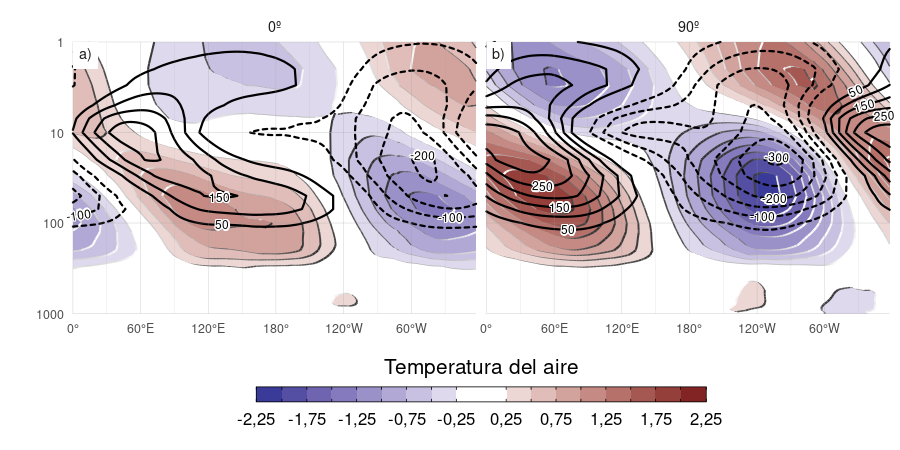
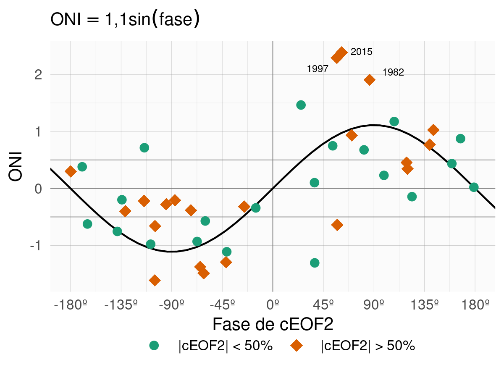

# Modos de variabilidad de la circulación zonalmente asimétrica en primavera {#ceofs}

## Introducción

Dadas las deficiencias de los índices analizados previamente, es necesaria una metodología alternativa para caracterizar la circulación zonalmente asimétrica.
Proponemos el uso de Funciones Ortogonales Empíricas Complejas (cEOF) [@horel1984], ya que éstas permiten caracterizar modos de variabilidad con amplitud y fase variable en el tiempo y con una estructura espacial más compleja que ondas sinusoidales constantes por cada círculo de latitud.

En base a exploraciones preliminares, en este capítulo nos restringimos al trimestre septiembre-octubre-noviembre (SON) ya durante esta estación las teleconexiones sobre Sudamérica son más intensas [@cazes-boezio2003].
Muchas de las características de los cEOF son similares en los otros trimestres a excepción del trimestre diciembre-enero-febrero, el cual tiene características distintas.

Analizamos el nivel de 200 hPa dado que es un nivel cercano al máximo de la amplitud de la onda 3 [@campitelli2018b].
Dada la importancia de la variabilidad estratosférica en modular la propagación de las ondas, también incluimos el nivel de 50 hPa.

## Métodos

### Funciones ortogonales complejas (cEOF) {#ceof-metodo}


(ref:eof-naive-cap) Patrones espaciales de los primeros EOFs de las anomalías zonales de altura geopotencial en 50 hPa al sur de 20ºS. Para el período 1979--2020 (unidades arbitrarias).


Una de las metodologías más extendidas para analizar la variabilidad espacio-temporal de una variable es la de Funciones Ortogonales Empíricas (EOF) o componentes principales.
La Figura \@ref(fig:eof-naive) muestra las cuatro priemras EOFs de las anomalías zonales de altura geopotencial de SON en 50 hPa al sur de 20º S.
Se puede observar que los dos primeros EOFs representan un único patrón de una onda zonal 1 no estacionario (es decir, un patrón con características espaciales similares donde la localización de los máximos varía).
Dado que los EOFs estándar sólo pueden representar patrones estacionarios [@horel1984], ésta onda aparece como un par de EOFs girados en 1/4 de longitud de onda (90º en el espacio de frecuencias).
La amplitud de esta onda 1 podría medirse como $\sqrt{\mathrm{PC1}^2 + \mathrm{PC2}^2}$ y su fase como $\tan^{-1} \left ( \frac{\mathrm{PC2}}{\mathrm{PC1}} \right )$ (donde $\mathrm{PC1}$ y $\mathrm{PC2}$ son las series temporales asociadas a cada EOF).
Lo mismo sucede con el siguiente par de EOFs (EOF3 y EOF4), los cuales representan un mismo patrón con una escala espacial menor.
Pero esto se fundamenta en la inspección visual cualitativa de estos patrones espaciales y sólo funciona correctamente si ambas fases aparecen claramente divididas en estos dos EOFs, lo cual no está garantizado por construcción.

Una mejor alternativa para representar ondas que varían en su fase es utilizando el análisis de Funciones Ortogonales Empíricas Complejas (cEOF, por sus siglas en inglés) [@horel1984].
Cada cEOF es un conjunto de patrones espaciales y series temporales con números complejos.
Las componentes real e imaginaria del patrón espacial complejo son la representación de dos patrones espaciales que están desplazados 1/4 de longitud de onda, similar a EOF1 y EOF2 en la Figura \@ref(fig:eof-naive).
En este trabajo nor referiremos a cada fase de un cEOF como la fase de 0º y la fase de 90º.
El campo real reconstruido por cada cEOF es la combinación lineal de los dos campos espaciales ponderados por sus respectivas series temporales.
Esto es análogo a cómo cualquier onda sinusoidal de fase y amplitud arbitraria puede construirse mediante la suma de un seno y un coseno de diferente amplitud pero fase fija.
Esto significa que los cEOF representan de forma natural patrones ondulatorios que cambian tanto su ubicación como su amplitud.

Por ejemplo, cuando las anomalías zonales de altura geopotencial se parecen mucho a la fase 0º del cEOF, entonces la serie temporal de esta fase es positiva y la serie temporal de la fase 90º es cercana a cero.
Del mismo modo, cuando las anomalías zonales de altura geopotencial se parecen a la fase 90º, la serie temporal de ésta es positiva y la serie temporal de la fase de 0º es cercana a cero.
Cuando las anomalías zonales de altura geopotencial tiene los máximos en una localización intermedia, entonces ambas series temporales tienen valores distintos a cero.

El signo de los EOF tradicionales no está determinado unívocamente, por lo que se puede multiplicar cada EOF por -1 (tanto su serie temporal como su patrón espacial) y obtener una descripción igualmente válida.
Este cambio de signo en los números reales corresponde a una rotación en el plano complejo de 0 o $\pi$.
De forma similar, los cEOF no tienen un argumento (entendiendo los números complejos como una magnitud y un argumento) definido, por lo que pueden rotarse en el plano complejo con cualquier ángulo entre 0 y $2\pi$ [@horel1984]; esto es una multiplicación por $\cos(\alpha) + i\sin(\alpha)$ con $\alpha$ cualquier número real entre 0 y $2\pi$.

El procedimiento para calcular los cEOF es similar al de computar los EOF con la única diferencia de que los datos de entrada primero se convierten en su señal analítica.
Ésta es un número complejo cuya parte real es la serie original y cuya parte imaginaria son los datos originales desplazados 90º en cada frecuencia espectral, es decir, su transformada de Hilbert.
La transformada de Hilbert suele entenderse en términos de señal variable en el tiempo, pero las ondas zonales son estructuras con forma de onda en el sentido zonal.
Por esto calculamos la transformada de Hilbert de las anomalías zonales de altura geopotencial variable en cada longitud; es decir, calculada para cada nivel, tiempo y latitud.
Dado que cada círculo de latitud es un dominio periódico, este procedimiento no sufre efectos de borde.

(ref:hilbert-ejemplo-cap) Ejemplo de cálculo de la función analítica de la señal de anomalías zonales de altura geopotencial. Los primeros cuatro paneles muestran las cuatro primeras ondas zonales y el último la señal completa. En verde se muestra la señal original y en naranja la transformada de Hilbert.


La Figura \@ref(fig:hilbert-ejemplo) ilustra la señal analítica con las anomalías zonales de geopotencial de SON en 1982 en 50hPa y 50ºS donde la línea verde es la señal original y la línea naranja es la transformada de Hilbert.
En los primeros paneles la señal está dividida en las ondas zonales 1 a 4 donde se ve con claridad como la transformada de Hilbert es la misma señal pero desplazada 1/4 de longitud de onda.


(ref:corr-ceof-splitted-cap) Coeficiente de determinación ($r^2$) entre la magnitud de las series temporales de los cEOF computados de forma separada en 50 y 200 hPa (p-valores menores a 0.01 en negrita).

::: {custom-style="Table Caption"}

<caption>(\#tab:corr-ceof-splitted)`<w:r><w:t xml:space="preserve">(ref:corr-ceof-splitted-cap)</w:t></w:r>`{=openxml}</caption>

:::

``````{=openxml}
<w:tbl xmlns:w="http://schemas.openxmlformats.org/wordprocessingml/2006/main" xmlns:r="http://schemas.openxmlformats.org/officeDocument/2006/relationships" xmlns:w14="http://schemas.microsoft.com/office/word/2010/wordml" xmlns:wp="http://schemas.openxmlformats.org/drawingml/2006/wordprocessingDrawing" xmlns:a="http://schemas.openxmlformats.org/drawingml/2006/main" xmlns:pic="http://schemas.openxmlformats.org/drawingml/2006/picture"><w:tblPr><w:tblLayout w:type="fixed"/><w:jc w:val="center"/><w:tblLook w:firstRow="1" w:lastRow="0" w:firstColumn="0" w:lastColumn="0" w:noHBand="0" w:noVBand="1"/></w:tblPr><w:tblGrid><w:gridCol w:w="1080"/><w:gridCol w:w="1080"/><w:gridCol w:w="1080"/><w:gridCol w:w="1080"/></w:tblGrid><w:tr><w:trPr><w:trHeight w:val="360" w:hRule="auto"/><w:tblHeader/></w:trPr>header1<w:tc><w:tcPr><w:tcBorders><w:bottom w:val="single" w:sz="12" w:space="0" w:color="666666"/><w:top w:val="single" w:sz="12" w:space="0" w:color="666666"/><w:left w:val="none" w:sz="0" w:space="0" w:color="000000"/><w:right w:val="none" w:sz="0" w:space="0" w:color="000000"/></w:tcBorders><w:shd w:val="clear" w:color="auto" w:fill="FFFFFF"/><w:tcMar><w:top w:w="0" w:type="dxa"/><w:bottom w:w="0" w:type="dxa"/><w:left w:w="0" w:type="dxa"/><w:right w:w="0" w:type="dxa"/></w:tcMar><w:vAlign w:val="center"/></w:tcPr><w:p><w:pPr><w:pStyle w:val="Normal"/><w:jc w:val="left"/><w:pBdr><w:bottom w:val="none" w:sz="0" w:space="0" w:color="000000"/><w:top w:val="none" w:sz="0" w:space="0" w:color="000000"/><w:left w:val="none" w:sz="0" w:space="0" w:color="000000"/><w:right w:val="none" w:sz="0" w:space="0" w:color="000000"/></w:pBdr><w:spacing w:after="100" w:before="100" w:line="240"/><w:ind w:left="100" w:right="100" w:firstLine="0" w:firstLineChars="0"/></w:pPr><w:r xmlns:w="http://schemas.openxmlformats.org/wordprocessingml/2006/main" xmlns:wp="http://schemas.openxmlformats.org/drawingml/2006/wordprocessingDrawing" xmlns:r="http://schemas.openxmlformats.org/officeDocument/2006/relationships" xmlns:w14="http://schemas.microsoft.com/office/word/2010/wordml"><w:rPr><w:rFonts w:ascii="DejaVu Sans" w:hAnsi="DejaVu Sans" w:eastAsia="DejaVu Sans" w:cs="DejaVu Sans"/><w:i w:val="false"/><w:b w:val="false"/><w:u w:val="none"/><w:sz w:val="22"/><w:szCs w:val="22"/><w:color w:val="000000"/></w:rPr><w:t xml:space="preserve">200 hPa</w:t></w:r></w:p></w:tc><w:tc><w:tcPr><w:tcBorders><w:bottom w:val="single" w:sz="12" w:space="0" w:color="666666"/><w:top w:val="single" w:sz="12" w:space="0" w:color="666666"/><w:left w:val="none" w:sz="0" w:space="0" w:color="000000"/><w:right w:val="none" w:sz="0" w:space="0" w:color="000000"/></w:tcBorders><w:shd w:val="clear" w:color="auto" w:fill="FFFFFF"/><w:tcMar><w:top w:w="0" w:type="dxa"/><w:bottom w:w="0" w:type="dxa"/><w:left w:w="0" w:type="dxa"/><w:right w:w="0" w:type="dxa"/></w:tcMar><w:vAlign w:val="center"/></w:tcPr><w:p><w:pPr><w:pStyle w:val="Normal"/><w:jc w:val="right"/><w:pBdr><w:bottom w:val="none" w:sz="0" w:space="0" w:color="000000"/><w:top w:val="none" w:sz="0" w:space="0" w:color="000000"/><w:left w:val="none" w:sz="0" w:space="0" w:color="000000"/><w:right w:val="none" w:sz="0" w:space="0" w:color="000000"/></w:pBdr><w:spacing w:after="100" w:before="100" w:line="240"/><w:ind w:left="100" w:right="100" w:firstLine="0" w:firstLineChars="0"/></w:pPr><w:r xmlns:w="http://schemas.openxmlformats.org/wordprocessingml/2006/main" xmlns:wp="http://schemas.openxmlformats.org/drawingml/2006/wordprocessingDrawing" xmlns:r="http://schemas.openxmlformats.org/officeDocument/2006/relationships" xmlns:w14="http://schemas.microsoft.com/office/word/2010/wordml"><w:rPr><w:rFonts w:ascii="DejaVu Sans" w:hAnsi="DejaVu Sans" w:eastAsia="DejaVu Sans" w:cs="DejaVu Sans"/><w:i w:val="false"/><w:b w:val="false"/><w:u w:val="none"/><w:sz w:val="22"/><w:szCs w:val="22"/><w:color w:val="000000"/></w:rPr><w:t xml:space="preserve">cEOF1</w:t></w:r></w:p></w:tc><w:tc><w:tcPr><w:tcBorders><w:bottom w:val="single" w:sz="12" w:space="0" w:color="666666"/><w:top w:val="single" w:sz="12" w:space="0" w:color="666666"/><w:left w:val="none" w:sz="0" w:space="0" w:color="000000"/><w:right w:val="none" w:sz="0" w:space="0" w:color="000000"/></w:tcBorders><w:shd w:val="clear" w:color="auto" w:fill="FFFFFF"/><w:tcMar><w:top w:w="0" w:type="dxa"/><w:bottom w:w="0" w:type="dxa"/><w:left w:w="0" w:type="dxa"/><w:right w:w="0" w:type="dxa"/></w:tcMar><w:vAlign w:val="center"/></w:tcPr><w:p><w:pPr><w:pStyle w:val="Normal"/><w:jc w:val="right"/><w:pBdr><w:bottom w:val="none" w:sz="0" w:space="0" w:color="000000"/><w:top w:val="none" w:sz="0" w:space="0" w:color="000000"/><w:left w:val="none" w:sz="0" w:space="0" w:color="000000"/><w:right w:val="none" w:sz="0" w:space="0" w:color="000000"/></w:pBdr><w:spacing w:after="100" w:before="100" w:line="240"/><w:ind w:left="100" w:right="100" w:firstLine="0" w:firstLineChars="0"/></w:pPr><w:r xmlns:w="http://schemas.openxmlformats.org/wordprocessingml/2006/main" xmlns:wp="http://schemas.openxmlformats.org/drawingml/2006/wordprocessingDrawing" xmlns:r="http://schemas.openxmlformats.org/officeDocument/2006/relationships" xmlns:w14="http://schemas.microsoft.com/office/word/2010/wordml"><w:rPr><w:rFonts w:ascii="DejaVu Sans" w:hAnsi="DejaVu Sans" w:eastAsia="DejaVu Sans" w:cs="DejaVu Sans"/><w:i w:val="false"/><w:b w:val="false"/><w:u w:val="none"/><w:sz w:val="22"/><w:szCs w:val="22"/><w:color w:val="000000"/></w:rPr><w:t xml:space="preserve">cEOF2</w:t></w:r></w:p></w:tc><w:tc><w:tcPr><w:tcBorders><w:bottom w:val="single" w:sz="12" w:space="0" w:color="666666"/><w:top w:val="single" w:sz="12" w:space="0" w:color="666666"/><w:left w:val="none" w:sz="0" w:space="0" w:color="000000"/><w:right w:val="none" w:sz="0" w:space="0" w:color="000000"/></w:tcBorders><w:shd w:val="clear" w:color="auto" w:fill="FFFFFF"/><w:tcMar><w:top w:w="0" w:type="dxa"/><w:bottom w:w="0" w:type="dxa"/><w:left w:w="0" w:type="dxa"/><w:right w:w="0" w:type="dxa"/></w:tcMar><w:vAlign w:val="center"/></w:tcPr><w:p><w:pPr><w:pStyle w:val="Normal"/><w:jc w:val="right"/><w:pBdr><w:bottom w:val="none" w:sz="0" w:space="0" w:color="000000"/><w:top w:val="none" w:sz="0" w:space="0" w:color="000000"/><w:left w:val="none" w:sz="0" w:space="0" w:color="000000"/><w:right w:val="none" w:sz="0" w:space="0" w:color="000000"/></w:pBdr><w:spacing w:after="100" w:before="100" w:line="240"/><w:ind w:left="100" w:right="100" w:firstLine="0" w:firstLineChars="0"/></w:pPr><w:r xmlns:w="http://schemas.openxmlformats.org/wordprocessingml/2006/main" xmlns:wp="http://schemas.openxmlformats.org/drawingml/2006/wordprocessingDrawing" xmlns:r="http://schemas.openxmlformats.org/officeDocument/2006/relationships" xmlns:w14="http://schemas.microsoft.com/office/word/2010/wordml"><w:rPr><w:rFonts w:ascii="DejaVu Sans" w:hAnsi="DejaVu Sans" w:eastAsia="DejaVu Sans" w:cs="DejaVu Sans"/><w:i w:val="false"/><w:b w:val="false"/><w:u w:val="none"/><w:sz w:val="22"/><w:szCs w:val="22"/><w:color w:val="000000"/></w:rPr><w:t xml:space="preserve">cEOF3</w:t></w:r></w:p></w:tc></w:tr><w:tr><w:trPr><w:trHeight w:val="360" w:hRule="auto"/></w:trPr>body1<w:tc><w:tcPr><w:tcBorders><w:bottom w:val="none" w:sz="0" w:space="0" w:color="000000"/><w:top w:val="single" w:sz="12" w:space="0" w:color="666666"/><w:left w:val="none" w:sz="0" w:space="0" w:color="000000"/><w:right w:val="none" w:sz="0" w:space="0" w:color="000000"/></w:tcBorders><w:shd w:val="clear" w:color="auto" w:fill="FFFFFF"/><w:tcMar><w:top w:w="0" w:type="dxa"/><w:bottom w:w="0" w:type="dxa"/><w:left w:w="0" w:type="dxa"/><w:right w:w="0" w:type="dxa"/></w:tcMar><w:vAlign w:val="center"/></w:tcPr><w:p><w:pPr><w:pStyle w:val="Normal"/><w:jc w:val="left"/><w:pBdr><w:bottom w:val="none" w:sz="0" w:space="0" w:color="000000"/><w:top w:val="none" w:sz="0" w:space="0" w:color="000000"/><w:left w:val="none" w:sz="0" w:space="0" w:color="000000"/><w:right w:val="none" w:sz="0" w:space="0" w:color="000000"/></w:pBdr><w:spacing w:after="100" w:before="100" w:line="240"/><w:ind w:left="100" w:right="100" w:firstLine="0" w:firstLineChars="0"/></w:pPr><w:r xmlns:w="http://schemas.openxmlformats.org/wordprocessingml/2006/main" xmlns:wp="http://schemas.openxmlformats.org/drawingml/2006/wordprocessingDrawing" xmlns:r="http://schemas.openxmlformats.org/officeDocument/2006/relationships" xmlns:w14="http://schemas.microsoft.com/office/word/2010/wordml"><w:rPr><w:rFonts w:ascii="DejaVu Sans" w:hAnsi="DejaVu Sans" w:eastAsia="DejaVu Sans" w:cs="DejaVu Sans"/><w:i w:val="false"/><w:b w:val="false"/><w:u w:val="none"/><w:sz w:val="22"/><w:szCs w:val="22"/><w:color w:val="000000"/></w:rPr><w:t xml:space="preserve">cEOF1</w:t></w:r></w:p></w:tc><w:tc><w:tcPr><w:tcBorders><w:bottom w:val="none" w:sz="0" w:space="0" w:color="000000"/><w:top w:val="single" w:sz="12" w:space="0" w:color="666666"/><w:left w:val="none" w:sz="0" w:space="0" w:color="000000"/><w:right w:val="none" w:sz="0" w:space="0" w:color="000000"/></w:tcBorders><w:shd w:val="clear" w:color="auto" w:fill="FFFFFF"/><w:tcMar><w:top w:w="0" w:type="dxa"/><w:bottom w:w="0" w:type="dxa"/><w:left w:w="0" w:type="dxa"/><w:right w:w="0" w:type="dxa"/></w:tcMar><w:vAlign w:val="center"/></w:tcPr><w:p><w:pPr><w:pStyle w:val="Normal"/><w:jc w:val="right"/><w:pBdr><w:bottom w:val="none" w:sz="0" w:space="0" w:color="000000"/><w:top w:val="none" w:sz="0" w:space="0" w:color="000000"/><w:left w:val="none" w:sz="0" w:space="0" w:color="000000"/><w:right w:val="none" w:sz="0" w:space="0" w:color="000000"/></w:pBdr><w:spacing w:after="100" w:before="100" w:line="240"/><w:ind w:left="100" w:right="100" w:firstLine="0" w:firstLineChars="0"/></w:pPr><w:r xmlns:w="http://schemas.openxmlformats.org/wordprocessingml/2006/main" xmlns:wp="http://schemas.openxmlformats.org/drawingml/2006/wordprocessingDrawing" xmlns:r="http://schemas.openxmlformats.org/officeDocument/2006/relationships" xmlns:w14="http://schemas.microsoft.com/office/word/2010/wordml"><w:rPr><w:rFonts w:ascii="DejaVu Sans" w:hAnsi="DejaVu Sans" w:eastAsia="DejaVu Sans" w:cs="DejaVu Sans"/><w:i w:val="false"/><w:b w:val="false"/><w:u w:val="none"/><w:sz w:val="22"/><w:szCs w:val="22"/><w:color w:val="000000"/></w:rPr><w:t xml:space="preserve">0.29</w:t></w:r></w:p></w:tc><w:tc><w:tcPr><w:tcBorders><w:bottom w:val="none" w:sz="0" w:space="0" w:color="000000"/><w:top w:val="single" w:sz="12" w:space="0" w:color="666666"/><w:left w:val="none" w:sz="0" w:space="0" w:color="000000"/><w:right w:val="none" w:sz="0" w:space="0" w:color="000000"/></w:tcBorders><w:shd w:val="clear" w:color="auto" w:fill="FFFFFF"/><w:tcMar><w:top w:w="0" w:type="dxa"/><w:bottom w:w="0" w:type="dxa"/><w:left w:w="0" w:type="dxa"/><w:right w:w="0" w:type="dxa"/></w:tcMar><w:vAlign w:val="center"/></w:tcPr><w:p><w:pPr><w:pStyle w:val="Normal"/><w:jc w:val="right"/><w:pBdr><w:bottom w:val="none" w:sz="0" w:space="0" w:color="000000"/><w:top w:val="none" w:sz="0" w:space="0" w:color="000000"/><w:left w:val="none" w:sz="0" w:space="0" w:color="000000"/><w:right w:val="none" w:sz="0" w:space="0" w:color="000000"/></w:pBdr><w:spacing w:after="100" w:before="100" w:line="240"/><w:ind w:left="100" w:right="100" w:firstLine="0" w:firstLineChars="0"/></w:pPr><w:r xmlns:w="http://schemas.openxmlformats.org/wordprocessingml/2006/main" xmlns:wp="http://schemas.openxmlformats.org/drawingml/2006/wordprocessingDrawing" xmlns:r="http://schemas.openxmlformats.org/officeDocument/2006/relationships" xmlns:w14="http://schemas.microsoft.com/office/word/2010/wordml"><w:rPr><w:rFonts w:ascii="DejaVu Sans" w:hAnsi="DejaVu Sans" w:eastAsia="DejaVu Sans" w:cs="DejaVu Sans"/><w:i w:val="false"/><w:b w:val="false"/><w:u w:val="none"/><w:sz w:val="22"/><w:szCs w:val="22"/><w:color w:val="000000"/></w:rPr><w:t xml:space="preserve">0.01</w:t></w:r></w:p></w:tc><w:tc><w:tcPr><w:tcBorders><w:bottom w:val="none" w:sz="0" w:space="0" w:color="000000"/><w:top w:val="single" w:sz="12" w:space="0" w:color="666666"/><w:left w:val="none" w:sz="0" w:space="0" w:color="000000"/><w:right w:val="none" w:sz="0" w:space="0" w:color="000000"/></w:tcBorders><w:shd w:val="clear" w:color="auto" w:fill="FFFFFF"/><w:tcMar><w:top w:w="0" w:type="dxa"/><w:bottom w:w="0" w:type="dxa"/><w:left w:w="0" w:type="dxa"/><w:right w:w="0" w:type="dxa"/></w:tcMar><w:vAlign w:val="center"/></w:tcPr><w:p><w:pPr><w:pStyle w:val="Normal"/><w:jc w:val="right"/><w:pBdr><w:bottom w:val="none" w:sz="0" w:space="0" w:color="000000"/><w:top w:val="none" w:sz="0" w:space="0" w:color="000000"/><w:left w:val="none" w:sz="0" w:space="0" w:color="000000"/><w:right w:val="none" w:sz="0" w:space="0" w:color="000000"/></w:pBdr><w:spacing w:after="100" w:before="100" w:line="240"/><w:ind w:left="100" w:right="100" w:firstLine="0" w:firstLineChars="0"/></w:pPr><w:r xmlns:w="http://schemas.openxmlformats.org/wordprocessingml/2006/main" xmlns:wp="http://schemas.openxmlformats.org/drawingml/2006/wordprocessingDrawing" xmlns:r="http://schemas.openxmlformats.org/officeDocument/2006/relationships" xmlns:w14="http://schemas.microsoft.com/office/word/2010/wordml"><w:rPr><w:rFonts w:ascii="DejaVu Sans" w:hAnsi="DejaVu Sans" w:eastAsia="DejaVu Sans" w:cs="DejaVu Sans"/><w:i w:val="false"/><w:b w:val="false"/><w:u w:val="none"/><w:sz w:val="22"/><w:szCs w:val="22"/><w:color w:val="000000"/></w:rPr><w:t xml:space="preserve">0.03</w:t></w:r></w:p></w:tc></w:tr><w:tr><w:trPr><w:trHeight w:val="360" w:hRule="auto"/></w:trPr>body2<w:tc><w:tcPr><w:tcBorders><w:bottom w:val="none" w:sz="0" w:space="0" w:color="000000"/><w:top w:val="none" w:sz="0" w:space="0" w:color="000000"/><w:left w:val="none" w:sz="0" w:space="0" w:color="000000"/><w:right w:val="none" w:sz="0" w:space="0" w:color="000000"/></w:tcBorders><w:shd w:val="clear" w:color="auto" w:fill="FFFFFF"/><w:tcMar><w:top w:w="0" w:type="dxa"/><w:bottom w:w="0" w:type="dxa"/><w:left w:w="0" w:type="dxa"/><w:right w:w="0" w:type="dxa"/></w:tcMar><w:vAlign w:val="center"/></w:tcPr><w:p><w:pPr><w:pStyle w:val="Normal"/><w:jc w:val="left"/><w:pBdr><w:bottom w:val="none" w:sz="0" w:space="0" w:color="000000"/><w:top w:val="none" w:sz="0" w:space="0" w:color="000000"/><w:left w:val="none" w:sz="0" w:space="0" w:color="000000"/><w:right w:val="none" w:sz="0" w:space="0" w:color="000000"/></w:pBdr><w:spacing w:after="100" w:before="100" w:line="240"/><w:ind w:left="100" w:right="100" w:firstLine="0" w:firstLineChars="0"/></w:pPr><w:r xmlns:w="http://schemas.openxmlformats.org/wordprocessingml/2006/main" xmlns:wp="http://schemas.openxmlformats.org/drawingml/2006/wordprocessingDrawing" xmlns:r="http://schemas.openxmlformats.org/officeDocument/2006/relationships" xmlns:w14="http://schemas.microsoft.com/office/word/2010/wordml"><w:rPr><w:rFonts w:ascii="DejaVu Sans" w:hAnsi="DejaVu Sans" w:eastAsia="DejaVu Sans" w:cs="DejaVu Sans"/><w:i w:val="false"/><w:b w:val="false"/><w:u w:val="none"/><w:sz w:val="22"/><w:szCs w:val="22"/><w:color w:val="000000"/></w:rPr><w:t xml:space="preserve">cEOF2</w:t></w:r></w:p></w:tc><w:tc><w:tcPr><w:tcBorders><w:bottom w:val="none" w:sz="0" w:space="0" w:color="000000"/><w:top w:val="none" w:sz="0" w:space="0" w:color="000000"/><w:left w:val="none" w:sz="0" w:space="0" w:color="000000"/><w:right w:val="none" w:sz="0" w:space="0" w:color="000000"/></w:tcBorders><w:shd w:val="clear" w:color="auto" w:fill="FFFFFF"/><w:tcMar><w:top w:w="0" w:type="dxa"/><w:bottom w:w="0" w:type="dxa"/><w:left w:w="0" w:type="dxa"/><w:right w:w="0" w:type="dxa"/></w:tcMar><w:vAlign w:val="center"/></w:tcPr><w:p><w:pPr><w:pStyle w:val="Normal"/><w:jc w:val="right"/><w:pBdr><w:bottom w:val="none" w:sz="0" w:space="0" w:color="000000"/><w:top w:val="none" w:sz="0" w:space="0" w:color="000000"/><w:left w:val="none" w:sz="0" w:space="0" w:color="000000"/><w:right w:val="none" w:sz="0" w:space="0" w:color="000000"/></w:pBdr><w:spacing w:after="100" w:before="100" w:line="240"/><w:ind w:left="100" w:right="100" w:firstLine="0" w:firstLineChars="0"/></w:pPr><w:r xmlns:w="http://schemas.openxmlformats.org/wordprocessingml/2006/main" xmlns:wp="http://schemas.openxmlformats.org/drawingml/2006/wordprocessingDrawing" xmlns:r="http://schemas.openxmlformats.org/officeDocument/2006/relationships" xmlns:w14="http://schemas.microsoft.com/office/word/2010/wordml"><w:rPr><w:rFonts w:ascii="DejaVu Sans" w:hAnsi="DejaVu Sans" w:eastAsia="DejaVu Sans" w:cs="DejaVu Sans"/><w:i w:val="false"/><w:b w:val="false"/><w:u w:val="none"/><w:sz w:val="22"/><w:szCs w:val="22"/><w:color w:val="000000"/></w:rPr><w:t xml:space="preserve">0.00</w:t></w:r></w:p></w:tc><w:tc><w:tcPr><w:tcBorders><w:bottom w:val="none" w:sz="0" w:space="0" w:color="000000"/><w:top w:val="none" w:sz="0" w:space="0" w:color="000000"/><w:left w:val="none" w:sz="0" w:space="0" w:color="000000"/><w:right w:val="none" w:sz="0" w:space="0" w:color="000000"/></w:tcBorders><w:shd w:val="clear" w:color="auto" w:fill="FFFFFF"/><w:tcMar><w:top w:w="0" w:type="dxa"/><w:bottom w:w="0" w:type="dxa"/><w:left w:w="0" w:type="dxa"/><w:right w:w="0" w:type="dxa"/></w:tcMar><w:vAlign w:val="center"/></w:tcPr><w:p><w:pPr><w:pStyle w:val="Normal"/><w:jc w:val="right"/><w:pBdr><w:bottom w:val="none" w:sz="0" w:space="0" w:color="000000"/><w:top w:val="none" w:sz="0" w:space="0" w:color="000000"/><w:left w:val="none" w:sz="0" w:space="0" w:color="000000"/><w:right w:val="none" w:sz="0" w:space="0" w:color="000000"/></w:pBdr><w:spacing w:after="100" w:before="100" w:line="240"/><w:ind w:left="100" w:right="100" w:firstLine="0" w:firstLineChars="0"/></w:pPr><w:r xmlns:w="http://schemas.openxmlformats.org/wordprocessingml/2006/main" xmlns:wp="http://schemas.openxmlformats.org/drawingml/2006/wordprocessingDrawing" xmlns:r="http://schemas.openxmlformats.org/officeDocument/2006/relationships" xmlns:w14="http://schemas.microsoft.com/office/word/2010/wordml"><w:rPr><w:rFonts w:ascii="DejaVu Sans" w:hAnsi="DejaVu Sans" w:eastAsia="DejaVu Sans" w:cs="DejaVu Sans"/><w:i w:val="false"/><w:b w:val="false"/><w:u w:val="none"/><w:sz w:val="22"/><w:szCs w:val="22"/><w:color w:val="000000"/></w:rPr><w:t xml:space="preserve">0.59</w:t></w:r></w:p></w:tc><w:tc><w:tcPr><w:tcBorders><w:bottom w:val="none" w:sz="0" w:space="0" w:color="000000"/><w:top w:val="none" w:sz="0" w:space="0" w:color="000000"/><w:left w:val="none" w:sz="0" w:space="0" w:color="000000"/><w:right w:val="none" w:sz="0" w:space="0" w:color="000000"/></w:tcBorders><w:shd w:val="clear" w:color="auto" w:fill="FFFFFF"/><w:tcMar><w:top w:w="0" w:type="dxa"/><w:bottom w:w="0" w:type="dxa"/><w:left w:w="0" w:type="dxa"/><w:right w:w="0" w:type="dxa"/></w:tcMar><w:vAlign w:val="center"/></w:tcPr><w:p><w:pPr><w:pStyle w:val="Normal"/><w:jc w:val="right"/><w:pBdr><w:bottom w:val="none" w:sz="0" w:space="0" w:color="000000"/><w:top w:val="none" w:sz="0" w:space="0" w:color="000000"/><w:left w:val="none" w:sz="0" w:space="0" w:color="000000"/><w:right w:val="none" w:sz="0" w:space="0" w:color="000000"/></w:pBdr><w:spacing w:after="100" w:before="100" w:line="240"/><w:ind w:left="100" w:right="100" w:firstLine="0" w:firstLineChars="0"/></w:pPr><w:r xmlns:w="http://schemas.openxmlformats.org/wordprocessingml/2006/main" xmlns:wp="http://schemas.openxmlformats.org/drawingml/2006/wordprocessingDrawing" xmlns:r="http://schemas.openxmlformats.org/officeDocument/2006/relationships" xmlns:w14="http://schemas.microsoft.com/office/word/2010/wordml"><w:rPr><w:rFonts w:ascii="DejaVu Sans" w:hAnsi="DejaVu Sans" w:eastAsia="DejaVu Sans" w:cs="DejaVu Sans"/><w:i w:val="false"/><w:b w:val="false"/><w:u w:val="none"/><w:sz w:val="22"/><w:szCs w:val="22"/><w:color w:val="000000"/></w:rPr><w:t xml:space="preserve">0.02</w:t></w:r></w:p></w:tc></w:tr><w:tr><w:trPr><w:trHeight w:val="360" w:hRule="auto"/></w:trPr>body3<w:tc><w:tcPr><w:tcBorders><w:bottom w:val="single" w:sz="12" w:space="0" w:color="666666"/><w:top w:val="none" w:sz="0" w:space="0" w:color="000000"/><w:left w:val="none" w:sz="0" w:space="0" w:color="000000"/><w:right w:val="none" w:sz="0" w:space="0" w:color="000000"/></w:tcBorders><w:shd w:val="clear" w:color="auto" w:fill="FFFFFF"/><w:tcMar><w:top w:w="0" w:type="dxa"/><w:bottom w:w="0" w:type="dxa"/><w:left w:w="0" w:type="dxa"/><w:right w:w="0" w:type="dxa"/></w:tcMar><w:vAlign w:val="center"/></w:tcPr><w:p><w:pPr><w:pStyle w:val="Normal"/><w:jc w:val="left"/><w:pBdr><w:bottom w:val="none" w:sz="0" w:space="0" w:color="000000"/><w:top w:val="none" w:sz="0" w:space="0" w:color="000000"/><w:left w:val="none" w:sz="0" w:space="0" w:color="000000"/><w:right w:val="none" w:sz="0" w:space="0" w:color="000000"/></w:pBdr><w:spacing w:after="100" w:before="100" w:line="240"/><w:ind w:left="100" w:right="100" w:firstLine="0" w:firstLineChars="0"/></w:pPr><w:r xmlns:w="http://schemas.openxmlformats.org/wordprocessingml/2006/main" xmlns:wp="http://schemas.openxmlformats.org/drawingml/2006/wordprocessingDrawing" xmlns:r="http://schemas.openxmlformats.org/officeDocument/2006/relationships" xmlns:w14="http://schemas.microsoft.com/office/word/2010/wordml"><w:rPr><w:rFonts w:ascii="DejaVu Sans" w:hAnsi="DejaVu Sans" w:eastAsia="DejaVu Sans" w:cs="DejaVu Sans"/><w:i w:val="false"/><w:b w:val="false"/><w:u w:val="none"/><w:sz w:val="22"/><w:szCs w:val="22"/><w:color w:val="000000"/></w:rPr><w:t xml:space="preserve">cEOF3</w:t></w:r></w:p></w:tc><w:tc><w:tcPr><w:tcBorders><w:bottom w:val="single" w:sz="12" w:space="0" w:color="666666"/><w:top w:val="none" w:sz="0" w:space="0" w:color="000000"/><w:left w:val="none" w:sz="0" w:space="0" w:color="000000"/><w:right w:val="none" w:sz="0" w:space="0" w:color="000000"/></w:tcBorders><w:shd w:val="clear" w:color="auto" w:fill="FFFFFF"/><w:tcMar><w:top w:w="0" w:type="dxa"/><w:bottom w:w="0" w:type="dxa"/><w:left w:w="0" w:type="dxa"/><w:right w:w="0" w:type="dxa"/></w:tcMar><w:vAlign w:val="center"/></w:tcPr><w:p><w:pPr><w:pStyle w:val="Normal"/><w:jc w:val="right"/><w:pBdr><w:bottom w:val="none" w:sz="0" w:space="0" w:color="000000"/><w:top w:val="none" w:sz="0" w:space="0" w:color="000000"/><w:left w:val="none" w:sz="0" w:space="0" w:color="000000"/><w:right w:val="none" w:sz="0" w:space="0" w:color="000000"/></w:pBdr><w:spacing w:after="100" w:before="100" w:line="240"/><w:ind w:left="100" w:right="100" w:firstLine="0" w:firstLineChars="0"/></w:pPr><w:r xmlns:w="http://schemas.openxmlformats.org/wordprocessingml/2006/main" xmlns:wp="http://schemas.openxmlformats.org/drawingml/2006/wordprocessingDrawing" xmlns:r="http://schemas.openxmlformats.org/officeDocument/2006/relationships" xmlns:w14="http://schemas.microsoft.com/office/word/2010/wordml"><w:rPr><w:rFonts w:ascii="DejaVu Sans" w:hAnsi="DejaVu Sans" w:eastAsia="DejaVu Sans" w:cs="DejaVu Sans"/><w:i w:val="false"/><w:b w:val="false"/><w:u w:val="none"/><w:sz w:val="22"/><w:szCs w:val="22"/><w:color w:val="000000"/></w:rPr><w:t xml:space="preserve">0.00</w:t></w:r></w:p></w:tc><w:tc><w:tcPr><w:tcBorders><w:bottom w:val="single" w:sz="12" w:space="0" w:color="666666"/><w:top w:val="none" w:sz="0" w:space="0" w:color="000000"/><w:left w:val="none" w:sz="0" w:space="0" w:color="000000"/><w:right w:val="none" w:sz="0" w:space="0" w:color="000000"/></w:tcBorders><w:shd w:val="clear" w:color="auto" w:fill="FFFFFF"/><w:tcMar><w:top w:w="0" w:type="dxa"/><w:bottom w:w="0" w:type="dxa"/><w:left w:w="0" w:type="dxa"/><w:right w:w="0" w:type="dxa"/></w:tcMar><w:vAlign w:val="center"/></w:tcPr><w:p><w:pPr><w:pStyle w:val="Normal"/><w:jc w:val="right"/><w:pBdr><w:bottom w:val="none" w:sz="0" w:space="0" w:color="000000"/><w:top w:val="none" w:sz="0" w:space="0" w:color="000000"/><w:left w:val="none" w:sz="0" w:space="0" w:color="000000"/><w:right w:val="none" w:sz="0" w:space="0" w:color="000000"/></w:pBdr><w:spacing w:after="100" w:before="100" w:line="240"/><w:ind w:left="100" w:right="100" w:firstLine="0" w:firstLineChars="0"/></w:pPr><w:r xmlns:w="http://schemas.openxmlformats.org/wordprocessingml/2006/main" xmlns:wp="http://schemas.openxmlformats.org/drawingml/2006/wordprocessingDrawing" xmlns:r="http://schemas.openxmlformats.org/officeDocument/2006/relationships" xmlns:w14="http://schemas.microsoft.com/office/word/2010/wordml"><w:rPr><w:rFonts w:ascii="DejaVu Sans" w:hAnsi="DejaVu Sans" w:eastAsia="DejaVu Sans" w:cs="DejaVu Sans"/><w:i w:val="false"/><w:b w:val="false"/><w:u w:val="none"/><w:sz w:val="22"/><w:szCs w:val="22"/><w:color w:val="000000"/></w:rPr><w:t xml:space="preserve">0.00</w:t></w:r></w:p></w:tc><w:tc><w:tcPr><w:tcBorders><w:bottom w:val="single" w:sz="12" w:space="0" w:color="666666"/><w:top w:val="none" w:sz="0" w:space="0" w:color="000000"/><w:left w:val="none" w:sz="0" w:space="0" w:color="000000"/><w:right w:val="none" w:sz="0" w:space="0" w:color="000000"/></w:tcBorders><w:shd w:val="clear" w:color="auto" w:fill="FFFFFF"/><w:tcMar><w:top w:w="0" w:type="dxa"/><w:bottom w:w="0" w:type="dxa"/><w:left w:w="0" w:type="dxa"/><w:right w:w="0" w:type="dxa"/></w:tcMar><w:vAlign w:val="center"/></w:tcPr><w:p><w:pPr><w:pStyle w:val="Normal"/><w:jc w:val="right"/><w:pBdr><w:bottom w:val="none" w:sz="0" w:space="0" w:color="000000"/><w:top w:val="none" w:sz="0" w:space="0" w:color="000000"/><w:left w:val="none" w:sz="0" w:space="0" w:color="000000"/><w:right w:val="none" w:sz="0" w:space="0" w:color="000000"/></w:pBdr><w:spacing w:after="100" w:before="100" w:line="240"/><w:ind w:left="100" w:right="100" w:firstLine="0" w:firstLineChars="0"/></w:pPr><w:r xmlns:w="http://schemas.openxmlformats.org/wordprocessingml/2006/main" xmlns:wp="http://schemas.openxmlformats.org/drawingml/2006/wordprocessingDrawing" xmlns:r="http://schemas.openxmlformats.org/officeDocument/2006/relationships" xmlns:w14="http://schemas.microsoft.com/office/word/2010/wordml"><w:rPr><w:rFonts w:ascii="DejaVu Sans" w:hAnsi="DejaVu Sans" w:eastAsia="DejaVu Sans" w:cs="DejaVu Sans"/><w:i w:val="false"/><w:b w:val="false"/><w:u w:val="none"/><w:sz w:val="22"/><w:szCs w:val="22"/><w:color w:val="000000"/></w:rPr><w:t xml:space="preserve">0.01</w:t></w:r></w:p></w:tc></w:tr></w:tbl>
``````

La Tabla \@ref(tab:corr-ceof-splitted) muestra el coeficiente de determinación de la magnitud de las series temporales de los cEOF entre 50 y 200 hPa.
Existe un alto grado de correlación entre la magnitud de los respectivos cEOF1 y cEOF2 en cada nivel.
Los patrones espaciales de los cEOF de 50 hPa y 200 hPa también son similares (no se muestra).

Tanto la similitud del patrón espacial como la alta correlación temporal de los cEOF calculados a 50 hPa y 200 hPa sugieren que se trata, en gran medida, de modos de variabilidad conjunta.
Esto motiva la decisión de calcular los cEOF en ambos niveles conjuntamente.
El resultado es que cada cEOF tiene una componente espacial que depende de la longitud, la latitud y el nivel, y una componente temporal que sólo depende del tiempo.
Dada las diferencias de magnitud entre la variabilidad de la altura geopotencial en 50 hPa y 200 hPa, se estandarizaron las variables de cada nivel por su desvío estándar.

Como se mencionó anteriormente, el argumento de los cEOF no está determinado unívocamente y se le puede sumar una constante real arbitraria.
Para facilitar la interpretación y permitir la reproducibilidad, definimos el argumento de cada cEOF de modo que alguna de las dos fases esté alineada con alguna variable significativa de nuestro análisis.
Este procedimiento no crea correlaciones espurias, sólo toma una relación existente y la alinea con una fase específica.

Un análisis preliminar mostró que el cEOF1 está estrechamente relacionado con la onda zonal 1 de la Columna Total de Ozono (CTO) y el segundo cEOF está estrechamente relacionado con el ENSO.
Por lo tanto, elegimos el argumento del cEOF1 de forma que la serie temporal correspondiente al cEOF1 de 0º tenga la máxima correlación con la onda zonal 1 del CTO entre 75°S y 45°S.
Del mismo modo, elegimos el argumento del cEOF2 de modo que el coeficiente de determinación entre el ONI y el cEOF2 de 0º sea mínimo, lo que también casi maximiza la correlación con el cEOF2 de 90º.


En la Sección \@ref(impactos) mostramos regresiones de precipitación y temperatura asociadas a fases intermedias entre 0º y 90º.
Para esos gráficos, giramos los cEOF en 1/4 de longitud de onda multiplicando las series temporales complejas por $\cos(\pi/4) + i\sin(\pi/4)$ y calculando la regresión sobre esas series temporales rotadas.

Si bien los cEOFs se calcularon para el período 1979--2020, extendimos las series temporales complejas hasta el periodo 1950--1978 proyectando las anomalías zonales mensuales de altura geopotencial normalizadas por nivel al sur de 20ºS sobre los patrones espaciales correspondientes.

## Resultados

### Caracterización espacio-temporal de los modos

(ref:ceofs-1-cap) Patrones espaciales de los dos primeros cEOF de las anomalías zonales de altura geopotencial de SON en 50 y 200 hPa para el período 1979--2020. El sombreado corresponde a la fase 0º y los contornos, a la fase 90º. La proporción de varianza explicada por cada modo con respecto a la media zonal está indicada entre paréntesis. Las unidades son arbitrarias.


(ref:extended-series-cap) Series temporales de los dos primeros cEOF de las anomalías zonales de altura geopotencial de SON en 50 y 200 hPa para el período 1979--2020. El cEOF1 (fila a) y cEOF2 (fila b) separados en la fase 0º (columna 1) y la fase 90º (columna 2). Las líneas oscuras muestran la tendencia lineal de todo el período. Las líneas negras horizontales y verticales muestran el valor medio y el rango de cada serie, respectivamente. La proporción de varianza explicada por cada modo con respecto a la media zonal está indicada entre paréntesis. Las unidades son arbitrarias.


Las Figuras \@ref(fig:ceofs-1) y \@ref(fig:extended-series) muestran las partes espacial y temporal de los dos primeros cEOFs de las anomalías zonales de la altura geopotencial en 50 hPa y 200 hPa, calculados conjuntamente en ambos niveles.
El primer modo (cEOF1) explica el 82% de la varianza de las anomalías zonales, mientras que el segundo modo (cEOF2) explica una fracción menor (7%).
En los patrones espaciales (Fig. \@ref(fig:ceofs-1)), las fases de 0º y 90º están en cuadratura por construcción, de modo que cada cEOF describe un único patrón ondulatorio cuya amplitud y fase está controlada por la magnitud y fase de su serie temporal.

El cEOF1 (Fig. \@ref(fig:ceofs-1) columna 1) es un patrón de onda 1 con amplitud máxima en latitudes altas.
En 50 hPa la fase de 0º del cEOF1tiene el máximo de la onda 1 en 150ºE y en 200 hPal máximo se sitúa en torno a 175ºE indicando un desplazamiento hacia el oeste con la altura.
El cEOF2 (Fig. \@ref(fig:eof-naive) columna 2) muestra también una estructura de onda zonal con amplitud máxima en latitudes altas, pero con escalas espaciales más cortas.
En particular, la estructura dominante a ambos niveles es una onda 3 pero con mayor amplitud en el sector del océano Pacífico.
No hay cambio de fase aparente con la altura, pero la amplitud del patrón se reduce considerablemente en la estratosfera, lo que es coherente con el hecho de que el cEOF2 calculado por separado para 200 hPa explica un porcentaje mayor de la varianza que el cEOF2 calculado por separado para 50 hPa (11% vs. 3%, respectivamente).
Esto sugiere que este modo barotrópico representa principalmente la variabilidad troposférica.


No existe una correlación significativa entre las series temporales de los cEOFs.
Ambos cEOF muestran variabilidad interanual pero no muestran evidencia de variabilidad decadal (Fig. \@ref(fig:extended-series)).
Debido a que los campos que entran en el algoritmo de cEOF son anomalías con respecto a la media zonal en lugar de la media temporal, las series temporales de los cEOF tienen media temporal no nula.
Sin embargo, la media temporal de cEOF2 es casi cero, lo que indica que sólo cEOF1 incluye variabilidad que se proyecta significativamente sobre el campo anómalo zonal medio.
Esto es coherente con el hecho de que el campo medio zonalmente anómalo de la altura geopotencial es muy similar al cEOF1 ($r^2$ = 98%) y no similar al cEOF2 ($r^2$ = 0%).

Es evidente una tendencia positiva significativa en la fase de 0º del cEOF1 (Fig. \@ref(fig:extended-series)a.1, p-valor = 0.023), mientras que no hay tendencia significativa en ninguna de las fases de cEOF2.
La tendencia positiva de la fase de 0º del cEOF1 se traduce en una tendencia positiva en la magnitud del cEOF1, pero no en un cambio sistemático en la fase (no se muestra).
Este cambio a largo plazo indica un aumento de la magnitud de la onda zonal 1 de latitudes altas.

### Mapas de regresión con los modos cEOF

#### Geopotencial

En la sección anterior mostramos los patrones espaciales de los cEOF obtenidos a partir de las anomalías zonales de altura geopotencial.
En esta sección calculamos campos de regresión de las series temporales de los cEOF con las anomalías temporales de altura geopotencial para describir la influencia de los cEOF en las anomalías temporales.


(ref:eof1-regr-gh-cap) Regresión de anomalías de temperatura geopotencial en SON ($m^2s^{-1}$) con la fase de 0º (columna 1) y de 90º (columna 2) del cEOF1 en 50 hPa (fila a) y 200 hPa (fila b) para el período 1979--2020. Estos coeficientes fueron obtenidos a partir de una regresión múltiple incluyendo ambas fases. Áreas con puntos marcan regiones donde el p-valor es menor que 0.01 ajustado por FDR.


La Figura \@ref(fig:eof1-regr-gh) muestra los mapas de regresión de anomalías de altura geopotencial en SON con respecto al cEOF1.
En 50 hPa (Fig. \@ref(fig:eof1-regr-gh) fila a), la fase de 0º del cEOF1 está asociada a un centro de anomalías positivas sobre la Antártida con su centro sobre el Mar de Ross.
Por otro lado, el centro de anomalías positivas asociado a la fase de 90º está corrido hacia Antártida Oriental y tiene un patrón de onda 1 más evidente.

En 200 hPa (Fig. \@ref(fig:eof1-regr-gh) fila b) la fase de 0º del cEOF1 muestra un único centro de anomalías positivas que abarca la Antártida Occidental rodeado de anomalías opuestas en latitudes más bajas, con su centro desplazado ligeramente hacia el este en comparación con las anomalías de niveles superiores.
La fase de 90º muestra un patrón mucho más simétrico zonalmente que se asemeja al patrón de anomalías características de la fase negativa del SAM [@fogt2020].
En ambas fases las anomalías negativas en latitudes bajas son débiles y no son estadísticamente significativas

Por lo tanto, la magnitud y la fase del cEOF1 están asociadas a la magnitud y la fase de una onda zonal principalmente en la estratosfera.

(ref:eof2-regr-gh-cap) Igual que la Figura \@ref(fig:eof1-regr-gh) pero para el cEOF2.


La Figura \@ref(fig:eof2-regr-gh) muestra los mapas de regresión de las anomalías de altura geopotencial con el cEOF2.
Tanto en 50 como en 200 hPa se observa un patrón de onda 3 similares a los de la Figura \@ref(fig:ceofs-1) columna 2.
Las anomalías de regresión asociadas con la fase de 0º del cEOF2 están desfasadas 1/4 de longitud de onda con respecto a las asociadas con la fase de 90º.
Todos los campos tienen una onda zonal dominante 3 limitada al hemisferio occidental, sobre los océanos Pacífico y Atlántico.

En 50 hPa (Fig. \@ref(fig:eof2-regr-gh) fila a) también se ve un monopolo sobre el polo con signo negativo asociado a la fase de 0º y signo positivo asociado a la fase de 90º.
Este monopolo podría indicar fortalecimiento del vórtice polar asociado a valores positivos de la fase de 0º del cEOF2 y debilitamiento asociado a valores negativos del la fase de 0º del cEOF2.
Sin embargo, estas anomalías no son estadísticamente significativas, indicando que su magnitud es baja en comparación a la variabilidad estratosférica y que esta característica no debe sobreinterpretarse.

En 200 hPa (Fig. \@ref(fig:eof2-regr-gh) fila b) el tren de ondas es robusto ya que los centros son estadísticamente significativos, con anomalías insignificantes por fuera de este patrón.
La localización de las anomalías no varía en la vertical, lo cual indica que se trata de un modo barotrópico equivalente.

El cEOF2 representa entonces un tren de ondas barotrópico equivalente muy similar al de los Patrones PSA [@mo2001].
Comparando la localización de la anomalía positiva cerca de 90ºO en la columna 2 de la Figura \@ref(fig:eof2-regr-gh) con las Figuras 1.a y b de @mo2001, el mapa de regresión de la fase de 0º podría identificarse con el PSA2, mientras que la fase 90º se asemeja al PSA1.
Por otro lado, ambos modos muestran relación con patrones anulares semejantes al SAM.
Estudiaremos la relación entre los cEOF y el PSA y con más detalle en el Capítulo \@ref(sam-ceof).

#### Temperatura y Ozono

(ref:eof1-regr-t-cap) Igual que la Figura \@ref(fig:eof1-regr-gh) pero para la temperatura del aire (K).


(ref:t-vertical-cap) Regresión de anomalías zonales de temperatura (sombrado, Kelvin) y razón de mezcla de ozono (contornos, valores negativos en línea punteada, etiquetas en partes por mil millón en masa) promediados entre 75°S y 45°S en SON con la fase de 0º (a) y de 90º (b) del cEOF1 para el período 1979--2020.



También evaluamos la señal de la variabilidad de los cEOF en la temperatura del aire.
La Figura \@ref(fig:eof1-regr-t) muestra los mapas de regresión de las anomalías de la temperatura del aire en 50 hPa y 200 hPa con el cEOF1.
La distribución de los coeficientes de regresión de la temperatura en 50 hPa y en 200 hPa refleja los mapas de regresión de la altura geopotencial en 50 hPa (Fig. \@ref(fig:eof1-regr-gh)).
En ambos niveles, la fase de 0º está asociada a anomalías positivas sobre el Polo Sur con su centro desplazado ligeramente hacia 150ºE (Fig. \@ref(fig:eof1-regr-t) columna 1).
Por otro lado, los mapas de regresión con la fase de 90º muestran un patrón de onda 1 más claro con su máximo alrededor de los 60ºE.

La Figura \@ref(fig:t-vertical) muestra la distribución vertical de los coeficientes de regresión del cEOF1 con las anomalías zonales de la temperatura del aire y de la razón de mezcla de ozono promediadas entre 75°S y 45°S.
Las anomalías zonales de temperatura asociadas al cEOF1 muestran un claro patrón de onda 1 tanto para la fase de 0º como para la de 90º en toda la atmósfera por encima de 250 hPa con una inversión de signo por encima de 10 hPa.
Como resultado del balance hidrostático, este es el nivel en el que la anomalía geopotencial tiene máxima amplitud (no mostrado).

Los valores máximos de la regresión con el ozono coinciden con los valores mínimos de temperatura por encima de 10 hPa y con los máximos por debajo de 10 hPa (Fig. \@ref(fig:t-vertical)).
Por tanto, la onda zonal 1 de ozono está correlacionada negativamente con la onda zonal 1 de temperatura en la estratosfera superior, y positivamente en la estratosfera baja.
Este cambio de fase es observado en las anomalías de ozono forzadas por ondas planetarias que alcanzan la estratosfera.
En la estratosfera superior, dominada por procesos fotoquímicos, las temperaturas frías inhiben la destrucción de ozono, explicando el comportamiento opuesto para ambas variables, tal y como se dilucidó con modelos químicos dinámicos [@hartmann1979; @wirth1993; @smith1995].
Por otro lado, en la estratosfera baja, dominada por la advección, las anomalías de ozono están desfasadas 1/4 de longitud de onda con el transporte horizontal y vertical, que a su vez están desfasados 1/4 de longitud de onda con las anomalías de temperatura, resultando anomalías del mismo signo para la respuesta de ambas variables [@hartmann1979; @wirth1993; @smith1995].


(ref:o3-regr-cap) Regresión de las anomalías de Columna Total de Ozono (CTO, sombreado, unidades Dobson) con la fase de 0º (a) y de 90º (b) del cEOF1 para el período 1979--2020. En contornos, la anomalía zonal media de de CTO (contornos negativos en líneas punteadas, unidades Dobson). Áreas con puntos marcan regiones donde el p-valor es menor que 0.01 ajustado por FDR.


(ref:wave1-o3-cap) Relación entre la amplitud y la fase de la onda zonal 1 de la Columna Total de Ozono promediada entre 75°S y 45°S y la amplitud y la fase del cEOF1 para SON en el período 1979--2020.


Los mapas de regresión de las anomalías de CTO con el cEOF1 (Fig. \@ref(fig:o3-regr)) muestran patrones de onda zonal 1 asociados a ambas fases del cEOF1.
La posición climatológica del mínimo de ozono durante la primavera (agujero de la capa de ozono) no está centrada sobre el Polo Sur, sino que está desplazada hacia el mar de Weddell [ej, @grytsai2011]; este desplazamiento se traduce en una onda 1 de la CTO.
Así, el campo de regresión de la fase de 0º del cEOF1 (Fig. \@ref(fig:o3-regr)a) coincide con la posición climatológica de esta onda 1 del agujero de ozono, mientras que el campo para la fase de 90º está defasado en 90º cEOF1.
La correlación temporal entre la amplitud de la onda 1 de CTO y la amplitud del cEOF1 es 0.79 (CI: 0.63 -- 0.88), mientras que la correlación entre sus fases es -0.85 (CI: -0.92 -- -0.74).
La correlación entre las dos ondas es -0.87 (CI: -0.93 -- -0.77).
En consecuencia, el cEOF1 está fuertemente relacionado con la variabilidad del ozono del hemisferio sur.

### Fuentes de variabilidad tropicales {#fuentes-ceof}


(ref:psi-sst-explained-variance-cap) Varianza de las anomalías de TSM (fila a) y de las anomalías zonales de función corriente (fila b) explicada por el cEOF1 (columna 1) el cEOF2 (columna 2).


Para evaluar si la variabilidad de los cEOF analizados está relacionada con fuentes de variabilidad tropicales calculamos la regresión de distintas fases de los cEOFs con las anomalías de TSM y con las anomalías zonales de función corriente a 200 hPa.
La Figura \@ref(fig:psi-sst-explained-variance) muestra la varianza de cada variable explicada por cada cEOF.

El cEOF1 sólo explica una proporción importante de la varianza de la función corriente al sur de 60º, sugiriendo que no está asociado con la variabilidad tropical (Fig. \@ref(fig:psi-sst-explained-variance) b.1).

El cEOF2, en cambio, explica una gran proporción de la variabilidad tropical tanto de las anomalías de TSM como de las de función corriente.
Este modo comparte más de un 50% de la varianza con las TSM en el Pacífico central (sugiriendo el impacto del ENSO).
En cuanto a la función corriente, en el Pacífico explica más del 50% de la varianza en la región del cambio de fecha y sobre Indonesia.
También explica gran parte de la varianza en al oeste y al este de la Península Antártica, llegando a más del 80% sobre el mar de Amundsen.


(ref:sst-psi-2-cap) Regresión de (columna 1) TSM (K) y (columna 2) anomalías zonales de función corriente ($m^2/s\times10^-7$) y sus vectores de acción de onda con diferentes fases del cEOF2 (indicado con la flecha) en el período 1979--2020. Áreas con puntos marcan regiones donde el p-valor es menor que 0.01 ajustado por FDR.


La Figura \@ref(fig:sst-psi-2) muestra los mapas de regresión de las anomalías de la temperatura de la superficie del mar (TSM) y de la función de corriente a 200 hPa sobre los cEOF2 normalizados.
Además de los mapas de regresión para las fases de 0º y 90º, incluimos las regresiones correspondientes para dos direcciones intermedias (correspondientes a 45º y 135º).

La fase de 90º (fila b) está asociada a fuertes anomalías positivas de la TSM en el Pacífico central y oriental y a anomalías negativas en una zona que atraviesa el norte de Australia, Nueva Zelanda y la Zona de Convergencia del Pacífico Sur (SPCZ) (Fig. \@ref(fig:sst-psi-2).b1).
Este patrón es muy similar al patrón del ENSO positivo canónico [@bamston1997].
De hecho, existe una correlación significativa y muy alta entre el ONI y la serie temporal de la fase de 90º del cEOF2 (0.76 (CI: 0.6 -- 0.87)).
Además del patrón similar al ENSO del Pacífico, también hay anomalías positivas en el océano Índico occidental y valores negativos en el océano Índico oriental, lo que se asemeja a un dipolo del índico en su fase positiva [@saji1999].
Consistentemente, la correlación entre la fase de 90º del cEOF2 y el DMI es 0.62 (CI: 0.38 -- 0.77).
Sin embargo, la correlación parcial es de 0.33 (p-valor = 0.037), indicando que el DMI explica poca varianza de la fase de 90º del cEOF2 por sí mismo.
Esto puede observarse en la Figura \@ref(fig:euler), donde se ilustra la partición de la varianza de la fase de 90º del cEOF2, el DMI y el ONI.
El DMI aporta, independientemente, sólo un 4.3% de la varianza mientras que el ONI aporta un 23.9% por sí mismo.


(ref:euler-cap) Diagrama de Euler mostrando la proporción de la varianza de cada serie (DMI, ONI y la fase de 90º del cEOF2) explicada por las demás (p.e. la región común entre DMI y ONI es la varianza del DMI explicada por el ONI y viceversa).

La fase de 90º del cEOF2 está asociado a fuertes anomalías de la función corriente que emanan de los trópicos (Fig. \@ref(fig:sst-psi-2).b2), tanto del sector del Pacífico Central como del Océano Índico.
Esta respuesta atmosférica es consistente con el efecto combinado del ENSO y el DMI sobre los extratrópicos: con anomalías de la TSM que inducen convección tropical anómala que a su vez excita ondas de Rossby que se propagan meridionalmente hacia latitudes más altas [@mo2000; @cai2011; @nuncio2015].

Sin embargo, el cEOF2 no está asociado a los mismos patrones de anomalía de las TSM tropicales en todas sus fases.
Los paneles d1 y d2 de la Figura \@ref(fig:sst-psi-2) muestran que la fase de 0º del cEOF2 no está asociada a ninguna anomalía significativa de las TSM ni de la función corriente en los trópicos.
Tampoco la correlación entre la fase de 0º del cEOF2 y el ENSO es significativa (0 (CI: -0.3 -- 0.31)).
Las filas a y c de la Fig.\@ref(fig:sst-psi-2) muestran que las fases intermedias siguen asociadas con anomalías significativas de la TSM sobre el Océano Pacífico, pero en lugares ligeramente diferentes.
La fase de 135º está asociada a anomalías de la TSM en el Pacífico central (Fig.\@ref(fig:sst-psi-2)a.1), mientras que la fase de 45º está asociada a anomalías de la TSM que corresponden aproximadamente a los "sabores" de ENSO del Pacífico central y del Pacífico oriental, respectivamente (Fig.\@ref(fig:sst-psi-2)c.1) [@kao2009].
Ambas fases también están asociadas a trenes de onda que se generan cerca de Australia y se propagan hacia los extratrópicos, aunque menos intensos que los asociados a la fase de 90º.

(ref:enso-phase-cap) Valores del ONI en SON y la fase del cEOF2 en el período 1979--2020. Los años en los cuales la magnitud del cEOF2 es mayor o menor que la mediana se muestran como diamantes naranja o círculos verdes respectivamente. La línea negra representa el ajuste ONI \~ sen(fase) computado por cuadrados mínimos pesados por la magnitud del cEOF2.



Para explorar la relación entre el forzante tropical y las fases del cEOF2 con más profundidad, la Figura \@ref(fig:enso-phase) muestra la relación entre el ONI y la fase del cEOF2 para cada SON entre 1979 y 2020, destacando los años en los que la magnitud del cEOF2 está por encima de la mediana.
En los años con ONI positivo, la fase cEOF2 se sitúa mayoritariamente en torno a la fase de 90º; en los años con ONI negativo, en torno a la fase de -90º.
En las estaciones con ENSO neutro, la fase del cEOF2 es mucho más variable.
La línea negra de la Figura \@ref(fig:enso-phase) es un ajuste sinusoidal de la relación entre el ONI y la fase del cEOF2.
El $r^2$ correspondiente al ajuste es 0.57, estadísticamente significativo con p-valor < 0.001, lo que indica una relación aproximadamente sinusoidal entre estas dos variables.


(ref:fft-ceof-era5-cap) Espectro de Fourier para cada fase del cEOF2 y del ONI.

Otra evidencia de la relación entre el ENSO y la fase del cEOF2 es que tanto el ONI como la fase de 90º del cEOF2 tienen un pico de periodicidad alrededor de 3 años (Fig. \@ref(fig:fft-ceof-era5).
Esto muestra que la principal escala de variabilidad de esta fase está íntimamente relacionada con el ENSO.

La correlación entre la magnitud absoluta del ONI y la amplitud del cEOF2 es 0.45 (CI: 0.17 -- 0.66).
Sin embargo, esta relación está determinada principalmente por los tres años con los eventos ENSO más intensos del periodo (2015, 1997, y 1982), los cuales coinciden con los tres años con la magnitud CEOF2 más intensa (no se muestra).
Si se eliminan esos años, la correlación deja de ser significativa (0.04 (CI: -0.28 -- 0.35)).
Además, incluso cuando utilizando todos los años, la correlación de Spearman -que es robusta frente a los valores atípicos- tampoco es significativa (0.2, p-valor = 0.21).
Por lo tanto, aunque la localización de las anomalías tropicales de la TSM parece tener un efecto en la definición de la fase del cEOF2, la relación entre la magnitud del cEOF2 y el ONI sigue siendo incierta y podría ser sólo evidente en eventos ENSO muy fuertes, que son escasos en el registro observacional histórico.

Concluimos que el tren de ondas representado por el cEOF2 es tanto parte de la variabilidad interna de la atmósfera extratropical como forzado por las TSM tropicales.
En el primer caso, el tren de ondas tiene poca preferencia de fase.
Sin embargo, cuando el cEOF2 es excitado por la variabilidad de la TSM tropical, tiende a permanecer fijo en la fase de 90º.

(ref:sst-psi-1-cap) Igual que la Figura \@ref(fig:sst-psi-2) pero para el cEOF1.


La Figura \@ref(fig:sst-psi-1) muestra las mismas regresiones que la Figura \@ref(fig:sst-psi-2) pero para el cEOF1.
Como anticipó la Figura \@ref(fig:psi-sst-explained-variance), el cEOF1 no está asociado a anomalías significativas de TSM ni de función corriente en los trópicos.
En vez de eso, las fases de 0º y 90º están asociadas a flujos de actividad de onda que se propagan zonalmente en los extratrópicos cerca de de 60ºS, excepto por un flujo hacia el ecuador desde la costa de la Antártida alrededor de 150ºE en la fase de 0º.
Esto sugiere que la variabilidad de cEOF1 está impulsada principalmente por la variabilidad interna de los extratrópicos.

### Impactos en superficie {#impactos}


(ref:pp-t2m-r2-cap) Igual que la Figura \@ref(fig:psi-sst-explained-variance) pero para Temperatura a 2 metros y precipitación.

La Figura \@ref(fig:pp-t2m-r2) muestra la varianza de la temperatura a 2 metros y de la precipitación explicada por cada cEOF.

La varianza explicada por el cEOF1 para ambas variables es muy baja en la mayoría de las regiones, excepto para el extremo norte de la Península Antártica, el norte del Mar de Weddell y la costa del Mar de Ross (Fig.\@ref(fig:pp-t2m-r2)a.1).

Por otro lado, la varianza explicada cEOF2 es superior al 50% en algunas regiones para ambas variables (Fig. \@ref(fig:pp-t2m-r2) columna 2).
Para la temperatura de 2 metros, hay valores altos en el Pacífico tropical y en la región que forma un arco entre Nueva Zelanda y el Atlántico Sur.
Sobre los continentes, hay valores moderados de alrededor del 30% de varianza explicada en el sur de Australia, el sur de Sudamérica y la Península Antártica.
En cuanto a las precipitaciones, los valores son elevados en los trópicos.
En latitudes más altas, se observan valores moderados sobre el este de Australia y algunas regiones del sur de Sudamérica.


Dado que el cEOF1 tiene una señal relativamente débil en las variables de superficie exploradas, sólo nos centraremos en la influencia del cEOF2.
En la Figura \@ref(fig:pp-temp-2) se muestran mapas de regresión de las anomalías de temperatura a 2 metros (columna 1) y precipitación (columna 2) sobre diferentes fases del cEOF2 normalizado.

(ref:pp-temp-2-cap) Regresión de la temperatura de 2 metros (K, sombreado) y la altura geopotencial de 850 hPa (m, contornos) (columna 1), y la precipitación (correlación, columna 2) sobre diferentes fases de cEOF2. Para el trimestre SON del periodo 1979--2020. Áreas con puntos marcan regiones donde el p-valor es menor que 0.01 ajustado por FDR.


Las anomalías de temperatura asociadas a la fase de 90º del cEOF2 (Fig. \@ref(fig:pp-temp-2).b1) muestran valores positivos en el Pacífico tropical, coherentes con las anomalías de TSM asociadas a esta misma fase (Fig. \@ref(fig:sst-psi-2).b1).
En latitudes más altas existe un patrón ondulatorio de valores positivos y negativos que coincide con los nodos de los patrones de regresión de la altura geopotencial de 850 hPa.
Esto es coherente con las anomalías de temperatura producidas por la advección meridional de temperatura por los vientos meridionales derivados del equilibrio geostrófico.
Sobre los continentes, las fase de 90º (Fig.\@ref(fig:pp-temp-2)b.1) está asociada a anomalías de temperatura positiva en el sur de Australia y anomalías de regresión negativa en el sur de Sudamérica y la Península Antártica, que son resultado del tren de ondas descrito anteriormente.

Las anomalías de temperatura asociadas a la fase de 0º (Fig.\@ref(fig:pp-temp-2)d.1) son menos extensas y se limitan a latitudes medias y altas.
Sobre los continentes, las regresiones de las anomalías de temperatura no son significativas, excepto las anomalías positivas cerca de la Península Antártica.

Las anomalías de precipitación tropicales asociadas con el 90º cEOF2 son fuertes, con anomalías positivas en el Pacífico central y el Índico occidental, y anomalías negativas en el Pacífico oriental (Fig.\@ref(fig:pp-temp-2)b.2).
Este campo es consistente con el mapa de regresión de la TSM (Fig.\@ref(fig:pp-temp-2)b.1) ya que las anomalías positivas de la TSM potencian la convección tropical y las anomalías negativas de la TSM la inhiben.

En los extratrópicos, la fase de 90º del cEOF2 se asocia a condiciones más secas sobre el este de Australia y el océano circundante, que es una señal similar a la asociada al ENSO [@cai2011].
Sin embargo, esta es la fase más fuertemente correlacionada con la precipitación en esa zona.
La fase de 135º (una intermedia 90º y 180º) está correlacionada más intensa y extensamente con la precipitación sobre Australia y Nueva Zelanda.
La influencia del cEOF2 en la precipitación australiana podría estar relacionada más con los impactos directos de las anomalías de la TSM en los océanos circundantes que en el patrón de teleconexión representado por el cEOF2.

Sobre Sudamérica, la fase de 90º del cEOF2 está correlacionada positivamente con la precipitación en el sudeste de Sudamérica (SESA) y el centro de Chile, y negativamente en el este de Brasil.
Este campo de correlación coincide con la señal de ENSO la precipitación de primavera [p.e. @cai2020a].

Los coeficientes de correlación entre las anomalías de precipitación y la fase de 0º del cEOF2 (Fig. \@ref(fig:pp-temp-2)d.2) son más débiles que para la fase de 90º.
Hay una correlación positiva residual en el Pacífico oriental ecuatorial y pequeñas correlaciones positivas, no estadísticamente significativas, sobre el este de Australia y negativas sobre Nueva Zelanda.

## Conclusión

Los cEOF identificados en este capítulo logran representar características importantes de la circulación zonalmente asimétrica del hemisferio sur.
El cEOF1 captura principalmente la onda 1 en la estratósfera mientras que el cEOF2 representa la onda 3 con un máximo de amplitud en el Pacífico sur.

El cEOF2 está asociado a forzantes tropicales y el tren de ondas que representa se asemeja a los modos PSA y la circulación asociada a ambos cEOF tiene características similares al SAM.
Antes de estudiar estas relaciones en más detalle, es necesario estudiar el SAM y entender sus características zonalmente simétricas y asimétricas.
