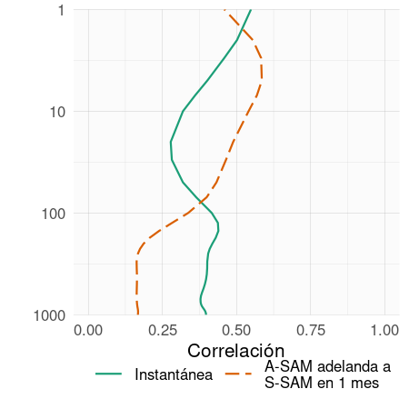
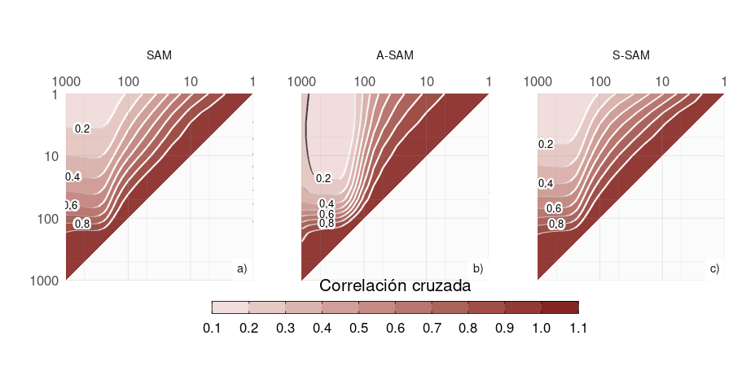

# Estructura simétrica y asimétrica del SAM 

## Introducción 

El Modo Anular del Sur (SAM, por sus siglas en inglés) es el principal modo de variabilidad de la circulación extratropical del hemisferio sur [@rogers1982] en escalas temporales diarias, mensuales y decadales [@baldwin2001a; @fogt2006] y ejerce una importante influencia en las anomalías de temperatura y precipitación, así como en la concentración de hielo marino [p. ej. @fogt2020].
Su fase positiva suele describirse como presiones anómalamente bajas sobre la Antártida rodeadas de un anillo de altas presiones anómalas en latitudes medias y altas.

La mayoría de los autores describen el SAM como un patrón zonalmente simétrico, hecho que se refleja no sólo en su nombre, sino también en los diversos métodos utilizados para caracterizarlo.
De los distintos índices presentados en la literatura, muchos de ellos se basan en medias zonales de la presión a nivel del mar o de la altura geopotencial [@ho2012].
@gong1999 definió el índice SAM como la diferencia de presión media zonal a nivel del mar entre 40\degree S y 65\degree S, que es también la definición utilizada por el índice basado en estaciones de @marshall2003.
@baldwin2009 propuso definir los modos anular septentrional y meridional como la EOF principal de la altura geopotencial promediada zonalmente en cada nivel.

Aunque estos índices se basan en promedios zonales, sus anomalías espaciales de altura geopotencial asociadas contienen notables desviaciones de la simetría zonal, particularmente en la región del Océano Pacífico.
Las asimetrías zonales no han sido ampliamente estudiadas, pero trabajos previos sugieren que modulan fuertemente los impactos regionales de la SAM [@fan2007; @silvestri2009; @fogt2012; @rosso2018].
El hecho de que la SAM no sea totalmente simétrica zonalmente dificulta nuestra capacidad para reconstruir su variabilidad histórica antes de la disponibilidad de observaciones densas en el hemisferio sur [@jones2009].

Parte de la variabilidad asociada a las asimetrías zonales de la SAM parece estar forzada por los trópicos.
La variabilidad de tipo ENOS afecta a los extratópicos del Hemisferio Sur a través de los trenes de ondas de Rossby [@mo1987; @kidson1988; @karoly1989] que se proyectan fuertemente sobre las anomalías zonales asociadas a la SAM en el sector del Pacífico.
Además, se han observado influencias tropicales en la SAM [@fan2007; @fogt2011a; @clem2013].
@fan2007 calculó los índices de SAM de los hemisferios occidental y oriental por separado y descubrió que estaban mucho más correlacionados entre sí si se eliminaba la señal (lineal) del ENSO.

Varios investigadores han documentado tendencias positivas en la SAM utilizando diferentes índices, sobre todo en verano y otoño austral [por ejemplo, @fogt2020 y sus referencias].
Se cree que estas tendencias están impulsadas principalmente por el agotamiento del ozono estratosférico y el aumento de los gases de efecto invernadero, y se entienden en el contexto de las variables medias zonales [@marshall2004; @gillett2005; @arblaster2006; @gillett2013].
Sin embargo, aún no está claro cómo o si el componente SAM asimétrico responde a estos forzamientos, o cómo su variabilidad altera las tendencias observadas.

El impacto de la componente zonalmente asimétrica de la SAM a escala regional aún no se ha estudiado en detalle.
La fase positiva de la SAM se asocia con temperaturas más frías de lo normal sobre la Antártida y más cálidas de lo normal en latitudes más bajas [@jones2019] (y viceversa para la SAM negativa).
Pero hay desviaciones significativas de esta respuesta media zonal, especialmente en la Península Antártica y el Atlántico sur [@fogt2012].
La señal relacionada con SAM en las anomalías de precipitación se comporta de forma similar, aunque con una desviación aún mayor de la simetría zonal [@lim2016].
La relación SAM-precipitación en el sudeste de Sudamérica puede explicarse por la circulación zonalmente asimétrica similar a la del Pacífico-Sudamérica (PSA) asociada a la SAM [@silvestri2009; @rosso2018].
@fan2007 también descubrió que las precipitaciones en Asia oriental se veían afectadas por la variabilidad de la parte occidental de la SAM.

El estudio de la variabilidad temporal del componente asimétrico de la SAM no ha recibido mucha atención, excepto por @fogt2012.
Este estudio aporta evidencias sobre la relevancia del componente asimétrico de la SAM.
Sin embargo, sus conclusiones se basan en composiciones de eventos SAM positivos y negativos que incluyen un pequeño número de casos desigualmente distribuidos entre años con y sin información satelital.
Esto último es especialmente importante debido a las inhomogeneidades en los productos de reanálisis anteriores a la era de los satélites y al posible cambio en la estructura asimétrica de la SAM [@silvestri2009].
Además, @fogt2012 estudió la componente asimétrica zonal de la SAM sólo en la presión a nivel del mar.
Las asimetrías zonales en el patrón espacial de la SAM son bastante barotrópicas en toda la troposfera, pero cambian drásticamente en la estratosfera [@baldwin2009].

En resumen, las investigaciones previas sugieren fuertemente que el componente zonalmente asimétrico de la SAM puede ser potencialmente muy diferente del componente zonalmente simétrico. 
Podría tener diferentes fuentes de variabilidad, impactos y respuesta a largo plazo al forzamiento radiativo. 
Un único índice SAM que mezcle la variabilidad zonalmente simétrica y zonalmente asimétrica sólo es capaz de captar el efecto combinado de estos dos modos potencialmente distintos. 

Nuestro objetivo es, por tanto, describir los componentes zonalmente asimétricos y simétricos de la variabilidad de la SAM.
En primer lugar, proponemos una metodología que proporciona, para cada nivel, dos índices que pretenden captar de forma independiente la variabilidad del componente SAM simétrico y asimétrico, respectivamente.
En consecuencia, se evalúan su estructura vertical y su coherencia, así como su variabilidad temporal y sus tendencias.
A continuación se estudian los patrones espaciales descritos por la variabilidad exclusiva de cada índice centrándose en 50 hPa como representación de la estratosfera y 700 hPa como representación de la troposfera.
Por último, se investigan las relaciones de la SAM a 700 hPa con las anomalías de temperatura y precipitación.


## Datos y métodos


### Definición de los índices

Tradicionalmente, la SAM se define como el modo ortogonal empírico (EOF) principal de las anomalías de la presión al nivel del mar o de la altura geopotencial en niveles bajos [@ho2012].
Siguiendo a @baldwin2001, ampliamos esa definición verticalmente y utilizamos el término SAM para referirnos al EOF principal de las anomalías mensuales de la altura geopotencial al sur de 20 grados S en cada nivel.
Realizamos EOFs calculando la Descomposición de Valor Singular de la matriz de datos consistente en 489 filas y 4176 columnas (144 puntos de longitud y 29 puntos de latitud).
Ponderamos los valores por la raíz cuadrada del coseno de la latitud para tener en cuenta el área no igual de cada punto de cuadrícula [@chung1999].
En el análisis EOF consideramos todos los meses juntos sin dividir por estaciones.

Para separar los componentes zonalmente simétricos y asimétricos de la SAM, calculamos la media zonal y las anomalías del patrón espacial completo de la SAM, como se muestra en la Figura \@ref(fig:method) a 700 hPa.
La señal espacial completa ($\mathrm{EOF_1}(\lambda, \phi)$) es la suma de los componentes zonalmente asimétricos ($\mathrm{EOF_1^*}(\lambda, \phi)$) y simétricos ($[\mathrm{EOF_1}](\lambda, \phi)$).
A continuación, calculamos el índice SAM, el índice SAM asimétrico (A-SAM) y los índices SAM simétrico (S-SAM) como los coeficientes de la regresión de cada campo de altura geopotencial mensual sobre los respectivos patrones (ponderando por el coseno de la latitud).
A continuación, los tres índices se normalizan dividiéndolos por la desviación típica del índice SAM en cada nivel.
Como resultado, las magnitudes entre los índices son comparables.
Sin embargo, sólo el índice SAM tiene desviación típica unitaria por definición.
La varianza explicada de cada patrón se utiliza como indicador del grado de simetría o asimetría zonal de cada campo mensual.
Para cuantificar la coherencia entre las series temporales correspondientes a distintos índices o al mismo índice en distintos niveles, calculamos la correlación temporal entre ellas.


(ref:method-cap) Spatial patterns of the first EOF of 700\ hPa geopotential height for 1979 -- 2018 period1. 
(a) Full field, (b) zonally asymmetric component and (c) zonally symmetric component. 
Arbitrary units; positive values in blue and negative values in red.


El método supone la linealidad de la componente asimétrica de la SAM.
Esto significa que las asimetrías zonales asociadas a la fase positiva de SAM (SAM+) son de signo casi opuesto y de la misma magnitud que las asociadas a la fase negativa de SAM (SAM-).
Las composiciones de @fogt2012 (su Figura 4) sugieren que esto podría no ser del todo válido, aunque gran parte de esa aparente no linealidad podría deberse a la naturaleza heterogénea de los años seleccionados para construir las composiciones.
Para probar esta suposición, calculamos compuestos estacionales de anomalías zonales de altura geopotencial para SAM+ y SAM- (definidos como meses en los que el índice SAM es mayor que 1 desviación estándar y menor que menos 1 desviación estándar, respectivamente) para el periodo de 1979 a 2018 en los niveles de 700 hPa y 50 hPa (Figuras \@ref(fig:A3) y \@ref(fig:A4)).
En todas las estaciones y en ambos niveles, los compuestos SAM+ son similares a los SAM- en estructura pero con signo opuesto.
Las correlaciones espaciales entre los compuestos de cada estación son elevadas.
El método considerado en este estudio parece entonces una aproximación razonable del fenómeno.

Al realizar el análisis EOF utilizando los datos de todos los meses estamos asumiendo que la estructura zonalmente asimétrica de la SAM es la misma en todas las estaciones.
Esto último se evaluó calculando las anomalías zonales de la altura geopotencial mediante la proyección de la primera EOF de cada estación de forma independiente.
Se consideraron las siguientes estaciones: diciembre a febrero (DJF), marzo a mayo (MAM), junio a agosto (JJA) y septiembre a noviembre (SON).
Los resultados son muy similares entre sí en la troposfera (Figura \@ref(fig:A5), fila 2) y muestran correlaciones espaciales entre 0,65 (DJF con JJA) y 0,9 (MAM con SON).
En la estratosfera (Figura \@ref(fig:A5), fila 1), los patrones son similares para todas las estaciones excepto DJF, cuando las anomalías zonales de la onda-1 se giran 90\degree en comparación con el resto del año.
Las correlaciones espaciales en la estratosfera se sitúan entre -0,24 (DJF con SON) y 0,95 (MAM con JJA).
Por tanto, los resultados confirman que la estructura asimétrica zonal de la SAM es muy similar durante la mayor parte del año.
El trimestre DJF muestra correlaciones mucho más bajas con las otras estaciones en ambos niveles y las anomalías zonales más débiles (Figura \@ref(fig:A3)), lo que concuerda con @fogt2020.
Por tanto, cabría esperar que, aunque el análisis se realice incluyendo todos los meses, represente con mayor precisión el resto de las estaciones.

El método también asume que el patrón zonalmente asimétrico de la SAM permanece estacionario a lo largo del periodo considerado.
@silvestri2009 sugieren que este podría no ser el caso entre 1958 y 2004.
Los patrones asimétricos zonales de SAM se calcularon para las dos mitades del periodo (1979 a 1998 y 1999 a 2018) respectivamente.
Las diferencias entre los dos periodos parecen ser relativamente pequeñas tanto en la troposfera como en la estratosfera (Figura \@ref(fig:A6)).

### Regresiones

Realizamos regresiones lineales para cuantificar la asociación entre los índices SAM y otras variables.
Además, aplicamos un análisis de regresión lineal múltiple para describir la influencia combinada de A-SAM y S-SAM.
Para obtener los coeficientes lineales de una variable $X$ (geopotencial, temperatura, precipitación, etc...) con A-SAM y S-SAM ajustamos la ecuación

$$
X(\lambda, \phi, t) = \alpha(\lambda, \phi) \operatorname{A-SAM} + \beta(\lambda, \phi) \operatorname{S-SAM} + X_0(\lambda, \phi) + \epsilon(\lambda, \phi, t)
$$

donde $\lambda$ y $\phi$ son la longitud y la latitud, $t$ es el tiempo, $\alpha$ y $\beta$ son los coeficientes de regresión lineal, $X_0$ y $\epsilon$ son la constante y los términos de error.
A partir de esta ecuación, $\alpha$ representa la asociación (lineal) de $X$ con la variabilidad de A-SAM que no se explica por la variabilidad de S-SAM; es decir, es proporcional a la correlación parcial de $X$ y A-SAM, controlando el efecto de S-SAM, y viceversa para $\beta$.
Al realizar una regresión separada para cada trimestre (DJF, MAM, JJA, SON), promediamos estacionalmente las variables relevantes para cada año y trimestre antes de calcular la regresión.

La significación estadística de los campos de regresión se evaluó ajustando los valores p mediante el control de la Tasa de Falsos Descubrimientos [@benjamini1995; @wilks2016] para evitar resultados engañosos derivados del elevado número de regresiones [@walker1914; @katz1991].

Las tendencias lineales se calcularon mediante mínimos cuadrados ordinarios y el intervalo de confianza del 95% se calculó asumiendo una distribución t con los grados de libertad residuales apropiados.
La amplitud de las ondas zonales se define calculando la transformada de Fourier del campo espacial en cada círculo de latitud.

Calculamos las estimaciones de probabilidad de densidad utilizando un kernel gaussiano de anchura óptima según @sheather1991.


## Resultados


## Temporal evolution {#temporal}


(asymsam-timeseries-cap) Time series for A-SAM and S-SAM at (a) 50~hPa and (b) 700~hPa.
To the right, probability density estimate of each index. Series are standardised by the standard deviation of the SAM at each level.


En primer lugar, evaluamos la evolución temporal de A-SAM y S-SAM.
La figura \@ref(fig:asymsam-timeseries) muestra las series temporales correspondientes para 700 hPa y 50 hPa y sus correspondientes estimaciones de densidad.
Seleccionamos estos dos niveles como representativos de la variabilidad troposférica y estratosférica respectivamente.
Como se muestra a continuación, las variabilidades de ambos índices son muy coherentes dentro de cada capa atmosférica, por lo que es razonable tomar un nivel como representativo de cada capa.

La variabilidad mes a mes es evidente para ambos índices, con variaciones ruidosas en las frecuencias bajas.
A primera vista, las series pueden distinguirse por sus distribuciones.
En comparación con los índices troposféricos, los estratosféricos son mucho más de cola larga; es decir, abundan los valores extremos (tanto negativos como positivos).
Las series A-SAM tienen a la vez más variabilidad en las frecuencias más altas que las series S-SAM.


El S-SAM estratosférico varía fuertemente con un periodo entre 15 y 30 meses (el espectro máximo se sitúa en 12 meses), lo que puede apreciarse mediante el análisis espectral (Figura \@ref(fig:A2)).
En el periodograma del S-SAM troposférico se aprecia un pico local en un rango de frecuencias similar, aunque no es estadísticamente significativo.
Esta banda de periodicidad está alrededor del rango de periodicidad de la Oscilación Cuasi-Bienal [@baldwin2001b] y es consistente con [@vasconcellos2022], quien encontró que la SAM y la QBO comparten una alta potencia común significativa alrededor de la banda de 2 años.
El hecho de que esta periodicidad no sea evidente en el índice A-SAM, también es consistente con sus composiciones de anomalías de altura geopotencial durante la QBO oriental y occidental, que muestran un monopolo bastante simétrico sobre la Antártida.
En la troposfera, el pico de variabilidad más significativo se encuentra en A-SAM en torno a 36 meses.


En una inspección visual, las series temporales A-SAM y S-SAM parecen estar correlacionadas.
Además, observando los extremos en la estratosfera, la serie S-SAM parece ir por detrás de la serie A-SAM (véanse, por ejemplo, los eventos positivos de finales de 1987).
La figura \@ref(fig:cor-lev) muestra estas correlaciones a lo largo de todos los niveles considerados, para los retardos cero y -1.
Los valores de las correlaciones de retardo cero entre A-SAM y S-SAM son relativamente constantes en toda la troposfera, fluctuando entre 0.32 y 0.4.
Las correlaciones con desfase de un mes son igualmente constantes, pero se reducen significativamente a alrededor de 0.13.
En la estratosfera, las correlaciones de desfase cero caen a un mínimo de 0.14 en 20 hPa y luego aumentan de nuevo monotónicamente con la altura hasta el nivel más alto del reanálisis (aunque los resultados cerca de la parte superior de los modelos deben interpretarse con cuidado).
Al mismo tiempo, las correlaciones de un mes de retraso aumentan con la altura.
Por lo tanto, el índice A-SAM estratosférico tiende a preceder al índice S-SAM.
(Las correlaciones en los desfases de -5 a 5 se muestran en la Figura \@ref(fig:A1)).


(ref:cor-lev-cap) Correlation between S-SAM and A-SAM at each level for lag zero and lag -1 (A-SAM leads S-SAM) for the 1979 -- 2018 period.



(ref:cross-correlation-cap) Cross correlation between levels for the (a) SAM, (b) A-SAM, and (c) S-SAM for the 1979 -- 2018 period.



La figura \@ref(fig:cross-correlation) muestra la correlación cruzada (lag cero) entre niveles para los índices SAM, A-SAM y S-SAM.
Para el SAM (Figura \@ref(fig:cross-correlation)a), los valores altos por debajo de 100 hPa reflejan la coherencia vertical (lag cero) en toda la troposfera.
Por encima de 100 hPa, la correlación entre niveles disminuye más rápidamente, lo que indica una variabilidad menos coherente (desfase cero).
Sin embargo, las correlaciones entre los niveles troposféricos y los niveles estratosféricos bajos y medios siguen siendo relativamente altas (por ejemplo, más de 0,4 entre los niveles troposféricos y los niveles por debajo de 30 hPa).
A-SAM y S-SAM (Figura \@ref(fig:cross-correlation)b y c, respectivamente) comparten un alto nivel de coherencia similar en la troposfera, pero difieren en su comportamiento estratosférico.
La coherencia estratosférica es mayor para el A-SAM que para el S-SAM.
La S-SAM estratosférica parece conectarse con más fuerza a la troposfera que la A-SAM estratosférica.

(ref:trends-cap) Linear trends (in standard deviations per decade) at each level for annual (row 1) and seasonal values (rows 2 to 5) for the period 1979 -- 2018 and for the (column a) SAM index, (column b) A-SAM index, and (column c) S-SAM index. 
Shading indicates the 95 confidence interval from a t-distribution.


Las tendencias lineales para cada uno de los índices (SAM, S-SAM y A-SAM) se evaluaron para el periodo completo 1979 -- 2018 en cada nivel para el año completo y separado por trimestres (Figura \@ref(fig:trends)).
El índice SAM presenta una tendencia significativa estadísticamente positiva (Figura \@ref(fig:trends)b.1) que se extiende por toda la troposfera hasta aproximadamente 50 hPa y alcanza su valor máximo a 100 hPa.
Las tendencias estacionales (resto de la Figura \@ref(fig:trends) columna a) indican que las tendencias positivas están presentes en otoño y sobre todo en verano, donde el máximo de 100 hPa está mucho más definido.
En invierno y primavera, no detectamos ninguna tendencia estadísticamente significativa.
Esto es coherente con los resultados de estudios anteriores, que encuentran grandes tendencias positivas en verano, menores en otoño y ninguna tendencia en las demás estaciones (por ejemplo, @fogt2020 y referencias en él) utilizando índices de la SAM basados en la circulación en superficie o cerca de la superficie.

Al separar la señal SAM en sus partes asimétrica y simétrica, no sólo podemos ver que estas tendencias se deben casi por completo al componente simétrico (columna b frente a columna c en la Figura \@ref(fig:trends)), sino que en algunos casos las tendencias se vuelven más claras.
En verano, A-SAM tiene una tendencia negativa estadísticamente no significativa en la troposfera media que oculta la tendencia en el índice SAM; como resultado, las tendencias calculadas utilizando sólo el componente simétrico son más fuertes (comparar la región sombreada en la Figura \@ref(fig:trends)b.2 y c.2).
En otoño, el índice S-SAM revela una tendencia positiva estadísticamente significativa en la estratosfera que no es significativa utilizando el índice SAM.

Una tendencia positiva en el índice S-SAM y ninguna tendencia en el índice A-SAM podría sugerir en un primer momento una tendencia hacia una SAM más simétrica.
Sin embargo, un S-SAM muy negativo con tendencia a un S-SAM menos negativo se traduciría en una tendencia positiva del S-SAM pero en una SAM más asimétrica.

(ref: r-squared-trend-cap) Linear trends (in percent per decade) of the variance explained by A-SAM and S-SAM at each level and for each trimester for the period 1979 -- 2018. 
Shading indicates the 95 confidence interval.


Para estudiar la cuestión de si la SAM se está volviendo más o menos asimétrica, mostramos las tendencias de la varianza explicada de cada índice para cada trimestre en la Figura \@ref(fig:r-squared-trend).
En la troposfera, la única tendencia significativa es la de DJF, en la que el A-SAM tiene una tendencia positiva de alrededor del 2% por década, lo que sugiere que el DJF SAM se ha vuelto más asimétrico en el período de 1979 a 2018.
@fogt2012 observó un cambio de una SAM más asimétrica antes de 1980 a una SAM más simétrica después de 1980, pero nuestro periodo de estudio (1979 -- 2018) nos impide detectar ese cambio.
Sin embargo, debido a la naturaleza atípica del componente asimétrico de la SAM durante la DJF (Sección \@ref(definition-of-indices)), esto debe tomarse sólo como una evidencia preliminar.
La otra tendencia significativa se da en la estratosfera durante SON, donde hay una tendencia positiva en la varianza explicada por la S-SAM de aproximadamente un 4% por década.
Este cambio podría ser el resultado del forzamiento provocado por el agotamiento del ozono.


## Spatial patterns {#spatial}


(ref:2d-regr-cap) Regression of geopotential height (meters) at (row 1) 50~hPa and (row 2) 700~hPa with (column a) SAM, (column b) A-SAM, and (column c) S-SAM for the 1979 -- 2018 period4. 
The regression patterns for A-SAM and S-SAM are the result of one multiple regression using both indices.
Points marked on panel b.2 are the location of the reference points used by @raphael2004 for their Zonal Wave 3 index.


A continuación calculamos la regresión espacial de las anomalías de altura geopotencial sobre los índices A-SAM y S-SAM en los niveles de 700 hPa y 50 hPa (Figura \@ref(fig:2d-regr)).
Mientras que los coeficientes de regresión de la columna a de la Figura \@ref(fig:2d-regr) se calculan utilizando SAM, los coeficientes de regresión de las columnas b y c de la Figura \@ref(fig:2d-regr) se calculan mediante regresión múltiple utilizando los índices A-SAM y S-SAM al mismo tiempo.
Así, deben interpretarse como los patrones asociados a cada índice, eliminando la variabilidad (linealmente) explicada por el otro.

En la estratosfera, el patrón espacial asociado al SAM está claramente dominado por una estructura zonalmente simétrica y monopolar (Figura \@ref(fig:2d-regr)a.1) que no está centrada en el Polo Sur.
Por otro lado, el monopolo asociado a S-SAM (Figura \@ref(fig:2d-regr)c.1) es más simétrico, aunque sigue sin estar perfectamente centrado en el Polo Sur.
Además, el patrón de regresión de A-SAM se caracteriza por una estructura de onda-1 con centros sobre el Pasaje de Drake en el Hemisferio Occidental y el Mar de Davis en el Hemisferio Oriental.


En la troposfera, el patrón de regresión asociado al SAM muestra la conocida combinación de modo anular zonalmente simétrico con asimetrías zonales en forma de onda-3 (Figura \@ref(fig:2d-regr)a.2, [@fogt2012]).
Los patrones de regresión asociados a los índices A-SAM y S-SAM desentrañan con éxito ambas estructuras.
Obsérvese que, a la luz del debate anterior sobre la naturaleza atípica de la DJF, es probable que este efecto medio anual no represente perfectamente la DJF.
Mientras que el índice A-SAM da lugar a una onda zonal más limpia (Figura \@ref(fig:2d-regr)b.2), el índice S-SAM se asocia a una estructura anular, con sólo asimetrías zonales vestigiales (Figura \@ref(fig:2d-regr)c.2) en forma de una onda-3 que es la inversa de la onda-3 A-SAM.
El patrón de onda-3 observado en la figura \@ref(fig:2d-regr)b.2 está girado media longitud de onda respecto a la posición media del patrón de onda-3 medio descrito por @raphael2004, cuyas posiciones de referencia están marcadas con puntos en la figura.
De hecho, no existe correlación entre el índice de @raphael2004 y A-SAM (cor = -0.14, p-value < 0.001).
Así, el índice A-SAM troposférico representa un desplazamiento zonal en la posición del patrón climatológico de la onda-3.

(ref:wave-amplitude-caption) Amplitud (metros) de las ondas zonales de los patrones de regresión de altura geopotencial de la Figura \@ref(fig:2d-regr) para ondas zonales con número de onda 0, 1, 2 y 3, donde el número de onda 0 representa la amplitud de la media zonal.


La amplitud de los primeros números de onda zonales en cada latitud a 50 hPa y 700 hPa se muestran en la Figura \@ref(fig:wave-amplitude), donde el número de onda cero representa la amplitud de la media zonal.
Las amplitudes de las ondas zonales del patrón espacial descrito por el índice SAM (Figura \@ref(fig:wave-amplitude) columna a) están dominadas por la media zonal (número de onda 0) en ambos niveles.
Sin embargo, las ondas zonales son importantes, sobre todo al sur de 50 grados S, con un número de onda 1 claramente dominante a 50 hPa (Figura \@ref(fig:wave-amplitude)a.1) y una mezcla de ondas de amplitud similar a 700 hPa (Figura \@ref(fig:wave-amplitude)a.2).
La figura \@ref(fig:wave-amplitude) columna b muestra que el A-SAM está abrumadoramente dominado por la onda 1 en la estratosfera (Figura \@ref(fig:wave-amplitudeb.1), mientras que en la troposfera se explica por una combinación de ondas zonales 3 a 1 en nivel decreciente de importancia (Figura \@ref(fig:wave-amplitude)b.2) con una amplitud despreciable de la media zonal.
Por otra parte, el S-SAM se explica casi en su totalidad por la media zonal en ambos niveles (Figura \@ref(fig:wave-amplitude) columna c), con poca o ninguna contribución de las ondas zonales con números de onda de 1 a 3.


(ref:vertical-regression) Regression between monthly geopotential height anomalies (meters) averaged betweeen 65 and 40 S and the A-SAM index (extracted from a multiple regression which included the S-SAM index).
(a) With the A-SAM in 50~hPa and (b) in 700~hPa for the 1979 -- 2018 period5.


Para analizar la estructura vertical de las anomalías de altura geopotencial asociadas al índice A-SAM, mostramos una sección transversal vertical de regresiones de altura geopotencial media entre 65\degree S y 40\degree S para el índice A-SAM de 50 hPa (Figura \@ref(fig:vertical-regression)a) y para el índice A-SAM de 700 hPa (Figura \@ref(fig:vertical-regression)b).
Las anomalías de altura geopotencial asociadas a la A-SAM estratosférica (Figura \@ref(fig:vertical-regression)a) están claramente limitadas a la estratosfera, lo que subraya el desacoplamiento entre la A-SAM estratosférica y la troposférica.
La estructura vertical de esta señal se inclina unos 60 grados hacia el oeste entre 100 hPa y 1 hPa, lo que sugiere procesos baroclínicos.
La señal en la estratosfera se maximiza cerca de 10 hPa a pesar de utilizar el índice de 50 hPa para la regresión.

El A-SAM troposférico (Figura \@ref(fig:vertical-regression)b) presenta señales significativas que se extienden hacia arriba hasta los niveles superiores considerados.
En la troposfera, la estructura de la onda 3 es barotrópica equivalente, con una amplitud máxima en torno a los 250 hPa.
Las anomalías son mayores en el hemisferio occidental, donde se extienden hasta la estratosfera.
En el hemisferio oriental, la señal de la onda 3 es menor y se limita a la troposfera, mientras que las anomalías negativas dominan en la estratosfera.
Así, mientras que el índice A-SAM troposférico está asociado a anomalías geopotenciales estratosféricas, éstas no se proyectan fuertemente sobre el A-SAM estratosférico.
Las estructuras mostradas en la Figura \@ref(fig:vertical-regression) son robustas a la elección del nivel del índice.
Para cualquier índice estratosférico (por encima de 100 hPa), las anomalías resultantes son muy similares a la estructura de onda-1 con máximo cerca de 10 hPa en la Figura \@ref(fig:vertical-regression)a.
Por el contrario, para cualquier índice troposférico (por debajo de 100 hPa), el resultado es muy similar al de la Figura \@ref(fig:vertical-regression)b.
Los patrones cambian principalmente en amplitud (no se muestra).


(ref:enso-cor-table-cap) Correlation between SAM indices and the Oceanic Niño Index. p-values corrected for False Detection Rate in parenthesis. In bold, correlations with p-value smaller than 0.05.

::: {custom-style="Table Caption"}

<caption>(\#tab:enso-cor-table)`<w:r><w:t xml:space="preserve">(ref:enso-cor-table-cap)</w:t></w:r>`{=openxml}</caption>

:::

``````{=openxml}
<w:tbl xmlns:w="http://schemas.openxmlformats.org/wordprocessingml/2006/main" xmlns:r="http://schemas.openxmlformats.org/officeDocument/2006/relationships" xmlns:w14="http://schemas.microsoft.com/office/word/2010/wordml" xmlns:wp="http://schemas.openxmlformats.org/drawingml/2006/wordprocessingDrawing" xmlns:a="http://schemas.openxmlformats.org/drawingml/2006/main" xmlns:pic="http://schemas.openxmlformats.org/drawingml/2006/picture"><w:tblPr><w:tblLayout w:type="fixed"/><w:jc w:val="center"/><w:tblLook w:firstRow="1" w:lastRow="0" w:firstColumn="0" w:lastColumn="0" w:noHBand="0" w:noVBand="1"/></w:tblPr><w:tblGrid><w:gridCol w:w="1080"/><w:gridCol w:w="1080"/><w:gridCol w:w="1080"/><w:gridCol w:w="1080"/></w:tblGrid><w:tr><w:trPr><w:trHeight w:val="360" w:hRule="auto"/><w:tblHeader/></w:trPr>header 1<w:tc><w:tcPr><w:tcBorders><w:bottom w:val="single" w:sz="12" w:space="0" w:color="666666"/><w:top w:val="single" w:sz="12" w:space="0" w:color="666666"/><w:left w:val="none" w:sz="0" w:space="0" w:color="000000"/><w:right w:val="none" w:sz="0" w:space="0" w:color="000000"/></w:tcBorders><w:shd w:val="clear" w:color="auto" w:fill="FFFFFF"/><w:tcMar><w:top w:w="0" w:type="dxa"/><w:bottom w:w="0" w:type="dxa"/><w:left w:w="0" w:type="dxa"/><w:right w:w="0" w:type="dxa"/></w:tcMar><w:vAlign w:val="center"/></w:tcPr><w:p><w:pPr><w:pStyle w:val="Normal"/><w:jc w:val="left"/><w:pBdr><w:bottom w:val="none" w:sz="0" w:space="0" w:color="000000"/><w:top w:val="none" w:sz="0" w:space="0" w:color="000000"/><w:left w:val="none" w:sz="0" w:space="0" w:color="000000"/><w:right w:val="none" w:sz="0" w:space="0" w:color="000000"/></w:pBdr><w:spacing w:after="100" w:before="100" w:line="240"/><w:ind w:left="100" w:right="100" w:firstLine="0" w:firstLineChars="0"/></w:pPr><w:r xmlns:w="http://schemas.openxmlformats.org/wordprocessingml/2006/main" xmlns:wp="http://schemas.openxmlformats.org/drawingml/2006/wordprocessingDrawing" xmlns:r="http://schemas.openxmlformats.org/officeDocument/2006/relationships" xmlns:w14="http://schemas.microsoft.com/office/word/2010/wordml"><w:rPr><w:rFonts w:ascii="DejaVu Sans" w:hAnsi="DejaVu Sans" w:eastAsia="DejaVu Sans" w:cs="DejaVu Sans"/><w:i w:val="false"/><w:b w:val="false"/><w:u w:val="none"/><w:sz w:val="22"/><w:szCs w:val="22"/><w:color w:val="000000"/></w:rPr><w:t xml:space="preserve">season</w:t></w:r></w:p></w:tc><w:tc><w:tcPr><w:tcBorders><w:bottom w:val="single" w:sz="12" w:space="0" w:color="666666"/><w:top w:val="single" w:sz="12" w:space="0" w:color="666666"/><w:left w:val="none" w:sz="0" w:space="0" w:color="000000"/><w:right w:val="none" w:sz="0" w:space="0" w:color="000000"/></w:tcBorders><w:shd w:val="clear" w:color="auto" w:fill="FFFFFF"/><w:tcMar><w:top w:w="0" w:type="dxa"/><w:bottom w:w="0" w:type="dxa"/><w:left w:w="0" w:type="dxa"/><w:right w:w="0" w:type="dxa"/></w:tcMar><w:vAlign w:val="center"/></w:tcPr><w:p><w:pPr><w:pStyle w:val="Normal"/><w:jc w:val="left"/><w:pBdr><w:bottom w:val="none" w:sz="0" w:space="0" w:color="000000"/><w:top w:val="none" w:sz="0" w:space="0" w:color="000000"/><w:left w:val="none" w:sz="0" w:space="0" w:color="000000"/><w:right w:val="none" w:sz="0" w:space="0" w:color="000000"/></w:pBdr><w:spacing w:after="100" w:before="100" w:line="240"/><w:ind w:left="100" w:right="100" w:firstLine="0" w:firstLineChars="0"/></w:pPr><w:r xmlns:w="http://schemas.openxmlformats.org/wordprocessingml/2006/main" xmlns:wp="http://schemas.openxmlformats.org/drawingml/2006/wordprocessingDrawing" xmlns:r="http://schemas.openxmlformats.org/officeDocument/2006/relationships" xmlns:w14="http://schemas.microsoft.com/office/word/2010/wordml"><w:rPr><w:rFonts w:ascii="DejaVu Sans" w:hAnsi="DejaVu Sans" w:eastAsia="DejaVu Sans" w:cs="DejaVu Sans"/><w:i w:val="false"/><w:b w:val="false"/><w:u w:val="none"/><w:sz w:val="22"/><w:szCs w:val="22"/><w:color w:val="000000"/></w:rPr><w:t xml:space="preserve">SAM</w:t></w:r></w:p></w:tc><w:tc><w:tcPr><w:tcBorders><w:bottom w:val="single" w:sz="12" w:space="0" w:color="666666"/><w:top w:val="single" w:sz="12" w:space="0" w:color="666666"/><w:left w:val="none" w:sz="0" w:space="0" w:color="000000"/><w:right w:val="none" w:sz="0" w:space="0" w:color="000000"/></w:tcBorders><w:shd w:val="clear" w:color="auto" w:fill="FFFFFF"/><w:tcMar><w:top w:w="0" w:type="dxa"/><w:bottom w:w="0" w:type="dxa"/><w:left w:w="0" w:type="dxa"/><w:right w:w="0" w:type="dxa"/></w:tcMar><w:vAlign w:val="center"/></w:tcPr><w:p><w:pPr><w:pStyle w:val="Normal"/><w:jc w:val="left"/><w:pBdr><w:bottom w:val="none" w:sz="0" w:space="0" w:color="000000"/><w:top w:val="none" w:sz="0" w:space="0" w:color="000000"/><w:left w:val="none" w:sz="0" w:space="0" w:color="000000"/><w:right w:val="none" w:sz="0" w:space="0" w:color="000000"/></w:pBdr><w:spacing w:after="100" w:before="100" w:line="240"/><w:ind w:left="100" w:right="100" w:firstLine="0" w:firstLineChars="0"/></w:pPr><w:r xmlns:w="http://schemas.openxmlformats.org/wordprocessingml/2006/main" xmlns:wp="http://schemas.openxmlformats.org/drawingml/2006/wordprocessingDrawing" xmlns:r="http://schemas.openxmlformats.org/officeDocument/2006/relationships" xmlns:w14="http://schemas.microsoft.com/office/word/2010/wordml"><w:rPr><w:rFonts w:ascii="DejaVu Sans" w:hAnsi="DejaVu Sans" w:eastAsia="DejaVu Sans" w:cs="DejaVu Sans"/><w:i w:val="false"/><w:b w:val="false"/><w:u w:val="none"/><w:sz w:val="22"/><w:szCs w:val="22"/><w:color w:val="000000"/></w:rPr><w:t xml:space="preserve">A-SAM</w:t></w:r></w:p></w:tc><w:tc><w:tcPr><w:tcBorders><w:bottom w:val="single" w:sz="12" w:space="0" w:color="666666"/><w:top w:val="single" w:sz="12" w:space="0" w:color="666666"/><w:left w:val="none" w:sz="0" w:space="0" w:color="000000"/><w:right w:val="none" w:sz="0" w:space="0" w:color="000000"/></w:tcBorders><w:shd w:val="clear" w:color="auto" w:fill="FFFFFF"/><w:tcMar><w:top w:w="0" w:type="dxa"/><w:bottom w:w="0" w:type="dxa"/><w:left w:w="0" w:type="dxa"/><w:right w:w="0" w:type="dxa"/></w:tcMar><w:vAlign w:val="center"/></w:tcPr><w:p><w:pPr><w:pStyle w:val="Normal"/><w:jc w:val="left"/><w:pBdr><w:bottom w:val="none" w:sz="0" w:space="0" w:color="000000"/><w:top w:val="none" w:sz="0" w:space="0" w:color="000000"/><w:left w:val="none" w:sz="0" w:space="0" w:color="000000"/><w:right w:val="none" w:sz="0" w:space="0" w:color="000000"/></w:pBdr><w:spacing w:after="100" w:before="100" w:line="240"/><w:ind w:left="100" w:right="100" w:firstLine="0" w:firstLineChars="0"/></w:pPr><w:r xmlns:w="http://schemas.openxmlformats.org/wordprocessingml/2006/main" xmlns:wp="http://schemas.openxmlformats.org/drawingml/2006/wordprocessingDrawing" xmlns:r="http://schemas.openxmlformats.org/officeDocument/2006/relationships" xmlns:w14="http://schemas.microsoft.com/office/word/2010/wordml"><w:rPr><w:rFonts w:ascii="DejaVu Sans" w:hAnsi="DejaVu Sans" w:eastAsia="DejaVu Sans" w:cs="DejaVu Sans"/><w:i w:val="false"/><w:b w:val="false"/><w:u w:val="none"/><w:sz w:val="22"/><w:szCs w:val="22"/><w:color w:val="000000"/></w:rPr><w:t xml:space="preserve">S-SAM</w:t></w:r></w:p></w:tc></w:tr><w:tr><w:trPr><w:trHeight w:val="360" w:hRule="auto"/></w:trPr>body 1<w:tc><w:tcPr><w:tcBorders><w:bottom w:val="none" w:sz="0" w:space="0" w:color="000000"/><w:top w:val="single" w:sz="12" w:space="0" w:color="666666"/><w:left w:val="none" w:sz="0" w:space="0" w:color="000000"/><w:right w:val="none" w:sz="0" w:space="0" w:color="000000"/></w:tcBorders><w:shd w:val="clear" w:color="auto" w:fill="FFFFFF"/><w:tcMar><w:top w:w="0" w:type="dxa"/><w:bottom w:w="0" w:type="dxa"/><w:left w:w="0" w:type="dxa"/><w:right w:w="0" w:type="dxa"/></w:tcMar><w:vAlign w:val="center"/></w:tcPr><w:p><w:pPr><w:pStyle w:val="Normal"/><w:jc w:val="left"/><w:pBdr><w:bottom w:val="none" w:sz="0" w:space="0" w:color="000000"/><w:top w:val="none" w:sz="0" w:space="0" w:color="000000"/><w:left w:val="none" w:sz="0" w:space="0" w:color="000000"/><w:right w:val="none" w:sz="0" w:space="0" w:color="000000"/></w:pBdr><w:spacing w:after="100" w:before="100" w:line="240"/><w:ind w:left="100" w:right="100" w:firstLine="0" w:firstLineChars="0"/></w:pPr><w:r xmlns:w="http://schemas.openxmlformats.org/wordprocessingml/2006/main" xmlns:wp="http://schemas.openxmlformats.org/drawingml/2006/wordprocessingDrawing" xmlns:r="http://schemas.openxmlformats.org/officeDocument/2006/relationships" xmlns:w14="http://schemas.microsoft.com/office/word/2010/wordml"><w:rPr><w:rFonts w:ascii="DejaVu Sans" w:hAnsi="DejaVu Sans" w:eastAsia="DejaVu Sans" w:cs="DejaVu Sans"/><w:i w:val="false"/><w:b w:val="false"/><w:u w:val="none"/><w:sz w:val="22"/><w:szCs w:val="22"/><w:color w:val="000000"/></w:rPr><w:t xml:space="preserve">Year</w:t></w:r></w:p></w:tc><w:tc><w:tcPr><w:tcBorders><w:bottom w:val="none" w:sz="0" w:space="0" w:color="000000"/><w:top w:val="single" w:sz="12" w:space="0" w:color="666666"/><w:left w:val="none" w:sz="0" w:space="0" w:color="000000"/><w:right w:val="none" w:sz="0" w:space="0" w:color="000000"/></w:tcBorders><w:shd w:val="clear" w:color="auto" w:fill="FFFFFF"/><w:tcMar><w:top w:w="0" w:type="dxa"/><w:bottom w:w="0" w:type="dxa"/><w:left w:w="0" w:type="dxa"/><w:right w:w="0" w:type="dxa"/></w:tcMar><w:vAlign w:val="center"/></w:tcPr><w:p><w:pPr><w:pStyle w:val="Normal"/><w:jc w:val="left"/><w:pBdr><w:bottom w:val="none" w:sz="0" w:space="0" w:color="000000"/><w:top w:val="none" w:sz="0" w:space="0" w:color="000000"/><w:left w:val="none" w:sz="0" w:space="0" w:color="000000"/><w:right w:val="none" w:sz="0" w:space="0" w:color="000000"/></w:pBdr><w:spacing w:after="100" w:before="100" w:line="240"/><w:ind w:left="100" w:right="100" w:firstLine="0" w:firstLineChars="0"/></w:pPr><w:r xmlns:w="http://schemas.openxmlformats.org/wordprocessingml/2006/main" xmlns:wp="http://schemas.openxmlformats.org/drawingml/2006/wordprocessingDrawing" xmlns:r="http://schemas.openxmlformats.org/officeDocument/2006/relationships" xmlns:w14="http://schemas.microsoft.com/office/word/2010/wordml"><w:rPr><w:rFonts w:ascii="DejaVu Sans" w:hAnsi="DejaVu Sans" w:eastAsia="DejaVu Sans" w:cs="DejaVu Sans"/><w:i w:val="false"/><w:b w:val="false"/><w:u w:val="none"/><w:sz w:val="22"/><w:szCs w:val="22"/><w:color w:val="000000"/></w:rPr><w:t xml:space="preserve">-0.15</w:t></w:r></w:p></w:tc><w:tc><w:tcPr><w:tcBorders><w:bottom w:val="none" w:sz="0" w:space="0" w:color="000000"/><w:top w:val="single" w:sz="12" w:space="0" w:color="666666"/><w:left w:val="none" w:sz="0" w:space="0" w:color="000000"/><w:right w:val="none" w:sz="0" w:space="0" w:color="000000"/></w:tcBorders><w:shd w:val="clear" w:color="auto" w:fill="FFFFFF"/><w:tcMar><w:top w:w="0" w:type="dxa"/><w:bottom w:w="0" w:type="dxa"/><w:left w:w="0" w:type="dxa"/><w:right w:w="0" w:type="dxa"/></w:tcMar><w:vAlign w:val="center"/></w:tcPr><w:p><w:pPr><w:pStyle w:val="Normal"/><w:jc w:val="left"/><w:pBdr><w:bottom w:val="none" w:sz="0" w:space="0" w:color="000000"/><w:top w:val="none" w:sz="0" w:space="0" w:color="000000"/><w:left w:val="none" w:sz="0" w:space="0" w:color="000000"/><w:right w:val="none" w:sz="0" w:space="0" w:color="000000"/></w:pBdr><w:spacing w:after="100" w:before="100" w:line="240"/><w:ind w:left="100" w:right="100" w:firstLine="0" w:firstLineChars="0"/></w:pPr><w:r xmlns:w="http://schemas.openxmlformats.org/wordprocessingml/2006/main" xmlns:wp="http://schemas.openxmlformats.org/drawingml/2006/wordprocessingDrawing" xmlns:r="http://schemas.openxmlformats.org/officeDocument/2006/relationships" xmlns:w14="http://schemas.microsoft.com/office/word/2010/wordml"><w:rPr><w:rFonts w:ascii="DejaVu Sans" w:hAnsi="DejaVu Sans" w:eastAsia="DejaVu Sans" w:cs="DejaVu Sans"/><w:i w:val="false"/><w:b w:val="false"/><w:u w:val="none"/><w:sz w:val="22"/><w:szCs w:val="22"/><w:color w:val="000000"/></w:rPr><w:t xml:space="preserve">0.24</w:t></w:r></w:p></w:tc><w:tc><w:tcPr><w:tcBorders><w:bottom w:val="none" w:sz="0" w:space="0" w:color="000000"/><w:top w:val="single" w:sz="12" w:space="0" w:color="666666"/><w:left w:val="none" w:sz="0" w:space="0" w:color="000000"/><w:right w:val="none" w:sz="0" w:space="0" w:color="000000"/></w:tcBorders><w:shd w:val="clear" w:color="auto" w:fill="FFFFFF"/><w:tcMar><w:top w:w="0" w:type="dxa"/><w:bottom w:w="0" w:type="dxa"/><w:left w:w="0" w:type="dxa"/><w:right w:w="0" w:type="dxa"/></w:tcMar><w:vAlign w:val="center"/></w:tcPr><w:p><w:pPr><w:pStyle w:val="Normal"/><w:jc w:val="left"/><w:pBdr><w:bottom w:val="none" w:sz="0" w:space="0" w:color="000000"/><w:top w:val="none" w:sz="0" w:space="0" w:color="000000"/><w:left w:val="none" w:sz="0" w:space="0" w:color="000000"/><w:right w:val="none" w:sz="0" w:space="0" w:color="000000"/></w:pBdr><w:spacing w:after="100" w:before="100" w:line="240"/><w:ind w:left="100" w:right="100" w:firstLine="0" w:firstLineChars="0"/></w:pPr><w:r xmlns:w="http://schemas.openxmlformats.org/wordprocessingml/2006/main" xmlns:wp="http://schemas.openxmlformats.org/drawingml/2006/wordprocessingDrawing" xmlns:r="http://schemas.openxmlformats.org/officeDocument/2006/relationships" xmlns:w14="http://schemas.microsoft.com/office/word/2010/wordml"><w:rPr><w:rFonts w:ascii="DejaVu Sans" w:hAnsi="DejaVu Sans" w:eastAsia="DejaVu Sans" w:cs="DejaVu Sans"/><w:i w:val="false"/><w:b w:val="false"/><w:u w:val="none"/><w:sz w:val="22"/><w:szCs w:val="22"/><w:color w:val="000000"/></w:rPr><w:t xml:space="preserve">0.02</w:t></w:r></w:p></w:tc></w:tr><w:tr><w:trPr><w:trHeight w:val="360" w:hRule="auto"/></w:trPr>body 2<w:tc><w:tcPr><w:tcBorders><w:bottom w:val="none" w:sz="0" w:space="0" w:color="000000"/><w:top w:val="none" w:sz="0" w:space="0" w:color="000000"/><w:left w:val="none" w:sz="0" w:space="0" w:color="000000"/><w:right w:val="none" w:sz="0" w:space="0" w:color="000000"/></w:tcBorders><w:shd w:val="clear" w:color="auto" w:fill="FFFFFF"/><w:tcMar><w:top w:w="0" w:type="dxa"/><w:bottom w:w="0" w:type="dxa"/><w:left w:w="0" w:type="dxa"/><w:right w:w="0" w:type="dxa"/></w:tcMar><w:vAlign w:val="center"/></w:tcPr><w:p><w:pPr><w:pStyle w:val="Normal"/><w:jc w:val="left"/><w:pBdr><w:bottom w:val="none" w:sz="0" w:space="0" w:color="000000"/><w:top w:val="none" w:sz="0" w:space="0" w:color="000000"/><w:left w:val="none" w:sz="0" w:space="0" w:color="000000"/><w:right w:val="none" w:sz="0" w:space="0" w:color="000000"/></w:pBdr><w:spacing w:after="100" w:before="100" w:line="240"/><w:ind w:left="100" w:right="100" w:firstLine="0" w:firstLineChars="0"/></w:pPr><w:r xmlns:w="http://schemas.openxmlformats.org/wordprocessingml/2006/main" xmlns:wp="http://schemas.openxmlformats.org/drawingml/2006/wordprocessingDrawing" xmlns:r="http://schemas.openxmlformats.org/officeDocument/2006/relationships" xmlns:w14="http://schemas.microsoft.com/office/word/2010/wordml"><w:rPr><w:rFonts w:ascii="DejaVu Sans" w:hAnsi="DejaVu Sans" w:eastAsia="DejaVu Sans" w:cs="DejaVu Sans"/><w:i w:val="false"/><w:b w:val="false"/><w:u w:val="none"/><w:sz w:val="22"/><w:szCs w:val="22"/><w:color w:val="000000"/></w:rPr><w:t xml:space="preserve">Year</w:t></w:r></w:p></w:tc><w:tc><w:tcPr><w:tcBorders><w:bottom w:val="none" w:sz="0" w:space="0" w:color="000000"/><w:top w:val="none" w:sz="0" w:space="0" w:color="000000"/><w:left w:val="none" w:sz="0" w:space="0" w:color="000000"/><w:right w:val="none" w:sz="0" w:space="0" w:color="000000"/></w:tcBorders><w:shd w:val="clear" w:color="auto" w:fill="FFFFFF"/><w:tcMar><w:top w:w="0" w:type="dxa"/><w:bottom w:w="0" w:type="dxa"/><w:left w:w="0" w:type="dxa"/><w:right w:w="0" w:type="dxa"/></w:tcMar><w:vAlign w:val="center"/></w:tcPr><w:p><w:pPr><w:pStyle w:val="Normal"/><w:jc w:val="left"/><w:pBdr><w:bottom w:val="none" w:sz="0" w:space="0" w:color="000000"/><w:top w:val="none" w:sz="0" w:space="0" w:color="000000"/><w:left w:val="none" w:sz="0" w:space="0" w:color="000000"/><w:right w:val="none" w:sz="0" w:space="0" w:color="000000"/></w:pBdr><w:spacing w:after="100" w:before="100" w:line="240"/><w:ind w:left="100" w:right="100" w:firstLine="0" w:firstLineChars="0"/></w:pPr><w:r xmlns:w="http://schemas.openxmlformats.org/wordprocessingml/2006/main" xmlns:wp="http://schemas.openxmlformats.org/drawingml/2006/wordprocessingDrawing" xmlns:r="http://schemas.openxmlformats.org/officeDocument/2006/relationships" xmlns:w14="http://schemas.microsoft.com/office/word/2010/wordml"><w:rPr><w:rFonts w:ascii="DejaVu Sans" w:hAnsi="DejaVu Sans" w:eastAsia="DejaVu Sans" w:cs="DejaVu Sans"/><w:i w:val="false"/><w:b w:val="false"/><w:u w:val="none"/><w:sz w:val="22"/><w:szCs w:val="22"/><w:color w:val="000000"/></w:rPr><w:t xml:space="preserve">(&lt;0.001)</w:t></w:r></w:p></w:tc><w:tc><w:tcPr><w:tcBorders><w:bottom w:val="none" w:sz="0" w:space="0" w:color="000000"/><w:top w:val="none" w:sz="0" w:space="0" w:color="000000"/><w:left w:val="none" w:sz="0" w:space="0" w:color="000000"/><w:right w:val="none" w:sz="0" w:space="0" w:color="000000"/></w:tcBorders><w:shd w:val="clear" w:color="auto" w:fill="FFFFFF"/><w:tcMar><w:top w:w="0" w:type="dxa"/><w:bottom w:w="0" w:type="dxa"/><w:left w:w="0" w:type="dxa"/><w:right w:w="0" w:type="dxa"/></w:tcMar><w:vAlign w:val="center"/></w:tcPr><w:p><w:pPr><w:pStyle w:val="Normal"/><w:jc w:val="left"/><w:pBdr><w:bottom w:val="none" w:sz="0" w:space="0" w:color="000000"/><w:top w:val="none" w:sz="0" w:space="0" w:color="000000"/><w:left w:val="none" w:sz="0" w:space="0" w:color="000000"/><w:right w:val="none" w:sz="0" w:space="0" w:color="000000"/></w:pBdr><w:spacing w:after="100" w:before="100" w:line="240"/><w:ind w:left="100" w:right="100" w:firstLine="0" w:firstLineChars="0"/></w:pPr><w:r xmlns:w="http://schemas.openxmlformats.org/wordprocessingml/2006/main" xmlns:wp="http://schemas.openxmlformats.org/drawingml/2006/wordprocessingDrawing" xmlns:r="http://schemas.openxmlformats.org/officeDocument/2006/relationships" xmlns:w14="http://schemas.microsoft.com/office/word/2010/wordml"><w:rPr><w:rFonts w:ascii="DejaVu Sans" w:hAnsi="DejaVu Sans" w:eastAsia="DejaVu Sans" w:cs="DejaVu Sans"/><w:i w:val="false"/><w:b w:val="false"/><w:u w:val="none"/><w:sz w:val="22"/><w:szCs w:val="22"/><w:color w:val="000000"/></w:rPr><w:t xml:space="preserve">(&lt;0.001)</w:t></w:r></w:p></w:tc><w:tc><w:tcPr><w:tcBorders><w:bottom w:val="none" w:sz="0" w:space="0" w:color="000000"/><w:top w:val="none" w:sz="0" w:space="0" w:color="000000"/><w:left w:val="none" w:sz="0" w:space="0" w:color="000000"/><w:right w:val="none" w:sz="0" w:space="0" w:color="000000"/></w:tcBorders><w:shd w:val="clear" w:color="auto" w:fill="FFFFFF"/><w:tcMar><w:top w:w="0" w:type="dxa"/><w:bottom w:w="0" w:type="dxa"/><w:left w:w="0" w:type="dxa"/><w:right w:w="0" w:type="dxa"/></w:tcMar><w:vAlign w:val="center"/></w:tcPr><w:p><w:pPr><w:pStyle w:val="Normal"/><w:jc w:val="left"/><w:pBdr><w:bottom w:val="none" w:sz="0" w:space="0" w:color="000000"/><w:top w:val="none" w:sz="0" w:space="0" w:color="000000"/><w:left w:val="none" w:sz="0" w:space="0" w:color="000000"/><w:right w:val="none" w:sz="0" w:space="0" w:color="000000"/></w:pBdr><w:spacing w:after="100" w:before="100" w:line="240"/><w:ind w:left="100" w:right="100" w:firstLine="0" w:firstLineChars="0"/></w:pPr><w:r xmlns:w="http://schemas.openxmlformats.org/wordprocessingml/2006/main" xmlns:wp="http://schemas.openxmlformats.org/drawingml/2006/wordprocessingDrawing" xmlns:r="http://schemas.openxmlformats.org/officeDocument/2006/relationships" xmlns:w14="http://schemas.microsoft.com/office/word/2010/wordml"><w:rPr><w:rFonts w:ascii="DejaVu Sans" w:hAnsi="DejaVu Sans" w:eastAsia="DejaVu Sans" w:cs="DejaVu Sans"/><w:i w:val="false"/><w:b w:val="false"/><w:u w:val="none"/><w:sz w:val="22"/><w:szCs w:val="22"/><w:color w:val="000000"/></w:rPr><w:t xml:space="preserve">(0.596)</w:t></w:r></w:p></w:tc></w:tr><w:tr><w:trPr><w:trHeight w:val="360" w:hRule="auto"/></w:trPr>body 3<w:tc><w:tcPr><w:tcBorders><w:bottom w:val="none" w:sz="0" w:space="0" w:color="000000"/><w:top w:val="none" w:sz="0" w:space="0" w:color="000000"/><w:left w:val="none" w:sz="0" w:space="0" w:color="000000"/><w:right w:val="none" w:sz="0" w:space="0" w:color="000000"/></w:tcBorders><w:shd w:val="clear" w:color="auto" w:fill="FFFFFF"/><w:tcMar><w:top w:w="0" w:type="dxa"/><w:bottom w:w="0" w:type="dxa"/><w:left w:w="0" w:type="dxa"/><w:right w:w="0" w:type="dxa"/></w:tcMar><w:vAlign w:val="center"/></w:tcPr><w:p><w:pPr><w:pStyle w:val="Normal"/><w:jc w:val="left"/><w:pBdr><w:bottom w:val="none" w:sz="0" w:space="0" w:color="000000"/><w:top w:val="none" w:sz="0" w:space="0" w:color="000000"/><w:left w:val="none" w:sz="0" w:space="0" w:color="000000"/><w:right w:val="none" w:sz="0" w:space="0" w:color="000000"/></w:pBdr><w:spacing w:after="100" w:before="100" w:line="240"/><w:ind w:left="100" w:right="100" w:firstLine="0" w:firstLineChars="0"/></w:pPr><w:r xmlns:w="http://schemas.openxmlformats.org/wordprocessingml/2006/main" xmlns:wp="http://schemas.openxmlformats.org/drawingml/2006/wordprocessingDrawing" xmlns:r="http://schemas.openxmlformats.org/officeDocument/2006/relationships" xmlns:w14="http://schemas.microsoft.com/office/word/2010/wordml"><w:rPr><w:rFonts w:ascii="DejaVu Sans" w:hAnsi="DejaVu Sans" w:eastAsia="DejaVu Sans" w:cs="DejaVu Sans"/><w:i w:val="false"/><w:b w:val="false"/><w:u w:val="none"/><w:sz w:val="22"/><w:szCs w:val="22"/><w:color w:val="000000"/></w:rPr><w:t xml:space="preserve">DJF</w:t></w:r></w:p></w:tc><w:tc><w:tcPr><w:tcBorders><w:bottom w:val="none" w:sz="0" w:space="0" w:color="000000"/><w:top w:val="none" w:sz="0" w:space="0" w:color="000000"/><w:left w:val="none" w:sz="0" w:space="0" w:color="000000"/><w:right w:val="none" w:sz="0" w:space="0" w:color="000000"/></w:tcBorders><w:shd w:val="clear" w:color="auto" w:fill="FFFFFF"/><w:tcMar><w:top w:w="0" w:type="dxa"/><w:bottom w:w="0" w:type="dxa"/><w:left w:w="0" w:type="dxa"/><w:right w:w="0" w:type="dxa"/></w:tcMar><w:vAlign w:val="center"/></w:tcPr><w:p><w:pPr><w:pStyle w:val="Normal"/><w:jc w:val="left"/><w:pBdr><w:bottom w:val="none" w:sz="0" w:space="0" w:color="000000"/><w:top w:val="none" w:sz="0" w:space="0" w:color="000000"/><w:left w:val="none" w:sz="0" w:space="0" w:color="000000"/><w:right w:val="none" w:sz="0" w:space="0" w:color="000000"/></w:pBdr><w:spacing w:after="100" w:before="100" w:line="240"/><w:ind w:left="100" w:right="100" w:firstLine="0" w:firstLineChars="0"/></w:pPr><w:r xmlns:w="http://schemas.openxmlformats.org/wordprocessingml/2006/main" xmlns:wp="http://schemas.openxmlformats.org/drawingml/2006/wordprocessingDrawing" xmlns:r="http://schemas.openxmlformats.org/officeDocument/2006/relationships" xmlns:w14="http://schemas.microsoft.com/office/word/2010/wordml"><w:rPr><w:rFonts w:ascii="DejaVu Sans" w:hAnsi="DejaVu Sans" w:eastAsia="DejaVu Sans" w:cs="DejaVu Sans"/><w:i w:val="false"/><w:b w:val="false"/><w:u w:val="none"/><w:sz w:val="22"/><w:szCs w:val="22"/><w:color w:val="000000"/></w:rPr><w:t xml:space="preserve">-0.25</w:t></w:r></w:p></w:tc><w:tc><w:tcPr><w:tcBorders><w:bottom w:val="none" w:sz="0" w:space="0" w:color="000000"/><w:top w:val="none" w:sz="0" w:space="0" w:color="000000"/><w:left w:val="none" w:sz="0" w:space="0" w:color="000000"/><w:right w:val="none" w:sz="0" w:space="0" w:color="000000"/></w:tcBorders><w:shd w:val="clear" w:color="auto" w:fill="FFFFFF"/><w:tcMar><w:top w:w="0" w:type="dxa"/><w:bottom w:w="0" w:type="dxa"/><w:left w:w="0" w:type="dxa"/><w:right w:w="0" w:type="dxa"/></w:tcMar><w:vAlign w:val="center"/></w:tcPr><w:p><w:pPr><w:pStyle w:val="Normal"/><w:jc w:val="left"/><w:pBdr><w:bottom w:val="none" w:sz="0" w:space="0" w:color="000000"/><w:top w:val="none" w:sz="0" w:space="0" w:color="000000"/><w:left w:val="none" w:sz="0" w:space="0" w:color="000000"/><w:right w:val="none" w:sz="0" w:space="0" w:color="000000"/></w:pBdr><w:spacing w:after="100" w:before="100" w:line="240"/><w:ind w:left="100" w:right="100" w:firstLine="0" w:firstLineChars="0"/></w:pPr><w:r xmlns:w="http://schemas.openxmlformats.org/wordprocessingml/2006/main" xmlns:wp="http://schemas.openxmlformats.org/drawingml/2006/wordprocessingDrawing" xmlns:r="http://schemas.openxmlformats.org/officeDocument/2006/relationships" xmlns:w14="http://schemas.microsoft.com/office/word/2010/wordml"><w:rPr><w:rFonts w:ascii="DejaVu Sans" w:hAnsi="DejaVu Sans" w:eastAsia="DejaVu Sans" w:cs="DejaVu Sans"/><w:i w:val="false"/><w:b w:val="false"/><w:u w:val="none"/><w:sz w:val="22"/><w:szCs w:val="22"/><w:color w:val="000000"/></w:rPr><w:t xml:space="preserve">0.23</w:t></w:r></w:p></w:tc><w:tc><w:tcPr><w:tcBorders><w:bottom w:val="none" w:sz="0" w:space="0" w:color="000000"/><w:top w:val="none" w:sz="0" w:space="0" w:color="000000"/><w:left w:val="none" w:sz="0" w:space="0" w:color="000000"/><w:right w:val="none" w:sz="0" w:space="0" w:color="000000"/></w:tcBorders><w:shd w:val="clear" w:color="auto" w:fill="FFFFFF"/><w:tcMar><w:top w:w="0" w:type="dxa"/><w:bottom w:w="0" w:type="dxa"/><w:left w:w="0" w:type="dxa"/><w:right w:w="0" w:type="dxa"/></w:tcMar><w:vAlign w:val="center"/></w:tcPr><w:p><w:pPr><w:pStyle w:val="Normal"/><w:jc w:val="left"/><w:pBdr><w:bottom w:val="none" w:sz="0" w:space="0" w:color="000000"/><w:top w:val="none" w:sz="0" w:space="0" w:color="000000"/><w:left w:val="none" w:sz="0" w:space="0" w:color="000000"/><w:right w:val="none" w:sz="0" w:space="0" w:color="000000"/></w:pBdr><w:spacing w:after="100" w:before="100" w:line="240"/><w:ind w:left="100" w:right="100" w:firstLine="0" w:firstLineChars="0"/></w:pPr><w:r xmlns:w="http://schemas.openxmlformats.org/wordprocessingml/2006/main" xmlns:wp="http://schemas.openxmlformats.org/drawingml/2006/wordprocessingDrawing" xmlns:r="http://schemas.openxmlformats.org/officeDocument/2006/relationships" xmlns:w14="http://schemas.microsoft.com/office/word/2010/wordml"><w:rPr><w:rFonts w:ascii="DejaVu Sans" w:hAnsi="DejaVu Sans" w:eastAsia="DejaVu Sans" w:cs="DejaVu Sans"/><w:i w:val="false"/><w:b w:val="false"/><w:u w:val="none"/><w:sz w:val="22"/><w:szCs w:val="22"/><w:color w:val="000000"/></w:rPr><w:t xml:space="preserve">0.15</w:t></w:r></w:p></w:tc></w:tr><w:tr><w:trPr><w:trHeight w:val="360" w:hRule="auto"/></w:trPr>body 4<w:tc><w:tcPr><w:tcBorders><w:bottom w:val="none" w:sz="0" w:space="0" w:color="000000"/><w:top w:val="none" w:sz="0" w:space="0" w:color="000000"/><w:left w:val="none" w:sz="0" w:space="0" w:color="000000"/><w:right w:val="none" w:sz="0" w:space="0" w:color="000000"/></w:tcBorders><w:shd w:val="clear" w:color="auto" w:fill="FFFFFF"/><w:tcMar><w:top w:w="0" w:type="dxa"/><w:bottom w:w="0" w:type="dxa"/><w:left w:w="0" w:type="dxa"/><w:right w:w="0" w:type="dxa"/></w:tcMar><w:vAlign w:val="center"/></w:tcPr><w:p><w:pPr><w:pStyle w:val="Normal"/><w:jc w:val="left"/><w:pBdr><w:bottom w:val="none" w:sz="0" w:space="0" w:color="000000"/><w:top w:val="none" w:sz="0" w:space="0" w:color="000000"/><w:left w:val="none" w:sz="0" w:space="0" w:color="000000"/><w:right w:val="none" w:sz="0" w:space="0" w:color="000000"/></w:pBdr><w:spacing w:after="100" w:before="100" w:line="240"/><w:ind w:left="100" w:right="100" w:firstLine="0" w:firstLineChars="0"/></w:pPr><w:r xmlns:w="http://schemas.openxmlformats.org/wordprocessingml/2006/main" xmlns:wp="http://schemas.openxmlformats.org/drawingml/2006/wordprocessingDrawing" xmlns:r="http://schemas.openxmlformats.org/officeDocument/2006/relationships" xmlns:w14="http://schemas.microsoft.com/office/word/2010/wordml"><w:rPr><w:rFonts w:ascii="DejaVu Sans" w:hAnsi="DejaVu Sans" w:eastAsia="DejaVu Sans" w:cs="DejaVu Sans"/><w:i w:val="false"/><w:b w:val="false"/><w:u w:val="none"/><w:sz w:val="22"/><w:szCs w:val="22"/><w:color w:val="000000"/></w:rPr><w:t xml:space="preserve">DJF</w:t></w:r></w:p></w:tc><w:tc><w:tcPr><w:tcBorders><w:bottom w:val="none" w:sz="0" w:space="0" w:color="000000"/><w:top w:val="none" w:sz="0" w:space="0" w:color="000000"/><w:left w:val="none" w:sz="0" w:space="0" w:color="000000"/><w:right w:val="none" w:sz="0" w:space="0" w:color="000000"/></w:tcBorders><w:shd w:val="clear" w:color="auto" w:fill="FFFFFF"/><w:tcMar><w:top w:w="0" w:type="dxa"/><w:bottom w:w="0" w:type="dxa"/><w:left w:w="0" w:type="dxa"/><w:right w:w="0" w:type="dxa"/></w:tcMar><w:vAlign w:val="center"/></w:tcPr><w:p><w:pPr><w:pStyle w:val="Normal"/><w:jc w:val="left"/><w:pBdr><w:bottom w:val="none" w:sz="0" w:space="0" w:color="000000"/><w:top w:val="none" w:sz="0" w:space="0" w:color="000000"/><w:left w:val="none" w:sz="0" w:space="0" w:color="000000"/><w:right w:val="none" w:sz="0" w:space="0" w:color="000000"/></w:pBdr><w:spacing w:after="100" w:before="100" w:line="240"/><w:ind w:left="100" w:right="100" w:firstLine="0" w:firstLineChars="0"/></w:pPr><w:r xmlns:w="http://schemas.openxmlformats.org/wordprocessingml/2006/main" xmlns:wp="http://schemas.openxmlformats.org/drawingml/2006/wordprocessingDrawing" xmlns:r="http://schemas.openxmlformats.org/officeDocument/2006/relationships" xmlns:w14="http://schemas.microsoft.com/office/word/2010/wordml"><w:rPr><w:rFonts w:ascii="DejaVu Sans" w:hAnsi="DejaVu Sans" w:eastAsia="DejaVu Sans" w:cs="DejaVu Sans"/><w:i w:val="false"/><w:b w:val="false"/><w:u w:val="none"/><w:sz w:val="22"/><w:szCs w:val="22"/><w:color w:val="000000"/></w:rPr><w:t xml:space="preserve">(0.002)</w:t></w:r></w:p></w:tc><w:tc><w:tcPr><w:tcBorders><w:bottom w:val="none" w:sz="0" w:space="0" w:color="000000"/><w:top w:val="none" w:sz="0" w:space="0" w:color="000000"/><w:left w:val="none" w:sz="0" w:space="0" w:color="000000"/><w:right w:val="none" w:sz="0" w:space="0" w:color="000000"/></w:tcBorders><w:shd w:val="clear" w:color="auto" w:fill="FFFFFF"/><w:tcMar><w:top w:w="0" w:type="dxa"/><w:bottom w:w="0" w:type="dxa"/><w:left w:w="0" w:type="dxa"/><w:right w:w="0" w:type="dxa"/></w:tcMar><w:vAlign w:val="center"/></w:tcPr><w:p><w:pPr><w:pStyle w:val="Normal"/><w:jc w:val="left"/><w:pBdr><w:bottom w:val="none" w:sz="0" w:space="0" w:color="000000"/><w:top w:val="none" w:sz="0" w:space="0" w:color="000000"/><w:left w:val="none" w:sz="0" w:space="0" w:color="000000"/><w:right w:val="none" w:sz="0" w:space="0" w:color="000000"/></w:pBdr><w:spacing w:after="100" w:before="100" w:line="240"/><w:ind w:left="100" w:right="100" w:firstLine="0" w:firstLineChars="0"/></w:pPr><w:r xmlns:w="http://schemas.openxmlformats.org/wordprocessingml/2006/main" xmlns:wp="http://schemas.openxmlformats.org/drawingml/2006/wordprocessingDrawing" xmlns:r="http://schemas.openxmlformats.org/officeDocument/2006/relationships" xmlns:w14="http://schemas.microsoft.com/office/word/2010/wordml"><w:rPr><w:rFonts w:ascii="DejaVu Sans" w:hAnsi="DejaVu Sans" w:eastAsia="DejaVu Sans" w:cs="DejaVu Sans"/><w:i w:val="false"/><w:b w:val="false"/><w:u w:val="none"/><w:sz w:val="22"/><w:szCs w:val="22"/><w:color w:val="000000"/></w:rPr><w:t xml:space="preserve">(0.004)</w:t></w:r></w:p></w:tc><w:tc><w:tcPr><w:tcBorders><w:bottom w:val="none" w:sz="0" w:space="0" w:color="000000"/><w:top w:val="none" w:sz="0" w:space="0" w:color="000000"/><w:left w:val="none" w:sz="0" w:space="0" w:color="000000"/><w:right w:val="none" w:sz="0" w:space="0" w:color="000000"/></w:tcBorders><w:shd w:val="clear" w:color="auto" w:fill="FFFFFF"/><w:tcMar><w:top w:w="0" w:type="dxa"/><w:bottom w:w="0" w:type="dxa"/><w:left w:w="0" w:type="dxa"/><w:right w:w="0" w:type="dxa"/></w:tcMar><w:vAlign w:val="center"/></w:tcPr><w:p><w:pPr><w:pStyle w:val="Normal"/><w:jc w:val="left"/><w:pBdr><w:bottom w:val="none" w:sz="0" w:space="0" w:color="000000"/><w:top w:val="none" w:sz="0" w:space="0" w:color="000000"/><w:left w:val="none" w:sz="0" w:space="0" w:color="000000"/><w:right w:val="none" w:sz="0" w:space="0" w:color="000000"/></w:pBdr><w:spacing w:after="100" w:before="100" w:line="240"/><w:ind w:left="100" w:right="100" w:firstLine="0" w:firstLineChars="0"/></w:pPr><w:r xmlns:w="http://schemas.openxmlformats.org/wordprocessingml/2006/main" xmlns:wp="http://schemas.openxmlformats.org/drawingml/2006/wordprocessingDrawing" xmlns:r="http://schemas.openxmlformats.org/officeDocument/2006/relationships" xmlns:w14="http://schemas.microsoft.com/office/word/2010/wordml"><w:rPr><w:rFonts w:ascii="DejaVu Sans" w:hAnsi="DejaVu Sans" w:eastAsia="DejaVu Sans" w:cs="DejaVu Sans"/><w:i w:val="false"/><w:b w:val="false"/><w:u w:val="none"/><w:sz w:val="22"/><w:szCs w:val="22"/><w:color w:val="000000"/></w:rPr><w:t xml:space="preserve">(0.069)</w:t></w:r></w:p></w:tc></w:tr><w:tr><w:trPr><w:trHeight w:val="360" w:hRule="auto"/></w:trPr>body 5<w:tc><w:tcPr><w:tcBorders><w:bottom w:val="none" w:sz="0" w:space="0" w:color="000000"/><w:top w:val="none" w:sz="0" w:space="0" w:color="000000"/><w:left w:val="none" w:sz="0" w:space="0" w:color="000000"/><w:right w:val="none" w:sz="0" w:space="0" w:color="000000"/></w:tcBorders><w:shd w:val="clear" w:color="auto" w:fill="FFFFFF"/><w:tcMar><w:top w:w="0" w:type="dxa"/><w:bottom w:w="0" w:type="dxa"/><w:left w:w="0" w:type="dxa"/><w:right w:w="0" w:type="dxa"/></w:tcMar><w:vAlign w:val="center"/></w:tcPr><w:p><w:pPr><w:pStyle w:val="Normal"/><w:jc w:val="left"/><w:pBdr><w:bottom w:val="none" w:sz="0" w:space="0" w:color="000000"/><w:top w:val="none" w:sz="0" w:space="0" w:color="000000"/><w:left w:val="none" w:sz="0" w:space="0" w:color="000000"/><w:right w:val="none" w:sz="0" w:space="0" w:color="000000"/></w:pBdr><w:spacing w:after="100" w:before="100" w:line="240"/><w:ind w:left="100" w:right="100" w:firstLine="0" w:firstLineChars="0"/></w:pPr><w:r xmlns:w="http://schemas.openxmlformats.org/wordprocessingml/2006/main" xmlns:wp="http://schemas.openxmlformats.org/drawingml/2006/wordprocessingDrawing" xmlns:r="http://schemas.openxmlformats.org/officeDocument/2006/relationships" xmlns:w14="http://schemas.microsoft.com/office/word/2010/wordml"><w:rPr><w:rFonts w:ascii="DejaVu Sans" w:hAnsi="DejaVu Sans" w:eastAsia="DejaVu Sans" w:cs="DejaVu Sans"/><w:i w:val="false"/><w:b w:val="false"/><w:u w:val="none"/><w:sz w:val="22"/><w:szCs w:val="22"/><w:color w:val="000000"/></w:rPr><w:t xml:space="preserve">MAM</w:t></w:r></w:p></w:tc><w:tc><w:tcPr><w:tcBorders><w:bottom w:val="none" w:sz="0" w:space="0" w:color="000000"/><w:top w:val="none" w:sz="0" w:space="0" w:color="000000"/><w:left w:val="none" w:sz="0" w:space="0" w:color="000000"/><w:right w:val="none" w:sz="0" w:space="0" w:color="000000"/></w:tcBorders><w:shd w:val="clear" w:color="auto" w:fill="FFFFFF"/><w:tcMar><w:top w:w="0" w:type="dxa"/><w:bottom w:w="0" w:type="dxa"/><w:left w:w="0" w:type="dxa"/><w:right w:w="0" w:type="dxa"/></w:tcMar><w:vAlign w:val="center"/></w:tcPr><w:p><w:pPr><w:pStyle w:val="Normal"/><w:jc w:val="left"/><w:pBdr><w:bottom w:val="none" w:sz="0" w:space="0" w:color="000000"/><w:top w:val="none" w:sz="0" w:space="0" w:color="000000"/><w:left w:val="none" w:sz="0" w:space="0" w:color="000000"/><w:right w:val="none" w:sz="0" w:space="0" w:color="000000"/></w:pBdr><w:spacing w:after="100" w:before="100" w:line="240"/><w:ind w:left="100" w:right="100" w:firstLine="0" w:firstLineChars="0"/></w:pPr><w:r xmlns:w="http://schemas.openxmlformats.org/wordprocessingml/2006/main" xmlns:wp="http://schemas.openxmlformats.org/drawingml/2006/wordprocessingDrawing" xmlns:r="http://schemas.openxmlformats.org/officeDocument/2006/relationships" xmlns:w14="http://schemas.microsoft.com/office/word/2010/wordml"><w:rPr><w:rFonts w:ascii="DejaVu Sans" w:hAnsi="DejaVu Sans" w:eastAsia="DejaVu Sans" w:cs="DejaVu Sans"/><w:i w:val="false"/><w:b w:val="false"/><w:u w:val="none"/><w:sz w:val="22"/><w:szCs w:val="22"/><w:color w:val="000000"/></w:rPr><w:t xml:space="preserve">-0.10</w:t></w:r></w:p></w:tc><w:tc><w:tcPr><w:tcBorders><w:bottom w:val="none" w:sz="0" w:space="0" w:color="000000"/><w:top w:val="none" w:sz="0" w:space="0" w:color="000000"/><w:left w:val="none" w:sz="0" w:space="0" w:color="000000"/><w:right w:val="none" w:sz="0" w:space="0" w:color="000000"/></w:tcBorders><w:shd w:val="clear" w:color="auto" w:fill="FFFFFF"/><w:tcMar><w:top w:w="0" w:type="dxa"/><w:bottom w:w="0" w:type="dxa"/><w:left w:w="0" w:type="dxa"/><w:right w:w="0" w:type="dxa"/></w:tcMar><w:vAlign w:val="center"/></w:tcPr><w:p><w:pPr><w:pStyle w:val="Normal"/><w:jc w:val="left"/><w:pBdr><w:bottom w:val="none" w:sz="0" w:space="0" w:color="000000"/><w:top w:val="none" w:sz="0" w:space="0" w:color="000000"/><w:left w:val="none" w:sz="0" w:space="0" w:color="000000"/><w:right w:val="none" w:sz="0" w:space="0" w:color="000000"/></w:pBdr><w:spacing w:after="100" w:before="100" w:line="240"/><w:ind w:left="100" w:right="100" w:firstLine="0" w:firstLineChars="0"/></w:pPr><w:r xmlns:w="http://schemas.openxmlformats.org/wordprocessingml/2006/main" xmlns:wp="http://schemas.openxmlformats.org/drawingml/2006/wordprocessingDrawing" xmlns:r="http://schemas.openxmlformats.org/officeDocument/2006/relationships" xmlns:w14="http://schemas.microsoft.com/office/word/2010/wordml"><w:rPr><w:rFonts w:ascii="DejaVu Sans" w:hAnsi="DejaVu Sans" w:eastAsia="DejaVu Sans" w:cs="DejaVu Sans"/><w:i w:val="false"/><w:b w:val="false"/><w:u w:val="none"/><w:sz w:val="22"/><w:szCs w:val="22"/><w:color w:val="000000"/></w:rPr><w:t xml:space="preserve">0.23</w:t></w:r></w:p></w:tc><w:tc><w:tcPr><w:tcBorders><w:bottom w:val="none" w:sz="0" w:space="0" w:color="000000"/><w:top w:val="none" w:sz="0" w:space="0" w:color="000000"/><w:left w:val="none" w:sz="0" w:space="0" w:color="000000"/><w:right w:val="none" w:sz="0" w:space="0" w:color="000000"/></w:tcBorders><w:shd w:val="clear" w:color="auto" w:fill="FFFFFF"/><w:tcMar><w:top w:w="0" w:type="dxa"/><w:bottom w:w="0" w:type="dxa"/><w:left w:w="0" w:type="dxa"/><w:right w:w="0" w:type="dxa"/></w:tcMar><w:vAlign w:val="center"/></w:tcPr><w:p><w:pPr><w:pStyle w:val="Normal"/><w:jc w:val="left"/><w:pBdr><w:bottom w:val="none" w:sz="0" w:space="0" w:color="000000"/><w:top w:val="none" w:sz="0" w:space="0" w:color="000000"/><w:left w:val="none" w:sz="0" w:space="0" w:color="000000"/><w:right w:val="none" w:sz="0" w:space="0" w:color="000000"/></w:pBdr><w:spacing w:after="100" w:before="100" w:line="240"/><w:ind w:left="100" w:right="100" w:firstLine="0" w:firstLineChars="0"/></w:pPr><w:r xmlns:w="http://schemas.openxmlformats.org/wordprocessingml/2006/main" xmlns:wp="http://schemas.openxmlformats.org/drawingml/2006/wordprocessingDrawing" xmlns:r="http://schemas.openxmlformats.org/officeDocument/2006/relationships" xmlns:w14="http://schemas.microsoft.com/office/word/2010/wordml"><w:rPr><w:rFonts w:ascii="DejaVu Sans" w:hAnsi="DejaVu Sans" w:eastAsia="DejaVu Sans" w:cs="DejaVu Sans"/><w:i w:val="false"/><w:b w:val="false"/><w:u w:val="none"/><w:sz w:val="22"/><w:szCs w:val="22"/><w:color w:val="000000"/></w:rPr><w:t xml:space="preserve">-0.05</w:t></w:r></w:p></w:tc></w:tr><w:tr><w:trPr><w:trHeight w:val="360" w:hRule="auto"/></w:trPr>body 6<w:tc><w:tcPr><w:tcBorders><w:bottom w:val="none" w:sz="0" w:space="0" w:color="000000"/><w:top w:val="none" w:sz="0" w:space="0" w:color="000000"/><w:left w:val="none" w:sz="0" w:space="0" w:color="000000"/><w:right w:val="none" w:sz="0" w:space="0" w:color="000000"/></w:tcBorders><w:shd w:val="clear" w:color="auto" w:fill="FFFFFF"/><w:tcMar><w:top w:w="0" w:type="dxa"/><w:bottom w:w="0" w:type="dxa"/><w:left w:w="0" w:type="dxa"/><w:right w:w="0" w:type="dxa"/></w:tcMar><w:vAlign w:val="center"/></w:tcPr><w:p><w:pPr><w:pStyle w:val="Normal"/><w:jc w:val="left"/><w:pBdr><w:bottom w:val="none" w:sz="0" w:space="0" w:color="000000"/><w:top w:val="none" w:sz="0" w:space="0" w:color="000000"/><w:left w:val="none" w:sz="0" w:space="0" w:color="000000"/><w:right w:val="none" w:sz="0" w:space="0" w:color="000000"/></w:pBdr><w:spacing w:after="100" w:before="100" w:line="240"/><w:ind w:left="100" w:right="100" w:firstLine="0" w:firstLineChars="0"/></w:pPr><w:r xmlns:w="http://schemas.openxmlformats.org/wordprocessingml/2006/main" xmlns:wp="http://schemas.openxmlformats.org/drawingml/2006/wordprocessingDrawing" xmlns:r="http://schemas.openxmlformats.org/officeDocument/2006/relationships" xmlns:w14="http://schemas.microsoft.com/office/word/2010/wordml"><w:rPr><w:rFonts w:ascii="DejaVu Sans" w:hAnsi="DejaVu Sans" w:eastAsia="DejaVu Sans" w:cs="DejaVu Sans"/><w:i w:val="false"/><w:b w:val="false"/><w:u w:val="none"/><w:sz w:val="22"/><w:szCs w:val="22"/><w:color w:val="000000"/></w:rPr><w:t xml:space="preserve">MAM</w:t></w:r></w:p></w:tc><w:tc><w:tcPr><w:tcBorders><w:bottom w:val="none" w:sz="0" w:space="0" w:color="000000"/><w:top w:val="none" w:sz="0" w:space="0" w:color="000000"/><w:left w:val="none" w:sz="0" w:space="0" w:color="000000"/><w:right w:val="none" w:sz="0" w:space="0" w:color="000000"/></w:tcBorders><w:shd w:val="clear" w:color="auto" w:fill="FFFFFF"/><w:tcMar><w:top w:w="0" w:type="dxa"/><w:bottom w:w="0" w:type="dxa"/><w:left w:w="0" w:type="dxa"/><w:right w:w="0" w:type="dxa"/></w:tcMar><w:vAlign w:val="center"/></w:tcPr><w:p><w:pPr><w:pStyle w:val="Normal"/><w:jc w:val="left"/><w:pBdr><w:bottom w:val="none" w:sz="0" w:space="0" w:color="000000"/><w:top w:val="none" w:sz="0" w:space="0" w:color="000000"/><w:left w:val="none" w:sz="0" w:space="0" w:color="000000"/><w:right w:val="none" w:sz="0" w:space="0" w:color="000000"/></w:pBdr><w:spacing w:after="100" w:before="100" w:line="240"/><w:ind w:left="100" w:right="100" w:firstLine="0" w:firstLineChars="0"/></w:pPr><w:r xmlns:w="http://schemas.openxmlformats.org/wordprocessingml/2006/main" xmlns:wp="http://schemas.openxmlformats.org/drawingml/2006/wordprocessingDrawing" xmlns:r="http://schemas.openxmlformats.org/officeDocument/2006/relationships" xmlns:w14="http://schemas.microsoft.com/office/word/2010/wordml"><w:rPr><w:rFonts w:ascii="DejaVu Sans" w:hAnsi="DejaVu Sans" w:eastAsia="DejaVu Sans" w:cs="DejaVu Sans"/><w:i w:val="false"/><w:b w:val="false"/><w:u w:val="none"/><w:sz w:val="22"/><w:szCs w:val="22"/><w:color w:val="000000"/></w:rPr><w:t xml:space="preserve">(0.264)</w:t></w:r></w:p></w:tc><w:tc><w:tcPr><w:tcBorders><w:bottom w:val="none" w:sz="0" w:space="0" w:color="000000"/><w:top w:val="none" w:sz="0" w:space="0" w:color="000000"/><w:left w:val="none" w:sz="0" w:space="0" w:color="000000"/><w:right w:val="none" w:sz="0" w:space="0" w:color="000000"/></w:tcBorders><w:shd w:val="clear" w:color="auto" w:fill="FFFFFF"/><w:tcMar><w:top w:w="0" w:type="dxa"/><w:bottom w:w="0" w:type="dxa"/><w:left w:w="0" w:type="dxa"/><w:right w:w="0" w:type="dxa"/></w:tcMar><w:vAlign w:val="center"/></w:tcPr><w:p><w:pPr><w:pStyle w:val="Normal"/><w:jc w:val="left"/><w:pBdr><w:bottom w:val="none" w:sz="0" w:space="0" w:color="000000"/><w:top w:val="none" w:sz="0" w:space="0" w:color="000000"/><w:left w:val="none" w:sz="0" w:space="0" w:color="000000"/><w:right w:val="none" w:sz="0" w:space="0" w:color="000000"/></w:pBdr><w:spacing w:after="100" w:before="100" w:line="240"/><w:ind w:left="100" w:right="100" w:firstLine="0" w:firstLineChars="0"/></w:pPr><w:r xmlns:w="http://schemas.openxmlformats.org/wordprocessingml/2006/main" xmlns:wp="http://schemas.openxmlformats.org/drawingml/2006/wordprocessingDrawing" xmlns:r="http://schemas.openxmlformats.org/officeDocument/2006/relationships" xmlns:w14="http://schemas.microsoft.com/office/word/2010/wordml"><w:rPr><w:rFonts w:ascii="DejaVu Sans" w:hAnsi="DejaVu Sans" w:eastAsia="DejaVu Sans" w:cs="DejaVu Sans"/><w:i w:val="false"/><w:b w:val="false"/><w:u w:val="none"/><w:sz w:val="22"/><w:szCs w:val="22"/><w:color w:val="000000"/></w:rPr><w:t xml:space="preserve">(0.003)</w:t></w:r></w:p></w:tc><w:tc><w:tcPr><w:tcBorders><w:bottom w:val="none" w:sz="0" w:space="0" w:color="000000"/><w:top w:val="none" w:sz="0" w:space="0" w:color="000000"/><w:left w:val="none" w:sz="0" w:space="0" w:color="000000"/><w:right w:val="none" w:sz="0" w:space="0" w:color="000000"/></w:tcBorders><w:shd w:val="clear" w:color="auto" w:fill="FFFFFF"/><w:tcMar><w:top w:w="0" w:type="dxa"/><w:bottom w:w="0" w:type="dxa"/><w:left w:w="0" w:type="dxa"/><w:right w:w="0" w:type="dxa"/></w:tcMar><w:vAlign w:val="center"/></w:tcPr><w:p><w:pPr><w:pStyle w:val="Normal"/><w:jc w:val="left"/><w:pBdr><w:bottom w:val="none" w:sz="0" w:space="0" w:color="000000"/><w:top w:val="none" w:sz="0" w:space="0" w:color="000000"/><w:left w:val="none" w:sz="0" w:space="0" w:color="000000"/><w:right w:val="none" w:sz="0" w:space="0" w:color="000000"/></w:pBdr><w:spacing w:after="100" w:before="100" w:line="240"/><w:ind w:left="100" w:right="100" w:firstLine="0" w:firstLineChars="0"/></w:pPr><w:r xmlns:w="http://schemas.openxmlformats.org/wordprocessingml/2006/main" xmlns:wp="http://schemas.openxmlformats.org/drawingml/2006/wordprocessingDrawing" xmlns:r="http://schemas.openxmlformats.org/officeDocument/2006/relationships" xmlns:w14="http://schemas.microsoft.com/office/word/2010/wordml"><w:rPr><w:rFonts w:ascii="DejaVu Sans" w:hAnsi="DejaVu Sans" w:eastAsia="DejaVu Sans" w:cs="DejaVu Sans"/><w:i w:val="false"/><w:b w:val="false"/><w:u w:val="none"/><w:sz w:val="22"/><w:szCs w:val="22"/><w:color w:val="000000"/></w:rPr><w:t xml:space="preserve">(0.596)</w:t></w:r></w:p></w:tc></w:tr><w:tr><w:trPr><w:trHeight w:val="360" w:hRule="auto"/></w:trPr>body 7<w:tc><w:tcPr><w:tcBorders><w:bottom w:val="none" w:sz="0" w:space="0" w:color="000000"/><w:top w:val="none" w:sz="0" w:space="0" w:color="000000"/><w:left w:val="none" w:sz="0" w:space="0" w:color="000000"/><w:right w:val="none" w:sz="0" w:space="0" w:color="000000"/></w:tcBorders><w:shd w:val="clear" w:color="auto" w:fill="FFFFFF"/><w:tcMar><w:top w:w="0" w:type="dxa"/><w:bottom w:w="0" w:type="dxa"/><w:left w:w="0" w:type="dxa"/><w:right w:w="0" w:type="dxa"/></w:tcMar><w:vAlign w:val="center"/></w:tcPr><w:p><w:pPr><w:pStyle w:val="Normal"/><w:jc w:val="left"/><w:pBdr><w:bottom w:val="none" w:sz="0" w:space="0" w:color="000000"/><w:top w:val="none" w:sz="0" w:space="0" w:color="000000"/><w:left w:val="none" w:sz="0" w:space="0" w:color="000000"/><w:right w:val="none" w:sz="0" w:space="0" w:color="000000"/></w:pBdr><w:spacing w:after="100" w:before="100" w:line="240"/><w:ind w:left="100" w:right="100" w:firstLine="0" w:firstLineChars="0"/></w:pPr><w:r xmlns:w="http://schemas.openxmlformats.org/wordprocessingml/2006/main" xmlns:wp="http://schemas.openxmlformats.org/drawingml/2006/wordprocessingDrawing" xmlns:r="http://schemas.openxmlformats.org/officeDocument/2006/relationships" xmlns:w14="http://schemas.microsoft.com/office/word/2010/wordml"><w:rPr><w:rFonts w:ascii="DejaVu Sans" w:hAnsi="DejaVu Sans" w:eastAsia="DejaVu Sans" w:cs="DejaVu Sans"/><w:i w:val="false"/><w:b w:val="false"/><w:u w:val="none"/><w:sz w:val="22"/><w:szCs w:val="22"/><w:color w:val="000000"/></w:rPr><w:t xml:space="preserve">JJA</w:t></w:r></w:p></w:tc><w:tc><w:tcPr><w:tcBorders><w:bottom w:val="none" w:sz="0" w:space="0" w:color="000000"/><w:top w:val="none" w:sz="0" w:space="0" w:color="000000"/><w:left w:val="none" w:sz="0" w:space="0" w:color="000000"/><w:right w:val="none" w:sz="0" w:space="0" w:color="000000"/></w:tcBorders><w:shd w:val="clear" w:color="auto" w:fill="FFFFFF"/><w:tcMar><w:top w:w="0" w:type="dxa"/><w:bottom w:w="0" w:type="dxa"/><w:left w:w="0" w:type="dxa"/><w:right w:w="0" w:type="dxa"/></w:tcMar><w:vAlign w:val="center"/></w:tcPr><w:p><w:pPr><w:pStyle w:val="Normal"/><w:jc w:val="left"/><w:pBdr><w:bottom w:val="none" w:sz="0" w:space="0" w:color="000000"/><w:top w:val="none" w:sz="0" w:space="0" w:color="000000"/><w:left w:val="none" w:sz="0" w:space="0" w:color="000000"/><w:right w:val="none" w:sz="0" w:space="0" w:color="000000"/></w:pBdr><w:spacing w:after="100" w:before="100" w:line="240"/><w:ind w:left="100" w:right="100" w:firstLine="0" w:firstLineChars="0"/></w:pPr><w:r xmlns:w="http://schemas.openxmlformats.org/wordprocessingml/2006/main" xmlns:wp="http://schemas.openxmlformats.org/drawingml/2006/wordprocessingDrawing" xmlns:r="http://schemas.openxmlformats.org/officeDocument/2006/relationships" xmlns:w14="http://schemas.microsoft.com/office/word/2010/wordml"><w:rPr><w:rFonts w:ascii="DejaVu Sans" w:hAnsi="DejaVu Sans" w:eastAsia="DejaVu Sans" w:cs="DejaVu Sans"/><w:i w:val="false"/><w:b w:val="false"/><w:u w:val="none"/><w:sz w:val="22"/><w:szCs w:val="22"/><w:color w:val="000000"/></w:rPr><w:t xml:space="preserve">-0.03</w:t></w:r></w:p></w:tc><w:tc><w:tcPr><w:tcBorders><w:bottom w:val="none" w:sz="0" w:space="0" w:color="000000"/><w:top w:val="none" w:sz="0" w:space="0" w:color="000000"/><w:left w:val="none" w:sz="0" w:space="0" w:color="000000"/><w:right w:val="none" w:sz="0" w:space="0" w:color="000000"/></w:tcBorders><w:shd w:val="clear" w:color="auto" w:fill="FFFFFF"/><w:tcMar><w:top w:w="0" w:type="dxa"/><w:bottom w:w="0" w:type="dxa"/><w:left w:w="0" w:type="dxa"/><w:right w:w="0" w:type="dxa"/></w:tcMar><w:vAlign w:val="center"/></w:tcPr><w:p><w:pPr><w:pStyle w:val="Normal"/><w:jc w:val="left"/><w:pBdr><w:bottom w:val="none" w:sz="0" w:space="0" w:color="000000"/><w:top w:val="none" w:sz="0" w:space="0" w:color="000000"/><w:left w:val="none" w:sz="0" w:space="0" w:color="000000"/><w:right w:val="none" w:sz="0" w:space="0" w:color="000000"/></w:pBdr><w:spacing w:after="100" w:before="100" w:line="240"/><w:ind w:left="100" w:right="100" w:firstLine="0" w:firstLineChars="0"/></w:pPr><w:r xmlns:w="http://schemas.openxmlformats.org/wordprocessingml/2006/main" xmlns:wp="http://schemas.openxmlformats.org/drawingml/2006/wordprocessingDrawing" xmlns:r="http://schemas.openxmlformats.org/officeDocument/2006/relationships" xmlns:w14="http://schemas.microsoft.com/office/word/2010/wordml"><w:rPr><w:rFonts w:ascii="DejaVu Sans" w:hAnsi="DejaVu Sans" w:eastAsia="DejaVu Sans" w:cs="DejaVu Sans"/><w:i w:val="false"/><w:b w:val="false"/><w:u w:val="none"/><w:sz w:val="22"/><w:szCs w:val="22"/><w:color w:val="000000"/></w:rPr><w:t xml:space="preserve">0.18</w:t></w:r></w:p></w:tc><w:tc><w:tcPr><w:tcBorders><w:bottom w:val="none" w:sz="0" w:space="0" w:color="000000"/><w:top w:val="none" w:sz="0" w:space="0" w:color="000000"/><w:left w:val="none" w:sz="0" w:space="0" w:color="000000"/><w:right w:val="none" w:sz="0" w:space="0" w:color="000000"/></w:tcBorders><w:shd w:val="clear" w:color="auto" w:fill="FFFFFF"/><w:tcMar><w:top w:w="0" w:type="dxa"/><w:bottom w:w="0" w:type="dxa"/><w:left w:w="0" w:type="dxa"/><w:right w:w="0" w:type="dxa"/></w:tcMar><w:vAlign w:val="center"/></w:tcPr><w:p><w:pPr><w:pStyle w:val="Normal"/><w:jc w:val="left"/><w:pBdr><w:bottom w:val="none" w:sz="0" w:space="0" w:color="000000"/><w:top w:val="none" w:sz="0" w:space="0" w:color="000000"/><w:left w:val="none" w:sz="0" w:space="0" w:color="000000"/><w:right w:val="none" w:sz="0" w:space="0" w:color="000000"/></w:pBdr><w:spacing w:after="100" w:before="100" w:line="240"/><w:ind w:left="100" w:right="100" w:firstLine="0" w:firstLineChars="0"/></w:pPr><w:r xmlns:w="http://schemas.openxmlformats.org/wordprocessingml/2006/main" xmlns:wp="http://schemas.openxmlformats.org/drawingml/2006/wordprocessingDrawing" xmlns:r="http://schemas.openxmlformats.org/officeDocument/2006/relationships" xmlns:w14="http://schemas.microsoft.com/office/word/2010/wordml"><w:rPr><w:rFonts w:ascii="DejaVu Sans" w:hAnsi="DejaVu Sans" w:eastAsia="DejaVu Sans" w:cs="DejaVu Sans"/><w:i w:val="false"/><w:b w:val="false"/><w:u w:val="none"/><w:sz w:val="22"/><w:szCs w:val="22"/><w:color w:val="000000"/></w:rPr><w:t xml:space="preserve">-0.06</w:t></w:r></w:p></w:tc></w:tr><w:tr><w:trPr><w:trHeight w:val="360" w:hRule="auto"/></w:trPr>body 8<w:tc><w:tcPr><w:tcBorders><w:bottom w:val="none" w:sz="0" w:space="0" w:color="000000"/><w:top w:val="none" w:sz="0" w:space="0" w:color="000000"/><w:left w:val="none" w:sz="0" w:space="0" w:color="000000"/><w:right w:val="none" w:sz="0" w:space="0" w:color="000000"/></w:tcBorders><w:shd w:val="clear" w:color="auto" w:fill="FFFFFF"/><w:tcMar><w:top w:w="0" w:type="dxa"/><w:bottom w:w="0" w:type="dxa"/><w:left w:w="0" w:type="dxa"/><w:right w:w="0" w:type="dxa"/></w:tcMar><w:vAlign w:val="center"/></w:tcPr><w:p><w:pPr><w:pStyle w:val="Normal"/><w:jc w:val="left"/><w:pBdr><w:bottom w:val="none" w:sz="0" w:space="0" w:color="000000"/><w:top w:val="none" w:sz="0" w:space="0" w:color="000000"/><w:left w:val="none" w:sz="0" w:space="0" w:color="000000"/><w:right w:val="none" w:sz="0" w:space="0" w:color="000000"/></w:pBdr><w:spacing w:after="100" w:before="100" w:line="240"/><w:ind w:left="100" w:right="100" w:firstLine="0" w:firstLineChars="0"/></w:pPr><w:r xmlns:w="http://schemas.openxmlformats.org/wordprocessingml/2006/main" xmlns:wp="http://schemas.openxmlformats.org/drawingml/2006/wordprocessingDrawing" xmlns:r="http://schemas.openxmlformats.org/officeDocument/2006/relationships" xmlns:w14="http://schemas.microsoft.com/office/word/2010/wordml"><w:rPr><w:rFonts w:ascii="DejaVu Sans" w:hAnsi="DejaVu Sans" w:eastAsia="DejaVu Sans" w:cs="DejaVu Sans"/><w:i w:val="false"/><w:b w:val="false"/><w:u w:val="none"/><w:sz w:val="22"/><w:szCs w:val="22"/><w:color w:val="000000"/></w:rPr><w:t xml:space="preserve">JJA</w:t></w:r></w:p></w:tc><w:tc><w:tcPr><w:tcBorders><w:bottom w:val="none" w:sz="0" w:space="0" w:color="000000"/><w:top w:val="none" w:sz="0" w:space="0" w:color="000000"/><w:left w:val="none" w:sz="0" w:space="0" w:color="000000"/><w:right w:val="none" w:sz="0" w:space="0" w:color="000000"/></w:tcBorders><w:shd w:val="clear" w:color="auto" w:fill="FFFFFF"/><w:tcMar><w:top w:w="0" w:type="dxa"/><w:bottom w:w="0" w:type="dxa"/><w:left w:w="0" w:type="dxa"/><w:right w:w="0" w:type="dxa"/></w:tcMar><w:vAlign w:val="center"/></w:tcPr><w:p><w:pPr><w:pStyle w:val="Normal"/><w:jc w:val="left"/><w:pBdr><w:bottom w:val="none" w:sz="0" w:space="0" w:color="000000"/><w:top w:val="none" w:sz="0" w:space="0" w:color="000000"/><w:left w:val="none" w:sz="0" w:space="0" w:color="000000"/><w:right w:val="none" w:sz="0" w:space="0" w:color="000000"/></w:pBdr><w:spacing w:after="100" w:before="100" w:line="240"/><w:ind w:left="100" w:right="100" w:firstLine="0" w:firstLineChars="0"/></w:pPr><w:r xmlns:w="http://schemas.openxmlformats.org/wordprocessingml/2006/main" xmlns:wp="http://schemas.openxmlformats.org/drawingml/2006/wordprocessingDrawing" xmlns:r="http://schemas.openxmlformats.org/officeDocument/2006/relationships" xmlns:w14="http://schemas.microsoft.com/office/word/2010/wordml"><w:rPr><w:rFonts w:ascii="DejaVu Sans" w:hAnsi="DejaVu Sans" w:eastAsia="DejaVu Sans" w:cs="DejaVu Sans"/><w:i w:val="false"/><w:b w:val="false"/><w:u w:val="none"/><w:sz w:val="22"/><w:szCs w:val="22"/><w:color w:val="000000"/></w:rPr><w:t xml:space="preserve">(0.658)</w:t></w:r></w:p></w:tc><w:tc><w:tcPr><w:tcBorders><w:bottom w:val="none" w:sz="0" w:space="0" w:color="000000"/><w:top w:val="none" w:sz="0" w:space="0" w:color="000000"/><w:left w:val="none" w:sz="0" w:space="0" w:color="000000"/><w:right w:val="none" w:sz="0" w:space="0" w:color="000000"/></w:tcBorders><w:shd w:val="clear" w:color="auto" w:fill="FFFFFF"/><w:tcMar><w:top w:w="0" w:type="dxa"/><w:bottom w:w="0" w:type="dxa"/><w:left w:w="0" w:type="dxa"/><w:right w:w="0" w:type="dxa"/></w:tcMar><w:vAlign w:val="center"/></w:tcPr><w:p><w:pPr><w:pStyle w:val="Normal"/><w:jc w:val="left"/><w:pBdr><w:bottom w:val="none" w:sz="0" w:space="0" w:color="000000"/><w:top w:val="none" w:sz="0" w:space="0" w:color="000000"/><w:left w:val="none" w:sz="0" w:space="0" w:color="000000"/><w:right w:val="none" w:sz="0" w:space="0" w:color="000000"/></w:pBdr><w:spacing w:after="100" w:before="100" w:line="240"/><w:ind w:left="100" w:right="100" w:firstLine="0" w:firstLineChars="0"/></w:pPr><w:r xmlns:w="http://schemas.openxmlformats.org/wordprocessingml/2006/main" xmlns:wp="http://schemas.openxmlformats.org/drawingml/2006/wordprocessingDrawing" xmlns:r="http://schemas.openxmlformats.org/officeDocument/2006/relationships" xmlns:w14="http://schemas.microsoft.com/office/word/2010/wordml"><w:rPr><w:rFonts w:ascii="DejaVu Sans" w:hAnsi="DejaVu Sans" w:eastAsia="DejaVu Sans" w:cs="DejaVu Sans"/><w:i w:val="false"/><w:b w:val="false"/><w:u w:val="none"/><w:sz w:val="22"/><w:szCs w:val="22"/><w:color w:val="000000"/></w:rPr><w:t xml:space="preserve">(0.027)</w:t></w:r></w:p></w:tc><w:tc><w:tcPr><w:tcBorders><w:bottom w:val="none" w:sz="0" w:space="0" w:color="000000"/><w:top w:val="none" w:sz="0" w:space="0" w:color="000000"/><w:left w:val="none" w:sz="0" w:space="0" w:color="000000"/><w:right w:val="none" w:sz="0" w:space="0" w:color="000000"/></w:tcBorders><w:shd w:val="clear" w:color="auto" w:fill="FFFFFF"/><w:tcMar><w:top w:w="0" w:type="dxa"/><w:bottom w:w="0" w:type="dxa"/><w:left w:w="0" w:type="dxa"/><w:right w:w="0" w:type="dxa"/></w:tcMar><w:vAlign w:val="center"/></w:tcPr><w:p><w:pPr><w:pStyle w:val="Normal"/><w:jc w:val="left"/><w:pBdr><w:bottom w:val="none" w:sz="0" w:space="0" w:color="000000"/><w:top w:val="none" w:sz="0" w:space="0" w:color="000000"/><w:left w:val="none" w:sz="0" w:space="0" w:color="000000"/><w:right w:val="none" w:sz="0" w:space="0" w:color="000000"/></w:pBdr><w:spacing w:after="100" w:before="100" w:line="240"/><w:ind w:left="100" w:right="100" w:firstLine="0" w:firstLineChars="0"/></w:pPr><w:r xmlns:w="http://schemas.openxmlformats.org/wordprocessingml/2006/main" xmlns:wp="http://schemas.openxmlformats.org/drawingml/2006/wordprocessingDrawing" xmlns:r="http://schemas.openxmlformats.org/officeDocument/2006/relationships" xmlns:w14="http://schemas.microsoft.com/office/word/2010/wordml"><w:rPr><w:rFonts w:ascii="DejaVu Sans" w:hAnsi="DejaVu Sans" w:eastAsia="DejaVu Sans" w:cs="DejaVu Sans"/><w:i w:val="false"/><w:b w:val="false"/><w:u w:val="none"/><w:sz w:val="22"/><w:szCs w:val="22"/><w:color w:val="000000"/></w:rPr><w:t xml:space="preserve">(0.573)</w:t></w:r></w:p></w:tc></w:tr><w:tr><w:trPr><w:trHeight w:val="360" w:hRule="auto"/></w:trPr>body 9<w:tc><w:tcPr><w:tcBorders><w:bottom w:val="none" w:sz="0" w:space="0" w:color="000000"/><w:top w:val="none" w:sz="0" w:space="0" w:color="000000"/><w:left w:val="none" w:sz="0" w:space="0" w:color="000000"/><w:right w:val="none" w:sz="0" w:space="0" w:color="000000"/></w:tcBorders><w:shd w:val="clear" w:color="auto" w:fill="FFFFFF"/><w:tcMar><w:top w:w="0" w:type="dxa"/><w:bottom w:w="0" w:type="dxa"/><w:left w:w="0" w:type="dxa"/><w:right w:w="0" w:type="dxa"/></w:tcMar><w:vAlign w:val="center"/></w:tcPr><w:p><w:pPr><w:pStyle w:val="Normal"/><w:jc w:val="left"/><w:pBdr><w:bottom w:val="none" w:sz="0" w:space="0" w:color="000000"/><w:top w:val="none" w:sz="0" w:space="0" w:color="000000"/><w:left w:val="none" w:sz="0" w:space="0" w:color="000000"/><w:right w:val="none" w:sz="0" w:space="0" w:color="000000"/></w:pBdr><w:spacing w:after="100" w:before="100" w:line="240"/><w:ind w:left="100" w:right="100" w:firstLine="0" w:firstLineChars="0"/></w:pPr><w:r xmlns:w="http://schemas.openxmlformats.org/wordprocessingml/2006/main" xmlns:wp="http://schemas.openxmlformats.org/drawingml/2006/wordprocessingDrawing" xmlns:r="http://schemas.openxmlformats.org/officeDocument/2006/relationships" xmlns:w14="http://schemas.microsoft.com/office/word/2010/wordml"><w:rPr><w:rFonts w:ascii="DejaVu Sans" w:hAnsi="DejaVu Sans" w:eastAsia="DejaVu Sans" w:cs="DejaVu Sans"/><w:i w:val="false"/><w:b w:val="false"/><w:u w:val="none"/><w:sz w:val="22"/><w:szCs w:val="22"/><w:color w:val="000000"/></w:rPr><w:t xml:space="preserve">SON</w:t></w:r></w:p></w:tc><w:tc><w:tcPr><w:tcBorders><w:bottom w:val="none" w:sz="0" w:space="0" w:color="000000"/><w:top w:val="none" w:sz="0" w:space="0" w:color="000000"/><w:left w:val="none" w:sz="0" w:space="0" w:color="000000"/><w:right w:val="none" w:sz="0" w:space="0" w:color="000000"/></w:tcBorders><w:shd w:val="clear" w:color="auto" w:fill="FFFFFF"/><w:tcMar><w:top w:w="0" w:type="dxa"/><w:bottom w:w="0" w:type="dxa"/><w:left w:w="0" w:type="dxa"/><w:right w:w="0" w:type="dxa"/></w:tcMar><w:vAlign w:val="center"/></w:tcPr><w:p><w:pPr><w:pStyle w:val="Normal"/><w:jc w:val="left"/><w:pBdr><w:bottom w:val="none" w:sz="0" w:space="0" w:color="000000"/><w:top w:val="none" w:sz="0" w:space="0" w:color="000000"/><w:left w:val="none" w:sz="0" w:space="0" w:color="000000"/><w:right w:val="none" w:sz="0" w:space="0" w:color="000000"/></w:pBdr><w:spacing w:after="100" w:before="100" w:line="240"/><w:ind w:left="100" w:right="100" w:firstLine="0" w:firstLineChars="0"/></w:pPr><w:r xmlns:w="http://schemas.openxmlformats.org/wordprocessingml/2006/main" xmlns:wp="http://schemas.openxmlformats.org/drawingml/2006/wordprocessingDrawing" xmlns:r="http://schemas.openxmlformats.org/officeDocument/2006/relationships" xmlns:w14="http://schemas.microsoft.com/office/word/2010/wordml"><w:rPr><w:rFonts w:ascii="DejaVu Sans" w:hAnsi="DejaVu Sans" w:eastAsia="DejaVu Sans" w:cs="DejaVu Sans"/><w:i w:val="false"/><w:b w:val="false"/><w:u w:val="none"/><w:sz w:val="22"/><w:szCs w:val="22"/><w:color w:val="000000"/></w:rPr><w:t xml:space="preserve">-0.18</w:t></w:r></w:p></w:tc><w:tc><w:tcPr><w:tcBorders><w:bottom w:val="none" w:sz="0" w:space="0" w:color="000000"/><w:top w:val="none" w:sz="0" w:space="0" w:color="000000"/><w:left w:val="none" w:sz="0" w:space="0" w:color="000000"/><w:right w:val="none" w:sz="0" w:space="0" w:color="000000"/></w:tcBorders><w:shd w:val="clear" w:color="auto" w:fill="FFFFFF"/><w:tcMar><w:top w:w="0" w:type="dxa"/><w:bottom w:w="0" w:type="dxa"/><w:left w:w="0" w:type="dxa"/><w:right w:w="0" w:type="dxa"/></w:tcMar><w:vAlign w:val="center"/></w:tcPr><w:p><w:pPr><w:pStyle w:val="Normal"/><w:jc w:val="left"/><w:pBdr><w:bottom w:val="none" w:sz="0" w:space="0" w:color="000000"/><w:top w:val="none" w:sz="0" w:space="0" w:color="000000"/><w:left w:val="none" w:sz="0" w:space="0" w:color="000000"/><w:right w:val="none" w:sz="0" w:space="0" w:color="000000"/></w:pBdr><w:spacing w:after="100" w:before="100" w:line="240"/><w:ind w:left="100" w:right="100" w:firstLine="0" w:firstLineChars="0"/></w:pPr><w:r xmlns:w="http://schemas.openxmlformats.org/wordprocessingml/2006/main" xmlns:wp="http://schemas.openxmlformats.org/drawingml/2006/wordprocessingDrawing" xmlns:r="http://schemas.openxmlformats.org/officeDocument/2006/relationships" xmlns:w14="http://schemas.microsoft.com/office/word/2010/wordml"><w:rPr><w:rFonts w:ascii="DejaVu Sans" w:hAnsi="DejaVu Sans" w:eastAsia="DejaVu Sans" w:cs="DejaVu Sans"/><w:i w:val="false"/><w:b w:val="false"/><w:u w:val="none"/><w:sz w:val="22"/><w:szCs w:val="22"/><w:color w:val="000000"/></w:rPr><w:t xml:space="preserve">0.36</w:t></w:r></w:p></w:tc><w:tc><w:tcPr><w:tcBorders><w:bottom w:val="none" w:sz="0" w:space="0" w:color="000000"/><w:top w:val="none" w:sz="0" w:space="0" w:color="000000"/><w:left w:val="none" w:sz="0" w:space="0" w:color="000000"/><w:right w:val="none" w:sz="0" w:space="0" w:color="000000"/></w:tcBorders><w:shd w:val="clear" w:color="auto" w:fill="FFFFFF"/><w:tcMar><w:top w:w="0" w:type="dxa"/><w:bottom w:w="0" w:type="dxa"/><w:left w:w="0" w:type="dxa"/><w:right w:w="0" w:type="dxa"/></w:tcMar><w:vAlign w:val="center"/></w:tcPr><w:p><w:pPr><w:pStyle w:val="Normal"/><w:jc w:val="left"/><w:pBdr><w:bottom w:val="none" w:sz="0" w:space="0" w:color="000000"/><w:top w:val="none" w:sz="0" w:space="0" w:color="000000"/><w:left w:val="none" w:sz="0" w:space="0" w:color="000000"/><w:right w:val="none" w:sz="0" w:space="0" w:color="000000"/></w:pBdr><w:spacing w:after="100" w:before="100" w:line="240"/><w:ind w:left="100" w:right="100" w:firstLine="0" w:firstLineChars="0"/></w:pPr><w:r xmlns:w="http://schemas.openxmlformats.org/wordprocessingml/2006/main" xmlns:wp="http://schemas.openxmlformats.org/drawingml/2006/wordprocessingDrawing" xmlns:r="http://schemas.openxmlformats.org/officeDocument/2006/relationships" xmlns:w14="http://schemas.microsoft.com/office/word/2010/wordml"><w:rPr><w:rFonts w:ascii="DejaVu Sans" w:hAnsi="DejaVu Sans" w:eastAsia="DejaVu Sans" w:cs="DejaVu Sans"/><w:i w:val="false"/><w:b w:val="false"/><w:u w:val="none"/><w:sz w:val="22"/><w:szCs w:val="22"/><w:color w:val="000000"/></w:rPr><w:t xml:space="preserve">-0.03</w:t></w:r></w:p></w:tc></w:tr><w:tr><w:trPr><w:trHeight w:val="360" w:hRule="auto"/></w:trPr>body10<w:tc><w:tcPr><w:tcBorders><w:bottom w:val="single" w:sz="12" w:space="0" w:color="666666"/><w:top w:val="none" w:sz="0" w:space="0" w:color="000000"/><w:left w:val="none" w:sz="0" w:space="0" w:color="000000"/><w:right w:val="none" w:sz="0" w:space="0" w:color="000000"/></w:tcBorders><w:shd w:val="clear" w:color="auto" w:fill="FFFFFF"/><w:tcMar><w:top w:w="0" w:type="dxa"/><w:bottom w:w="0" w:type="dxa"/><w:left w:w="0" w:type="dxa"/><w:right w:w="0" w:type="dxa"/></w:tcMar><w:vAlign w:val="center"/></w:tcPr><w:p><w:pPr><w:pStyle w:val="Normal"/><w:jc w:val="left"/><w:pBdr><w:bottom w:val="none" w:sz="0" w:space="0" w:color="000000"/><w:top w:val="none" w:sz="0" w:space="0" w:color="000000"/><w:left w:val="none" w:sz="0" w:space="0" w:color="000000"/><w:right w:val="none" w:sz="0" w:space="0" w:color="000000"/></w:pBdr><w:spacing w:after="100" w:before="100" w:line="240"/><w:ind w:left="100" w:right="100" w:firstLine="0" w:firstLineChars="0"/></w:pPr><w:r xmlns:w="http://schemas.openxmlformats.org/wordprocessingml/2006/main" xmlns:wp="http://schemas.openxmlformats.org/drawingml/2006/wordprocessingDrawing" xmlns:r="http://schemas.openxmlformats.org/officeDocument/2006/relationships" xmlns:w14="http://schemas.microsoft.com/office/word/2010/wordml"><w:rPr><w:rFonts w:ascii="DejaVu Sans" w:hAnsi="DejaVu Sans" w:eastAsia="DejaVu Sans" w:cs="DejaVu Sans"/><w:i w:val="false"/><w:b w:val="false"/><w:u w:val="none"/><w:sz w:val="22"/><w:szCs w:val="22"/><w:color w:val="000000"/></w:rPr><w:t xml:space="preserve">SON</w:t></w:r></w:p></w:tc><w:tc><w:tcPr><w:tcBorders><w:bottom w:val="single" w:sz="12" w:space="0" w:color="666666"/><w:top w:val="none" w:sz="0" w:space="0" w:color="000000"/><w:left w:val="none" w:sz="0" w:space="0" w:color="000000"/><w:right w:val="none" w:sz="0" w:space="0" w:color="000000"/></w:tcBorders><w:shd w:val="clear" w:color="auto" w:fill="FFFFFF"/><w:tcMar><w:top w:w="0" w:type="dxa"/><w:bottom w:w="0" w:type="dxa"/><w:left w:w="0" w:type="dxa"/><w:right w:w="0" w:type="dxa"/></w:tcMar><w:vAlign w:val="center"/></w:tcPr><w:p><w:pPr><w:pStyle w:val="Normal"/><w:jc w:val="left"/><w:pBdr><w:bottom w:val="none" w:sz="0" w:space="0" w:color="000000"/><w:top w:val="none" w:sz="0" w:space="0" w:color="000000"/><w:left w:val="none" w:sz="0" w:space="0" w:color="000000"/><w:right w:val="none" w:sz="0" w:space="0" w:color="000000"/></w:pBdr><w:spacing w:after="100" w:before="100" w:line="240"/><w:ind w:left="100" w:right="100" w:firstLine="0" w:firstLineChars="0"/></w:pPr><w:r xmlns:w="http://schemas.openxmlformats.org/wordprocessingml/2006/main" xmlns:wp="http://schemas.openxmlformats.org/drawingml/2006/wordprocessingDrawing" xmlns:r="http://schemas.openxmlformats.org/officeDocument/2006/relationships" xmlns:w14="http://schemas.microsoft.com/office/word/2010/wordml"><w:rPr><w:rFonts w:ascii="DejaVu Sans" w:hAnsi="DejaVu Sans" w:eastAsia="DejaVu Sans" w:cs="DejaVu Sans"/><w:i w:val="false"/><w:b w:val="false"/><w:u w:val="none"/><w:sz w:val="22"/><w:szCs w:val="22"/><w:color w:val="000000"/></w:rPr><w:t xml:space="preserve">(0.027)</w:t></w:r></w:p></w:tc><w:tc><w:tcPr><w:tcBorders><w:bottom w:val="single" w:sz="12" w:space="0" w:color="666666"/><w:top w:val="none" w:sz="0" w:space="0" w:color="000000"/><w:left w:val="none" w:sz="0" w:space="0" w:color="000000"/><w:right w:val="none" w:sz="0" w:space="0" w:color="000000"/></w:tcBorders><w:shd w:val="clear" w:color="auto" w:fill="FFFFFF"/><w:tcMar><w:top w:w="0" w:type="dxa"/><w:bottom w:w="0" w:type="dxa"/><w:left w:w="0" w:type="dxa"/><w:right w:w="0" w:type="dxa"/></w:tcMar><w:vAlign w:val="center"/></w:tcPr><w:p><w:pPr><w:pStyle w:val="Normal"/><w:jc w:val="left"/><w:pBdr><w:bottom w:val="none" w:sz="0" w:space="0" w:color="000000"/><w:top w:val="none" w:sz="0" w:space="0" w:color="000000"/><w:left w:val="none" w:sz="0" w:space="0" w:color="000000"/><w:right w:val="none" w:sz="0" w:space="0" w:color="000000"/></w:pBdr><w:spacing w:after="100" w:before="100" w:line="240"/><w:ind w:left="100" w:right="100" w:firstLine="0" w:firstLineChars="0"/></w:pPr><w:r xmlns:w="http://schemas.openxmlformats.org/wordprocessingml/2006/main" xmlns:wp="http://schemas.openxmlformats.org/drawingml/2006/wordprocessingDrawing" xmlns:r="http://schemas.openxmlformats.org/officeDocument/2006/relationships" xmlns:w14="http://schemas.microsoft.com/office/word/2010/wordml"><w:rPr><w:rFonts w:ascii="DejaVu Sans" w:hAnsi="DejaVu Sans" w:eastAsia="DejaVu Sans" w:cs="DejaVu Sans"/><w:i w:val="false"/><w:b w:val="false"/><w:u w:val="none"/><w:sz w:val="22"/><w:szCs w:val="22"/><w:color w:val="000000"/></w:rPr><w:t xml:space="preserve">(&lt;0.001)</w:t></w:r></w:p></w:tc><w:tc><w:tcPr><w:tcBorders><w:bottom w:val="single" w:sz="12" w:space="0" w:color="666666"/><w:top w:val="none" w:sz="0" w:space="0" w:color="000000"/><w:left w:val="none" w:sz="0" w:space="0" w:color="000000"/><w:right w:val="none" w:sz="0" w:space="0" w:color="000000"/></w:tcBorders><w:shd w:val="clear" w:color="auto" w:fill="FFFFFF"/><w:tcMar><w:top w:w="0" w:type="dxa"/><w:bottom w:w="0" w:type="dxa"/><w:left w:w="0" w:type="dxa"/><w:right w:w="0" w:type="dxa"/></w:tcMar><w:vAlign w:val="center"/></w:tcPr><w:p><w:pPr><w:pStyle w:val="Normal"/><w:jc w:val="left"/><w:pBdr><w:bottom w:val="none" w:sz="0" w:space="0" w:color="000000"/><w:top w:val="none" w:sz="0" w:space="0" w:color="000000"/><w:left w:val="none" w:sz="0" w:space="0" w:color="000000"/><w:right w:val="none" w:sz="0" w:space="0" w:color="000000"/></w:pBdr><w:spacing w:after="100" w:before="100" w:line="240"/><w:ind w:left="100" w:right="100" w:firstLine="0" w:firstLineChars="0"/></w:pPr><w:r xmlns:w="http://schemas.openxmlformats.org/wordprocessingml/2006/main" xmlns:wp="http://schemas.openxmlformats.org/drawingml/2006/wordprocessingDrawing" xmlns:r="http://schemas.openxmlformats.org/officeDocument/2006/relationships" xmlns:w14="http://schemas.microsoft.com/office/word/2010/wordml"><w:rPr><w:rFonts w:ascii="DejaVu Sans" w:hAnsi="DejaVu Sans" w:eastAsia="DejaVu Sans" w:cs="DejaVu Sans"/><w:i w:val="false"/><w:b w:val="false"/><w:u w:val="none"/><w:sz w:val="22"/><w:szCs w:val="22"/><w:color w:val="000000"/></w:rPr><w:t xml:space="preserve">(0.658)</w:t></w:r></w:p></w:tc></w:tr></w:tbl>
``````

El patrón de la onda 3 de la Figura \@ref(fig:2d-regr)b.2 es muy similar al patrón SAM [@mo1987; @kidson1988], que es un patrón de teleconexión asociado al ENSO [@karoly1989].
De hecho, @fogt2011a demostró que existe una relación significativa entre el SAM y el ENSO.
La correlación entre la SAM y el ENSO medida por el Índice del Niño Oceánico [ONI, @bamston1997] se muestra en la Tabla \@ref(tab:enso-cor-table) para cada índice SAM y para cada trimestre. 
Existe una correlación significativa entre SAM y ENSO. Cuando se divide en trimestres, esta correlación sólo es importante en DJF y SON. 
Esta relación es captada principalmente por el A-SAM, ya que este índice presenta correlaciones parciales significativas con el ENSO, mientras que las correlaciones con el S-SAM son todas menores y no significativas. 
En MAM, ENSO no está significativamente correlacionado con SAM, pero sí lo está con A-SAM en un nivel comparable a la correlación ENSO-SAM en SON. El mismo análisis se realizó utilizando el Índice ENSO Multivariante [@wolter2011] y el Índice de Oscilación del Sur [@ropelewski1987], obteniendo resultados similares.
Esto último nos permite concluir que estos resultados no dependen del índice ENSO utilizado.

## Impactos {#impacts}


(ref:regr-air-season-cap) Regression of seasonal mean 2-metre temperature anomalies (Kelvin) from ERA5 with SAM, A-SAM and S-SAM for the 1979 -- 2018 period. Black contours indicate areas with p-value smaller than 0.05 controlling for False Detection Rate. Note that the colour scale cuts-off at $\pm0.6 \mathrm{K}$ to highlight mid-latitudes and tropics features at the expense of the higher values in polar regions2.


Para evaluar las diferencias en los impactos asociados a los índices SAM, A-SAM y S-SAM, realizamos una regresión de la temperatura del aire y la precipitación a 2 metros sobre cada uno de los tres índices SAM a 700 hPa.
Como se ha mostrado en secciones anteriores, los tres índices son muy coherentes en la troposfera, por lo que seleccionamos este nivel para representar la circulación troposférica por coherencia con estudios anteriores.
Las regresiones se realizaron sin desdiferenciar ni las variables ni los índices, pero calcular las regresiones con valores desdiferenciados no cambia los resultados considerablemente (no se muestra).

La figura \@ref(fig:regr-air-season) muestra los coeficientes de regresión de cada índice a 700 hPa con la temperatura del aire terrestre superficial y del mar para cada trimestre.
En verano, los valores positivos del índice SAM (Figura \@ref(fig:regr-air-season)a.1) se asocian con anomalías negativas de temperatura cerca de la Antártida que están rodeadas por un anillo de anomalías positivas en las latitudes medias.
El anillo no es zonalmente simétrico, ya que hay cuatro máximos locales distintivos en torno a los 30º W, 120º W, 150º E y 90º E respectivamente.
En los trópicos, las anomalías son negativas en el Pacífico ecuatorial, lo que concuerda con la correlación negativa entre SAM y ENOS.
La figura \@ref(fig:regr-air-season)b.1 y c.1 muestra anomalías de temperatura asociadas a valores positivos de A-SAM y S-SAM, respectivamente.
Tanto los máximos locales en el anillo como las anomalías en las regiones del Pacífico están presentes sobre todo en el mapa de regresión de A-SAM, mientras que los patrones de temperatura ligados a valores positivos de S-SAM muestran un anillo más consistente zonalmente y menos relacionado con los trópicos.
Sobre la Antártida, los valores positivos del índice SAM están asociados a anomalías negativas de temperatura, en particular sobre la costa oriental.
Estas anomalías están asociadas únicamente con el S-SAM.
Además, las típicas variaciones longitudinales de las anomalías de temperatura a lo largo de la Península Antártica no son evidentes en las regresiones con el SAM, de acuerdo con trabajos anteriores [por ejemplo @marshall2016].
Por otro lado, las anomalías de temperatura en el océano Índico, el sur de África y Australia están fuertemente relacionadas con A-SAM y no están presentes en el patrón de regresión con la SAM.

En otoño, invierno y primavera (filas 2, 3, y 4 en la Figura \@ref(fig:regr-air-season)) el anillo positivo sólo está presente a través de sus máximos locales en la regresión con la SAM, lo que refleja la naturaleza más asimétrica de la SAM en comparación con el verano.
También se observan anomalías negativas en el sur de Australia y anomalías positivas sobre Nueva Zelanda y el sur de Sudamérica.
@jones2019 observó características similares en las mediciones de estaciones, aunque utilizando datos de 1957 a 2016.
En primavera, la señal tropical de A-SAM es similar a la del verano, revelando de nuevo la importancia del vínculo ENSO-A-SAM. 
Además, de otoño a primavera, se aprecian anomalías positivas (negativas) de temperatura en la porción norte (sur) de la Península Antártica en las regresiones con el SAM, que también son evidentes en las regresiones con A-SAM. En concordancia, @marshall2016 encontró la misma señal en asociación con SAM mientras que ese patrón sólo es evidente en otoño para el modo anular baroclínico del sur, que está asociado con variaciones en la amplitud de tormentas extratropicales.

<!-- Las mismas regresiones utilizando datos de temperatura del Merged Land Ocean Global Surface Temperature Analysis V4.0.1 [@smith2008; @vose2012] de la NOAA, que combina el análisis de la temperatura del aire de la superficie terrestre y de la temperatura de la superficie del mar (agua) en una cuadrícula global mensual, se muestran en la Figura \@ref(fig:A10). -->
<!-- Allí donde se dispone de datos, los patrones generales son similares, aunque de menor magnitud, quizá debido a que las temperaturas de la superficie del mar varían menos. -->

El patrón de anomalías negativas en el polo rodeadas de anomalías positivas que se observa aproximadamente en todas las estaciones -aunque con intensidad variable y detalles a pequeña escala- se traduce en un gradiente de temperatura meridional aumentado maximizado en la línea cero, lo que es coherente con la intensificación y migración hacia el polo de los vientos del oeste comúnmente vinculados a la SAM a través del balance térmico del viento.
Por tanto, no es sorprendente verlo más claramente asociado al S-SAM (al menos en verano y primavera).
Las temperaturas sobre la Antártida Oriental se ven más afectadas por el S-SAM, mientras que en la Antártida Occidental son más sensibles al A-SAM.
Dado que el índice S-SAM está negativamente correlacionado con la temperatura sobre la Antártida Oriental, es posible que la tendencia positiva en el índice S-SAM pueda ayudar a explicar la falta de tendencia positiva de la temperatura en la Antártida Oriental en comparación con la Antártida Occidental en el contexto del calentamiento global [@nicolas2014].


(ref:global-pp-cap) Regression of monthly precipitation anomalies (mm per day, shading) with a) SAM, b) A-SAM and c) S-SAM for the 1979 -- 2018 period. Black contours indicate areas with p-value smaller than 0.05 controlling for False Detection Rate. Note that the colour scale cuts-off at $\pm0.25 \mathrm{K}$ to highlight mid- and high-latitude features at the expense of the very high values in the Tropics.


La figura \@ref(fig:global-pp) muestra la regresión de los índices SAM con la precipitación para el Hemisferio Sur. La señal de precipitación asociada a SAM muestra en general una disminución de la precipitación en torno a los 45 grados S, un ligero aumento de la precipitación en torno a los 30 grados S (Fig. \@ref(fig:global-pp)a) y un aumento de la precipitación sobre la Antártida, un patrón conocido por otros estudios [p. ej. @hendon2014].
Este patrón se mantiene prácticamente sin cambios entre estaciones, aunque varía en intensidad (no se muestra).
Los paneles b y c de la Figura \@ref(fig:global-pp) muestran que la señal A-SAM sólo se da en los trópicos y latitudes medias, mientras que la señal S-SAM es fuerte en las latitudes altas.
En particular, los valores positivos de S-SAM se asocian con el aumento de las precipitaciones sobre la Antártida y la disminución de las precipitaciones alrededor del Océano Austral.

Para estudiar con más detalle los impactos sobre tierra, las Figuras \@ref(fig:pp-regr-oceania) y \@ref(fig:pp-regr-america) muestran la regresión de los índices SAM con la precipitación media estacional y la altura geopotencial de 700 hPa para Nueva Zelanda e islas vecinas, y Sudamérica respectivamente.
No se muestra Sudáfrica porque allí no se detectó ninguna señal significativa.


(ref:pp-regr-oceania-cap) Regression of (row 1) annual and (rows 2 to 5) seasonal mean precipitation anomalies (mm per day, shading) and 700~hPa geopotential height anomalies (thin lines, positive values as solid lines and negative values as dashed lines) with (column a) SAM, (column (b) A-SAM and (column c) S-SAM for the 1979 -- 2018 period6.
Black contours indicate areas with p-value smaller than 0.05 controlling for False Detection Rate.


En Australia, la regresión anual muestra que el índice SAM está asociado con anomalías positivas de precipitación en la región sudeste (Figura \@ref(fig:pp-regr-oceania)a.1), de acuerdo con @gillett2006.
La separación entre A-SAM y S-SAM sugiere que esta anomalía positiva se explica por la S-SAM sólo en la costa este (Figura \@ref(fig:pp-regr-oceania)c.1).
Las anomalías de altura geopotencial asociadas a este índice (contornos negros) son indicativas de un flujo hacia el este procedente del mar de Tasmania, lo que podría explicar las anomalías positivas en las precipitaciones encontradas por @hendon2007.
A-SAM parece estar relacionado con anomalías positivas de precipitación en la costa oeste del sureste de Australia (Figura \@ref(fig:pp-regr-oceania)b.2), que podrían explicarse de forma similar por la circulación anómala del oeste que transporta aire húmedo al continente desde el océano Índico.

Las regresiones estacionales muestran anomalías estadísticamente significativas sólo en primavera, cuando una SAM positiva se asocia con anomalías positivas de precipitación en el este de Australia (Figura \@ref(fig:pp-regr-oceania)a.5).
En este trimestre, S-SAM parece estar asociado con anomalías positivas de precipitación en un área relativamente reducida de la costa oriental (Figura \@ref(fig:pp-regr-oceania)c.5) mientras que las anomalías positivas de precipitación relacionadas con A-SAM positivo afectan a todo el este de Australia (Figura \@ref(fig:pp-regr-oceania)b.5).

En verano, un índice SAM positivo se asocia con anomalías de precipitación positivas en Australia occidental y oriental, sobre todo en la región nororiental (Figura \@ref(fig:pp-regr-oceania)a.2).
La parte oriental está dominada por la relación con S-SAM y la occidental, por A-SAM.
En otoño, la regresión con SAM muestra anomalías positivas en el norte, similares a las de verano, que se asocian con el A-SAM.
En invierno los coeficientes de regresión son mucho más débiles que durante el resto del año. 
Ninguno de estos coeficientes de regresión es estadísticamente significativo al nivel del 95%.
La señal de la primavera coincide en líneas generales con @hendon2007, pero mientras que ellos también detectaron una fuerte señal en verano, la Figura \@ref(fig:pp-regr-oceania)a.2 no muestra ninguna asociación estadísticamente significativa (aunque los coeficientes tienen el signo coherente).

(ref:pp-rer-america-cap) Igual que la Figura \@ref(fig:pp-regr-oceania) pero para Sudamérica.


En Sudamérica (Figura \@ref(fig:pp-regr-america)), la regresión utilizando todas las estaciones muestra que la SAM positiva está asociada con anomalías de precipitación negativas estadísticamente significativas en el Sudeste de Sudamérica (SESA) y el sur de Chile, y anomalías positivas no significativas en el sur de Brasil, cerca de la Zona de Convergencia del Atlántico Sur (SACZ) (Figura \@ref(fig:pp-regr-america)a.1).
Las figuras \@ref(fig:pp-regr-america)b.1 y c.1 muestran que mientras la señal sobre SESA y el sur de Brasil está asociada con A-SAM, la del sur de Chile está relacionada con S-SAM.

Excepto en invierno, las regresiones estacionales reflejan este mismo patrón.
Aunque no sean estadísticamente significativas, todas muestran valores negativos en SESA y el sur de Chile junto con valores positivos en el sur de Brasil en relación con la SAM.
La separación de estas características entre los mapas de regresión A-SAM y S-SAM es también bastante consistente.

La circulación anómala a 700 hPa asociada a S-SAM (Figura \@ref(fig:pp-regr-america)c.1) indica un flujo anómalo del este sobre el sur de Chile. Esto conduce a una menor afluencia de aire húmedo desde el Océano Pacífico, que es la principal fuente de agua precipitable en esa región [por ejemplo, @garreaud2007]. Por otro lado, la circulación anómala asociada a valores positivos de A-SAM (Figura \@ref(fig:pp-regr-america)b.1) en el Atlántico es anticiclónica en el sur y ciclónica en el norte. Esto promueve un flujo anómalo del sudeste sobre el SESA, que inhibe el flujo del chorro de baja altura de Sudamérica hacia la región [@silvestri2009; @zamboni2010]. Se encontró que este mismo patrón está asociado con el aumento de las precipitaciones en el sur de Brasil durante los eventos de SACZ [@rosso2018].
Hay una pequeña área de anomalías positivas significativas de precipitación con el SAM cerca del centro de Argentina que también está presente en el análisis basado en estaciones de @gillett2006 que se explica por el A-SAM.

(ref:A3-cap) 50~hPa geopotential height zonal anomalies (meters) of composites of positive and negative SAM months selected using $\pm1$ standard deviation as threshhold for the 1979 -- 2018 period. 
Numbers in the column headers are the spatial correlation between SAM+ and SAM- composites and number of monthly fields used to construct each composite.


(ref:A4-cap) Same as \@ref(fig:A3) but for 700 hPa geopotential height.


(ref:A5-cap) Regression coefficients of 50~hPa and 700~hPa geopotential height zonal anomalies (meters) onto the standardised timeseries of the leading EOF computed for each season independently for the 1979 -- 2018 period.


(ref:A6-cap) Regression of 50~hPa and 700~hPa geopotential height zonal anomalies (meters) onto the standardised timeseries of the leading EOF computed for the periods 1979 -- 1998 and 1999 -- 2018.
Spatial correlation between both fields is 0.86 for the 50~hPa fields and 0.76 for the 700~hPa fields.


(ref:A6b-cap) Regression of 50~hPa and 700~hPa geopotential height zonal anomalies (meters) onto the standardised timeseries of the leading EOF computed for the periods 1979 -- 1998 and 1999 -- 2018 for the SON trimester only. 
Spatial correlation between both fields is 0.86 for the 50~hPa fields and 0.76 for the 700~hPa fields.


(ref:A1-cap) Lag-correlation between the A-SAM and the S-SAM index at each level. Negative lags imply A-SAM leading S-SAM and vice versa. 
For the 1979 -- 2018 period.


(ref:A2-cap) Fourier spectrum of each timeseries computed as Fourier transform smoothed with modified Daniell smoothers with widths 3 and 5.
The shading indicates de 95% confidence area derived by computing the spectrum for 5000 simulated samples from a fitted autorregressive model and (95% of the simulated sampels had an amplitude equal or lower). 
The light line indicates the theoretical expected amplitude from the autorregressive model. For the 1979 -- 2018 period.


<!-- ```{r compute-air-regr-noaa} -->
<!-- time_subset <- list(time = range(indices$time)) -->
<!-- air <- NOAATemp() %>%  -->
<!--   ReadNetCDF(vars = "air", subset = c(time_subset, list(lat = c(-90, 10)))) %>%  -->
<!--   normalise_coords()  %>% -->
<!--   # Interpolate at lon = 0. Otherwise, can't close contours.  -->
<!--   qwrap(lon = c(0, 360) ~ c(-2.5, 360)) %>%  -->
<!--   .[ , Interpolate(air ~ lon + lat, x.out = c(0, unique(lon)), y.out = unique(lat)), by = time] %>%  -->
<!--   .[lon != -2.5] -->


<!-- # air <- ReadNetCDF("~/DATOS/reanalysis/ERA5/mon/era5sl.mon.mean.nc",  -->
<!-- #            vars = c(air = "t2m"), subset = c(time_subset, list(lat = c(-90, 10)))) %>%  -->
<!-- #   normalise_coords()   -->

<!-- air_regr <- air %>%  -->
<!--   # .[, air := Anomaly(air), by = .(lon, lat)] %>% -->
<!--   .[indices_wide[lev == 700], on = .NATURAL] %>%  -->
<!--   # mei[., on = .NATURAL] %>%  -->
<!--   rm_singleton() %>%  -->
<!--   .[, lapply(.SD, mean, na.rm = TRUE), by = .(lon, lat, time = seasonally(time))] %>% -->
<!--   .[, nas := mean(is.na(air)), by = .(lon, lat, season(time))] %>% -->
<!--   .[nas >= 0.15, air := NA] %>% -->
<!--   .[, rbind(as.data.table(FitLm(air, asym, sym, se = TRUE)), -->
<!--             as.data.table(FitLm(air, full, se = TRUE))), -->
<!--     by = .(lon, lat, season(time))] %>%  -->
<!--   rm_intercept() %>%  -->
<!--   .[, term := factor(term, levels = names(lab_sam), ordered = TRUE)]  -->
<!-- ``` -->

<!-- ```{r A10, fig.cap = "Regression of seasonal mean surface land air and sea temperature anomalies (Kelvin) with SAM, A\-SAM and S\-SAM for the 1979 -- 2018 period. Black contours indicate areas with p-value smaller than 0.05 controlling for False Detection Rate. Gray areas in Antarctica have more than 15\\% of missing data.", fig.width = 6, fig.height = 8, fig.env = "figure*", cache = FALSE} -->
<!-- air_regr %>%  -->
<!--   copy() %>%  -->
<!--   .[, p.value := Pvaluate(estimate, std.error, df, "fdr"), by = .(term, season)] %>%  -->
<!--   periodic(lon = c(0, 360)) %>%  -->
<!--   ggplot(aes(lon, lat)) + -->
<!--   geom_contour_fill(aes(z = estimate),  -->
<!--                     breaks = AnchorBreaks(0, 0.1, 0)) + -->
<!--   geom_contour2(aes(z = p.value), breaks = c(0, 0.05), color = "black", size = 0.3) + -->
<!--   geom_contour_fill(aes(z = as.numeric(is.na(estimate))), breaks = c(0.5, 2), fill = "gray") + -->
<!--   geom_contour2(aes(z = as.numeric(is.na(estimate))), breaks = c(0.5, 2), color = "gray50") + -->
<!--   geom_qmap(~.x[lat <= 0]) + -->
<!--   geom_coords() + -->
<!--   scale_x_longitude(labels = NULL) + -->
<!--   scale_y_latitude(labels = NULL, limits = c(NA, 0)) + -->
<!--   scale_fill_divergent("2-meter air temperature",   -->
<!--                        limits = c(-0.6, .6),  -->
<!--                        oob = scales::squish, -->
<!--                        guide = guide_colorsteps_bottom(), breaks = AnchorBreaks(0, 0.1, 0)) + -->
<!--   coord_polar() + -->
<!--   facet_grid(season ~ term, labeller = labeller(term = lab_sam, lev = lab_lev)) + -->
<!--   tag_facets("cr", tag_suffix = "") + -->
<!--   no_grid  -->
<!-- ``` -->


Adentrar un poco más en la relación con el  cEOF2
