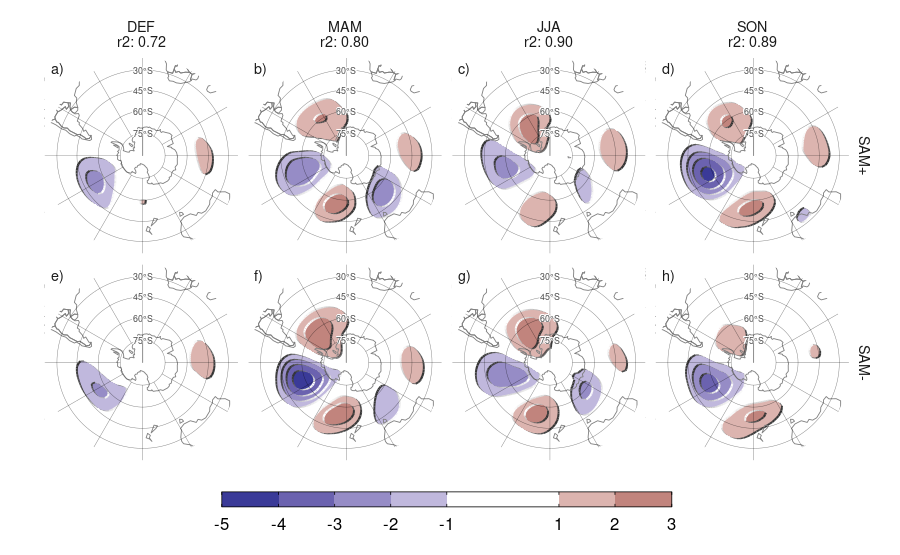
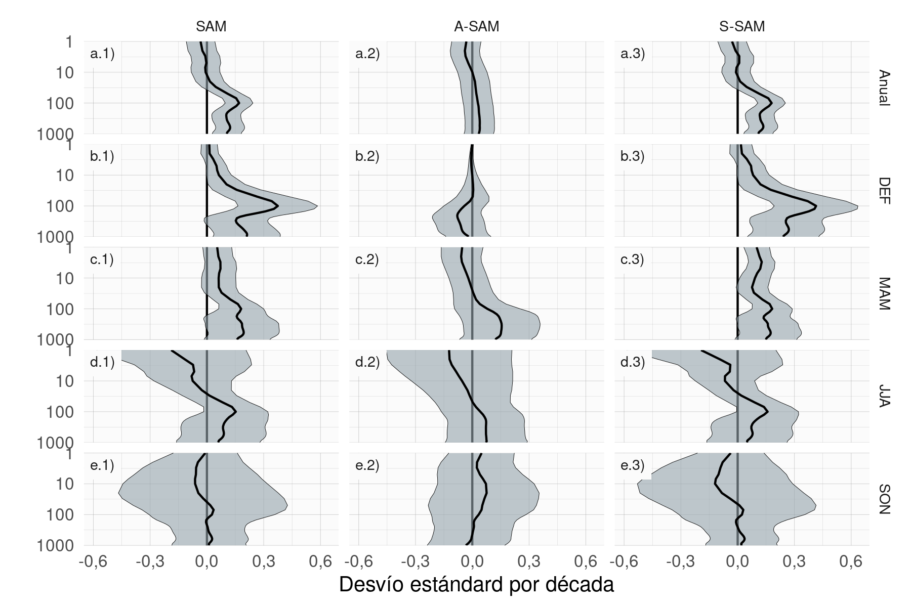

# Estructura simétrica y asimétrica del SAM {#asymsam}

## Introducción

Como se explicó en la introducción, el patrón espacial del SAM suele describirse a través del primer EOF de las anomalías de altura geopotencial en la troposfera del hemisferio sur.
En otros casos se utilizan índices construidos asumiendo que el patrón describe eminentemente variaciones de la circulación zonalmente simétrica.
Sin embargo, este patrón tiene asimetrías zonales significativas.

Muchos índices presentados en la literatura para describir el SAM se basan en medias zonales de la presión a nivel del mar o de la altura geopotencial [@ho2012].
Tanto @gong1999 como @marshall2003 definen el índice SAM como la diferencia de la media zonal de la presión a nivel del mar entre 40ºS y 65ºS.
Asimismo, @baldwin2009 propusieron definir modos anulares del norte y el sur como el primer EOF de la altura geopotencial promediada zonalmente en cada nivel en cada hemisferio.
Sin embargo, como se verá a continuación, las asimetrías zonales del SAM pueden ser significativas y han sido poco estudiadas.

En la literatura se asocia generalmente a la fase positiva del SAM a aquella asociada con anomalías negativas de altura geopotencial sobre la Antártida y positivas en latitudes medias [@jones2019].
En esta fase las temperaturas son más frías de lo normal sobre la Antártida y más cálidas de lo normal en latitudes más bajas.
Lo opuesto se encuentra para la fase negativa.
Pero hay desviaciones significativas de esta respuesta media zonal, especialmente en la Península Antártica y el Atlántico sur [@fogt2012].
La señal relacionada con el SAM en las anomalías de precipitación también es positiva en latitudes altas y negativa en latitudes medias, aunque con aún mayores desviaciones respecto de la simetría zonal [@lim2016].
En particular, la relación entre el SAM y la precipitación en el SESA en escalas interanuales depende fuertemente de las anomalías de circulación zonalmente asimétrica asociadas al SAM y presenta importantes variaciones decadales [@silvestri2009; @rosso2018].

Si bien la variabilidad del SAM se debe principalmente a la variabilidad interna, en escalas intraestacionales e interanuales, puede estar asociada con la variabilidad tropical [@fan2007; @fogt2011a; @clem2013].
Como se discutió en las secciones anteriores, el ENSO o la variabilidad tropical en general afecta a los extratrópicos del hemisferio sur a través de trenes de ondas de Rossby [@mo1987; @kidson1988; @karoly1989] que pueden proyectarse fuertemente sobre las anomalías zonales asociadas al SAM en el sector del Pacífico [p.ej. @silvestri2009; @vera2018].
@fan2007 calculó los índices de SAM de los hemisferios occidental y oriental por separado y encontró que la correlación entre ellos aumentaba si se elimina la señal (lineal) del ENSO, sugiriendo que la influencia del ENSO en el SAM no es zonalmente homogénea.

En escalas más largas, investigaciones previas han documentado a lo largo del siglo XX y lo que va del XXI, tendencias positivas en el SAM utilizando diferentes índices, sobre todo para el verano y otoño australes [p.ej., @fogt2020 y sus referencias].
Se encontró que estas tendencias están impulsadas principalmente por la reducción del ozono estratosférico y el aumento de los gases de efecto invernadero, aunque han sido analizadas en el contexto de las variables medias zonales [@marshall2004; @gillett2005; @arblaster2006; @gillett2013].
Por lo tanto, no está claro si la componente asimétrica del SAM responde a estos forzantes de la misma forma o si su variabilidad, por el contrario, altera las tendencias observadas.

Uno de los pocos trabajos que estudiaron la variabilidad temporal de la componente asimétrica del SAM es @fogt2012.
Este trabajo definió los patrones de SAM asimétrico positivo y negativo como las anomalías zonales de composiciones de presión al nivel del mar para eventos SAM positivos y negativos.
Sin embargo, estas composiciones se basan en un número reducido de casos y distribuidos inhomogéneamente entre años con y sin información satelital.
Esto es especialmente relevante debido a las inhomogeneidades en los productos de reanálisis anteriores a la era satelital y al posible cambio en la estructura asimétrica del SAM [@silvestri2009].
Además, @fogt2012 estudió la componente asimétrica zonal del SAM solamente en la presión a nivel del mar.
Si bien las asimetrías zonales en el patrón espacial del SAM son barotrópicas equivalentes en toda la troposfera, su estructura cambia drásticamente en la estratosfera [@baldwin2009].

Es decir, las investigaciones previas sugieren fuertemente que la componente zonalmente asimétrica del SAM puede tener un comportamiento potencialmente muy distinto al de la componente zonalmente simétrica, por lo que su estudio merece particular atención.
En este sentido, en el capítulo anterior se encontró que algunas fases de los cEOFs están asociadas con patrones tipo SAM en distintos niveles.
El objetivo de este capítulo es, por tanto, describir las componentes zonalmente asimétricas y simétricas de la variabilidad del SAM y su relación con los cEOFs.
En primer lugar, se propone una metodología que proporciona, para cada nivel, dos índices que pretenden captar de forma independiente la variabilidad de la componente del SAM simétrica y asimétrica, respectivamente.
Luego se los utilizó para describir su estructura vertical y su coherencia, así como su variabilidad temporal y sus tendencias.
A continuación se estudiaron los patrones espaciales asociados a la variabilidad exclusiva de cada índice centrándose en 50 hPa como nivel estratosférico y 700 hPa como nivel troposférico.
Por último, se investigaron las relaciones del SAM a 700 hPa con las anomalías de temperatura y precipitación.

## Datos y métodos

### Datos

Se utilizan las mismas fuentes de datos que en capítulos anteriores.
En este capítulo se usaron en particular datos de altura geopotencial, temperatura del aire a 2 metros del conjunto de datos ERA5 y precipitación del conjunto de datos CMAP para el período 1979--2020.

### Regresión segmentada

Se utilizó la metodología de regresión lineal segmentada para calcular los campos asociados a las fases positivas y negativas del SAM.
Ésta consiste en ajustar un modelo lineal a tramos con continuidad en cada segmento como se ilustra en la Figura \@ref(fig:segmentada-ejemplo) con datos sintéticos.

(\#fig:segmentada-ejemplo)(ref:segmentada-ejemplo-cap)

(ref:segmentada-ejemplo-cap) Ejemplo de regresión segmentada. X es una variable aleatoria con distribución uniforme e Y es $2X$ cuando $X<0$ y $1/2X$ cuando $X\ge0$ más errores aleatorios. La línea azul es la regresión segmentada de X e Y.

Para obtener las pendientes asociadas a la relación lineal para cada signo, se ajustó la ecuación

$$
Y_i = \alpha X_i + \beta X_iI_{X\le 0} + X_0 + \epsilon_i
$$

donde $Y$ e $X$ son las variables dependiente e independiente respectivamente, $\alpha$ es la pendiente asociada a los valores positivos de $X$, $\beta$ es la diferencia entre la pendiente asociada a valores positivos y negativos de $X$, $I_{X\le 0}$ es la función indicador que es 1 cuando $X\le0$ y 0 cuando $X>0$, y $X_0$ y $\epsilon_i$ son la constante y los términos de error.
El coeficiente asociado a valores negativos de X es $\beta - \alpha$.

Comparado con el uso de composiciones para eventos que superan umbrales positivos y negativos, este método tiene la ventaja de utilizar todos los datos eficientemente (en vez de descartar los eventos "neutrales") y de que la magnitud de los patrones obtenidos no depende de la intensidad media de los eventos positivos y negativos. 
Además, dado que $\beta$ es la diferencia en la pendiente entre valores positivos y negativos, es posible calcular la significancia estadística de la misma.

### Descomposición de las componentes del SAM {#definition-of-indices}

El SAM suele en muchos casos definirse como el EOF de las anomalías de la presión al nivel del mar o de la altura geopotencial en un determinado nivel vertical, generalmente bajo de la troposfera [ej @silvestri2009; @ho2012].
Siguiendo a @baldwin2001, se amplió esa definición verticalmente y se utiliza el término SAM para referirse al primer EOF de las anomalías mensuales de altura geopotencial al sur de 20º S en cada nivel vertical considerado y que de ahora en adelante el SAM se refiere al SAM "completo" que incluye tanto la componente simétrica como la asimétrica.

Para separar la componente zonalmente simétrica y la asimétrica del SAM, se calculó la media zonal y las anomalías del patrón espacial del SAM completo, como se muestra en la Figura \@ref(fig:method) en 700 hPa.
La señal espacial completa ($\mathrm{EOF_1}(\lambda, \phi)$) es la suma de la componente zonalmente asimétrica ($\mathrm{EOF_1^*}(\lambda, \phi)$) y la simétrica ($[\mathrm{EOF_1}](\lambda, \phi)$).
A continuación, se calculó el índice SAM, el índice SAM asimétrico (A-SAM) y el índice SAM simétrico (S-SAM) como los coeficientes de la regresión de cada campo de altura geopotencial mensual sobre los respectivos patrones (ponderando por el coseno de la latitud).
Finalmente, se normalizaron los tres índices dividiéndolos por la desviación estándar del índice SAM en cada nivel.
Como resultado, las magnitudes entre los índices son comparables.
Sin embargo, sólo el índice SAM tiene desviación estándar unitaria por definición.
La varianza explicada por cada patrón se utiliza como indicador del grado de simetría o asimetría zonal de cada campo mensual.
Para cuantificar la coherencia entre las series temporales correspondientes a distintos índices o al mismo índice en distintos niveles, se calculó la correlación temporal entre ellas.

(ref:method-cap) Patrones espaciales del primer EOF de la altura geopotencial en 700 hPa para el período 1979--2020. (a) Campo completo, (b) componente zonalmente asimétrica y (c) componente zonalmente simétrica. Unidades arbitrarias con valores negativos en azul y positivos en rojo.

(\#fig:method)(ref:method-cap)

Cabe mencionar que una limitación de este método es que supone linealidad en entre las componentes del SAM.
Es decir, supone que los patrones de anomalías asociadas a valores positivos de cada componente del SAM son similares pero de signo opuesto a las asociadas a la fase valores negativos y de magnitud proporcional a la magnitud del índice.
Las composiciones de @fogt2012 (su Figura 4) sugieren que esto podría no ser del todo válido, aunque gran parte de esa aparente no linealidad podría deberse a la naturaleza heterogénea de los años seleccionados para construir las composiciones y a la incertidumbre muestral.

Para poner esta suposición a prueba, se calculó la regresión segmentada de las anomalías zonales de altura geopotencial con el índice SAM para cada signo del SAM.
Las Figuras \@ref(fig:sign-regression-50) y \@ref(fig:sign-regression-700) muestran los campos de regresión en 50 y 700 hPa divididos por trimestres.
Se puede observar que en casi todas las estaciones y en ambos niveles, los campos de regresión de SAM positivo y negativo son similares entre ellos.
Este análisis cualitativo se confirma por el análisis cuantitativo al observar que el $r^2$ (representando la correlación espacial al cuadrado) tienen valores entre 0,7 y 0,9, indicando alta similaridad.
A su vez, también es similar la intensidad de los coeficientes de correlación, indicando un buen cumplimiento de la hipótesis de linealidad.

(ref:sign-regression-50-cap) Regresión segmentada de la anomalía zonal de altura geopotencial en 50 hPa con el índice SAM para cada signo para el período 1979--2020 (m). La correlación espacial al cuadrado entre cada campo en cada estación se detalla debajo de la estación. Áreas con puntos marcan regiones donde el p-valor de la diferencia entre el signo positivo y el negativo  es menor que 0,01 ajustado por FDR (no hay áreas).

(\#fig:sign-regression-50)(ref:sign-regression-50-cap)

(ref:sign-regression-700-cap) Igual que la Figura \@ref(fig:sign-regression-50) pero para 700 hPa.

(\#fig:sign-regression-700)(ref:sign-regression-700-cap)

Al realizar el análisis EOF utilizando los datos de todos los meses también se asume que la estructura del SAM es la misma en todas las estaciones.
La Figura \@ref(fig:season-regression) muestra la regresión de las anomalías de altura geopotencial en 50 y 700 hPa contra el índice SAM para cada trimestre del año y la significancia estadística de la diferencia entre cada estación y SON.

En 50 hPa (Fig. \@ref(fig:season-regression) fila a), los patrones del SAM para MAM y JJA son muy similares a SON, con correlación espacial cuadrada mayor a 0,75.
En estas tres estaciones, el SAM en 50 hPa se asocia a una onda planetaria 1 con su centro negativo en 60ºO.
El patrón de JJA tiene algunas diferencias significativas con respecto a SON, principalmente un corrimiento e intensificación de la anomalía negativa de la onda.
El patrón de DEF, en cambio, es muy distinto; la onda 1 tiene su mínimo cerca de 180ºO y está más retraída a latitudes altas.
Además, su correlación espacial es esencialmente nula.

En 700 hPa (Fig. \@ref(fig:season-regression) fila b), las cuatro estaciones tienen patrones bastante similares, prácticamente sin diferencias estadísticamente significativas con respecto a SON y con correlaciones cuadradas mayores a 0,6.
El patrón de DEF es el más distinto, siendo similar a SON pero menos intenso.
Esto es consistente con los resultados de @fogt2020.

Estos resultados sugieren entonces que la suposición de estabilidad estacional se cumple excepto para DEF en la estratósfera.
Esto indica que hay que tener cuidado en la interpretación del SAM asimétrico en DEF en la estratosfera ya que el patrón de SAM asimétrico impuesto por la metodología no coincide con el patrón de SAM asimétrico que se obtendría considerando únicamente este trimestre.

(ref:season-regression-cap) Regresión múltiple de las anomalías zonales de altura geopotencial en 50 hPa y en 700 hPa con el índice SAM para cada estación (m). El sombreado muestra la regresión de cada estación y los contornos grises, la diferencia de cada estación con respecto a SON (valores negativos en línea punteada y positivos en línea sólida). La correlación espacial al cuadrado entre cada campo y el campo de SON se detalla debajo de la estación. Áreas con puntos marcan regiones donde el p-valor es menor que 0,01 ajustado por FDR, donde para estaciones distintas a SON, marca el p-valor de la diferencia respecto a SON.

(\#fig:season-regression)(ref:season-regression-cap)

(ref:sam-period-cap) Patrón espacial del primer EOF computado para el período 1979 -- 1998 (columna 1) y 1999 -- 2020 (columna 2) para 50 hPa (fila a) y 700 hPa (fila b). Unidades arbitrarias con valores negativos en azul y negativos en azul.

(\#fig:sam-period)(ref:sam-period-cap)

El método también asume que el patrón zonalmente asimétrico del SAM permanece estacionario a lo largo del periodo considerado.
@silvestri2009 sugieren que este podría no ser el caso entre 1958 y 2004.
Para probar esta suposición, se calculó el SAM para las dos mitades del periodo (1979 a 1998 y 1999 a 2020), que se muestran en la Figura \@ref(fig:sam-period).
Las diferencias entre los dos períodos parecen ser relativamente pequeñas, tanto en la troposfera como en la estratosfera.
La correlación espacial entre los campos es de 0,73 (CI: 0,72 -- 0,75) en 50 hPa y  0,78 (CI: 0,77 -- 0,79) en 700 hPa. 

## Resultados

### Evolución temporal {#temporal}

Primero se evalúa la evolución temporal del A-SAM y S-SAM.
La Figura \@ref(fig:asymsam-timeseries) muestra las series temporales en 700 hPa y 50 hPa y sus correspondientes estimaciones de densidad.
Se seleccionaron estos dos niveles como representativos de la variabilidad troposférica y estratosférica respectivamente.
Como se muestra a continuación, las variabilidades de ambos índices son muy coherentes dentro de cada región de la atmósfera, por lo que es razonable tomar un nivel como representativo de cada capa.

(ref:asymsam-timeseries-cap) Serie temporal de A-SAM y S-SAM en 50 hPa (panel a) y 700 hPa (panel b). A la derecha, la densidad de probabilidad de cada índice. Las series están estandarizadas por el desvío estándar del SAM en cada nivel. Sin unidades.

(\#fig:asymsam-timeseries)(ref:asymsam-timeseries-cap)

(ref:spectrum-cap) Espectro de cada serie temporal suavizada. El sombreado indica el intervalo de confianza del 95% del espectro nulo calculado usando bootstrap tomando 5000 simulaciones de un modelo autoregresivo ajustado a los datos. La línea gris indica la amplitud promedio teórica del modelo autoregresivo. Para el período 1979--2020.

(\#fig:spectrum)(ref:spectrum-cap)

Los espectros de estas series temporales se muestran en la Figura \@ref(fig:spectrum).
El S-SAM estratosférico varía fuertemente con un periodo entre 10 y 30 meses (Fig. \@ref(fig:spectrum) a.3).
En el periodograma del S-SAM troposférico (Fig.\@ref(fig:spectrum) b.3) se aprecia un pico local en un rango de frecuencias similar, aunque no es estadísticamente significativo.
Esta banda de periodicidad que exhibe la estratosfera está alrededor del rango de periodicidad de la Oscilación Cuasi-Bienal (QBO, por su siglas en inglés, @baldwin2001b) y es consistente con  los resultados de @vasconcellos2022, quienes encontraron que el SAM y la QBO comparten una alta potencia común significativa alrededor de la banda de 2 años.
El hecho de que esta periodicidad no sea evidente en el índice A-SAM, también es consistente con los resultados de estos autores, que muestran un monopolo bastante simétrico sobre la Antártida en sus composiciones de anomalías de altura geopotencial durante la QBO oriental y occidental
En la troposfera, el pico de variabilidad más significativo se encuentra en A-SAM en torno a 36 meses.

La Figura \@ref(fig:cor-lev) muestra la correlación entre A-SAM y S-SAM en cada nivel para los desfasajes cero (simultáneo) y -1 (A-SAM adelantada a S-SAM en 1 mes).
Los valores de las correlaciones instantáneas entre A-SAM y S-SAM son relativamente constantes en toda la troposfera, fluctuando entre 0,38 y 0,44.
Las correlaciones con defasaje de un mes son igualmente constantes pero muy reducidas.
En la estratosfera, las correlaciones instantáneas caen a un mínimo de 0,28 en 20 hPa y luego aumentan nuevamente monótonamente con la altura hasta el nivel más alto considerado  (aunque los resultados cerca del tope superior representado en los modelos deben interpretarse con cuidado).
Al mismo tiempo, las correlaciones con un mes de defasaje aumentan con la altura.
Por lo tanto, el índice A-SAM estratosférico tiende a preceder al índice S-SAM.

(ref:cor-lev-cap) Correlación instantánea (línea verde) y con un defasaje de 1 mes (línea naranja) entre S-SAM y A-SAM para el período 1979--2020.

(\#fig:cor-lev)(ref:cor-lev-cap)

(ref:cross-correlation-cap) Correlación cruzada entre niveles para el índice SAM (a), A-SAM (b) y S-SAM (c) para el período 1979--2020.

(\#fig:cross-correlation)(ref:cross-correlation-cap)

La Figura \@ref(fig:cross-correlation) muestra la correlación cruzada simultánea (sin desfasaje) entre niveles para los índices SAM, A-SAM y S-SAM.
Para el SAM (Fig. \@ref(fig:cross-correlation)a), los valores altos por debajo de 100 hPa reflejan coherencia vertical en toda la troposfera.
Por encima de 100 hPa, la correlación entre niveles disminuye más rápidamente, lo que indica una variabilidad menos coherente.
Sin embargo, las correlaciones entre los niveles troposféricos y los niveles estratosféricos bajos y medios siguen siendo relativamente altas (por ejemplo, más de 0,4 entre los niveles troposféricos y los niveles por debajo de 30 hPa).
A-SAM y S-SAM (Fig. \@ref(fig:cross-correlation)b y c, respectivamente) comparten un alto nivel de coherencia similar en la troposfera, pero difieren en su comportamiento estratosférico.
La coherencia estratosférica es mayor para el A-SAM que para el S-SAM.
El S-SAM estratosférico tiene una conexión con el S-SAM troposférico algo más intensa que el A-SAM estratosférico con el A-SAM troposférico.

(ref:trends-cap) Tendencias lineales (en desvío estándar por década) del SAM (columna a), A-SAM (columna b) y S-SAM (columna c) para cada nivel usando datos del todo el año (fila 1) y promedios estacionales (filas 2 a 5) para el período 1979--2020. El sombreado indica el intervalo de confianza de 95%.

(\#fig:trends)(ref:trends-cap)

A continuación, se evalúan las tendencias lineales para cada uno de los índices para el periodo 1979--2020 en cada nivel para el año completo y separado por trimestres (Fig. \@ref(fig:trends)).
El índice SAM presenta una tendencia positiva estadísticamente significativa (Fig. \@ref(fig:trends)a.1) en todos los niveles entre 1000 hPa y aproximadamente 50 hPa, con un máximo en 100 hPa.
Las tendencias estacionales (Fig. \@ref(fig:trends) columna 1) indican que las tendencias son significativas sólo en verano y marginalmente en otoño.
Esto es consistente con los resultados de estudios previos, los cuales documentaron tendencias positivas en verano, menores en otoño y ninguna tendencia en las demás estaciones (por ejemplo, @fogt2020 y sus referencias) utilizando índices del SAM basados en la circulación cerca de la superficie.

Al separar el SAM en sus partes asimétrica y simétrica, no sólo se puede ver que estas tendencias se deben casi por completo a la componente simétrica (comparar columnas 2 y 3 en Figura \@ref(fig:trends)), sino que en algunos casos las tendencias se vuelven más claras.
En verano, el índice A-SAM tiene una tendencia negativa estadísticamente no significativa en la troposfera media que oculta la tendencia en el índice SAM; como resultado, las tendencias calculadas utilizando sólo la componente simétrica son más intensas (comparar la región sombreada en la Figura \@ref(fig:trends)b.1 y b.3).
En otoño, el índice S-SAM revela una tendencia positiva estadísticamente significativa en la estratosfera que no es significativa utilizando el índice SAM.

(ref:r-squared-trend-cap) Tendencias lineales (en porcentaje por década) de la varianza explicada por el A-SAM y el S-SAM en cada nivel para cada trimestre en el período 1979--2020. El sombreado indica el intervalo de confianza del 95%.

(\#fig:r-squared-trend)(ref:r-squared-trend-cap)

Para estudiar la cuestión de si el SAM se está volviendo más o menos asimétrico, se muestran las tendencias de la varianza explicada de cada índice para cada trimestre en la Figura \@ref(fig:r-squared-trend).
En la troposfera, la única tendencia significativa es la de DEF, en la que el A-SAM tiene una tendencia positiva de alrededor del 2% por década (Fig. \@ref(fig:r-squared-trend) a), lo que sugiere que el SAM en DEF se ha vuelto más asimétrico en el período de 1979 a 2020.
@fogt2012 observó un cambio de una SAM más asimétrica antes de 1980 a una SAM más simétrica después de 1980, pero nuestro periodo de estudio (1979--2020) nos impide detectar ese cambio.
Sin embargo, debido a la naturaleza atípica de la componente asimétrica del SAM durante la DEF (Sección \@ref(definition-of-indices)), esto debe tomarse sólo como una evidencia preliminar.
La otra tendencia significativa se da en la estratosfera durante SON (Fig. \@ref(fig:r-squared-trend) d), donde hay una tendencia positiva en la varianza explicada por la S-SAM de aproximadamente un 4% por década.
Este cambio podría ser el resultado del forzamiento provocado por el agotamiento del ozono.

### Patrones espaciales {#spatial}

Para describir y entender la influencia de las diferentes componentes del SAM en las anomalías temporales de la circulación del hemisferio sur, se calculó la regresión lineal de las anomalías de altura geopotencial sobre los índices SAM, A-SAM y S-SAM en los niveles de 50 hPa y 700 hPa (Fig. \@ref(fig:2d-regr)).
Los coeficientes de regresión de la columna 1 de la Figura \@ref(fig:2d-regr) se calcularon utilizando el índice del SAM.
Los coeficientes de regresión de las columnas 2 y 3 se calcularon mediante regresión múltiple utilizando los índices A-SAM y S-SAM al mismo tiempo, de manera que deben interpretarse como los patrones asociados a cada índice, eliminando la variabilidad (linealmente) explicada por el otro.

(ref:2d-regr-cap) Regresión de altura geopotencial (metros) en 50 hPa (fila a) y 700 hPa (fila b) con el SAM (columna 1), A-SAM (columna 2) y S-SAM (columna 3) para el período 1979--2020. Los puntos en panel b.2 indican la posición de los puntos de referencia usados por @raphael2004 para calcular su índice de la onda zonal 3.

(\#fig:2d-regr)(ref:2d-regr-cap)

En la estratosfera, el patrón espacial descrito por la regresión asociada al SAM está claramente dominado por un monopolo que no está centrado en el Polo Sur (Fig. \@ref(fig:2d-regr)a.1).
En cambio, el patrón asociado a la parte asimétrica del SAM se caracteriza por una estructura de onda-1 con centros sobre el Pasaje de Drake en el Hemisferio Occidental y el Mar de Davis en el Hemisferio Oriental.
Este eje se alinea con el defasaje del monopolo encontrado para el SAM (Fig. \@ref(fig:2d-regr).a.1).
Por otra parte, el patrón asociado al S-SAM, es un monopolo más simétrico que el encontrado para el SAM aunque tampoco perfectamente centrado en el Polo Sur.

En la troposfera, el patrón espacial descrito por la regresión asociada al SAM (Fig. \@ref(fig:2d-regr)b.1) muestra la ya conocida combinación de una estructura anular zonalmente simétrica en la zona polar con asimetrías zonales en forma de onda-3 en las latitudes medias [@fogt2012].
Los patrones asociados a los índices A-SAM y S-SAM separan ambas estructuras claramente.
El A-SAM se ve asociado a un patrón de onda zonal 3 y de amplitud modulada por la longitud; con mayor amplitud en hemisferio occidental y casi nula amplitud en el oriental.
El S-SAM, por su parte, se asocia a una estructura anular mucho más zonalmente simétrica que el SAM.
Se encontró que el patrón de onda-3 asociado con el A-SAM (Figura \@ref(fig:2d-regr)b.2) está girado media longitud de onda respecto a la posición media del patrón de onda-3 medio descrito por @raphael2004, cuyas posiciones de referencia están marcadas con puntos en la figura.
De hecho, no existe correlación entre el índice de @raphael2004 y el A-SAM (cor = 0,04 (CI: -0,05 -- 0,13)).
Así, el índice A-SAM troposférico representa un desplazamiento zonal en la posición de la onda 3 climatológica.

(ref:wave-amplitude-cap) Amplitud (metros) de las ondas zonales de los patrones de regresión de altura geopotencial de la Figura \@ref(fig:2d-regr) para ondas zonales con número de onda 0, 1, 2 y 3, donde el número de onda 0 representa la amplitud de la media zonal.

(\#fig:wave-amplitude)(ref:wave-amplitude-cap)

La amplitud de las ondas zonales con números de onda 0 a 3 en cada latitud a 50 hPa y 700 hPa se muestran en la Figura \@ref(fig:wave-amplitude), donde el número de onda cero representa la amplitud de la media zonal.
Las amplitudes de las ondas zonales del patrón espacial asociado al SAM (Fig. \@ref(fig:wave-amplitude) columna 1) están dominadas por la media zonal (número de onda 0) en ambos niveles.
Sin embargo, las ondas zonales son importantes, sobre todo al sur de 50ºS, con un número de onda 1 claramente dominante en 50 hPa (Fig. \@ref(fig:wave-amplitude)a.1) y una mezcla de ondas de amplitud similar en 700 hPa (Fig. \@ref(fig:wave-amplitude)b.1).
La Figura \@ref(fig:wave-amplitude) columna 2 muestra que el A-SAM está dominado principalmente por la onda 1 en la estratosfera (Fig. \@ref(fig:wave-amplitude)a.2), mientras que en la troposfera se explica por una combinación de ondas zonales 3 a 1 en nivel decreciente de importancia (Fig. \@ref(fig:wave-amplitude)b.2) con una amplitud despreciable de la media zonal.
Por otra parte, el S-SAM se explica casi en su totalidad por la media zonal en ambos niveles (Fig. \@ref(fig:wave-amplitude) columna 3), con poca o ninguna contribución de las ondas zonales con números de onda de 1 a 3.

(ref:vertical-regression-cap) Regresión de las anomalías mensuales de altura geopotencial promediada entre 65ºS y 45ºS (metros) y el índice A-SAM de 50 hPa (a) y 700 hPa (b) (niveles indicados en línea punteada) para el período 1979--2020.

(\#fig:vertical-regression)(ref:vertical-regression-cap)

La estructura vertical de las anomalías de altura geopotencial asociadas al índice A-SAM se analizaron con mayor profundidad a través de una sección transversal vertical de regresiones de anomalías de altura geopotencial promediadas entre 65ºS y 40ºS con el índice A-SAM de 50 hPa (Fig. \@ref(fig:vertical-regression)a) y con el índice A-SAM de 700 hPa (Fig. \@ref(fig:vertical-regression)b).
Las anomalías de altura geopotencial asociadas al A-SAM estratosférico (Fig. \@ref(fig:vertical-regression)a) están claramente limitadas a la estratosfera, lo que subraya el desacoplamiento entre el A-SAM estratosférico y el troposférico.
La estructura vertical de esta señal se inclina unos 60 grados hacia el oeste entre 100 hPa y 1 hPa, lo que sugiere procesos baroclínicos.
La señal en la estratosfera maximiza cerca de 10 hPa a pesar de utilizar el índice de 50 hPa para la regresión.

El A-SAM troposférico (Fig. \@ref(fig:vertical-regression)b) presenta señales significativas que se extienden hacia arriba hasta los niveles más altos del reanálisis.
En la troposfera, la estructura de la onda 3 es barotrópica equivalente, con una amplitud máxima en torno a los 250 hPa.
Las anomalías son mayores en el hemisferio occidental, donde se extienden hasta la estratosfera.
En el hemisferio oriental, la señal de la onda 3 es menor y se limita a la troposfera, mientras que las anomalías negativas dominan en la estratosfera.
Aunque el índice A-SAM troposférico está asociado a anomalías geopotenciales estratosféricas, éstas no se proyectan fuertemente sobre el A-SAM estratosférico.
Las estructuras mostradas en la Figura \@ref(fig:vertical-regression) son robustas a la elección del nivel del índice.
Para cualquier índice estratosférico (por encima de 100 hPa), las anomalías resultantes son muy similares a la estructura de onda-1 con máximo cerca de 10 hPa en la Figura \@ref(fig:vertical-regression)a.
Por el contrario, para cualquier índice troposférico (por debajo de 100 hPa), el resultado es muy similar al de la Figura \@ref(fig:vertical-regression)b.
Los patrones cambian principalmente en amplitud (no se muestra).

(ref:enso-cor-table-cap) Correlación entre los índices del SAM y el ONI considerando todos los meses y para cada estación por separado. Entre parentéresis se indican los p-valores ajustado por FDR).  En negrita, se indican las correlaciones con p-valores menores a 0,01.

<table class=" lightable-classic-2" style='font-family: "Arial Narrow", "Source Sans Pro", sans-serif; width: auto !important; margin-left: auto; margin-right: auto;'>
<caption>(\#tab:enso-cor-table)(ref:enso-cor-table-cap)</caption>
 <thead>
<tr>
<th style="empty-cells: hide;" colspan="1"></th>
<th style="padding-bottom:0; padding-left:3px;padding-right:3px;text-align: center; " colspan="1">
Correlación
</th>
<th style="padding-bottom:0; padding-left:3px;padding-right:3px;text-align: center; " colspan="2">
Correlación parcial
</th>
</tr>
  <tr>
   <th style="text-align:center;">  </th>
   <th style="text-align:center;"> SAM </th>
   <th style="text-align:center;"> A-SAM </th>
   <th style="text-align:center;"> S-SAM </th>
  </tr>
 </thead>
<tbody>
  <tr>
   <td style="text-align:center;"> Año </td>
   <td style="text-align:center;font-weight: bold;"> -0,17 </td>
   <td style="text-align:center;font-weight: bold;"> -0,25 </td>
   <td style="text-align:center;"> 0,00 </td>
  </tr>
  <tr>
   <td style="text-align:center;"> Año </td>
   <td style="text-align:center;font-weight: bold;"> (&lt;0,001) </td>
   <td style="text-align:center;font-weight: bold;"> (&lt;0,001) </td>
   <td style="text-align:center;"> (0,993) </td>
  </tr>
  <tr>
   <td style="text-align:center;"> DEF </td>
   <td style="text-align:center;font-weight: bold;"> -0,32 </td>
   <td style="text-align:center;font-weight: bold;"> -0,31 </td>
   <td style="text-align:center;"> -0,19 </td>
  </tr>
  <tr>
   <td style="text-align:center;"> DEF </td>
   <td style="text-align:center;font-weight: bold;"> (&lt;0,001) </td>
   <td style="text-align:center;font-weight: bold;"> (0,002) </td>
   <td style="text-align:center;"> (0,068) </td>
  </tr>
  <tr>
   <td style="text-align:center;"> MAM </td>
   <td style="text-align:center;"> -0,05 </td>
   <td style="text-align:center;font-weight: bold;"> -0,25 </td>
   <td style="text-align:center;"> 0,15 </td>
  </tr>
  <tr>
   <td style="text-align:center;"> MAM </td>
   <td style="text-align:center;"> (0,678) </td>
   <td style="text-align:center;font-weight: bold;"> (0,009) </td>
   <td style="text-align:center;"> (0,156) </td>
  </tr>
  <tr>
   <td style="text-align:center;"> JJA </td>
   <td style="text-align:center;"> 0,02 </td>
   <td style="text-align:center;"> -0,13 </td>
   <td style="text-align:center;"> 0,11 </td>
  </tr>
  <tr>
   <td style="text-align:center;"> JJA </td>
   <td style="text-align:center;"> (0,948) </td>
   <td style="text-align:center;"> (0,218) </td>
   <td style="text-align:center;"> (0,300) </td>
  </tr>
  <tr>
   <td style="text-align:center;"> SON </td>
   <td style="text-align:center;font-weight: bold;"> -0,26 </td>
   <td style="text-align:center;font-weight: bold;"> -0,40 </td>
   <td style="text-align:center;"> 0,00 </td>
  </tr>
  <tr>
   <td style="text-align:center;"> SON </td>
   <td style="text-align:center;font-weight: bold;"> (0,008) </td>
   <td style="text-align:center;font-weight: bold;"> (&lt;0,001) </td>
   <td style="text-align:center;"> (0,993) </td>
  </tr>
</tbody>
</table>

El patrón de la onda 3 de la Figura \@ref(fig:2d-regr)b.2 es muy similar al PSA [@mo1987; @kidson1988], que es un patrón de teleconexión asociado al ENSO [@karoly1989].
Como se mencionó en la introducción de este capítulo, existen evidencias previas de que la actividad del ENSO y el SAM pueden estar relacionadas [@silvestri2009; @fogt2011a].
Se analizó entonces la relación entre el SAM y sus componentes y el ENSO (medido por el Índice del Niño Oceánico [ONI, @bamston1997]) y se muestra en la Tabla \@ref(tab:enso-cor-table) para cada índice SAM y para cada trimestre y para todo el año.
Mientras que la correlación es significativa entre el SAM completo y ENSO considerando todo el año, solamente es significativa para los trimestres  DEF y SON.
Se encontró que esta relación es captada principalmente por el A-SAM, ya que este índice presenta correlaciones parciales significativas con el ENSO, mientras que las correlaciones con el S-SAM son todas menores y no significativas.
Incluso en los trimestres donde la correlación entre SAM y ENSO es esencialmente nula (MAM y JJA), la correlación parcial entre el A-SAM y el ONI es mucho más alta; en efecto, en MAM  es significativa al nivel del 95%.
El mismo análisis se realizó utilizando el Índice ENSO Multivariado [@wolter2011] y el Índice de Oscilación del Sur [@ropelewski1987], obteniendo resultados similares.
Esto último indica que estos resultados no dependen del índice ENSO utilizado.

### Impactos {#impacts}

Para evaluar las diferencias en los impactos asociados a los índices SAM, A-SAM y S-SAM, se realió una regresión de la temperatura del aire a 2 metros y la precipitación sobre cada uno de los tres índices del SAM de 700 hPa.
Como se mostró en secciones anteriores, los tres índices son muy coherentes en la troposfera, por lo que se seleccionó este nivel para representar la circulación troposférica por compatibilidad con la literatura previa.
Las regresiones se realizaron sin quitarle la tendencia ni a las variables ni a los índices, pero el cálculo de las regresiones con valores sin tendencias no muestran diferencias importantes (no se muestra).

#### Temperatura del aire a 2 metros

La Figura \@ref(fig:regr-air-season) muestra las regresiones con la temperatura del aire a 2 metros.
En verano, los valores positivos del índice SAM (Fig. \@ref(fig:regr-air-season)a.1) se asocian con anomalías negativas de temperatura cerca de la Antártida rodeadas por un anillo de anomalías positivas en las latitudes medias.
El anillo no es zonalmente simétrico, ya que hay cuatro máximos locales distintivos en torno a 30ºO, 120ºO, 150ºE y 90ºE respectivamente.
En los trópicos, las anomalías son negativas en el Pacífico ecuatorial, lo que concuerda con la correlación negativa entre SAM y ENSO observada en la Tabla \@ref(tab:enso-cor-table).
Los paneles a.2 y a.3 de la Figura \@ref(fig:regr-air-season) muestran que tanto las anomalías negativas en los trópicos como las anomalías entre 45ºS y 60ºS están asociadas principalmente con el A-SAM y que el S-SAM está asociado a anomalías de temperatura extendidas más zonalmente simétricas en latitudes altas.
Sobre la Antártida, los valores positivos del índice SAM están asociados a anomalías negativas de temperatura, en particular sobre la costa oriental.
Estas anomalías están explicadas únicamente con el S-SAM.
Por otro lado, las anomalías de temperatura en el océano Índico, el sur de África y Australia están fuertemente relacionadas con A-SAM y no están presentes en el patrón asociado con el SAM.

(ref:regr-air-season-cap) Regresión de las anomalías de temperatura a dos metros (K) con el índice SAM (columna a), A-SAM (columna b) y S-SAM (columna c) en cada trimestre para el período 1979--2020. Áreas con puntos marcan regiones donde el p-valor es menor que 0,01 ajustado por FDR. La escala de colores se corta en $\pm0,6 \mathrm{K}$ para resaltar valores de regresión en los trópicos y latitudes medias a expensas de los valores en las regiones polares.

(\#fig:regr-air-season)(ref:regr-air-season-cap)

En otoño, invierno y primavera (filas b, c y d en la Figura \@ref(fig:regr-air-season)) el SAM está asociado a anomalías de temperatura con estructura zonalmente asimétrica en latitudes altas, con valores negativos sobre la Antártida y el Mar de Amundsen y positivas al sur de Nueva Zelanda y centradas en el pasaje de Drake que se extienden hasta la Patagonia.
Esto refleja la naturaleza más asimétrica del SAM durante estas estaciones en comparación al verano.
En acuerdo, @jones2019 observó características similares en las mediciones de estaciones, aunque utilizando datos de 1957 a 2016.
De todas maneras, en general se observa que la señal sobre la Antártida está asociada al S-SAM (aunque estadísticamente significativa sólo en invierno), mientras que las anomalías sobre el Océano Antártico y latitudes más bajas se asocian al A-SAM.
En primavera, la señal tropical de A-SAM es similar a la del verano, revelando de nuevo la importancia del vínculo ENSO\--A-SAM.

El patrón de anomalías de temperatura negativas en el polo rodeadas de anomalías positivas, evidente aproximadamente en todas las estaciones -aunque con intensidad variable y detalles a pequeña escala-, se traduce en un gradiente de temperatura meridional aumentado que maximiza en la línea cero, lo que es coherente con la intensificación y migración hacia el polo de los vientos del oeste comúnmente vinculados al SAM a través del balance de viento térmico.
Por tanto, no es sorprendente verlo más claramente asociado al S-SAM.
Asimismo, las temperaturas sobre la Antártida Oriental se ven más afectadas por el S-SAM, mientras que en la Antártida Occidental son más sensibles al A-SAM.
Dado que el índice S-SAM está negativamente correlacionado con la temperatura sobre la Antártida Oriental (Figura \@ref(fig:regr-air-season) columna 3), es posible que la tendencia positiva en el índice S-SAM pueda ayudar a explicar la falta de tendencia positiva de la temperatura en la Antártida Oriental en comparación con la Antártida Occidental en el contexto del calentamiento global [@nicolas2014].

#### Precipitación

La Figura \@ref(fig:global-pp) muestra la regresión de los índices SAM con la precipitación para el hemisferio sur considerando todos los meses del año.
La señal de precipitación asociada al SAM completo (Fig. \@ref(fig:global-pp)a) muestra en general una disminución de la precipitación en torno a los 45ºS, un ligero aumento de la precipitación en torno a los 30ºS y un aumento de la precipitación sobre la Antártida, un patrón que concuerda con los obtenidos en otros estudios [p.ej. @hendon2014].
Este patrón se mantiene prácticamente sin cambios entre estaciones, aunque varía en intensidad (no se muestra).
Los paneles b y c de la Figura \@ref(fig:global-pp) muestran que la influencia del A-SAM sólo se da en los trópicos y latitudes medias, mientras que la señal S-SAM es fuerte en las latitudes altas.
En particular, los valores positivos del S-SAM se asocian con el aumento de las precipitaciones sobre la Antártida y la disminución de las precipitaciones alrededor del Océano Austral.

(ref:global-pp-cap) Regresión de anomalías de precipitación (mm por día) con el SAM (a), A-SAM (b) y S-SAM (c) para el período 1979--2020. En gris, las zonas con valores faltantes. Áreas con puntos marcan regiones donde el p-valor es menor que 0,01 ajustado por FDR. La escala de colores se corta en $\pm0,25 \mathrm{K}$ para resaltar valores de regresión en los trópicos y latitudes medias a expensas de los valores en las regiones polares.

(\#fig:global-pp)(ref:global-pp-cap)

Para estudiar con más detalle los impactos locales en distintas regiones continentales del hemisferio sur, las Figuras \@ref(fig:pp-regr-oceania) y \@ref(fig:pp-regr-america) muestran la regresión de los índices SAM con la precipitación media estacional y la altura geopotencial de 700 hPa para la región de Oceanía, y Sudamérica respectivamente.
No se muestran los resultados para la región de Sudáfrica porque allí no se detectó ninguna señal significativa.

(ref:pp-regr-oceania-cap) Regresión de anomalías de precipitación (mm por día, sombrado) y anomalías de altura geopotencial (líneas finas, valores positivos en líneas llenas y negativos en líneas punteadas) para todo el año (fila a) y medias estacionales (filas b a e) con el SAM (columna 1), A-SAM (columna 2) y S-SAM (columna 3) para el período 1979--2020. Nueva Zelanda e islas aledañas. Áreas con puntos marcan regiones donde el p-valor es menor que 0,01 ajustado por FDR.

(\#fig:pp-regr-oceania)(ref:pp-regr-oceania-cap)

En Oceanía, la regresión anual muestra que el índice SAM está asociado con anomalías positivas de precipitación en la región sudeste de Australia (Fig. \@ref(fig:pp-regr-oceania)a.1), en acuerdo con @gillett2006.
La separación entre A-SAM y S-SAM sugiere que esta anomalía positiva se explica por el S-SAM sólo en la costa este (Fig. \@ref(fig:pp-regr-oceania)a.3).
Las anomalías de altura geopotencial asociadas a este índice (contornos negros) son indicativas de un flujo hacia el oeste procedente del mar de Tasmania, lo que podría explicar las anomalías positivas en las precipitaciones, en acuerdo con @hendon2007.
El A-SAM parece estar relacionado con anomalías positivas de precipitación en la costa sureste de Australia (Fig. \@ref(fig:pp-regr-oceania)a.2), que podrían explicarse de forma similar por la circulación anómala del oeste que transporta aire húmedo al continente desde el océano Índico.

Las regresiones estacionales muestran valores altos pero no estadísticamente significativos.
En SON, valores positivos del SAM se asocian con anomalías positivas de precipitación en el este y centro de Australia (Fig. \@ref(fig:pp-regr-oceania)e.1).
En este trimestre, el S-SAM parece estar asociado con anomalías positivas de precipitación en un área relativamente reducida de la costa oriental (Fig. \@ref(fig:pp-regr-oceania)e.3) mientras que las anomalías positivas de precipitación relacionadas con A-SAM positivo afectan a todo el este de Australia (Fig. \@ref(fig:pp-regr-oceania)e.2).

En verano, un índice SAM positivo se asocia con anomalías de precipitación positivas en Australia occidental y oriental, sobre todo en la región noreste (Fig. \@ref(fig:pp-regr-oceania)b.1).
La parte oriental está dominada por la relación con el S-SAM y la occidental, por el A-SAM.
En otoño, la regresión con el SAM muestra anomalías positivas en el norte, similares a las de verano, que se asocian con el A-SAM.
En invierno los coeficientes de regresión son mucho más débiles que durante el resto del año.
Ninguno de estos coeficientes de regresión es estadísticamente significativo al nivel del 95%.
La señal de la primavera coincide en líneas generales con @hendon2007, pero mientras que ellos también detectaron una fuerte señal en verano, la Figura \@ref(fig:pp-regr-oceania)b.1 no muestra ninguna asociación estadísticamente significativa (aunque los coeficientes tienen un signo coherente).

(ref:pp-regr-america-cap) Igual que la Figura \@ref(fig:pp-regr-oceania) pero para Sudamérica.

(\#fig:pp-regr-america)(ref:pp-regr-america-cap)

En Sudamérica (Fig. \@ref(fig:pp-regr-america)), la regresión anual muestra que la fase positiva del SAM está asociada con anomalías de precipitación negativas en el SESA y el sur de Chile, y anomalías positivas en el sudeste de Brasil, alrededor de la posición climatológica de la Zona de Convergencia del Atlántico Sur (SACZ) (Fig. \@ref(fig:pp-regr-america)a.1).
Las figuras \@ref(fig:pp-regr-america)a.2 y a.3 muestran que mientras las señales sobre SESA y el sudeste de Brasil están asociadas significativamente con A-SAM, la del sur de Chile está relacionada con S-SAM.

Las regresiones estacionales reflejan un patrón similar al anual, excepto en invierno.
Aunque no sean estadísticamente significativas, todas las estaciones muestran valores negativos en SESA y el sur de Chile junto con valores positivos en el sur de Brasil en relación con el SAM.
La separación de estas características entre los mapas de regresión del A-SAM y S-SAM es también bastante consistente.
En invierno la señal del SAM es levemente positiva en el SESA y al sur de Chile y levemente negativa en el centro de Chile.

La circulación anómala a 700 hPa asociada al S-SAM (Fig. \@ref(fig:pp-regr-america)a.3) indica un flujo anómalo del este sobre el sur de Chile.
Esto conduce a una menor advección de aire húmedo desde el Océano Pacífico, que es la principal fuente de agua precipitable en esa región [@garreaud2007].
Por otro lado, la circulación anómala asociada a valores positivos del A-SAM (Fig. \@ref(fig:pp-regr-america)a.2) en el Atlántico es anticiclónica al este y ciclónica al oeste de Sudamérica.
Esto promueve un flujo anómalo del sudeste sobre el SESA que inhibe el flujo del chorro de baja altura desde Sudamérica hacia la región [p.ej. @silvestri2009; @zamboni2010].
Se encontró que este mismo patrón está asociado con el aumento de las precipitaciones en el sur de Brasil durante los eventos de SACZ [@rosso2018].

### Relación con los cEOFs {#sam-ceof}

Se evaluó también la relación de los cEOFs presentados en el Capítulo \@ref(ceofs) con los índices del SAM. 
Para ello, se calculó el coeficiente de determinación entre las series temporales de los cEOFs con cada uno de los índices SAM  definidos en cada nivel vertical (Fig. \@ref(fig:sam-eof-vertical)).
Dado que los cEOFs fueron definidos únicamente para el trimestre SON, esto se calculó sólo para estre trimestre. 
El índice SAM está correlacionado de forma estadísticamente significativa con la fase de 0º del cEOF1 en todos los niveles, y con la fase de 90º del cEOF1 y la fase de 90º del cEOF2 en la tropósfera.
Por otro lado, las correlaciones entre el SAM y la fase de 0º del cEOF2 son prácticamente nulas.

(ref:sam-eof-vertical-cap) Coeficiente de determinación ($r^2$) entre la fase de 0º (fila a) y 90º (fila b) de los cEOFs con el SAM (línea naranja), A-SAM (línea verde) y S-SAM (línea azul) para cada nivel durante el período 1979--2020 para SON. Las líneas gruesas representan valores con p-valor menor a 0,01 ajustado por FDR.

(\#fig:sam-eof-vertical)(ref:sam-eof-vertical-cap)

En la tropósfera la correlación de ambas fases del cEOF1 y el SAM es igual a su correlación con el S-SAM, y su correlación con el A-SAM es mucho más baja y no significativa.
Esto indica que la relación entre el SAM y el cEOF1 en la tropósfera se explica en su totalidad por la componente zonalmente simétrica del SAM.
En la estratosfera, la fase de 0º del cEOF1 está correlacionada tanto con el A-SAM como con la S-SAM, mientras que la fase de 90º está altamente correlacionada sólo con el A-SAM.
Estas correlaciones son consistentes con los mapas de regresión de la altura geopotencial en la Figura \@ref(fig:eof1-regr-gh) y su comparación con los obtenidos para SAM, A-SAM y S-SAM (Fig. \@ref(fig:2d-regr)).

La Figura \@ref(fig:sam-eof-vertical) muestra que el cEOF2 sólo tiene relación con el SAM en su fase de 90º, asociada a la parte asimétrica y únicamente en la tropósfera.
La correlación entre ambos índices es muy alta, con valores superiores al 75% de la varianza compartida en toda la tropósfera y un máximo de 92% en 225 hPa.
Esta altísima correlación es comparable a la correlación observada entre distintos índices del SAM (@ho2012).
Esto sugiere que la fase de 90º del cEOF2 es capaz de caracterizar la actividad de la componente zonalmente asimétrica de el SAM en su totalidad.

## Conclusiones del capítulo \@ref(asymsam)

La división del SAM entre su parte zonalmente asimétrica y simétrica muestra que estos dos aspectos del SAM tienen variabilidad, tendencias e impactos distintivos que merecen ser abordados por separado.

Los patrones asociados al S-SAM son mucho más anulares que los asociados al SAM en toda la atmósfera. 
En la tropósfera, el A-SAM describe un patrón de onda zonal 3 similar al cEOF2 que se extiende verticalmente en toda esta capa y alcanza su máximo en 250 hPa y explica la relación entre el SAM y el ENSO.
En la estratósfera describe un patrón de onda 1 similar al cEOF1. 

La relación entre el SAM y el cEOF1 en la tropósfera se explica en su totalidad por la componente zonalmente simétrica del SAM, mientras que la relación entre el cEOF2 y el SAM se explica por la relación entre la fase de 90º del cEOF2 y la parte asimétrica del SAM.

Esto último sugiere que el A-SAM no es una componente intrínseca del SAM, sino que es la respuesta de la circulación atmosférica a la influencia tropical que aparece reflejado en el primer EOF de las anomalías de altura geopotencial por construcción.

Los principales resultados de este capítulo han sido publicados en @campitelli2022.
