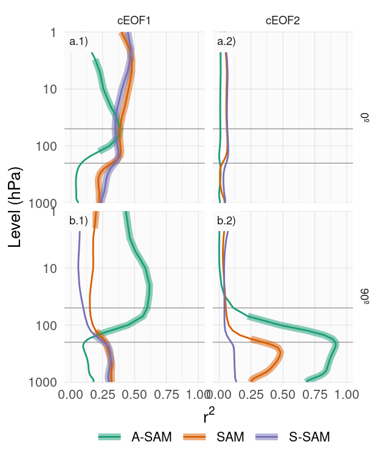

# Relación con otros patrones

Acá seguiría parte [del paper de cEOF](https://github.com/eliocamp/shceof).

## Datos y métodos

## SAM

(ref:sam-eof-vertical-cap) Coefficient of determination ($r^2$) between each component of cEOFs and the SAM, Asymmetric SAM (A-SAM) and Symmetric SAM (S-SAM) indices computed at each level for the 1979 -- 2019 period. Thick lines represent estimates with p-value \< 0.01 corrected for False Detection Rate [@benjamini1995].



Ahora exploramos la relación entre SAM y los cEOFs motivados por el parecido entre los mapas de regresión de los cEOFs y los patrones de SAM mostrados en la Sección \@ref(regresiones).
Calculamos el coeficiente de determinación entre las series temporales de los cEOFs y los tres índices SAM (SAM, A-SAM y S-SAM) definidos por @campitelli2022 en cada nivel vertical (Fig. \@ref(fig:sam-eof-vertical)).
El índice SAM está correlacionado de forma estadísticamente significativa con el 0º cEOF1 en todos los niveles, y con los 90º cEOF1 y 90º cEOF2 en la troposfera.
Por otro lado, las correlaciones entre SAM y el 0º cEOF2 no son significativas.

La relación entre la SAM y el cEOF1 en la troposfera se explica en su totalidad por el componente zonalmente simétrico de la SAM, como muestran la alta correlación con la S-SAM por debajo de 100 hPa y las correlaciones bajas y estadísticamente no significativas entre la A-SAM y el 0º o el 90º cEOF1.
En la estratosfera, la CEOF1 de 0º está correlacionada tanto con la A-SAM como con la S-SAM, mientras que la CEOF1 de 90º está altamente correlacionada sólo con la A-SAM.
Estas correlaciones son consistentes con los mapas de regresión de la altura geopotencial en la Figura \@ref(fig:eof1-regr-gh) y su comparación con los obtenidos para SAM, A-SAM y S-SAM por @campitelli2022.

<!-- Viene del cEOF pero hay que moverlo y adaptarlo a esta parte
-->
Esta falta de relación fuerte entre el cEOF1 y la SST, la temperatura y la precipitación podría ser sorprendente teniendo en cuenta la correlación entre el cEOF1 y la SAM (Fig. \@ref(fig:sam-eof-vertical) columna 1) y la correlación entre la SAM y la SST del Pacífico Central, la temperatura al este y oeste de la Península Antártica, y con la precipitación en el oeste de Australia [@fogt2020].
Esto se debe principalmente a dos razones.
En primer lugar, la correlación entre cEOF1 y la SAM en la troposfera es modesta, con menos del 50% de varianza compartida (Fig. \@ref(fig:sam-eof-vertical) columna 1), por lo que no se espera que estos índices sean equivalentes.
En segundo lugar, @campitelli2022 demostró que la fuerte relación entre la SAM y las SST del Pacífico y las anomalías de temperatura alrededor de la Península Antártica se debe principalmente a la parte asimétrica de la SAM.
Mientras tanto, el cEOF1 está significativamente correlacionado sólo con la parte simétrica de la SAM (Fig. \@ref(fig:sam-eof-vertical) columna 1), que por sí misma no está significativamente correlacionada con las temperaturas superficiales en esa zona.


En el caso de 90º cEOF2, su correlación con la SAM para la troposfera está asociada a la variabilidad asimétrica de la SAM.
De hecho, el 90º cEOF2 comparte hasta 50%, 68%, 72%, 78% varianza con el A-SAM y sólo 20%, 30%, 16%, 14% como máximo con el S-SAM (Figura \@ref(fig:sam-eof-vertical).
b2).
Esta altísima correlación entre A-SAM y 90º cEOF2 sugiere que los modos obtenidos en este trabajo son capaces de caracterizar la componente zonalmente asimétrica de la SAM descrita previamente por @campitelli2022.

## PSA {#psa}

(ref:psa-eof2-cap) Correlation coefficients (r) between cEOF2 components and the PSA1 and PSA2 modes computed as @mo2001 for the 1979 -- 2019 period. 95% confidence intervals in parenthesis. p-values lower than 0.01 in bold.


::: {custom-style="Table Caption"}

<caption>(\#tab:psa-eof2)`<w:r><w:t xml:space="preserve">(ref:psa-eof2-cap)</w:t></w:r>`{=openxml}</caption>

:::

``````{=openxml}
<w:tbl xmlns:w="http://schemas.openxmlformats.org/wordprocessingml/2006/main" xmlns:r="http://schemas.openxmlformats.org/officeDocument/2006/relationships" xmlns:w14="http://schemas.microsoft.com/office/word/2010/wordml" xmlns:wp="http://schemas.openxmlformats.org/drawingml/2006/wordprocessingDrawing" xmlns:a="http://schemas.openxmlformats.org/drawingml/2006/main" xmlns:pic="http://schemas.openxmlformats.org/drawingml/2006/picture"><w:tblPr><w:tblLayout w:type="fixed"/><w:jc w:val="center"/><w:tblLook w:firstRow="1" w:lastRow="0" w:firstColumn="0" w:lastColumn="0" w:noHBand="0" w:noVBand="1"/></w:tblPr><w:tblGrid><w:gridCol w:w="1080"/><w:gridCol w:w="1080"/><w:gridCol w:w="1080"/><w:gridCol w:w="1080"/></w:tblGrid><w:tr><w:trPr><w:trHeight w:val="360" w:hRule="auto"/><w:tblHeader/></w:trPr>header1<w:tc><w:tcPr><w:tcBorders><w:bottom w:val="single" w:sz="12" w:space="0" w:color="666666"/><w:top w:val="single" w:sz="12" w:space="0" w:color="666666"/><w:left w:val="none" w:sz="0" w:space="0" w:color="000000"/><w:right w:val="none" w:sz="0" w:space="0" w:color="000000"/></w:tcBorders><w:shd w:val="clear" w:color="auto" w:fill="FFFFFF"/><w:tcMar><w:top w:w="0" w:type="dxa"/><w:bottom w:w="0" w:type="dxa"/><w:left w:w="0" w:type="dxa"/><w:right w:w="0" w:type="dxa"/></w:tcMar><w:vAlign w:val="center"/></w:tcPr><w:p><w:pPr><w:pStyle w:val="Normal"/><w:jc w:val="left"/><w:pBdr><w:bottom w:val="none" w:sz="0" w:space="0" w:color="000000"/><w:top w:val="none" w:sz="0" w:space="0" w:color="000000"/><w:left w:val="none" w:sz="0" w:space="0" w:color="000000"/><w:right w:val="none" w:sz="0" w:space="0" w:color="000000"/></w:pBdr><w:spacing w:after="100" w:before="100" w:line="240"/><w:ind w:left="100" w:right="100" w:firstLine="0" w:firstLineChars="0"/></w:pPr><w:r xmlns:w="http://schemas.openxmlformats.org/wordprocessingml/2006/main" xmlns:wp="http://schemas.openxmlformats.org/drawingml/2006/wordprocessingDrawing" xmlns:r="http://schemas.openxmlformats.org/officeDocument/2006/relationships" xmlns:w14="http://schemas.microsoft.com/office/word/2010/wordml"><w:rPr><w:rFonts w:ascii="DejaVu Sans" w:hAnsi="DejaVu Sans" w:eastAsia="DejaVu Sans" w:cs="DejaVu Sans"/><w:i w:val="false"/><w:b w:val="false"/><w:u w:val="none"/><w:sz w:val="22"/><w:szCs w:val="22"/><w:color w:val="000000"/></w:rPr><w:t xml:space="preserve">PC</w:t></w:r></w:p></w:tc><w:tc><w:tcPr><w:tcBorders><w:bottom w:val="single" w:sz="12" w:space="0" w:color="666666"/><w:top w:val="single" w:sz="12" w:space="0" w:color="666666"/><w:left w:val="none" w:sz="0" w:space="0" w:color="000000"/><w:right w:val="none" w:sz="0" w:space="0" w:color="000000"/></w:tcBorders><w:shd w:val="clear" w:color="auto" w:fill="FFFFFF"/><w:tcMar><w:top w:w="0" w:type="dxa"/><w:bottom w:w="0" w:type="dxa"/><w:left w:w="0" w:type="dxa"/><w:right w:w="0" w:type="dxa"/></w:tcMar><w:vAlign w:val="center"/></w:tcPr><w:p><w:pPr><w:pStyle w:val="Normal"/><w:jc w:val="left"/><w:pBdr><w:bottom w:val="none" w:sz="0" w:space="0" w:color="000000"/><w:top w:val="none" w:sz="0" w:space="0" w:color="000000"/><w:left w:val="none" w:sz="0" w:space="0" w:color="000000"/><w:right w:val="none" w:sz="0" w:space="0" w:color="000000"/></w:pBdr><w:spacing w:after="100" w:before="100" w:line="240"/><w:ind w:left="100" w:right="100" w:firstLine="0" w:firstLineChars="0"/></w:pPr><w:r xmlns:w="http://schemas.openxmlformats.org/wordprocessingml/2006/main" xmlns:wp="http://schemas.openxmlformats.org/drawingml/2006/wordprocessingDrawing" xmlns:r="http://schemas.openxmlformats.org/officeDocument/2006/relationships" xmlns:w14="http://schemas.microsoft.com/office/word/2010/wordml"><w:rPr><w:rFonts w:ascii="DejaVu Sans" w:hAnsi="DejaVu Sans" w:eastAsia="DejaVu Sans" w:cs="DejaVu Sans"/><w:i w:val="false"/><w:b w:val="false"/><w:u w:val="none"/><w:sz w:val="22"/><w:szCs w:val="22"/><w:color w:val="000000"/></w:rPr><w:t xml:space="preserve">season</w:t></w:r></w:p></w:tc><w:tc><w:tcPr><w:tcBorders><w:bottom w:val="single" w:sz="12" w:space="0" w:color="666666"/><w:top w:val="single" w:sz="12" w:space="0" w:color="666666"/><w:left w:val="none" w:sz="0" w:space="0" w:color="000000"/><w:right w:val="none" w:sz="0" w:space="0" w:color="000000"/></w:tcBorders><w:shd w:val="clear" w:color="auto" w:fill="FFFFFF"/><w:tcMar><w:top w:w="0" w:type="dxa"/><w:bottom w:w="0" w:type="dxa"/><w:left w:w="0" w:type="dxa"/><w:right w:w="0" w:type="dxa"/></w:tcMar><w:vAlign w:val="center"/></w:tcPr><w:p><w:pPr><w:pStyle w:val="Normal"/><w:jc w:val="left"/><w:pBdr><w:bottom w:val="none" w:sz="0" w:space="0" w:color="000000"/><w:top w:val="none" w:sz="0" w:space="0" w:color="000000"/><w:left w:val="none" w:sz="0" w:space="0" w:color="000000"/><w:right w:val="none" w:sz="0" w:space="0" w:color="000000"/></w:pBdr><w:spacing w:after="100" w:before="100" w:line="240"/><w:ind w:left="100" w:right="100" w:firstLine="0" w:firstLineChars="0"/></w:pPr><w:r xmlns:w="http://schemas.openxmlformats.org/wordprocessingml/2006/main" xmlns:wp="http://schemas.openxmlformats.org/drawingml/2006/wordprocessingDrawing" xmlns:r="http://schemas.openxmlformats.org/officeDocument/2006/relationships" xmlns:w14="http://schemas.microsoft.com/office/word/2010/wordml"><w:rPr><w:rFonts w:ascii="DejaVu Sans" w:hAnsi="DejaVu Sans" w:eastAsia="DejaVu Sans" w:cs="DejaVu Sans"/><w:i w:val="false"/><w:b w:val="false"/><w:u w:val="none"/><w:sz w:val="22"/><w:szCs w:val="22"/><w:color w:val="000000"/></w:rPr><w:t xml:space="preserve">Real</w:t></w:r></w:p></w:tc><w:tc><w:tcPr><w:tcBorders><w:bottom w:val="single" w:sz="12" w:space="0" w:color="666666"/><w:top w:val="single" w:sz="12" w:space="0" w:color="666666"/><w:left w:val="none" w:sz="0" w:space="0" w:color="000000"/><w:right w:val="none" w:sz="0" w:space="0" w:color="000000"/></w:tcBorders><w:shd w:val="clear" w:color="auto" w:fill="FFFFFF"/><w:tcMar><w:top w:w="0" w:type="dxa"/><w:bottom w:w="0" w:type="dxa"/><w:left w:w="0" w:type="dxa"/><w:right w:w="0" w:type="dxa"/></w:tcMar><w:vAlign w:val="center"/></w:tcPr><w:p><w:pPr><w:pStyle w:val="Normal"/><w:jc w:val="left"/><w:pBdr><w:bottom w:val="none" w:sz="0" w:space="0" w:color="000000"/><w:top w:val="none" w:sz="0" w:space="0" w:color="000000"/><w:left w:val="none" w:sz="0" w:space="0" w:color="000000"/><w:right w:val="none" w:sz="0" w:space="0" w:color="000000"/></w:pBdr><w:spacing w:after="100" w:before="100" w:line="240"/><w:ind w:left="100" w:right="100" w:firstLine="0" w:firstLineChars="0"/></w:pPr><w:r xmlns:w="http://schemas.openxmlformats.org/wordprocessingml/2006/main" xmlns:wp="http://schemas.openxmlformats.org/drawingml/2006/wordprocessingDrawing" xmlns:r="http://schemas.openxmlformats.org/officeDocument/2006/relationships" xmlns:w14="http://schemas.microsoft.com/office/word/2010/wordml"><w:rPr><w:rFonts w:ascii="DejaVu Sans" w:hAnsi="DejaVu Sans" w:eastAsia="DejaVu Sans" w:cs="DejaVu Sans"/><w:i w:val="false"/><w:b w:val="false"/><w:u w:val="none"/><w:sz w:val="22"/><w:szCs w:val="22"/><w:color w:val="000000"/></w:rPr><w:t xml:space="preserve">Imaginario</w:t></w:r></w:p></w:tc></w:tr><w:tr><w:trPr><w:trHeight w:val="360" w:hRule="auto"/></w:trPr>body1<w:tc><w:tcPr><w:tcBorders><w:bottom w:val="none" w:sz="0" w:space="0" w:color="000000"/><w:top w:val="single" w:sz="12" w:space="0" w:color="666666"/><w:left w:val="none" w:sz="0" w:space="0" w:color="000000"/><w:right w:val="none" w:sz="0" w:space="0" w:color="000000"/></w:tcBorders><w:shd w:val="clear" w:color="auto" w:fill="FFFFFF"/><w:tcMar><w:top w:w="0" w:type="dxa"/><w:bottom w:w="0" w:type="dxa"/><w:left w:w="0" w:type="dxa"/><w:right w:w="0" w:type="dxa"/></w:tcMar><w:vAlign w:val="center"/></w:tcPr><w:p><w:pPr><w:pStyle w:val="Normal"/><w:jc w:val="left"/><w:pBdr><w:bottom w:val="none" w:sz="0" w:space="0" w:color="000000"/><w:top w:val="none" w:sz="0" w:space="0" w:color="000000"/><w:left w:val="none" w:sz="0" w:space="0" w:color="000000"/><w:right w:val="none" w:sz="0" w:space="0" w:color="000000"/></w:pBdr><w:spacing w:after="100" w:before="100" w:line="240"/><w:ind w:left="100" w:right="100" w:firstLine="0" w:firstLineChars="0"/></w:pPr><w:r xmlns:w="http://schemas.openxmlformats.org/wordprocessingml/2006/main" xmlns:wp="http://schemas.openxmlformats.org/drawingml/2006/wordprocessingDrawing" xmlns:r="http://schemas.openxmlformats.org/officeDocument/2006/relationships" xmlns:w14="http://schemas.microsoft.com/office/word/2010/wordml"><w:rPr><w:rFonts w:ascii="DejaVu Sans" w:hAnsi="DejaVu Sans" w:eastAsia="DejaVu Sans" w:cs="DejaVu Sans"/><w:i w:val="false"/><w:b w:val="false"/><w:u w:val="none"/><w:sz w:val="22"/><w:szCs w:val="22"/><w:color w:val="000000"/></w:rPr><w:t xml:space="preserve">PSA1</w:t></w:r></w:p></w:tc><w:tc><w:tcPr><w:tcBorders><w:bottom w:val="none" w:sz="0" w:space="0" w:color="000000"/><w:top w:val="single" w:sz="12" w:space="0" w:color="666666"/><w:left w:val="none" w:sz="0" w:space="0" w:color="000000"/><w:right w:val="none" w:sz="0" w:space="0" w:color="000000"/></w:tcBorders><w:shd w:val="clear" w:color="auto" w:fill="FFFFFF"/><w:tcMar><w:top w:w="0" w:type="dxa"/><w:bottom w:w="0" w:type="dxa"/><w:left w:w="0" w:type="dxa"/><w:right w:w="0" w:type="dxa"/></w:tcMar><w:vAlign w:val="center"/></w:tcPr><w:p><w:pPr><w:pStyle w:val="Normal"/><w:jc w:val="left"/><w:pBdr><w:bottom w:val="none" w:sz="0" w:space="0" w:color="000000"/><w:top w:val="none" w:sz="0" w:space="0" w:color="000000"/><w:left w:val="none" w:sz="0" w:space="0" w:color="000000"/><w:right w:val="none" w:sz="0" w:space="0" w:color="000000"/></w:pBdr><w:spacing w:after="100" w:before="100" w:line="240"/><w:ind w:left="100" w:right="100" w:firstLine="0" w:firstLineChars="0"/></w:pPr><w:r xmlns:w="http://schemas.openxmlformats.org/wordprocessingml/2006/main" xmlns:wp="http://schemas.openxmlformats.org/drawingml/2006/wordprocessingDrawing" xmlns:r="http://schemas.openxmlformats.org/officeDocument/2006/relationships" xmlns:w14="http://schemas.microsoft.com/office/word/2010/wordml"><w:rPr><w:rFonts w:ascii="DejaVu Sans" w:hAnsi="DejaVu Sans" w:eastAsia="DejaVu Sans" w:cs="DejaVu Sans"/><w:i w:val="false"/><w:b w:val="false"/><w:u w:val="none"/><w:sz w:val="22"/><w:szCs w:val="22"/><w:color w:val="000000"/></w:rPr><w:t xml:space="preserve">DJF</w:t></w:r></w:p></w:tc><w:tc><w:tcPr><w:tcBorders><w:bottom w:val="none" w:sz="0" w:space="0" w:color="000000"/><w:top w:val="single" w:sz="12" w:space="0" w:color="666666"/><w:left w:val="none" w:sz="0" w:space="0" w:color="000000"/><w:right w:val="none" w:sz="0" w:space="0" w:color="000000"/></w:tcBorders><w:shd w:val="clear" w:color="auto" w:fill="FFFFFF"/><w:tcMar><w:top w:w="0" w:type="dxa"/><w:bottom w:w="0" w:type="dxa"/><w:left w:w="0" w:type="dxa"/><w:right w:w="0" w:type="dxa"/></w:tcMar><w:vAlign w:val="center"/></w:tcPr><w:p><w:pPr><w:pStyle w:val="Normal"/><w:jc w:val="left"/><w:pBdr><w:bottom w:val="none" w:sz="0" w:space="0" w:color="000000"/><w:top w:val="none" w:sz="0" w:space="0" w:color="000000"/><w:left w:val="none" w:sz="0" w:space="0" w:color="000000"/><w:right w:val="none" w:sz="0" w:space="0" w:color="000000"/></w:pBdr><w:spacing w:after="100" w:before="100" w:line="240"/><w:ind w:left="100" w:right="100" w:firstLine="0" w:firstLineChars="0"/></w:pPr><w:r xmlns:w="http://schemas.openxmlformats.org/wordprocessingml/2006/main" xmlns:wp="http://schemas.openxmlformats.org/drawingml/2006/wordprocessingDrawing" xmlns:r="http://schemas.openxmlformats.org/officeDocument/2006/relationships" xmlns:w14="http://schemas.microsoft.com/office/word/2010/wordml"><w:rPr><w:rFonts w:ascii="DejaVu Sans" w:hAnsi="DejaVu Sans" w:eastAsia="DejaVu Sans" w:cs="DejaVu Sans"/><w:i w:val="false"/><w:b w:val="false"/><w:u w:val="none"/><w:sz w:val="22"/><w:szCs w:val="22"/><w:color w:val="000000"/></w:rPr><w:t xml:space="preserve">0.4 (CI: 0.1 -- 0.63)</w:t></w:r></w:p></w:tc><w:tc><w:tcPr><w:tcBorders><w:bottom w:val="none" w:sz="0" w:space="0" w:color="000000"/><w:top w:val="single" w:sz="12" w:space="0" w:color="666666"/><w:left w:val="none" w:sz="0" w:space="0" w:color="000000"/><w:right w:val="none" w:sz="0" w:space="0" w:color="000000"/></w:tcBorders><w:shd w:val="clear" w:color="auto" w:fill="FFFFFF"/><w:tcMar><w:top w:w="0" w:type="dxa"/><w:bottom w:w="0" w:type="dxa"/><w:left w:w="0" w:type="dxa"/><w:right w:w="0" w:type="dxa"/></w:tcMar><w:vAlign w:val="center"/></w:tcPr><w:p><w:pPr><w:pStyle w:val="Normal"/><w:jc w:val="left"/><w:pBdr><w:bottom w:val="none" w:sz="0" w:space="0" w:color="000000"/><w:top w:val="none" w:sz="0" w:space="0" w:color="000000"/><w:left w:val="none" w:sz="0" w:space="0" w:color="000000"/><w:right w:val="none" w:sz="0" w:space="0" w:color="000000"/></w:pBdr><w:spacing w:after="100" w:before="100" w:line="240"/><w:ind w:left="100" w:right="100" w:firstLine="0" w:firstLineChars="0"/></w:pPr><w:r xmlns:w="http://schemas.openxmlformats.org/wordprocessingml/2006/main" xmlns:wp="http://schemas.openxmlformats.org/drawingml/2006/wordprocessingDrawing" xmlns:r="http://schemas.openxmlformats.org/officeDocument/2006/relationships" xmlns:w14="http://schemas.microsoft.com/office/word/2010/wordml"><w:rPr><w:rFonts w:ascii="DejaVu Sans" w:hAnsi="DejaVu Sans" w:eastAsia="DejaVu Sans" w:cs="DejaVu Sans"/><w:i w:val="false"/><w:b w:val="false"/><w:u w:val="none"/><w:sz w:val="22"/><w:szCs w:val="22"/><w:color w:val="000000"/></w:rPr><w:t xml:space="preserve">0.72 (CI: 0.53 -- 0.84)</w:t></w:r></w:p></w:tc></w:tr><w:tr><w:trPr><w:trHeight w:val="360" w:hRule="auto"/></w:trPr>body2<w:tc><w:tcPr><w:tcBorders><w:bottom w:val="none" w:sz="0" w:space="0" w:color="000000"/><w:top w:val="none" w:sz="0" w:space="0" w:color="000000"/><w:left w:val="none" w:sz="0" w:space="0" w:color="000000"/><w:right w:val="none" w:sz="0" w:space="0" w:color="000000"/></w:tcBorders><w:shd w:val="clear" w:color="auto" w:fill="FFFFFF"/><w:tcMar><w:top w:w="0" w:type="dxa"/><w:bottom w:w="0" w:type="dxa"/><w:left w:w="0" w:type="dxa"/><w:right w:w="0" w:type="dxa"/></w:tcMar><w:vAlign w:val="center"/></w:tcPr><w:p><w:pPr><w:pStyle w:val="Normal"/><w:jc w:val="left"/><w:pBdr><w:bottom w:val="none" w:sz="0" w:space="0" w:color="000000"/><w:top w:val="none" w:sz="0" w:space="0" w:color="000000"/><w:left w:val="none" w:sz="0" w:space="0" w:color="000000"/><w:right w:val="none" w:sz="0" w:space="0" w:color="000000"/></w:pBdr><w:spacing w:after="100" w:before="100" w:line="240"/><w:ind w:left="100" w:right="100" w:firstLine="0" w:firstLineChars="0"/></w:pPr><w:r xmlns:w="http://schemas.openxmlformats.org/wordprocessingml/2006/main" xmlns:wp="http://schemas.openxmlformats.org/drawingml/2006/wordprocessingDrawing" xmlns:r="http://schemas.openxmlformats.org/officeDocument/2006/relationships" xmlns:w14="http://schemas.microsoft.com/office/word/2010/wordml"><w:rPr><w:rFonts w:ascii="DejaVu Sans" w:hAnsi="DejaVu Sans" w:eastAsia="DejaVu Sans" w:cs="DejaVu Sans"/><w:i w:val="false"/><w:b w:val="false"/><w:u w:val="none"/><w:sz w:val="22"/><w:szCs w:val="22"/><w:color w:val="000000"/></w:rPr><w:t xml:space="preserve">PSA2</w:t></w:r></w:p></w:tc><w:tc><w:tcPr><w:tcBorders><w:bottom w:val="none" w:sz="0" w:space="0" w:color="000000"/><w:top w:val="none" w:sz="0" w:space="0" w:color="000000"/><w:left w:val="none" w:sz="0" w:space="0" w:color="000000"/><w:right w:val="none" w:sz="0" w:space="0" w:color="000000"/></w:tcBorders><w:shd w:val="clear" w:color="auto" w:fill="FFFFFF"/><w:tcMar><w:top w:w="0" w:type="dxa"/><w:bottom w:w="0" w:type="dxa"/><w:left w:w="0" w:type="dxa"/><w:right w:w="0" w:type="dxa"/></w:tcMar><w:vAlign w:val="center"/></w:tcPr><w:p><w:pPr><w:pStyle w:val="Normal"/><w:jc w:val="left"/><w:pBdr><w:bottom w:val="none" w:sz="0" w:space="0" w:color="000000"/><w:top w:val="none" w:sz="0" w:space="0" w:color="000000"/><w:left w:val="none" w:sz="0" w:space="0" w:color="000000"/><w:right w:val="none" w:sz="0" w:space="0" w:color="000000"/></w:pBdr><w:spacing w:after="100" w:before="100" w:line="240"/><w:ind w:left="100" w:right="100" w:firstLine="0" w:firstLineChars="0"/></w:pPr><w:r xmlns:w="http://schemas.openxmlformats.org/wordprocessingml/2006/main" xmlns:wp="http://schemas.openxmlformats.org/drawingml/2006/wordprocessingDrawing" xmlns:r="http://schemas.openxmlformats.org/officeDocument/2006/relationships" xmlns:w14="http://schemas.microsoft.com/office/word/2010/wordml"><w:rPr><w:rFonts w:ascii="DejaVu Sans" w:hAnsi="DejaVu Sans" w:eastAsia="DejaVu Sans" w:cs="DejaVu Sans"/><w:i w:val="false"/><w:b w:val="false"/><w:u w:val="none"/><w:sz w:val="22"/><w:szCs w:val="22"/><w:color w:val="000000"/></w:rPr><w:t xml:space="preserve">DJF</w:t></w:r></w:p></w:tc><w:tc><w:tcPr><w:tcBorders><w:bottom w:val="none" w:sz="0" w:space="0" w:color="000000"/><w:top w:val="none" w:sz="0" w:space="0" w:color="000000"/><w:left w:val="none" w:sz="0" w:space="0" w:color="000000"/><w:right w:val="none" w:sz="0" w:space="0" w:color="000000"/></w:tcBorders><w:shd w:val="clear" w:color="auto" w:fill="FFFFFF"/><w:tcMar><w:top w:w="0" w:type="dxa"/><w:bottom w:w="0" w:type="dxa"/><w:left w:w="0" w:type="dxa"/><w:right w:w="0" w:type="dxa"/></w:tcMar><w:vAlign w:val="center"/></w:tcPr><w:p><w:pPr><w:pStyle w:val="Normal"/><w:jc w:val="left"/><w:pBdr><w:bottom w:val="none" w:sz="0" w:space="0" w:color="000000"/><w:top w:val="none" w:sz="0" w:space="0" w:color="000000"/><w:left w:val="none" w:sz="0" w:space="0" w:color="000000"/><w:right w:val="none" w:sz="0" w:space="0" w:color="000000"/></w:pBdr><w:spacing w:after="100" w:before="100" w:line="240"/><w:ind w:left="100" w:right="100" w:firstLine="0" w:firstLineChars="0"/></w:pPr><w:r xmlns:w="http://schemas.openxmlformats.org/wordprocessingml/2006/main" xmlns:wp="http://schemas.openxmlformats.org/drawingml/2006/wordprocessingDrawing" xmlns:r="http://schemas.openxmlformats.org/officeDocument/2006/relationships" xmlns:w14="http://schemas.microsoft.com/office/word/2010/wordml"><w:rPr><w:rFonts w:ascii="DejaVu Sans" w:hAnsi="DejaVu Sans" w:eastAsia="DejaVu Sans" w:cs="DejaVu Sans"/><w:i w:val="false"/><w:b w:val="false"/><w:u w:val="none"/><w:sz w:val="22"/><w:szCs w:val="22"/><w:color w:val="000000"/></w:rPr><w:t xml:space="preserve">0.54 (CI: 0.28 -- 0.73)</w:t></w:r></w:p></w:tc><w:tc><w:tcPr><w:tcBorders><w:bottom w:val="none" w:sz="0" w:space="0" w:color="000000"/><w:top w:val="none" w:sz="0" w:space="0" w:color="000000"/><w:left w:val="none" w:sz="0" w:space="0" w:color="000000"/><w:right w:val="none" w:sz="0" w:space="0" w:color="000000"/></w:tcBorders><w:shd w:val="clear" w:color="auto" w:fill="FFFFFF"/><w:tcMar><w:top w:w="0" w:type="dxa"/><w:bottom w:w="0" w:type="dxa"/><w:left w:w="0" w:type="dxa"/><w:right w:w="0" w:type="dxa"/></w:tcMar><w:vAlign w:val="center"/></w:tcPr><w:p><w:pPr><w:pStyle w:val="Normal"/><w:jc w:val="left"/><w:pBdr><w:bottom w:val="none" w:sz="0" w:space="0" w:color="000000"/><w:top w:val="none" w:sz="0" w:space="0" w:color="000000"/><w:left w:val="none" w:sz="0" w:space="0" w:color="000000"/><w:right w:val="none" w:sz="0" w:space="0" w:color="000000"/></w:pBdr><w:spacing w:after="100" w:before="100" w:line="240"/><w:ind w:left="100" w:right="100" w:firstLine="0" w:firstLineChars="0"/></w:pPr><w:r xmlns:w="http://schemas.openxmlformats.org/wordprocessingml/2006/main" xmlns:wp="http://schemas.openxmlformats.org/drawingml/2006/wordprocessingDrawing" xmlns:r="http://schemas.openxmlformats.org/officeDocument/2006/relationships" xmlns:w14="http://schemas.microsoft.com/office/word/2010/wordml"><w:rPr><w:rFonts w:ascii="DejaVu Sans" w:hAnsi="DejaVu Sans" w:eastAsia="DejaVu Sans" w:cs="DejaVu Sans"/><w:i w:val="false"/><w:b w:val="false"/><w:u w:val="none"/><w:sz w:val="22"/><w:szCs w:val="22"/><w:color w:val="000000"/></w:rPr><w:t xml:space="preserve">0.21 (CI: -0.1 -- 0.49)</w:t></w:r></w:p></w:tc></w:tr><w:tr><w:trPr><w:trHeight w:val="360" w:hRule="auto"/></w:trPr>body3<w:tc><w:tcPr><w:tcBorders><w:bottom w:val="none" w:sz="0" w:space="0" w:color="000000"/><w:top w:val="none" w:sz="0" w:space="0" w:color="000000"/><w:left w:val="none" w:sz="0" w:space="0" w:color="000000"/><w:right w:val="none" w:sz="0" w:space="0" w:color="000000"/></w:tcBorders><w:shd w:val="clear" w:color="auto" w:fill="FFFFFF"/><w:tcMar><w:top w:w="0" w:type="dxa"/><w:bottom w:w="0" w:type="dxa"/><w:left w:w="0" w:type="dxa"/><w:right w:w="0" w:type="dxa"/></w:tcMar><w:vAlign w:val="center"/></w:tcPr><w:p><w:pPr><w:pStyle w:val="Normal"/><w:jc w:val="left"/><w:pBdr><w:bottom w:val="none" w:sz="0" w:space="0" w:color="000000"/><w:top w:val="none" w:sz="0" w:space="0" w:color="000000"/><w:left w:val="none" w:sz="0" w:space="0" w:color="000000"/><w:right w:val="none" w:sz="0" w:space="0" w:color="000000"/></w:pBdr><w:spacing w:after="100" w:before="100" w:line="240"/><w:ind w:left="100" w:right="100" w:firstLine="0" w:firstLineChars="0"/></w:pPr><w:r xmlns:w="http://schemas.openxmlformats.org/wordprocessingml/2006/main" xmlns:wp="http://schemas.openxmlformats.org/drawingml/2006/wordprocessingDrawing" xmlns:r="http://schemas.openxmlformats.org/officeDocument/2006/relationships" xmlns:w14="http://schemas.microsoft.com/office/word/2010/wordml"><w:rPr><w:rFonts w:ascii="DejaVu Sans" w:hAnsi="DejaVu Sans" w:eastAsia="DejaVu Sans" w:cs="DejaVu Sans"/><w:i w:val="false"/><w:b w:val="false"/><w:u w:val="none"/><w:sz w:val="22"/><w:szCs w:val="22"/><w:color w:val="000000"/></w:rPr><w:t xml:space="preserve">PSA1</w:t></w:r></w:p></w:tc><w:tc><w:tcPr><w:tcBorders><w:bottom w:val="none" w:sz="0" w:space="0" w:color="000000"/><w:top w:val="none" w:sz="0" w:space="0" w:color="000000"/><w:left w:val="none" w:sz="0" w:space="0" w:color="000000"/><w:right w:val="none" w:sz="0" w:space="0" w:color="000000"/></w:tcBorders><w:shd w:val="clear" w:color="auto" w:fill="FFFFFF"/><w:tcMar><w:top w:w="0" w:type="dxa"/><w:bottom w:w="0" w:type="dxa"/><w:left w:w="0" w:type="dxa"/><w:right w:w="0" w:type="dxa"/></w:tcMar><w:vAlign w:val="center"/></w:tcPr><w:p><w:pPr><w:pStyle w:val="Normal"/><w:jc w:val="left"/><w:pBdr><w:bottom w:val="none" w:sz="0" w:space="0" w:color="000000"/><w:top w:val="none" w:sz="0" w:space="0" w:color="000000"/><w:left w:val="none" w:sz="0" w:space="0" w:color="000000"/><w:right w:val="none" w:sz="0" w:space="0" w:color="000000"/></w:pBdr><w:spacing w:after="100" w:before="100" w:line="240"/><w:ind w:left="100" w:right="100" w:firstLine="0" w:firstLineChars="0"/></w:pPr><w:r xmlns:w="http://schemas.openxmlformats.org/wordprocessingml/2006/main" xmlns:wp="http://schemas.openxmlformats.org/drawingml/2006/wordprocessingDrawing" xmlns:r="http://schemas.openxmlformats.org/officeDocument/2006/relationships" xmlns:w14="http://schemas.microsoft.com/office/word/2010/wordml"><w:rPr><w:rFonts w:ascii="DejaVu Sans" w:hAnsi="DejaVu Sans" w:eastAsia="DejaVu Sans" w:cs="DejaVu Sans"/><w:i w:val="false"/><w:b w:val="false"/><w:u w:val="none"/><w:sz w:val="22"/><w:szCs w:val="22"/><w:color w:val="000000"/></w:rPr><w:t xml:space="preserve">MAM</w:t></w:r></w:p></w:tc><w:tc><w:tcPr><w:tcBorders><w:bottom w:val="none" w:sz="0" w:space="0" w:color="000000"/><w:top w:val="none" w:sz="0" w:space="0" w:color="000000"/><w:left w:val="none" w:sz="0" w:space="0" w:color="000000"/><w:right w:val="none" w:sz="0" w:space="0" w:color="000000"/></w:tcBorders><w:shd w:val="clear" w:color="auto" w:fill="FFFFFF"/><w:tcMar><w:top w:w="0" w:type="dxa"/><w:bottom w:w="0" w:type="dxa"/><w:left w:w="0" w:type="dxa"/><w:right w:w="0" w:type="dxa"/></w:tcMar><w:vAlign w:val="center"/></w:tcPr><w:p><w:pPr><w:pStyle w:val="Normal"/><w:jc w:val="left"/><w:pBdr><w:bottom w:val="none" w:sz="0" w:space="0" w:color="000000"/><w:top w:val="none" w:sz="0" w:space="0" w:color="000000"/><w:left w:val="none" w:sz="0" w:space="0" w:color="000000"/><w:right w:val="none" w:sz="0" w:space="0" w:color="000000"/></w:pBdr><w:spacing w:after="100" w:before="100" w:line="240"/><w:ind w:left="100" w:right="100" w:firstLine="0" w:firstLineChars="0"/></w:pPr><w:r xmlns:w="http://schemas.openxmlformats.org/wordprocessingml/2006/main" xmlns:wp="http://schemas.openxmlformats.org/drawingml/2006/wordprocessingDrawing" xmlns:r="http://schemas.openxmlformats.org/officeDocument/2006/relationships" xmlns:w14="http://schemas.microsoft.com/office/word/2010/wordml"><w:rPr><w:rFonts w:ascii="DejaVu Sans" w:hAnsi="DejaVu Sans" w:eastAsia="DejaVu Sans" w:cs="DejaVu Sans"/><w:i w:val="false"/><w:b w:val="false"/><w:u w:val="none"/><w:sz w:val="22"/><w:szCs w:val="22"/><w:color w:val="000000"/></w:rPr><w:t xml:space="preserve">-0.17 (CI: -0.45 -- 0.14)</w:t></w:r></w:p></w:tc><w:tc><w:tcPr><w:tcBorders><w:bottom w:val="none" w:sz="0" w:space="0" w:color="000000"/><w:top w:val="none" w:sz="0" w:space="0" w:color="000000"/><w:left w:val="none" w:sz="0" w:space="0" w:color="000000"/><w:right w:val="none" w:sz="0" w:space="0" w:color="000000"/></w:tcBorders><w:shd w:val="clear" w:color="auto" w:fill="FFFFFF"/><w:tcMar><w:top w:w="0" w:type="dxa"/><w:bottom w:w="0" w:type="dxa"/><w:left w:w="0" w:type="dxa"/><w:right w:w="0" w:type="dxa"/></w:tcMar><w:vAlign w:val="center"/></w:tcPr><w:p><w:pPr><w:pStyle w:val="Normal"/><w:jc w:val="left"/><w:pBdr><w:bottom w:val="none" w:sz="0" w:space="0" w:color="000000"/><w:top w:val="none" w:sz="0" w:space="0" w:color="000000"/><w:left w:val="none" w:sz="0" w:space="0" w:color="000000"/><w:right w:val="none" w:sz="0" w:space="0" w:color="000000"/></w:pBdr><w:spacing w:after="100" w:before="100" w:line="240"/><w:ind w:left="100" w:right="100" w:firstLine="0" w:firstLineChars="0"/></w:pPr><w:r xmlns:w="http://schemas.openxmlformats.org/wordprocessingml/2006/main" xmlns:wp="http://schemas.openxmlformats.org/drawingml/2006/wordprocessingDrawing" xmlns:r="http://schemas.openxmlformats.org/officeDocument/2006/relationships" xmlns:w14="http://schemas.microsoft.com/office/word/2010/wordml"><w:rPr><w:rFonts w:ascii="DejaVu Sans" w:hAnsi="DejaVu Sans" w:eastAsia="DejaVu Sans" w:cs="DejaVu Sans"/><w:i w:val="false"/><w:b w:val="false"/><w:u w:val="none"/><w:sz w:val="22"/><w:szCs w:val="22"/><w:color w:val="000000"/></w:rPr><w:t xml:space="preserve">0.36 (CI: 0.06 -- 0.6)</w:t></w:r></w:p></w:tc></w:tr><w:tr><w:trPr><w:trHeight w:val="360" w:hRule="auto"/></w:trPr>body4<w:tc><w:tcPr><w:tcBorders><w:bottom w:val="none" w:sz="0" w:space="0" w:color="000000"/><w:top w:val="none" w:sz="0" w:space="0" w:color="000000"/><w:left w:val="none" w:sz="0" w:space="0" w:color="000000"/><w:right w:val="none" w:sz="0" w:space="0" w:color="000000"/></w:tcBorders><w:shd w:val="clear" w:color="auto" w:fill="FFFFFF"/><w:tcMar><w:top w:w="0" w:type="dxa"/><w:bottom w:w="0" w:type="dxa"/><w:left w:w="0" w:type="dxa"/><w:right w:w="0" w:type="dxa"/></w:tcMar><w:vAlign w:val="center"/></w:tcPr><w:p><w:pPr><w:pStyle w:val="Normal"/><w:jc w:val="left"/><w:pBdr><w:bottom w:val="none" w:sz="0" w:space="0" w:color="000000"/><w:top w:val="none" w:sz="0" w:space="0" w:color="000000"/><w:left w:val="none" w:sz="0" w:space="0" w:color="000000"/><w:right w:val="none" w:sz="0" w:space="0" w:color="000000"/></w:pBdr><w:spacing w:after="100" w:before="100" w:line="240"/><w:ind w:left="100" w:right="100" w:firstLine="0" w:firstLineChars="0"/></w:pPr><w:r xmlns:w="http://schemas.openxmlformats.org/wordprocessingml/2006/main" xmlns:wp="http://schemas.openxmlformats.org/drawingml/2006/wordprocessingDrawing" xmlns:r="http://schemas.openxmlformats.org/officeDocument/2006/relationships" xmlns:w14="http://schemas.microsoft.com/office/word/2010/wordml"><w:rPr><w:rFonts w:ascii="DejaVu Sans" w:hAnsi="DejaVu Sans" w:eastAsia="DejaVu Sans" w:cs="DejaVu Sans"/><w:i w:val="false"/><w:b w:val="false"/><w:u w:val="none"/><w:sz w:val="22"/><w:szCs w:val="22"/><w:color w:val="000000"/></w:rPr><w:t xml:space="preserve">PSA2</w:t></w:r></w:p></w:tc><w:tc><w:tcPr><w:tcBorders><w:bottom w:val="none" w:sz="0" w:space="0" w:color="000000"/><w:top w:val="none" w:sz="0" w:space="0" w:color="000000"/><w:left w:val="none" w:sz="0" w:space="0" w:color="000000"/><w:right w:val="none" w:sz="0" w:space="0" w:color="000000"/></w:tcBorders><w:shd w:val="clear" w:color="auto" w:fill="FFFFFF"/><w:tcMar><w:top w:w="0" w:type="dxa"/><w:bottom w:w="0" w:type="dxa"/><w:left w:w="0" w:type="dxa"/><w:right w:w="0" w:type="dxa"/></w:tcMar><w:vAlign w:val="center"/></w:tcPr><w:p><w:pPr><w:pStyle w:val="Normal"/><w:jc w:val="left"/><w:pBdr><w:bottom w:val="none" w:sz="0" w:space="0" w:color="000000"/><w:top w:val="none" w:sz="0" w:space="0" w:color="000000"/><w:left w:val="none" w:sz="0" w:space="0" w:color="000000"/><w:right w:val="none" w:sz="0" w:space="0" w:color="000000"/></w:pBdr><w:spacing w:after="100" w:before="100" w:line="240"/><w:ind w:left="100" w:right="100" w:firstLine="0" w:firstLineChars="0"/></w:pPr><w:r xmlns:w="http://schemas.openxmlformats.org/wordprocessingml/2006/main" xmlns:wp="http://schemas.openxmlformats.org/drawingml/2006/wordprocessingDrawing" xmlns:r="http://schemas.openxmlformats.org/officeDocument/2006/relationships" xmlns:w14="http://schemas.microsoft.com/office/word/2010/wordml"><w:rPr><w:rFonts w:ascii="DejaVu Sans" w:hAnsi="DejaVu Sans" w:eastAsia="DejaVu Sans" w:cs="DejaVu Sans"/><w:i w:val="false"/><w:b w:val="false"/><w:u w:val="none"/><w:sz w:val="22"/><w:szCs w:val="22"/><w:color w:val="000000"/></w:rPr><w:t xml:space="preserve">MAM</w:t></w:r></w:p></w:tc><w:tc><w:tcPr><w:tcBorders><w:bottom w:val="none" w:sz="0" w:space="0" w:color="000000"/><w:top w:val="none" w:sz="0" w:space="0" w:color="000000"/><w:left w:val="none" w:sz="0" w:space="0" w:color="000000"/><w:right w:val="none" w:sz="0" w:space="0" w:color="000000"/></w:tcBorders><w:shd w:val="clear" w:color="auto" w:fill="FFFFFF"/><w:tcMar><w:top w:w="0" w:type="dxa"/><w:bottom w:w="0" w:type="dxa"/><w:left w:w="0" w:type="dxa"/><w:right w:w="0" w:type="dxa"/></w:tcMar><w:vAlign w:val="center"/></w:tcPr><w:p><w:pPr><w:pStyle w:val="Normal"/><w:jc w:val="left"/><w:pBdr><w:bottom w:val="none" w:sz="0" w:space="0" w:color="000000"/><w:top w:val="none" w:sz="0" w:space="0" w:color="000000"/><w:left w:val="none" w:sz="0" w:space="0" w:color="000000"/><w:right w:val="none" w:sz="0" w:space="0" w:color="000000"/></w:pBdr><w:spacing w:after="100" w:before="100" w:line="240"/><w:ind w:left="100" w:right="100" w:firstLine="0" w:firstLineChars="0"/></w:pPr><w:r xmlns:w="http://schemas.openxmlformats.org/wordprocessingml/2006/main" xmlns:wp="http://schemas.openxmlformats.org/drawingml/2006/wordprocessingDrawing" xmlns:r="http://schemas.openxmlformats.org/officeDocument/2006/relationships" xmlns:w14="http://schemas.microsoft.com/office/word/2010/wordml"><w:rPr><w:rFonts w:ascii="DejaVu Sans" w:hAnsi="DejaVu Sans" w:eastAsia="DejaVu Sans" w:cs="DejaVu Sans"/><w:i w:val="false"/><w:b w:val="false"/><w:u w:val="none"/><w:sz w:val="22"/><w:szCs w:val="22"/><w:color w:val="000000"/></w:rPr><w:t xml:space="preserve">0.72 (CI: 0.53 -- 0.84)</w:t></w:r></w:p></w:tc><w:tc><w:tcPr><w:tcBorders><w:bottom w:val="none" w:sz="0" w:space="0" w:color="000000"/><w:top w:val="none" w:sz="0" w:space="0" w:color="000000"/><w:left w:val="none" w:sz="0" w:space="0" w:color="000000"/><w:right w:val="none" w:sz="0" w:space="0" w:color="000000"/></w:tcBorders><w:shd w:val="clear" w:color="auto" w:fill="FFFFFF"/><w:tcMar><w:top w:w="0" w:type="dxa"/><w:bottom w:w="0" w:type="dxa"/><w:left w:w="0" w:type="dxa"/><w:right w:w="0" w:type="dxa"/></w:tcMar><w:vAlign w:val="center"/></w:tcPr><w:p><w:pPr><w:pStyle w:val="Normal"/><w:jc w:val="left"/><w:pBdr><w:bottom w:val="none" w:sz="0" w:space="0" w:color="000000"/><w:top w:val="none" w:sz="0" w:space="0" w:color="000000"/><w:left w:val="none" w:sz="0" w:space="0" w:color="000000"/><w:right w:val="none" w:sz="0" w:space="0" w:color="000000"/></w:pBdr><w:spacing w:after="100" w:before="100" w:line="240"/><w:ind w:left="100" w:right="100" w:firstLine="0" w:firstLineChars="0"/></w:pPr><w:r xmlns:w="http://schemas.openxmlformats.org/wordprocessingml/2006/main" xmlns:wp="http://schemas.openxmlformats.org/drawingml/2006/wordprocessingDrawing" xmlns:r="http://schemas.openxmlformats.org/officeDocument/2006/relationships" xmlns:w14="http://schemas.microsoft.com/office/word/2010/wordml"><w:rPr><w:rFonts w:ascii="DejaVu Sans" w:hAnsi="DejaVu Sans" w:eastAsia="DejaVu Sans" w:cs="DejaVu Sans"/><w:i w:val="false"/><w:b w:val="false"/><w:u w:val="none"/><w:sz w:val="22"/><w:szCs w:val="22"/><w:color w:val="000000"/></w:rPr><w:t xml:space="preserve">0.49 (CI: 0.22 -- 0.69)</w:t></w:r></w:p></w:tc></w:tr><w:tr><w:trPr><w:trHeight w:val="360" w:hRule="auto"/></w:trPr>body5<w:tc><w:tcPr><w:tcBorders><w:bottom w:val="none" w:sz="0" w:space="0" w:color="000000"/><w:top w:val="none" w:sz="0" w:space="0" w:color="000000"/><w:left w:val="none" w:sz="0" w:space="0" w:color="000000"/><w:right w:val="none" w:sz="0" w:space="0" w:color="000000"/></w:tcBorders><w:shd w:val="clear" w:color="auto" w:fill="FFFFFF"/><w:tcMar><w:top w:w="0" w:type="dxa"/><w:bottom w:w="0" w:type="dxa"/><w:left w:w="0" w:type="dxa"/><w:right w:w="0" w:type="dxa"/></w:tcMar><w:vAlign w:val="center"/></w:tcPr><w:p><w:pPr><w:pStyle w:val="Normal"/><w:jc w:val="left"/><w:pBdr><w:bottom w:val="none" w:sz="0" w:space="0" w:color="000000"/><w:top w:val="none" w:sz="0" w:space="0" w:color="000000"/><w:left w:val="none" w:sz="0" w:space="0" w:color="000000"/><w:right w:val="none" w:sz="0" w:space="0" w:color="000000"/></w:pBdr><w:spacing w:after="100" w:before="100" w:line="240"/><w:ind w:left="100" w:right="100" w:firstLine="0" w:firstLineChars="0"/></w:pPr><w:r xmlns:w="http://schemas.openxmlformats.org/wordprocessingml/2006/main" xmlns:wp="http://schemas.openxmlformats.org/drawingml/2006/wordprocessingDrawing" xmlns:r="http://schemas.openxmlformats.org/officeDocument/2006/relationships" xmlns:w14="http://schemas.microsoft.com/office/word/2010/wordml"><w:rPr><w:rFonts w:ascii="DejaVu Sans" w:hAnsi="DejaVu Sans" w:eastAsia="DejaVu Sans" w:cs="DejaVu Sans"/><w:i w:val="false"/><w:b w:val="false"/><w:u w:val="none"/><w:sz w:val="22"/><w:szCs w:val="22"/><w:color w:val="000000"/></w:rPr><w:t xml:space="preserve">PSA1</w:t></w:r></w:p></w:tc><w:tc><w:tcPr><w:tcBorders><w:bottom w:val="none" w:sz="0" w:space="0" w:color="000000"/><w:top w:val="none" w:sz="0" w:space="0" w:color="000000"/><w:left w:val="none" w:sz="0" w:space="0" w:color="000000"/><w:right w:val="none" w:sz="0" w:space="0" w:color="000000"/></w:tcBorders><w:shd w:val="clear" w:color="auto" w:fill="FFFFFF"/><w:tcMar><w:top w:w="0" w:type="dxa"/><w:bottom w:w="0" w:type="dxa"/><w:left w:w="0" w:type="dxa"/><w:right w:w="0" w:type="dxa"/></w:tcMar><w:vAlign w:val="center"/></w:tcPr><w:p><w:pPr><w:pStyle w:val="Normal"/><w:jc w:val="left"/><w:pBdr><w:bottom w:val="none" w:sz="0" w:space="0" w:color="000000"/><w:top w:val="none" w:sz="0" w:space="0" w:color="000000"/><w:left w:val="none" w:sz="0" w:space="0" w:color="000000"/><w:right w:val="none" w:sz="0" w:space="0" w:color="000000"/></w:pBdr><w:spacing w:after="100" w:before="100" w:line="240"/><w:ind w:left="100" w:right="100" w:firstLine="0" w:firstLineChars="0"/></w:pPr><w:r xmlns:w="http://schemas.openxmlformats.org/wordprocessingml/2006/main" xmlns:wp="http://schemas.openxmlformats.org/drawingml/2006/wordprocessingDrawing" xmlns:r="http://schemas.openxmlformats.org/officeDocument/2006/relationships" xmlns:w14="http://schemas.microsoft.com/office/word/2010/wordml"><w:rPr><w:rFonts w:ascii="DejaVu Sans" w:hAnsi="DejaVu Sans" w:eastAsia="DejaVu Sans" w:cs="DejaVu Sans"/><w:i w:val="false"/><w:b w:val="false"/><w:u w:val="none"/><w:sz w:val="22"/><w:szCs w:val="22"/><w:color w:val="000000"/></w:rPr><w:t xml:space="preserve">JJA</w:t></w:r></w:p></w:tc><w:tc><w:tcPr><w:tcBorders><w:bottom w:val="none" w:sz="0" w:space="0" w:color="000000"/><w:top w:val="none" w:sz="0" w:space="0" w:color="000000"/><w:left w:val="none" w:sz="0" w:space="0" w:color="000000"/><w:right w:val="none" w:sz="0" w:space="0" w:color="000000"/></w:tcBorders><w:shd w:val="clear" w:color="auto" w:fill="FFFFFF"/><w:tcMar><w:top w:w="0" w:type="dxa"/><w:bottom w:w="0" w:type="dxa"/><w:left w:w="0" w:type="dxa"/><w:right w:w="0" w:type="dxa"/></w:tcMar><w:vAlign w:val="center"/></w:tcPr><w:p><w:pPr><w:pStyle w:val="Normal"/><w:jc w:val="left"/><w:pBdr><w:bottom w:val="none" w:sz="0" w:space="0" w:color="000000"/><w:top w:val="none" w:sz="0" w:space="0" w:color="000000"/><w:left w:val="none" w:sz="0" w:space="0" w:color="000000"/><w:right w:val="none" w:sz="0" w:space="0" w:color="000000"/></w:pBdr><w:spacing w:after="100" w:before="100" w:line="240"/><w:ind w:left="100" w:right="100" w:firstLine="0" w:firstLineChars="0"/></w:pPr><w:r xmlns:w="http://schemas.openxmlformats.org/wordprocessingml/2006/main" xmlns:wp="http://schemas.openxmlformats.org/drawingml/2006/wordprocessingDrawing" xmlns:r="http://schemas.openxmlformats.org/officeDocument/2006/relationships" xmlns:w14="http://schemas.microsoft.com/office/word/2010/wordml"><w:rPr><w:rFonts w:ascii="DejaVu Sans" w:hAnsi="DejaVu Sans" w:eastAsia="DejaVu Sans" w:cs="DejaVu Sans"/><w:i w:val="false"/><w:b w:val="false"/><w:u w:val="none"/><w:sz w:val="22"/><w:szCs w:val="22"/><w:color w:val="000000"/></w:rPr><w:t xml:space="preserve">0.19 (CI: -0.12 -- 0.47)</w:t></w:r></w:p></w:tc><w:tc><w:tcPr><w:tcBorders><w:bottom w:val="none" w:sz="0" w:space="0" w:color="000000"/><w:top w:val="none" w:sz="0" w:space="0" w:color="000000"/><w:left w:val="none" w:sz="0" w:space="0" w:color="000000"/><w:right w:val="none" w:sz="0" w:space="0" w:color="000000"/></w:tcBorders><w:shd w:val="clear" w:color="auto" w:fill="FFFFFF"/><w:tcMar><w:top w:w="0" w:type="dxa"/><w:bottom w:w="0" w:type="dxa"/><w:left w:w="0" w:type="dxa"/><w:right w:w="0" w:type="dxa"/></w:tcMar><w:vAlign w:val="center"/></w:tcPr><w:p><w:pPr><w:pStyle w:val="Normal"/><w:jc w:val="left"/><w:pBdr><w:bottom w:val="none" w:sz="0" w:space="0" w:color="000000"/><w:top w:val="none" w:sz="0" w:space="0" w:color="000000"/><w:left w:val="none" w:sz="0" w:space="0" w:color="000000"/><w:right w:val="none" w:sz="0" w:space="0" w:color="000000"/></w:pBdr><w:spacing w:after="100" w:before="100" w:line="240"/><w:ind w:left="100" w:right="100" w:firstLine="0" w:firstLineChars="0"/></w:pPr><w:r xmlns:w="http://schemas.openxmlformats.org/wordprocessingml/2006/main" xmlns:wp="http://schemas.openxmlformats.org/drawingml/2006/wordprocessingDrawing" xmlns:r="http://schemas.openxmlformats.org/officeDocument/2006/relationships" xmlns:w14="http://schemas.microsoft.com/office/word/2010/wordml"><w:rPr><w:rFonts w:ascii="DejaVu Sans" w:hAnsi="DejaVu Sans" w:eastAsia="DejaVu Sans" w:cs="DejaVu Sans"/><w:i w:val="false"/><w:b w:val="false"/><w:u w:val="none"/><w:sz w:val="22"/><w:szCs w:val="22"/><w:color w:val="000000"/></w:rPr><w:t xml:space="preserve">0.41 (CI: 0.11 -- 0.63)</w:t></w:r></w:p></w:tc></w:tr><w:tr><w:trPr><w:trHeight w:val="360" w:hRule="auto"/></w:trPr>body6<w:tc><w:tcPr><w:tcBorders><w:bottom w:val="none" w:sz="0" w:space="0" w:color="000000"/><w:top w:val="none" w:sz="0" w:space="0" w:color="000000"/><w:left w:val="none" w:sz="0" w:space="0" w:color="000000"/><w:right w:val="none" w:sz="0" w:space="0" w:color="000000"/></w:tcBorders><w:shd w:val="clear" w:color="auto" w:fill="FFFFFF"/><w:tcMar><w:top w:w="0" w:type="dxa"/><w:bottom w:w="0" w:type="dxa"/><w:left w:w="0" w:type="dxa"/><w:right w:w="0" w:type="dxa"/></w:tcMar><w:vAlign w:val="center"/></w:tcPr><w:p><w:pPr><w:pStyle w:val="Normal"/><w:jc w:val="left"/><w:pBdr><w:bottom w:val="none" w:sz="0" w:space="0" w:color="000000"/><w:top w:val="none" w:sz="0" w:space="0" w:color="000000"/><w:left w:val="none" w:sz="0" w:space="0" w:color="000000"/><w:right w:val="none" w:sz="0" w:space="0" w:color="000000"/></w:pBdr><w:spacing w:after="100" w:before="100" w:line="240"/><w:ind w:left="100" w:right="100" w:firstLine="0" w:firstLineChars="0"/></w:pPr><w:r xmlns:w="http://schemas.openxmlformats.org/wordprocessingml/2006/main" xmlns:wp="http://schemas.openxmlformats.org/drawingml/2006/wordprocessingDrawing" xmlns:r="http://schemas.openxmlformats.org/officeDocument/2006/relationships" xmlns:w14="http://schemas.microsoft.com/office/word/2010/wordml"><w:rPr><w:rFonts w:ascii="DejaVu Sans" w:hAnsi="DejaVu Sans" w:eastAsia="DejaVu Sans" w:cs="DejaVu Sans"/><w:i w:val="false"/><w:b w:val="false"/><w:u w:val="none"/><w:sz w:val="22"/><w:szCs w:val="22"/><w:color w:val="000000"/></w:rPr><w:t xml:space="preserve">PSA2</w:t></w:r></w:p></w:tc><w:tc><w:tcPr><w:tcBorders><w:bottom w:val="none" w:sz="0" w:space="0" w:color="000000"/><w:top w:val="none" w:sz="0" w:space="0" w:color="000000"/><w:left w:val="none" w:sz="0" w:space="0" w:color="000000"/><w:right w:val="none" w:sz="0" w:space="0" w:color="000000"/></w:tcBorders><w:shd w:val="clear" w:color="auto" w:fill="FFFFFF"/><w:tcMar><w:top w:w="0" w:type="dxa"/><w:bottom w:w="0" w:type="dxa"/><w:left w:w="0" w:type="dxa"/><w:right w:w="0" w:type="dxa"/></w:tcMar><w:vAlign w:val="center"/></w:tcPr><w:p><w:pPr><w:pStyle w:val="Normal"/><w:jc w:val="left"/><w:pBdr><w:bottom w:val="none" w:sz="0" w:space="0" w:color="000000"/><w:top w:val="none" w:sz="0" w:space="0" w:color="000000"/><w:left w:val="none" w:sz="0" w:space="0" w:color="000000"/><w:right w:val="none" w:sz="0" w:space="0" w:color="000000"/></w:pBdr><w:spacing w:after="100" w:before="100" w:line="240"/><w:ind w:left="100" w:right="100" w:firstLine="0" w:firstLineChars="0"/></w:pPr><w:r xmlns:w="http://schemas.openxmlformats.org/wordprocessingml/2006/main" xmlns:wp="http://schemas.openxmlformats.org/drawingml/2006/wordprocessingDrawing" xmlns:r="http://schemas.openxmlformats.org/officeDocument/2006/relationships" xmlns:w14="http://schemas.microsoft.com/office/word/2010/wordml"><w:rPr><w:rFonts w:ascii="DejaVu Sans" w:hAnsi="DejaVu Sans" w:eastAsia="DejaVu Sans" w:cs="DejaVu Sans"/><w:i w:val="false"/><w:b w:val="false"/><w:u w:val="none"/><w:sz w:val="22"/><w:szCs w:val="22"/><w:color w:val="000000"/></w:rPr><w:t xml:space="preserve">JJA</w:t></w:r></w:p></w:tc><w:tc><w:tcPr><w:tcBorders><w:bottom w:val="none" w:sz="0" w:space="0" w:color="000000"/><w:top w:val="none" w:sz="0" w:space="0" w:color="000000"/><w:left w:val="none" w:sz="0" w:space="0" w:color="000000"/><w:right w:val="none" w:sz="0" w:space="0" w:color="000000"/></w:tcBorders><w:shd w:val="clear" w:color="auto" w:fill="FFFFFF"/><w:tcMar><w:top w:w="0" w:type="dxa"/><w:bottom w:w="0" w:type="dxa"/><w:left w:w="0" w:type="dxa"/><w:right w:w="0" w:type="dxa"/></w:tcMar><w:vAlign w:val="center"/></w:tcPr><w:p><w:pPr><w:pStyle w:val="Normal"/><w:jc w:val="left"/><w:pBdr><w:bottom w:val="none" w:sz="0" w:space="0" w:color="000000"/><w:top w:val="none" w:sz="0" w:space="0" w:color="000000"/><w:left w:val="none" w:sz="0" w:space="0" w:color="000000"/><w:right w:val="none" w:sz="0" w:space="0" w:color="000000"/></w:pBdr><w:spacing w:after="100" w:before="100" w:line="240"/><w:ind w:left="100" w:right="100" w:firstLine="0" w:firstLineChars="0"/></w:pPr><w:r xmlns:w="http://schemas.openxmlformats.org/wordprocessingml/2006/main" xmlns:wp="http://schemas.openxmlformats.org/drawingml/2006/wordprocessingDrawing" xmlns:r="http://schemas.openxmlformats.org/officeDocument/2006/relationships" xmlns:w14="http://schemas.microsoft.com/office/word/2010/wordml"><w:rPr><w:rFonts w:ascii="DejaVu Sans" w:hAnsi="DejaVu Sans" w:eastAsia="DejaVu Sans" w:cs="DejaVu Sans"/><w:i w:val="false"/><w:b w:val="false"/><w:u w:val="none"/><w:sz w:val="22"/><w:szCs w:val="22"/><w:color w:val="000000"/></w:rPr><w:t xml:space="preserve">0.72 (CI: 0.52 -- 0.84)</w:t></w:r></w:p></w:tc><w:tc><w:tcPr><w:tcBorders><w:bottom w:val="none" w:sz="0" w:space="0" w:color="000000"/><w:top w:val="none" w:sz="0" w:space="0" w:color="000000"/><w:left w:val="none" w:sz="0" w:space="0" w:color="000000"/><w:right w:val="none" w:sz="0" w:space="0" w:color="000000"/></w:tcBorders><w:shd w:val="clear" w:color="auto" w:fill="FFFFFF"/><w:tcMar><w:top w:w="0" w:type="dxa"/><w:bottom w:w="0" w:type="dxa"/><w:left w:w="0" w:type="dxa"/><w:right w:w="0" w:type="dxa"/></w:tcMar><w:vAlign w:val="center"/></w:tcPr><w:p><w:pPr><w:pStyle w:val="Normal"/><w:jc w:val="left"/><w:pBdr><w:bottom w:val="none" w:sz="0" w:space="0" w:color="000000"/><w:top w:val="none" w:sz="0" w:space="0" w:color="000000"/><w:left w:val="none" w:sz="0" w:space="0" w:color="000000"/><w:right w:val="none" w:sz="0" w:space="0" w:color="000000"/></w:pBdr><w:spacing w:after="100" w:before="100" w:line="240"/><w:ind w:left="100" w:right="100" w:firstLine="0" w:firstLineChars="0"/></w:pPr><w:r xmlns:w="http://schemas.openxmlformats.org/wordprocessingml/2006/main" xmlns:wp="http://schemas.openxmlformats.org/drawingml/2006/wordprocessingDrawing" xmlns:r="http://schemas.openxmlformats.org/officeDocument/2006/relationships" xmlns:w14="http://schemas.microsoft.com/office/word/2010/wordml"><w:rPr><w:rFonts w:ascii="DejaVu Sans" w:hAnsi="DejaVu Sans" w:eastAsia="DejaVu Sans" w:cs="DejaVu Sans"/><w:i w:val="false"/><w:b w:val="false"/><w:u w:val="none"/><w:sz w:val="22"/><w:szCs w:val="22"/><w:color w:val="000000"/></w:rPr><w:t xml:space="preserve">-0.4 (CI: -0.63 -- -0.1)</w:t></w:r></w:p></w:tc></w:tr><w:tr><w:trPr><w:trHeight w:val="360" w:hRule="auto"/></w:trPr>body7<w:tc><w:tcPr><w:tcBorders><w:bottom w:val="none" w:sz="0" w:space="0" w:color="000000"/><w:top w:val="none" w:sz="0" w:space="0" w:color="000000"/><w:left w:val="none" w:sz="0" w:space="0" w:color="000000"/><w:right w:val="none" w:sz="0" w:space="0" w:color="000000"/></w:tcBorders><w:shd w:val="clear" w:color="auto" w:fill="FFFFFF"/><w:tcMar><w:top w:w="0" w:type="dxa"/><w:bottom w:w="0" w:type="dxa"/><w:left w:w="0" w:type="dxa"/><w:right w:w="0" w:type="dxa"/></w:tcMar><w:vAlign w:val="center"/></w:tcPr><w:p><w:pPr><w:pStyle w:val="Normal"/><w:jc w:val="left"/><w:pBdr><w:bottom w:val="none" w:sz="0" w:space="0" w:color="000000"/><w:top w:val="none" w:sz="0" w:space="0" w:color="000000"/><w:left w:val="none" w:sz="0" w:space="0" w:color="000000"/><w:right w:val="none" w:sz="0" w:space="0" w:color="000000"/></w:pBdr><w:spacing w:after="100" w:before="100" w:line="240"/><w:ind w:left="100" w:right="100" w:firstLine="0" w:firstLineChars="0"/></w:pPr><w:r xmlns:w="http://schemas.openxmlformats.org/wordprocessingml/2006/main" xmlns:wp="http://schemas.openxmlformats.org/drawingml/2006/wordprocessingDrawing" xmlns:r="http://schemas.openxmlformats.org/officeDocument/2006/relationships" xmlns:w14="http://schemas.microsoft.com/office/word/2010/wordml"><w:rPr><w:rFonts w:ascii="DejaVu Sans" w:hAnsi="DejaVu Sans" w:eastAsia="DejaVu Sans" w:cs="DejaVu Sans"/><w:i w:val="false"/><w:b w:val="false"/><w:u w:val="none"/><w:sz w:val="22"/><w:szCs w:val="22"/><w:color w:val="000000"/></w:rPr><w:t xml:space="preserve">PSA1</w:t></w:r></w:p></w:tc><w:tc><w:tcPr><w:tcBorders><w:bottom w:val="none" w:sz="0" w:space="0" w:color="000000"/><w:top w:val="none" w:sz="0" w:space="0" w:color="000000"/><w:left w:val="none" w:sz="0" w:space="0" w:color="000000"/><w:right w:val="none" w:sz="0" w:space="0" w:color="000000"/></w:tcBorders><w:shd w:val="clear" w:color="auto" w:fill="FFFFFF"/><w:tcMar><w:top w:w="0" w:type="dxa"/><w:bottom w:w="0" w:type="dxa"/><w:left w:w="0" w:type="dxa"/><w:right w:w="0" w:type="dxa"/></w:tcMar><w:vAlign w:val="center"/></w:tcPr><w:p><w:pPr><w:pStyle w:val="Normal"/><w:jc w:val="left"/><w:pBdr><w:bottom w:val="none" w:sz="0" w:space="0" w:color="000000"/><w:top w:val="none" w:sz="0" w:space="0" w:color="000000"/><w:left w:val="none" w:sz="0" w:space="0" w:color="000000"/><w:right w:val="none" w:sz="0" w:space="0" w:color="000000"/></w:pBdr><w:spacing w:after="100" w:before="100" w:line="240"/><w:ind w:left="100" w:right="100" w:firstLine="0" w:firstLineChars="0"/></w:pPr><w:r xmlns:w="http://schemas.openxmlformats.org/wordprocessingml/2006/main" xmlns:wp="http://schemas.openxmlformats.org/drawingml/2006/wordprocessingDrawing" xmlns:r="http://schemas.openxmlformats.org/officeDocument/2006/relationships" xmlns:w14="http://schemas.microsoft.com/office/word/2010/wordml"><w:rPr><w:rFonts w:ascii="DejaVu Sans" w:hAnsi="DejaVu Sans" w:eastAsia="DejaVu Sans" w:cs="DejaVu Sans"/><w:i w:val="false"/><w:b w:val="false"/><w:u w:val="none"/><w:sz w:val="22"/><w:szCs w:val="22"/><w:color w:val="000000"/></w:rPr><w:t xml:space="preserve">SON</w:t></w:r></w:p></w:tc><w:tc><w:tcPr><w:tcBorders><w:bottom w:val="none" w:sz="0" w:space="0" w:color="000000"/><w:top w:val="none" w:sz="0" w:space="0" w:color="000000"/><w:left w:val="none" w:sz="0" w:space="0" w:color="000000"/><w:right w:val="none" w:sz="0" w:space="0" w:color="000000"/></w:tcBorders><w:shd w:val="clear" w:color="auto" w:fill="FFFFFF"/><w:tcMar><w:top w:w="0" w:type="dxa"/><w:bottom w:w="0" w:type="dxa"/><w:left w:w="0" w:type="dxa"/><w:right w:w="0" w:type="dxa"/></w:tcMar><w:vAlign w:val="center"/></w:tcPr><w:p><w:pPr><w:pStyle w:val="Normal"/><w:jc w:val="left"/><w:pBdr><w:bottom w:val="none" w:sz="0" w:space="0" w:color="000000"/><w:top w:val="none" w:sz="0" w:space="0" w:color="000000"/><w:left w:val="none" w:sz="0" w:space="0" w:color="000000"/><w:right w:val="none" w:sz="0" w:space="0" w:color="000000"/></w:pBdr><w:spacing w:after="100" w:before="100" w:line="240"/><w:ind w:left="100" w:right="100" w:firstLine="0" w:firstLineChars="0"/></w:pPr><w:r xmlns:w="http://schemas.openxmlformats.org/wordprocessingml/2006/main" xmlns:wp="http://schemas.openxmlformats.org/drawingml/2006/wordprocessingDrawing" xmlns:r="http://schemas.openxmlformats.org/officeDocument/2006/relationships" xmlns:w14="http://schemas.microsoft.com/office/word/2010/wordml"><w:rPr><w:rFonts w:ascii="DejaVu Sans" w:hAnsi="DejaVu Sans" w:eastAsia="DejaVu Sans" w:cs="DejaVu Sans"/><w:i w:val="false"/><w:b w:val="false"/><w:u w:val="none"/><w:sz w:val="22"/><w:szCs w:val="22"/><w:color w:val="000000"/></w:rPr><w:t xml:space="preserve">0.15 (CI: -0.16 -- 0.44)</w:t></w:r></w:p></w:tc><w:tc><w:tcPr><w:tcBorders><w:bottom w:val="none" w:sz="0" w:space="0" w:color="000000"/><w:top w:val="none" w:sz="0" w:space="0" w:color="000000"/><w:left w:val="none" w:sz="0" w:space="0" w:color="000000"/><w:right w:val="none" w:sz="0" w:space="0" w:color="000000"/></w:tcBorders><w:shd w:val="clear" w:color="auto" w:fill="FFFFFF"/><w:tcMar><w:top w:w="0" w:type="dxa"/><w:bottom w:w="0" w:type="dxa"/><w:left w:w="0" w:type="dxa"/><w:right w:w="0" w:type="dxa"/></w:tcMar><w:vAlign w:val="center"/></w:tcPr><w:p><w:pPr><w:pStyle w:val="Normal"/><w:jc w:val="left"/><w:pBdr><w:bottom w:val="none" w:sz="0" w:space="0" w:color="000000"/><w:top w:val="none" w:sz="0" w:space="0" w:color="000000"/><w:left w:val="none" w:sz="0" w:space="0" w:color="000000"/><w:right w:val="none" w:sz="0" w:space="0" w:color="000000"/></w:pBdr><w:spacing w:after="100" w:before="100" w:line="240"/><w:ind w:left="100" w:right="100" w:firstLine="0" w:firstLineChars="0"/></w:pPr><w:r xmlns:w="http://schemas.openxmlformats.org/wordprocessingml/2006/main" xmlns:wp="http://schemas.openxmlformats.org/drawingml/2006/wordprocessingDrawing" xmlns:r="http://schemas.openxmlformats.org/officeDocument/2006/relationships" xmlns:w14="http://schemas.microsoft.com/office/word/2010/wordml"><w:rPr><w:rFonts w:ascii="DejaVu Sans" w:hAnsi="DejaVu Sans" w:eastAsia="DejaVu Sans" w:cs="DejaVu Sans"/><w:i w:val="false"/><w:b w:val="false"/><w:u w:val="none"/><w:sz w:val="22"/><w:szCs w:val="22"/><w:color w:val="000000"/></w:rPr><w:t xml:space="preserve">0.74 (CI: 0.56 -- 0.85)</w:t></w:r></w:p></w:tc></w:tr><w:tr><w:trPr><w:trHeight w:val="360" w:hRule="auto"/></w:trPr>body8<w:tc><w:tcPr><w:tcBorders><w:bottom w:val="single" w:sz="12" w:space="0" w:color="666666"/><w:top w:val="none" w:sz="0" w:space="0" w:color="000000"/><w:left w:val="none" w:sz="0" w:space="0" w:color="000000"/><w:right w:val="none" w:sz="0" w:space="0" w:color="000000"/></w:tcBorders><w:shd w:val="clear" w:color="auto" w:fill="FFFFFF"/><w:tcMar><w:top w:w="0" w:type="dxa"/><w:bottom w:w="0" w:type="dxa"/><w:left w:w="0" w:type="dxa"/><w:right w:w="0" w:type="dxa"/></w:tcMar><w:vAlign w:val="center"/></w:tcPr><w:p><w:pPr><w:pStyle w:val="Normal"/><w:jc w:val="left"/><w:pBdr><w:bottom w:val="none" w:sz="0" w:space="0" w:color="000000"/><w:top w:val="none" w:sz="0" w:space="0" w:color="000000"/><w:left w:val="none" w:sz="0" w:space="0" w:color="000000"/><w:right w:val="none" w:sz="0" w:space="0" w:color="000000"/></w:pBdr><w:spacing w:after="100" w:before="100" w:line="240"/><w:ind w:left="100" w:right="100" w:firstLine="0" w:firstLineChars="0"/></w:pPr><w:r xmlns:w="http://schemas.openxmlformats.org/wordprocessingml/2006/main" xmlns:wp="http://schemas.openxmlformats.org/drawingml/2006/wordprocessingDrawing" xmlns:r="http://schemas.openxmlformats.org/officeDocument/2006/relationships" xmlns:w14="http://schemas.microsoft.com/office/word/2010/wordml"><w:rPr><w:rFonts w:ascii="DejaVu Sans" w:hAnsi="DejaVu Sans" w:eastAsia="DejaVu Sans" w:cs="DejaVu Sans"/><w:i w:val="false"/><w:b w:val="false"/><w:u w:val="none"/><w:sz w:val="22"/><w:szCs w:val="22"/><w:color w:val="000000"/></w:rPr><w:t xml:space="preserve">PSA2</w:t></w:r></w:p></w:tc><w:tc><w:tcPr><w:tcBorders><w:bottom w:val="single" w:sz="12" w:space="0" w:color="666666"/><w:top w:val="none" w:sz="0" w:space="0" w:color="000000"/><w:left w:val="none" w:sz="0" w:space="0" w:color="000000"/><w:right w:val="none" w:sz="0" w:space="0" w:color="000000"/></w:tcBorders><w:shd w:val="clear" w:color="auto" w:fill="FFFFFF"/><w:tcMar><w:top w:w="0" w:type="dxa"/><w:bottom w:w="0" w:type="dxa"/><w:left w:w="0" w:type="dxa"/><w:right w:w="0" w:type="dxa"/></w:tcMar><w:vAlign w:val="center"/></w:tcPr><w:p><w:pPr><w:pStyle w:val="Normal"/><w:jc w:val="left"/><w:pBdr><w:bottom w:val="none" w:sz="0" w:space="0" w:color="000000"/><w:top w:val="none" w:sz="0" w:space="0" w:color="000000"/><w:left w:val="none" w:sz="0" w:space="0" w:color="000000"/><w:right w:val="none" w:sz="0" w:space="0" w:color="000000"/></w:pBdr><w:spacing w:after="100" w:before="100" w:line="240"/><w:ind w:left="100" w:right="100" w:firstLine="0" w:firstLineChars="0"/></w:pPr><w:r xmlns:w="http://schemas.openxmlformats.org/wordprocessingml/2006/main" xmlns:wp="http://schemas.openxmlformats.org/drawingml/2006/wordprocessingDrawing" xmlns:r="http://schemas.openxmlformats.org/officeDocument/2006/relationships" xmlns:w14="http://schemas.microsoft.com/office/word/2010/wordml"><w:rPr><w:rFonts w:ascii="DejaVu Sans" w:hAnsi="DejaVu Sans" w:eastAsia="DejaVu Sans" w:cs="DejaVu Sans"/><w:i w:val="false"/><w:b w:val="false"/><w:u w:val="none"/><w:sz w:val="22"/><w:szCs w:val="22"/><w:color w:val="000000"/></w:rPr><w:t xml:space="preserve">SON</w:t></w:r></w:p></w:tc><w:tc><w:tcPr><w:tcBorders><w:bottom w:val="single" w:sz="12" w:space="0" w:color="666666"/><w:top w:val="none" w:sz="0" w:space="0" w:color="000000"/><w:left w:val="none" w:sz="0" w:space="0" w:color="000000"/><w:right w:val="none" w:sz="0" w:space="0" w:color="000000"/></w:tcBorders><w:shd w:val="clear" w:color="auto" w:fill="FFFFFF"/><w:tcMar><w:top w:w="0" w:type="dxa"/><w:bottom w:w="0" w:type="dxa"/><w:left w:w="0" w:type="dxa"/><w:right w:w="0" w:type="dxa"/></w:tcMar><w:vAlign w:val="center"/></w:tcPr><w:p><w:pPr><w:pStyle w:val="Normal"/><w:jc w:val="left"/><w:pBdr><w:bottom w:val="none" w:sz="0" w:space="0" w:color="000000"/><w:top w:val="none" w:sz="0" w:space="0" w:color="000000"/><w:left w:val="none" w:sz="0" w:space="0" w:color="000000"/><w:right w:val="none" w:sz="0" w:space="0" w:color="000000"/></w:pBdr><w:spacing w:after="100" w:before="100" w:line="240"/><w:ind w:left="100" w:right="100" w:firstLine="0" w:firstLineChars="0"/></w:pPr><w:r xmlns:w="http://schemas.openxmlformats.org/wordprocessingml/2006/main" xmlns:wp="http://schemas.openxmlformats.org/drawingml/2006/wordprocessingDrawing" xmlns:r="http://schemas.openxmlformats.org/officeDocument/2006/relationships" xmlns:w14="http://schemas.microsoft.com/office/word/2010/wordml"><w:rPr><w:rFonts w:ascii="DejaVu Sans" w:hAnsi="DejaVu Sans" w:eastAsia="DejaVu Sans" w:cs="DejaVu Sans"/><w:i w:val="false"/><w:b w:val="false"/><w:u w:val="none"/><w:sz w:val="22"/><w:szCs w:val="22"/><w:color w:val="000000"/></w:rPr><w:t xml:space="preserve">0.75 (CI: 0.58 -- 0.86)</w:t></w:r></w:p></w:tc><w:tc><w:tcPr><w:tcBorders><w:bottom w:val="single" w:sz="12" w:space="0" w:color="666666"/><w:top w:val="none" w:sz="0" w:space="0" w:color="000000"/><w:left w:val="none" w:sz="0" w:space="0" w:color="000000"/><w:right w:val="none" w:sz="0" w:space="0" w:color="000000"/></w:tcBorders><w:shd w:val="clear" w:color="auto" w:fill="FFFFFF"/><w:tcMar><w:top w:w="0" w:type="dxa"/><w:bottom w:w="0" w:type="dxa"/><w:left w:w="0" w:type="dxa"/><w:right w:w="0" w:type="dxa"/></w:tcMar><w:vAlign w:val="center"/></w:tcPr><w:p><w:pPr><w:pStyle w:val="Normal"/><w:jc w:val="left"/><w:pBdr><w:bottom w:val="none" w:sz="0" w:space="0" w:color="000000"/><w:top w:val="none" w:sz="0" w:space="0" w:color="000000"/><w:left w:val="none" w:sz="0" w:space="0" w:color="000000"/><w:right w:val="none" w:sz="0" w:space="0" w:color="000000"/></w:pBdr><w:spacing w:after="100" w:before="100" w:line="240"/><w:ind w:left="100" w:right="100" w:firstLine="0" w:firstLineChars="0"/></w:pPr><w:r xmlns:w="http://schemas.openxmlformats.org/wordprocessingml/2006/main" xmlns:wp="http://schemas.openxmlformats.org/drawingml/2006/wordprocessingDrawing" xmlns:r="http://schemas.openxmlformats.org/officeDocument/2006/relationships" xmlns:w14="http://schemas.microsoft.com/office/word/2010/wordml"><w:rPr><w:rFonts w:ascii="DejaVu Sans" w:hAnsi="DejaVu Sans" w:eastAsia="DejaVu Sans" w:cs="DejaVu Sans"/><w:i w:val="false"/><w:b w:val="false"/><w:u w:val="none"/><w:sz w:val="22"/><w:szCs w:val="22"/><w:color w:val="000000"/></w:rPr><w:t xml:space="preserve">0.3 (CI: -0.01 -- 0.56)</w:t></w:r></w:p></w:tc></w:tr></w:tbl>
``````

Dada la similitud entre las estructuras asociadas al cEOF2 (Fig. \@ref(fig:eof2-regr-gh)) y los patrones de PSA documentados, estudiamos la relación entre ellos.
La tabla \@ref(tab:psa-eof2) muestra las correlaciones entre los dos índices PSA y las series temporales para las fases 0º y 90º de CEOF2.
Como anticipaba visualmente la figura \@ref(fig:eof2-regr-gh), existe una gran correlación positiva entre PSA1 y 90º cEOF2, y entre PSA2 y 0º cEOF2.
Por otro lado, no existe una relación significativa entre PSA1 y 0º cEOF2, y entre PSA2 y 90º cEOF2.
En consecuencia, cEOF2 representa bien tanto la estructura espacial como la evolución temporal de los modos PSA, por lo que es posible establecer una asociación entre sus dos fases y los dos modos PSA.
Es decir, la elección de fase para cEOF2 que maximiza la relación entre ENSO y 90º cEOF2, también maximiza la asociación entre los componentes de cEOF2 y los modos PSA (no mostrado).

(ref:phase-histogram-cap) Histograma de distribución de fase de cEOF2 para el periodo 1979 -- 2019. Los intervalos están centrados en 90º, 0º, -90º, -180º con un ancho de intervalo de 90º. Las pequeñas líneas verticales cerca del eje horizontal marcan las observaciones.


La figura \@ref(fig:phase-histogram) muestra un histograma que cuenta el número de estaciones SON en las que la fase cEOF2 estaba cerca de cada una de las cuatro fases particulares (positiva/negativa de las fases 0º y 90º), con las observaciones para cada estación marcadas como alfombras en el eje horizontal.
En 61% de las estaciones cEOF2 tiene una fase similar a la fase negativa o positiva de 90º, haciendo que la fase de 90º sea la fase más común.
Esta es también la fase más correlacionada con ENSO según la definición de la fase de 0º descrita en la Sección \@ref(métodos).

Por lo tanto, en virtud de ser la fase más común, la cEOF2 de 90º explica más varianza que la cEOF2 de 0º.
Por lo tanto, el análisis EOF convencional tenderá a separarlos de forma relativamente limpia, con el EOF que representa el 90º cEOF2 siempre por delante del que representa el 0º cEOF2.
Esta preferencia de fase está de acuerdo con @irving2016, que encontró una distribución bimodal a la variabilidad tipo PSA (compare nuestra Figura \@ref(fig:phase-histogram) con su Figura 6).

## ENSO
