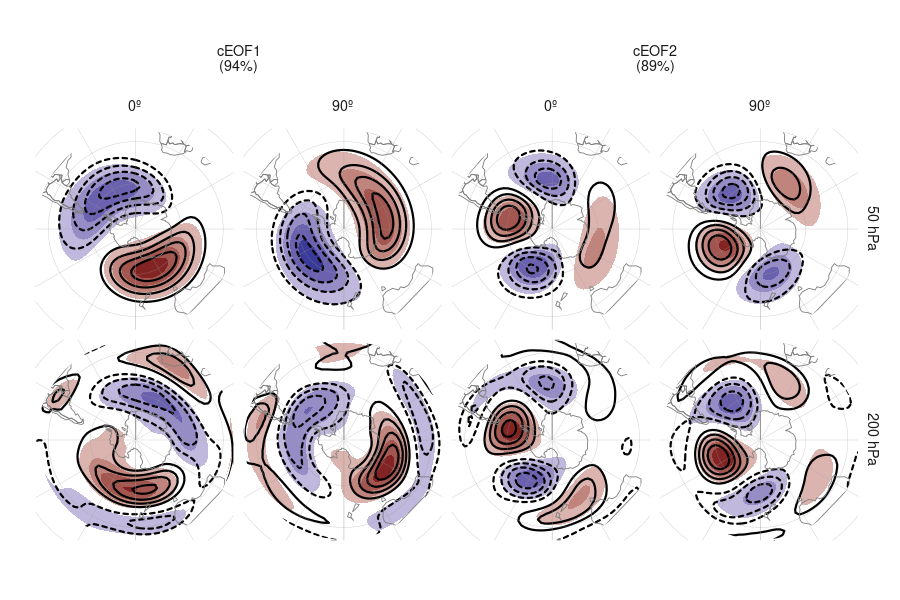

**TODO: Cambiar la nomenclatura de real e imaginaria a fase de 0º y 90º.**

# Análisis de estos modos en los modelos de CMIP6

El análisis previo estudió la circulación zonalmente asimétrica en los datos de reanálisis. 
Sin embargo, el estudio de tendencias y variabilidad de estos modelos se ve limitada por la corta longitud de los datos observacionales y la posible inhomogeneidad del reanálisis al cambiar la densidad y tipo de observaciones; un problema que afecta particularmente al hemisferio sur. 
Además, es imposible abordar la atribución de las tendencias observadas utilizando únicamente observaciones. 

Estas limitaciones motivan la inclusión de datos de modelos climáticos. 
En este capítulo se analiza la habilidad de los modelos del sexto Proyecto de Intercomparacion de Modelos Acoplados (CMIP6) y del Proyecto de Intercomparación de Modelos de Detección y Atribución (DAMIP) de capturar estos modos y sus principales características. 
Al contar con corridas mucho más largas y múltiples miembros por modelo, es posible evaluar las tendencias a largo plazo con mayor robustez. 
Utilizando los modelos incluidos en DAMPI, además podemos avanzar en la atribución de las tendencias observadas. 
## Métodos

### Datos

Descripción CMIP

Descripción DAMPI

Table: (\#tab:modelos)Modelos analizados y la cantidad de miembros para cada experimento.

|Modelo                                                                                 | historical| hist-GHG| hist-nat| hist-aer| hist-stratO3|
|:--------------------------------------------------------------------------------------|----------:|--------:|--------:|--------:|------------:|
|AWI-CM-1-1-MR [@CMIP6.CMIP.AWI.AWI-CM-1-1-MR]                                          |         10|        0|        0|        0|            0|
|FGOALS-g3 [@CMIP6.CMIP.CAS.FGOALS-g3; @CMIP6.DAMIP.CAS.FGOALS-g3]                      |         12|        3|        3|        0|            0|
|CanESM5 [@CMIP6.CMIP.CCCma.CanESM5; @CMIP6.DAMIP.CCCma.CanESM5]                        |         50|       50|       50|       10|           10|
|CNRM-CM6-1 [@CMIP6.CMIP.CNRM-CERFACS.CNRM-CM6-1; @CMIP6.DAMIP.CNRM-CERFACS.CNRM-CM6-1] |         60|       10|       10|       10|            0|
|CNRM-ESM2-1 [@CMIP6.CMIP.CNRM-CERFACS.CNRM-ESM2-1]                                     |         21|        0|        0|        0|            0|
|ACCESS-ESM1-5 [@CMIP6.CMIP.CSIRO.ACCESS-ESM1-5; @CMIP6.DAMIP.CSIRO.ACCESS-ESM1-5]      |         80|        3|        3|        0|            0|
|ACCESS-CM2 [@CMIP6.CMIP.CSIRO-ARCCSS.ACCESS-CM2; @CMIP6.DAMIP.CSIRO-ARCCSS.ACCESS-CM2] |         10|        3|        3|        0|            0|
|IPSL-CM6A-LR [@CMIP6.CMIP.IPSL.IPSL-CM6A-LR; @CMIP6.DAMIP.IPSL.IPSL-CM6A-LR]           |         66|       10|       10|       10|           10|
|MIROC6 [@CMIP6.CMIP.MIROC.MIROC6; @CMIP6.DAMIP.MIROC.MIROC6]                           |        100|       50|       50|        3|           10|
|HadGEM3-GC31-LL [@CMIP6.CMIP.MOHC.HadGEM3-GC31-LL; @CMIP6.DAMIP.MOHC.HadGEM3-GC31-LL]  |         10|        5|       10|        4|            0|
|UKESM1-0-LL [@CMIP6.CMIP.MOHC.UKESM1-0-LL; @CMIP6.CMIP.NIMS-KMA.UKESM1-0-LL]           |         30|        0|        0|        0|            0|
|MPI-ESM1-2-HR [@CMIP6.CMIP.MPI-M.MPI-ESM1-2-HR]                                        |         20|        0|        0|        0|            0|
|MPI-ESM1-2-LR [@CMIP6.CMIP.MPI-M.MPI-ESM1-2-LR]                                        |         60|        0|        0|        0|            0|
|GISS-E2-1-G [@CMIP6.CMIP.NASA-GISS.GISS-E2-1-G; @CMIP6.DAMIP.NASA-GISS.GISS-E2-1-G]    |         24|       10|       20|        0|            5|
|CESM2 [@CMIP6.CMIP.NCAR.CESM2; @CMIP6.DAMIP.NCAR.CESM2]                                |         22|        3|        3|        0|            0|
|NorCPM1 [@CMIP6.CMIP.NCC.NorCPM1]                                                      |         60|        0|        0|        0|            0|
|NESM3 [@CMIP6.CMIP.NUIST.NESM3]                                                        |         10|        0|        0|        0|            0|
|E3SM-1-0 [@CMIP6.CMIP.E3SM-Project.E3SM-1-0; @CMIP6.DAMIP.E3SM-Project.E3SM-1-0]       |         10|        3|        0|        0|            0|
|INM-CM5-0 [@CMIP6.CMIP.INM.INM-CM5-0]                                                  |         20|        0|        0|        0|            0|
|BCC-CSM2-MR [@CMIP6.DAMIP.BCC.BCC-CSM2-MR]                                             |          0|        3|        3|        3|            0|
|MRI-ESM2-0 [@CMIP6.DAMIP.MRI.MRI-ESM2-0]                                               |         20|        5|        5|        2|            3|
|NorESM2-LM [@CMIP6.DAMIP.NCC.NorESM2-LM]                                               |          0|        3|        3|        0|            0|
|GFDL-CM4 [@CMIP6.DAMIP.NOAA-GFDL.GFDL-CM4]                                             |          0|        0|        3|        0|            0|
|GFDL-ESM4 [@CMIP6.DAMIP.NOAA-GFDL.GFDL-ESM4]                                           |          0|        1|        3|        0|            0|

Los modelos usados se listan en la Tabla \@ref(tab:modelos) se listan todos los modelos y la cantidad de miembros de cada uno. 
Usamos todos los modelos de CMIP6 con 5 o más miembros en las corridas históricas ("historical") y todos los modelos en los experimentos que contienen únicamente el efecto de los gases de efecto invernadero ("hist-GHG"), variabilidad natural sin forzantes antropogénicos ("hist-nat") y sólo el efecto de el ozono estratosférico ("hist-stratO3").

Algunos miembros tienen más de una inicialización, parametrización física o datos usados para el forzante.
Elegimos un único miembro de esos. 

Para calcular los cEOFs y evaluar su desempeño, concatenamos todos los miembros para computar un único set de cEOFs para cada modelo y experimento. 
Este método trata k simulaciones de n años como una única simulación de k*n 
Luego, calculamos los cEOFs siguiendo la metodología de la Sección XXX. 

Para que sea comparable al ERA5, computamos los cEOFs para el período moderno, entre 1979 y 2014 (el último año disponible para todos los miembros).

Como se explicó anteriormente, los cEOFs no están definidos unívocamente ya que aceptan cualquier rotación en el plano complejo análogamente a como los EOFs aceptan cambios de signo. 
Los cEOFs computados en ERA5 fueron rotados para maximizar la correlación con el ozono estatosférico o el ENSO como se describe en la Sección XXX. 
Para los modelos de CMIP, rotamos los cEOFs para maximisar la correlación espacial de los patrones con el correspondiente cEOF de ERA5. 
Esto busca que la localización del patrón sea parecido al observado. 

## Comparación con los modos observados

En esta sección, primero analizamos los modos en el experimento "historical". 

(ref:comparacion-r2-cap) $r^2$ de los patrones espaciales de cada modelo con ERA5 para cada cEOF. 

La Figura\ \@ref(fig:comparacion-r2) muestra el $r^2$ de los modelos para los dos cEOFs. 
La correlación entre los modos simulados y los observados es alta, indicando que los modelos logran capturar los modos correctamente, aunque mejor el cEOF1 que el cEOF2. 

**TODO: ¿Debería agregar la figura gigante con los cEOFs de cada modelo? Creo que es mucho**

(ref:mmm-cap) Media multimodelo (sombreado) de los campos espaciales de cada cEOF, parte y nivel. Los contornos marcan los patrones de ERA5. El $r^2$ entre ERA5 y la media multimodelo está entre paréntesis. 

La Figura \@ref(fig:mmm) muestra los patrones promedio multimodelo para cada cEOF y cada parte (es decir, el promedio de los patrones espaciales de cada modelo). 
El patrón medio multimodelo es increíblemente similar al patrón de ERA5, con niveles de $r^2$ del orden del 90%. 

## Parte temporal

Para analizar las propiedades de los modos de cada modelo uso las series temporales propias de cada modelo. 

(ref:fft-ceof2-cap) Espectros de Fourier para la parte Real e Imaginaria del cEOF1. 
En línea obscura es el espectro promedio de todos los miembros, que se muestran en líneas translúcidas.

La Figura \@ref(fig:fft-ceof2) muestra el periodograma para el cEOF2 con una línea por miembro y una línea gruesa marcando el periodograma promedio.
ERA5 tiene una señal claraen ~3 años en la parte imaginaria del cEOF2.
Esta señal es representada sólo en algunos modelos (destacados en la figura con recuadro negro). 

Esta periodicidad muy probablamente esté asociada con la periodicidad deL ENSO, dada la relación entre ENSO y la parte imaginaria del cEOF2 descrita en la Sección XXX. 

(ref:ensofft-cap) Espectros de Fourier para los índices ENSO34 de cada modelo. En línea obscura es el espectro promedio de todos los miembros, que se muestran en líneas translúcidas. En recuadro negro, los mismos modelos recuadrados en la Figura \@ref(fig:fft-2). 

La Figura \@ref(fig:ensofft) muestra el periodograma del índice ENSO34 de cada modelo y miembro, incluyendo a ERA5. 
La mayoría de los modelos tiene una periodicidad de ~3 años similar a la observada en ERA5, aunque la intensidad y período máximo varía significativamente. 

Todos los los modelos que tienen una periodicidad clara en ~3 años en la parte imaginaria del cEOF2 también tienen una periodicidad del ENSO muy clara y además tienden a tener una correlación entre la parte imaginaria del cEOF2 y el ENSO más alta. 
Por otro lado, ninguno de los modelos con muy baja correlación con el ENSO pero periodicidad del ENSO clara presenta periocididad clara en el cEOF2.

Sin embargo existen modelos con periodicidad del ENSO clara y correlación relativamente alta que no tienen periodicidad del cEOF2 clara. 
MRI-ENSM2-0, UKESM1-0-LL, MPI-ESM1-2-LR son algunos ejemplos. 

Estas observaciones sugieren que el ENSO es la fuente de periodicidad del cEOF2 en los modelos de CMIP6 pero que su capacidad para representar la periodicidad observada no sólo depende de la periodiciad del ENSO y del grado de correlación entre los índices.

## SST

(ref:sst-mmm-cap) Media multimodelo de regresión de SST con los cEOFs. El área sombreada muestra las zonas donde más de la mitad de los modelos tienen p-valor menor a 0.01. Los contornos negros muestran la regresión de SST observada en ERA5.

También es relevante evaluar si los modelos capturan correctamente la relación entre los modos y las anomalías de temperatura de la superficie del mar. 
La Figura \@ref(fig:sst-mmm) muestra la media multimodelo de la regresión entre SST y las dos fases de cada cEOF, marcando las zonas donde más de la mitad de los modelos tienen p-valores menores a 0.01.
Los modelos de CMIP6 reproducen los patrones de regresión el cEOF2 relativamente bien. 
Se observa un exceso de señal en el Pacífico ecuatorial en la parte Real del cEOF2 que probablemente se deba a que estos modos no están alineados para minimizar esta relación. 
Por otro lado, la señal asociada a la parte imaginaria del cEOF1 sí muestra valores excesivamente altos no observados en ERA5. 

(ref:cor-sst-regr-cap) R^2 entre los patrones de regresión de SST cada modelo y el patrón de regresión de SST en ERA5.  

La Figura \@ref(fig:cor-sst-regr-cap) muestra el r^2 los campos de regresión de cada modelo y el campo de regresión de ERA5. 
La figura confirma que lo observado para la media multimodelo se cumple para casi todos los modelos individuales. 
La mayoría de los modelos tiene un campo de regresión similar a ERA5 para el cEOF2, aunque más para la fase imaginaria que para la fase real. 
Para la parte real del cEOF1, las similitudes son muy bajas, pero esto principalmente refleja que ni los modelos ni ERA5 tienen mucha señal. 
Para la parte imaginaria, en cambio, los valores de correlación espacial son esencialmente nulos, fruto de la señal presente en los modelos que está ausente en las observaciones.

## Relación con el SAM

(ref:cor-sam-cmip6-cap) Igual que la Figura \@ref(fig:sam-eof-vertical) pero para los modelos del CMIP6.

Otra característica interesante de los cEOFs es su relación con el SAM (Sección XXX). 
En la Figura \@ref(fig:cor-sam-cmip6) se muestra el coeficiente de determinación entre las componentes del SAM y las fases de los cEOFs. 
Las líneas translúcidas son los valores promedio de cada modelo y las áreas llenas representan el promedio multimodelo y su intervalo de confianza del 95%; la línea gruesa es el valor de ERA5. 

Se observa que la relación entre el SAM y el cEOF2 en los modelos del CMIP6 es prácticamente nula en todos los niveles de la atmósfera, sugiriendo que éstos no capturan esta interacción entre el PSA2 y el SAM. 
Sin embargo, sí logran capturar su relación con el A-SAM en la tropósfera; y aunque esta relación tiene menor magnitud en promedio, se observa que ciertos modelos sí consiguen correlaciones comparables con las observadas. 

## Tendencias

Para extender las series temporales de estos modos para todo el período disponible en CMIP6, proyectamos los campos espaciales del período moderno en los campos desde 19850 hasta 2014. 

(ref:series-largas-cap) Series temporales de anomalías estandarizadas de los cEOFs computados usando el período 1850 -- 2014. 
Las anomalías están computadas sobre el período 1850 -- 1900. 
En líneas translúcidas, las series promedio de cada modelo. 
En línea oscura, la media multimodelo. 
La línea azul es un loess smooth de la media multimodelo. 

La Figura \@ref(fig:series-largas) muestra las series temporales durante todo el período. 
Se observa que la parte real del cEOF1 tiene una tendencia positiva comenzando al rededor de 1950, consistente con la tendencia observada en ERA5 (Fig. \@ref(fig:extended-series)). 
El resto de las series no presentan tendencias. 

Para tratar de atribuir esta tendencia, computamos los mismos cEOFs para experimentos de DAMIP. 
La Figura \@ref(fig:ceof-damip) muestra las series temporales para los experimentos hist-GHG, hist-nat, hist-stratO3 e hist-aer junto a las corridas históricas. 

Para el cOEF1, el experimento hist-nat no presenta la tendencia observada, sugiriendo que ésta no se debe a variabilidad natural sino a forzantes externos. 
La tendencia sí se detecta en el experimento hist-GHG y, más levemente, en el experimento hist-stratO3. 
Esto sugiere que tanto las emisiones de gases de efecto invernadero como los cambios en el ozono estatosférico juegan un rol en la tendencia observada. 
Por otro lado, el experimento hist-aer muestra una tendencia negativa comenzando al rededor de 1900, indicando que el aumento de los aerosoles compensa el efecto de los dos forzantes anteriores. 
Esto podría explicar por qué la tendencia positiva en hist-GHG comienza también en 1900, mucho antes de que se observada la tendencia en la corrida histórica. 

La parte imaginaria del cEOF1, que tanto en las observaciones como en la corrida histórica no presenta tendencia, sí tiene tendencias en los experimentos hist-GHG e hist-stratO3, aunque en direcciones opuestas y de magnitud similar. 
Parecería que el cambio en el ozono estatosférico está contrarrestando el efecto del aumento de los gases de efecto invernadero. 
Dado que se espera que en las próximas décadas el ozono estratosférico empiece a recuperarse, es posible que este efecto se revierta y la parte imaginaria del cEOF2 comience a presentar una tendencia negativa. 

(ref:suma-cap) 

Como una aproximación, la Figura \@ref(fig:suma) muestra la media multimodelo de la corrida histórica junto con la suma de las medias multimodelo de las corridas hist-GHG, hist-stratO3 e hist-aer. 
Sorpendentemente ambas series presentan una variabilidad a largo plazo virtualmente id éntica, sugiriendo que el efecto de los forzantes es aproximadamente lineal. 

