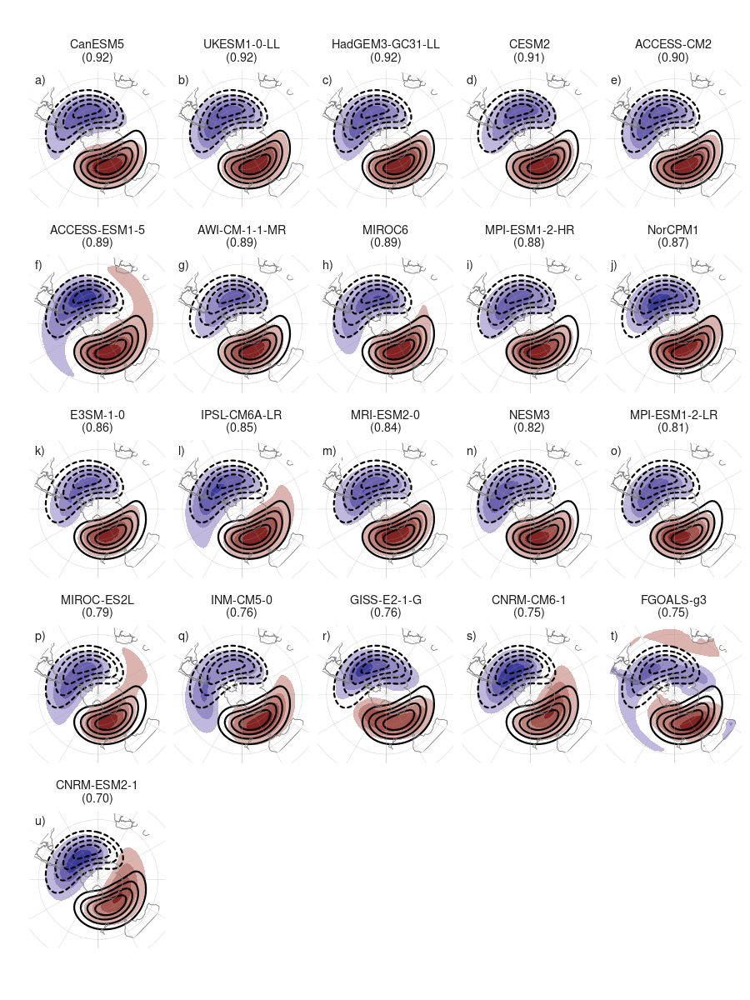
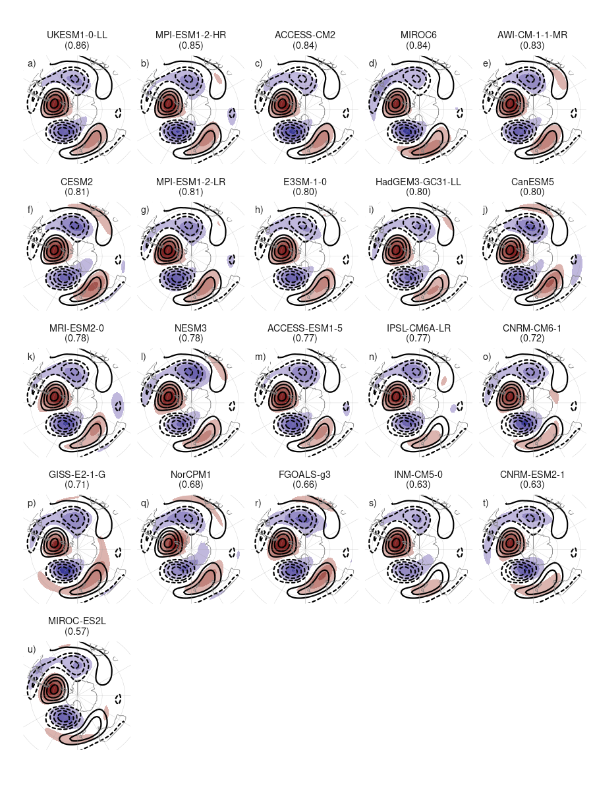
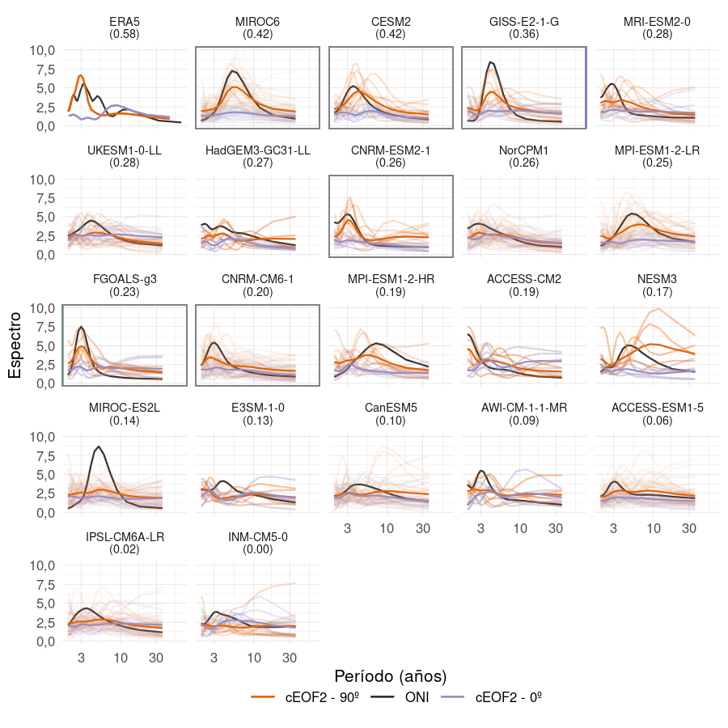
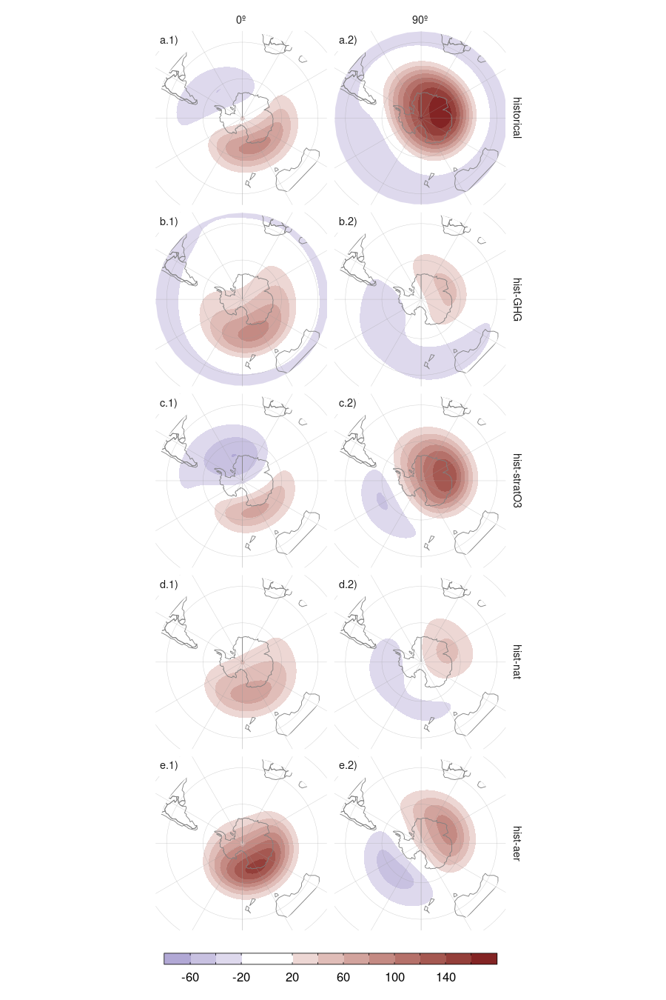

# Análisis de los modos de variabilidad de la circulación zonalmente asimétrica en los modelos del CMIP6 {#cmip6}

El análisis previo estudió la circulación zonalmente asimétrica en los datos de reanálisis.
Sin embargo, el estudio de tendencias y variabilidad de estos modelos se ve limitada por la corta longitud de los datos observacionales y la posible inhomogeneidad del reanálisis al cambiar la densidad y tipo de observaciones; un problema que afecta particularmente al hemisferio sur.
Además, es imposible abordar la atribución de las tendencias observadas a sus posibles causas utilizando únicamente observaciones.

Estas limitaciones motivan completar el trabajo de tesis a partir de la utilización de salidas de modelos climáticos.
En este capítulo se analiza la habilidad de los modelos del sexto Proyecto de Intercomparación de Modelos Acoplados (CMIP6) [@eyring2016] y del Proyecto de Intercomparación de Modelos de Detección y Atribución (DAMIP) [@gillett2016] de capturar estos modos y sus principales características.
Al contar con corridas mucho más largas y múltiples miembros por modelo, es posible evaluar las tendencias a largo plazo con mayor robustez.
Utilizando los modelos incluidos en DAMIP, además es posible avanzar en la atribución de las tendencias observadas.
Por lo que también se utilizaron las simulaciones de DAMIP para explicar los forzantes asociados con las tendencias observadas en los modos de variabilidad de la circulación zonalmente asimétrica del hemisferio sur.

Estudios previos evaluaron las tendencias de los principales modos de circulación del hemisferio sur.
Encontraron que la tendencia positiva del SAM observada en el clima presente es simulada correctamente por los modelos de CMIP5 y CMIP6 y que puede atribuirse tanto al efecto del incremento de los gases de efecto invernadero como a la destrucción del ozono estratosférico [@gillett2013; @ipcc6ch3].

## Métodos

### Datos

El CMIP6 es un proyecto que convoca y coordina a numerosos centros de modelado climático para realizar experimentos numéricos relacionados con el Cambio Climático, bajo protocolos comunes.
Los conjuntos de datos de los diferentes CMIP han sido un insumo fundamental en la elaboración de los reportes del IPCC.
DAMIP es una componente del CMIP6 que cuenta con experimentos particularmente diseñados para realizar estudios de atribución.

Table: (\#tab:modelos)Modelos analizados y la cantidad de miembros para cada experimento.

|Modelo                                                                                | historical| hist-GHG| hist-nat| hist-stratO3| hist-aer|
|:-------------------------------------------------------------------------------------|----------:|--------:|--------:|------------:|--------:|
|MIROC6
[@CMIP6.CMIP.MIROC.MIROC6; @CMIP6.DAMIP.MIROC.MIROC6]                           |         50|       50|       50|           10|        3|
|ACCESS-ESM1-5
[@CMIP6.CMIP.CSIRO.ACCESS-ESM1-5; @CMIP6.DAMIP.CSIRO.ACCESS-ESM1-5]      |         40|        3|        3|            -|        -|
|IPSL-CM6A-LR
[@CMIP6.CMIP.IPSL.IPSL-CM6A-LR; @CMIP6.DAMIP.IPSL.IPSL-CM6A-LR]           |         33|       10|       10|           10|       10|
|CNRM-CM6-1
[@CMIP6.CMIP.CNRM-CERFACS.CNRM-CM6-1; @CMIP6.DAMIP.CNRM-CERFACS.CNRM-CM6-1] |         30|       10|       10|            -|       10|
|MPI-ESM1-2-LR
[@CMIP6.CMIP.MPI-M.MPI-ESM1-2-LR]                                        |         30|        -|        -|            -|        -|
|NorCPM1
[@CMIP6.CMIP.NCC.NorCPM1]                                                      |         30|        -|        -|            -|        -|
|CanESM5
[@CMIP6.CMIP.CCCma.CanESM5; @CMIP6.DAMIP.CCCma.CanESM5]                        |         25|       50|       50|           10|       10|
|UKESM1-0-LL
[@CMIP6.CMIP.MOHC.UKESM1-0-LL; @CMIP6.CMIP.NIMS-KMA.UKESM1-0-LL]           |         16|        -|        -|            -|        -|
|GISS-E2-1-G
[@CMIP6.CMIP.NASA-GISS.GISS-E2-1-G; @CMIP6.DAMIP.NASA-GISS.GISS-E2-1-G]    |         12|       10|       20|            5|        -|
|CESM2
[@CMIP6.CMIP.NCAR.CESM2; @CMIP6.DAMIP.NCAR.CESM2]                                |         11|        3|        3|            -|        -|
|MRI-ESM2-0
[@CMIP6.DAMIP.MRI.MRI-ESM2-0]                                               |         10|        5|        5|            3|        2|
|CNRM-ESM2-1
[@CMIP6.CMIP.CNRM-CERFACS.CNRM-ESM2-1]                                     |         10|        -|        -|            -|        -|
|MPI-ESM1-2-HR
[@CMIP6.CMIP.MPI-M.MPI-ESM1-2-HR]                                        |         10|        -|        -|            -|        -|
|INM-CM5-0
[@CMIP6.CMIP.INM.INM-CM5-0]                                                  |         10|        -|        -|            -|        -|
|FGOALS-g3
[@CMIP6.CMIP.CAS.FGOALS-g3; @CMIP6.DAMIP.CAS.FGOALS-g3]                      |          6|        3|        3|            -|        -|
|HadGEM3-GC31-LL
[@CMIP6.CMIP.MOHC.HadGEM3-GC31-LL; @CMIP6.DAMIP.MOHC.HadGEM3-GC31-LL]  |          5|        5|       10|            -|        4|
|ACCESS-CM2
[@CMIP6.CMIP.CSIRO-ARCCSS.ACCESS-CM2; @CMIP6.DAMIP.CSIRO-ARCCSS.ACCESS-CM2] |          5|        3|        3|            -|        -|
|E3SM-1-0
[@CMIP6.CMIP.E3SM-Project.E3SM-1-0; @CMIP6.DAMIP.E3SM-Project.E3SM-1-0]       |          5|        3|        -|            -|        -|
|AWI-CM-1-1-MR
[@CMIP6.CMIP.AWI.AWI-CM-1-1-MR]                                          |          5|        -|        -|            -|        -|
|NESM3
[@CMIP6.CMIP.NUIST.NESM3]                                                        |          5|        -|        -|            -|        -|
|BCC-CSM2-MR
[@CMIP6.DAMIP.BCC.BCC-CSM2-MR]                                             |          -|        3|        3|            -|        3|
|NorESM2-LM
[@CMIP6.DAMIP.NCC.NorESM2-LM]                                               |          -|        3|        3|            -|        -|
|GFDL-ESM4
[@CMIP6.DAMIP.NOAA-GFDL.GFDL-ESM4]                                           |          -|        1|        3|            -|        -|
|GFDL-CM4
[@CMIP6.DAMIP.NOAA-GFDL.GFDL-CM4]                                             |          -|        -|        3|            -|        -|

Los modelos usados se listan en la Tabla \@ref(tab:modelos) que incluye además la cantidad de miembros de cada uno de los experimentos considerados.
Se utilizaron todos los modelos del CMIP6 con 5 o más miembros en el experimento histórico ("historical") y todos los modelos en los experimentos que contienen únicamente el efecto de los gases de efecto invernadero ("hist-GHG"), variabilidad natural sin forzantes antropogénicos ("hist-nat"), forzantes de aerosoles antropogénicos ("hist-aer") o sólo el efecto de el ozono estratosférico ("hist-stratO3").

El experimento histórico incluye todos los forzantes externos conocidos y está diseñado para evaluar la capacidad de los modelos para simular correctamente el clima presente y el cambio climático observado.
En cambio el resto de los experimentos considerados deja variable un determinado forzante mientras que fija a los otros restantes.
Los experimentos hist-nat son similares pero únicamente incluyen el forzante solar y volcánico, representando la respuesta climática en ausencia de forzantes antropogénicos.
Los experimentos hist-GHG están forzados únicamente con gases de efecto invernadero bien mezclados, dejando fijos otros cambios en la química atmosférica como la concentración de ozono.
Las simulaciones hist-aer incluyen únicamente el forzarte de los cambios en las concentraciones de aerosoles antropogénicos.
Por otra parte, las simulaciones hist-stratO3 únicamente incluyen el forzante de variación del ozono estratosférico, dejando constante el resto de la química atmosférica y las concentraciones de ozono troposférico.

Para calcular los cEOFs de un modelo y experimento determinado y evaluar su desempeño, se concatenaron todos sus miembros en un solo conjunto de datos con lo que se obtuvo un único set de cEOFs.
Es decir este método considera $k$ simulaciones de $n$ años como una única simulación de $k\times n$ años.
Luego, se calcularon los cEOFs siguiendo la metodología de la Sección \@ref(ceof-metodo).
Entonces para cada modelo y experimento se obtuvo un único patrón espacial (complejo) por cEOF pero además una serie temporal (compleja) por miembro.

Para que sea comparable al ERA5, se computaron los cEOFs para el período moderno, entre 1979 y 2014 (el último año disponible para todos los miembros).

Como se explicó anteriormente, los cEOFs no están definidos unívocamente ya que aceptan cualquier rotación en el plano complejo análogamente a como los EOFs aceptan cambios de signo.
Los cEOFs computados en ERA5 fueron rotados para maximizar la correlación con el ozono estatosférico o el ENSO como se describe en la Sección \@ref(ceof-metodo).
Para los modelos de CMIP, se rotaron los cEOFs para maximizar la correlación espacial de los patrones con el correspondiente cEOF de ERA5.
Esto busca que la localización del patrón sea parecida a la observada.

## Comparación con los modos observados

Previo a otros análisis, se decidió evaluar en los modelos la capacidad  de capturar las propiedades de los cEOFs observados.
Para esto se consideraron los experimentos históricos.

La Figura \@ref(fig:comparacion-r2) muestra el $r^2$ de los patrones espaciales de cada modelo para los dos cEOFs.
En general estos valores se extienden entre 57% y 92%.
En todos los casos, la correlación entre el cEOF1 simulado con el observado es mayor que la obtenida para el cEOF2.
Aunque se pueden identificar modelos con menor correlación con los modos observados, como CNRM-ESM2-1 y MIROC-ES2L, aún éstos se asocian con valores mayores al 50%.

(ref:comparacion-r2-cap) Coeficiente de determinación ($r^2$) de los patrones espaciales de cada modelo con ERA5 para el cEOF1 (rojo) y cEOF2 (azul).

(\#fig:comparacion-r2)(ref:comparacion-r2-cap)

(\#fig:todos-ceof1)(ref:todos-ceof1-cap)

(ref:todos-ceof1-cap) Fase de 0º del cEOF1 en 50 hPa (sombreado, valores positivos en rojo, negativos en azul) de las corridas históricas de los modelos de CMIP6 analizados. Los contornos marcan el patrón de ERA5 (valores positivos en líneas llenas, valores negativos en línea punteada). Unidades arbitrarias.

(\#fig:todos-ceof2)(ref:todos-ceof2-cap)

(ref:todos-ceof2-cap) Igual que la Figura \@ref(fig:todos-ceof1) pero para el cEOF2 en 200 hPa.

Para entender mejor los patrones espaciales representados por cada uno de los modelos, las Figuras \@ref(fig:todos-ceof1) y \@ref(fig:todos-ceof2) muestran la fase de 0º del cEOF1 y cEOF2, respectivamente, con los modelos ordenados de acuerdo al $r^2$ del respectivo cEOF y los representados por ERA5.
Para el cEOF1 (Fig. \@ref(fig:todos-ceof1)) todo los modelos excepto FGOALS-g3 (panel t) capturan correctamente el patrón de onda 1 observado.
Las diferencias con ERA5 son mínimas visualmente, como es de esperarse por la alta correlación espacial de estos patrones.
Para el cEOF2 (Fig. \@ref(fig:todos-ceof2)), todos los modelos capturan el patrón de onda 3 localizado en el sector Pacífico-Atlántico.
En particular, el centro positivo al sur de Sudamérica y los centros negativos a los lados del mismo coinciden en todos los modelos con los centros de ERA5.
La principal característica de los modelos con baja correlación es la menor intensidad y mala localización del máximo localizado al sur de Nueva Zelanda.

El patrón medio multimodelo de la fase de cada cEOF en cada nivel, calculado promediando el patrón espacial correspondiente a cada uno de los modelos se muestra en la Figura \@ref(fig:mmm), junto con el $r^2$ de estos patrones con respecto a los observados.
Los patrones son extremadamente similares a los observados en ERA5 y tienen $r^2$ de 94% y 89% para el cEOF1 y el cEOF2 respectivamente.
La media multimodelo es más similar a los patrones observados que cualquier modelo individual, indicando que las deficiencias de cada modelo se compensan al promediar.

(\#fig:mmm)(ref:mmm-cap)

(ref:mmm-cap) Media multimodelo (sombreado, valores positivos en rojo, negativos en azul) de los campos espaciales de cada cEOF, fase y nivel. Los contornos marcan los patrones de ERA5 (valores positivos en líneas llenas, valores negativos en línea punteada). El $r^2$ entre ERA5 y la media multimodelo está entre paréntesis. Unidades arbitrarias.

Los modelos del CMIP6 capturan entonces satisfactoriamente los patrones espaciales de los cEOFs, tanto en la media multimodelo como los modelos individuales.
Lo siguiente es explorar si los modelos logran capturar características de segundo orden, como su variabilidad y relación con otras partes del sistema climático.

### Relación con la variabilidad tropical

Como se mostró en la Sección \@ref(fuentes-ceof), el cEOF2 está fuertemente relacionado con la variabilidad tropical.
Una primera aproximación para explorar esta relación en los modelos del CMIP6 fue calcular la correlación entre el cEOF2 y el ONI de cada modelo (Figura \@ref(fig:cor-enso-plot)).
Se encontró que casi todos los modelos tienen una correlación alta entre el ONI y la fase de 90º del cEOF2 y casi nula correlación entre el ONI y la fase de 0º del cEOF2, lo cual es consistente con las observaciones.
Sin embargo, existe una gran variabilidad en la capacidad de los modelos de capturar esta relación.
Algunos, como MIROC6 y CESM2 tienen una correlación cercana a la observada, pero en la mayoría es mucho menor.
IPSL-CM6A-LR y INM-CM5-0 virtualmente no muestran relación entre el cEOF2 y el ONI.

(ref:cor-enso-plot-cap) Coeficiente de determinación ($r^2$) entre el índice ONI y las fases de 0º (azul)
y 90º (rojo) del cEOF2 para cada modelo del CMIP6 y para ERA5.

(\#fig:cor-enso-plot)(ref:cor-enso-plot-cap)

(\#fig:enso-phase-cmip)(ref:enso-phase-cmip-cap)

(ref:enso-phase-cmip-cap) Valores del ONI en SON y la fase del cEOF2 para los modelos del CMIP6 en el período 1979–2014 y para ERA5 en el período 1979--2020. La línea negra representa el ajuste ONI \~ sen(fase) computado por cuadrados mínimos pesados por la magnitud del cEOF2 de forma equivalente a la Figura \@ref(fig:enso-phase).

(\#fig:arg-enso-density)(ref:arg-enso-density-cap)

(ref:arg-enso-density-cap) Estimación de densidad por núcleos de la fase del cEOF2 para primaveras con ONI menor a -0,5 (verde), entre -0,5 y 0,5 (naranja), y mayor a 0,5 (azul) para los modelos del CMIP6 en el período 1979–2014 y para ERA5 en el período 1979--2020.

La relación entre el cEOF2 y el ENSO se explica por una preferencia de fase cuando el forzante tropical está activo.
Para evaluar esto en los modelos del CMIP6, la Figura \@ref(fig:enso-phase-cmip) muestra la relación entre el ENSO y la fase del cEOF2 para los modelos del CMIP6 y la Figura \@ref(fig:arg-enso-density) la distribución de fases del cEOF2 para primaveras con ONI menor a -0,5, mayor a 0,5 y valores intermedios.
Los modelos con una correlación alta entre el cEOF2 y el ENSO muestran una relación sinusoidal fuerte, mientras que en los modelos con baja correlación la relación es más chata.
Las distribuciones de las fases según categorías del índice ONI (Fig. \@ref(fig:arg-enso-density)) se ven bien separadas en las observaciones y en los modelos con alta correlación entre el cEOF2 y el ONI.
En estos modelos (ej. MIROC6, CESM2), cuando el ENSO está activo (definido como ONI \> 0,5 o ONI \< -0,5), la fase del cEOF2 se concentra cerca de $\pm$ 90º (dependiendo del signo del ONI) mientras que cuando el ENSO no está tan activo (definido como ONI entre -0,5 y 0,5), la distribución de la fase es más uniforme.
En los modelos con baja correlación entre cEOF2 y ONI (ej. IPSL-CM6A-LR, INM-CM5-0) la distribución de fase es uniforme independientemente de la actividad del ENSO.

(\#fig:fft-ceof2)(ref:fft-ceof2-cap)

(ref:fft-ceof2-cap) Espectros de Fourier en cada modelo para la fase de 90º del cEOF2 (naranja), para la fase de 0º del cEOF2 (violeta) y para el ONI (negro). En línea obscura es el espectro promedio de todos los miembros, que se muestran en líneas translúcidas. El espectro del ONI es el espectro promedio de todos los miembros de cada modelo. Los paneles están ordenados de mayor a menor según el $r^2$ entre la fase de 90º del cEOF2 y el ONI, el cual se muestra entre paréntesis en el título de cada panel.

La relación entre el cEOF2 y el ENSO también se evidencia en la similitud del periodograma de las series.
La Figura \@ref(fig:fft-ceof2) muestra el periodograma para el cEOF2 con una línea por miembro y una línea gruesa marcando el periodograma promedio, así como el periodograma promedio del ONI de cada modelo.
La mayoría de los modelos tiene una periodicidad del ONI de \~3 años similar a la observada en ERA5, aunque la intensidad y período máximo varía significativamente.

Todos los modelos que tienen una periodicidad clara en \~3 años en la fase de 90º del cEOF2 también tienen una periodicidad del ENSO muy clara y además tienden a tener una correlación entre la fase de 90º del cEOF2 y el ENSO más alta.
Por otro lado, ninguno de los modelos con muy baja correlación con el ENSO pero periodicidad del ENSO clara presenta periodicidad clara en el cEOF2.

Sin embargo existen modelos con periodicidad del ENSO clara y correlación relativamente alta que no tienen periodicidad del cEOF2 clara.
MRI-ENSM2-0, UKESM1-0-LL, MPI-ESM1-2-LR son algunos ejemplos.

Estas observaciones sugieren que el ENSO es la fuente de periodicidad del cEOF2 en los modelos del CMIP6 pero que su capacidad para representar la periodicidad observada no sólo depende de la periodicidad del ENSO y del grado de correlación entre los índices.

(ref:sst-mmm-cap) Media multimodelo de regresión de la TSM con las fases de 0º y 90º de cada cEOF (K). El área sombreada muestra las zonas donde más de la mitad de los modelos tienen p-valor menor a 0,01. Los contornos negros muestran la regresión de TSM observada en ERA5.

(\#fig:sst-mmm)(ref:sst-mmm-cap)

Para estudiar más en detalle esa relación, se evaluó la relación entre los cEOF y las anomalías de TSM.
La Figura \@ref(fig:sst-mmm) muestra la media multimodelo de la regresión entre TSM y las dos fases de cada cEOF, marcando las zonas donde más de la mitad de los modelos tienen p-valores menores a 0,01.
Los modelos del CMIP6 reproducen los patrones de regresión de la fase de 90º del cEOF2 relativamente bien.
Se observa un exceso de señal en el Pacífico ecuatorial en la fase de 0º del cEOF2 que probablemente se deba a que estos modos no están alineados para minimizar esta relación.
Por otro lado, la señal asociada a la fase de 90º del cEOF1 sí muestra valores excesivamente altos no observados en ERA5.

(ref:cor-sst-regr-cap) Coeficiente de determinación ($r^2$) entre los patrones de regresión de las fases de 0º (violeta) y 90º (naranja) de cada cEOF y la TSM cada modelo y el patrón de regresión respectivo de ERA5.

(\#fig:cor-sst-regr)(ref:cor-sst-regr-cap)

Para tener una visión global y cuantitativa de esta comparación, la Figura \@ref(fig:cor-sst-regr) muestra el $r^2$ entre las regresiones de TSM asociada con la fase de 90º del cEOF2 para cada modelo y la correspondiente regresión para ERA5.
En la mayoría de los modelos el patrón es similar al observado, excepto por INM-CM5-0.
Las regresiones asociadas con la fase de 0º del cEOF2, en cambio, tienen baja similitud con el observado en casi todos los modelos.
Posiblemente esto se deba al exceso de señal presente en la región del ENSO.

### Relación con el SAM

En la Sección \@ref(sam-ceof) se mostró que existía una relación importante entre las distintas fases de los cEOFs y las distintas componentes del SAM.
La Figura \@ref(fig:cor-sam-cmip6) muestra el $r^2$ entre las componentes del SAM y las fases de los cEOFs para los modelos del CMIP6.
Las líneas translúcidas son los valores para cada modelo y las áreas llenas representan el promedio multimodelo y su intervalo de confianza del 95%; la línea gruesa corresponde al valor de ERA5.

(\#fig:cor-sam-cmip6)(ref:cor-sam-cmip6-cap)

(ref:cor-sam-cmip6-cap) Coeficiente de determinación ($r^2$) entre la fase de 0º (columna 1 y 3) y 90º (columna 2 y 4) de los cEOFs con el SAM (fila a), A-SAM (fila b) y S-SAM (fila c) para cada nivel. Las líneas translúcidas son los valores promedio de cada modelo y las áreas llenas representan el promedio multimodelo y su intervalo de confianza del 95%. La línea gruesa es el valor de ERA5. Equivalente a la Figura \@ref(fig:sam-eof-vertical).

Se encuentra que la relación entre el cEOF1 y el SAM en los modelos del CMIP6 es similar a la observada, aunque con diferencias en la magnitud.

En cuanto al cEOF2, los modelos del CMIP6 capturan correctamente la falta de correlación entre fase de 0º del cEOF2 y el SAM y el S-SAM (paneles a.3 y c.3), pero tienen un nivel de correlación más alto de lo esperado con el A-SAM en la tropósfera (panel c.2).
La fase de 90º, en cambio, no muestra la relación observada con el SAM en la tropósfera (panel a.4).
A pesar de esto, sí tiene una relación alta con el A-SAM (panel b.4).
Esto implícitamente sugiere que los modelos CMIP6 no capturan correctamente la relación entre el PSA2 y el SAM, pero esta relación sí aparece si se filtra sólo la variabilidad de la parte asimétrica del SAM.

## Tendencias

De la sección anterior surge que los modelos del CMIP6 logran capturar la estructura espacial de los cEOFs correctamente y que algunos modelos capturan también su variabilidad y relación con otras componentes del sistema climático.

En esta sección, se utilizaron las corridas largas de estos modelos y los experimentos de DAMIP para estudiar las tendencias a largo plazo y sus posibles forzantes.
Para extender las series temporales para todo el período disponible en CMIP6 y DAMIP, se proyectaron los campos espaciales de los dos cEOFs del período 1979--2014 en los campos desde 1850 hasta 2014.

(\#fig:regresion-hgt-damip)(ref:regresion-hgt-damip-cap)

(ref:regresion-hgt-damip-cap) Regresión de anomalías de altura geopotencial (m) con la fase de 0º (columna 1) y de 90º (columna 2) del cEOF1 en 50 hPa para el período 1940--2014 para los experimentos de CMIP6 y DAMIP.

Los patrones espaciales de ambos cEOFs son muy similares en todos los experimentos y comparables con lo observado en la Figura \@ref(fig:mmm) (no se muestra).
La regresión con la altura geopotencial, en cambio, tiene diferencias en el caso del cEOF1.
Estas regresiones se muestran en la Figura \@ref(fig:regresion-hgt-damip) para el nivel de 50 hPa.
Si bien la localización general de los máximos es similar en todos los experimentos, en el experimento historical, la fase de 0º está asociada a una onda 1 mientras que la fase de 90º está asociada un monopolo con el centro sobre la Antártida oriental (Fig. \@ref(fig:regresion-hgt-damip) fila a).
Esto es lo contrario de lo observado en ERA5, donde la fase de 0º era la asociada a una estructura más zonalmente simétrica (Fig. \@ref(fig:eof1-regr-gh)).
Esto ocurre también para el experimento hist-stratO3, aunque en la fase 90 se observa mas bien una onda 1 que un monopolo (Fig \@ref(fig:regresion-hgt-damip), fila c).
Por otra parte, las regresiones para el experimento hist-aer (Fig. \@ref(fig:regresion-hgt-damip) fila e) son mas similares a las observadas, así como aquellas para el experimento hist-GHG (Fig. \@ref(fig:regresion-hgt-damip) fila b) y en menor medida para el experimento hist-nat (Fig. \@ref(fig:regresion-hgt-damip), fila d).

(\#fig:series-largas)(ref:series-largas-cap)

(ref:series-largas-cap) Series temporales de anomalías estandarizadas de los cEOFs computados usando el período 1850 – 2014 promediadas para cada modelo (líneas translúcidas) y su media multimodelo (línea oscura). Las anomalías están computadas con respecto a la media entre 1850 y 1900. En líneas translúcidas se muestran las series de cada modelo.

La Figura \@ref(fig:series-largas) muestra las series temporales durante todo el período.
La fase de 0º del cEOF1 tiene una pequeña tendencia positiva comenzando alrededor de 1940, consistente con la tendencia observada en ERA5 (Fig. \@ref(fig:extended-series)).
Sin embargo, la fase de 90º del cEOF1 tiene una tendencia negativa mucho mayor, la cual no está presente en ERA5.

(\#fig:trends-ceof1)(ref:trends-ceof1-cap)

(ref:trends-ceof1-cap) Tendencias lineales de cada fase del cEOF1 desde 1940. Cada punto representa un miembro, donde los miembros con tendencias significativas (p-valor < 0,01) se marcan con una cruz. La línea vertical punteada representa la tendencia media de todos los modelos.

Las tendencias de cada fase del cEOF1 para cada modelo desde 1940 se muestran en la Figura \@ref(fig:trends-ceof1) junto con la tendencia promedio de todos los modelos.
La tendencia media de la fase de 0º es positiva pero muy pequeña.
Además, los modelos no son consistentes en sus tendencias y sólo algunos modelos tienen una tendencia promedio positiva.
Por otro lado, las tendencias de la fase de 90º son más consistentes.

Estas tendencias son incompatibles con la variabilidad del cEOF1 observado, el cual tiene una tendencia positiva de su fase de 0º y ninguna tendencia en su fase de 90º.
Es posible que los modelos tengan algún problema fundamental al capturar la variabilidad a largo plazo de este modo, ya sea por falencias en la dinámica interna o por algún problema con el forzante involucrado.

También es posible que la tendencia observada se deba a variabilidad interna de baja frecuencia.
En este caso, no sería esperable que los modelos capturen correctamente la fase de esta variabilidad, por lo que no sería observable ni en la media multimodelo ni en las tendencias de cada miembro particularmente en el período 1940--2014.
ERA5 puede considerarse como una realización particular del ensamble climático y es posible que la tendencia particular observada no sea necesariamente representativa del forzante externo.

Alternativamente, dado que el cEOF1 captura el campo medio de las anomalías zonales de altura geopotencial y que los distintos modelos de CMIP6 tienen potencialmente un campo medio distinto a ERA5, es posible que la rotación elegida del cEOF1 no sea la ideal para capturar la variabilidad de largo plazo compatible con lo observado en ERA5.

La Figura \@ref(fig:ceof-damip) muestra las series temporales para los experimentos hist-GHG, hist-nat, hist-stratO3 e hist-aer junto al experimento histórico y la Figura \@ref(fig:mapa-trend) muestra las tendencias de la altura geopotencial en 50 hPa que son explicadas por cada fase del cEOF1 y la suma de ambas.
Esto se calculó como el valor de la regresión lineal entre cada fase del cEOF1 y la altura geopotencial multiplicado por la tendencia lineal de cada fase del cEOF1.
En estas figuras se excluyen los experimentos hist-nat e hist-aer ya que sus tendencias son poco significativas.

(\#fig:ceof-damip)(ref:ceof-damip-cap)

(ref:ceof-damip-cap) Igual que la Figura \@ref(fig:series-largas) pero para cada experimento de DAMIP y el experimento histórico en negro.

(\#fig:mapa-trend)(ref:mapa-trend-cap)

(ref:mapa-trend-cap) Tendencias de altura geopotencial (m por decada) en 50 hPa concordante con la tendencia de la fase de 0º y 90º del cEOF1 y su suma.

La fase de 90º del cEOF1, presenta una tendencia positiva en hist-aer y negativa en hist-GHG y, también negativa pero más débil, en hist-stratO3.
La disminución del ozono estratosférico y el aumento de las concentraciones de GHG contribuyen a la tendencia negativa.
Ambos efectos tienden a reducir la altura geopotencial en 50 hPa sobre la Antártida oriental (Fig. \@ref(fig:mapa-trend) columna 2).
Este efecto combinado de ambos forzantes ha sido ya identificada por trabajos previos como aquella que mayormente explica la intensificación y progresión hacia el polo de los vientos del oeste [@ipcc6ch3].

Para la fase de 0º del cEOF1, ni hist-nat ni hist-aer muestran tendencias significativas, sugiriendo que la tendencia observada no se debe a variabilidad ni al forzante de los aerosoles antropogénicos.
Por otro lado, hist-stratO3 muestra una tendencia mucho mayor a la observada e hist-GHG muestra una tendencia negativa de similar magnitud la de hist-stratO3.
Esto sugiere que el ozono estratosférico y los gases de efecto invernadero tienen efectos contrarios sobre esta fase del cEOF1.

El efecto de la tendencia de la fase de 0º del cEOF1 en el experimento hist-GHG en la altura geopotencial de 50 hPa es una leve anomalía negativa sobre el Mar de Ross (Fig. \@ref(fig:mapa-trend) b.1).
Este patrón indicaría un aumento del jet al Sur de Nueva Zelanda.
Este efecto es opuesto al efecto en el experimento hist-stratO3

(ref:suma-cap) Media multimodelo de las series temporales estandarizadas de las fases de 0º y 90º del cEOF1 para el experimento historical (azul) y para la suma de los experimentos hist-GHG, hist-stratO3 e hist-aer, es decir, los que consideran cambios antropogénicos (rojo). La líneas gruesas indican un suavizado usado regresión local. 

(\#fig:suma)(ref:suma-cap)

Como una primera aproximación al efecto combinado de todos estos forzantes, la Figura \@ref(fig:suma) muestra la media multimodelo de la corrida histórica junto con la suma de las medias multimodelo de las corridas hist-GHG, hist-stratO3 e hist-aer.
Ambas series presentan una tendencia a largo plazo virtualmente idéntica, sugiriendo que el efecto de los forzantes es aproximadamente lineal.

## Conclusiones del capítulo \@ref(cmip6)

Los modelos del CMIP6 consiguen caracterizar la estructura espacial de los cEOFs satisfactoriamente, con una buena correlación entre los patrones espaciales, particularmente para la media multimodelo.
La habilidad de los modelos de capturar sus características de segundo orden, como la relación con el ENSO y el SAM no es tan buena ni homogénea entre modelos.
Sólo algunos modelos, como MIROC6 y CESM2 consiguen capturar con todas sus características la influencia del ENSO en la fase del cEOF2 y la relación de la mayoría de los modelos con el SAM es menor a la observada.

La tendencia levemente positiva de la fase de 0º del cEOF1 es capturada por la media multimodelo y el análisis de las corridas de DAMIP indican que está principalmente asociada por el forzarte del ozono estratosférico parcialmente compensado por el forzante de los gases de efecto invernadero.
Los modelos del CMIP6 también presentan una tendencia negativa importante en la fase de 90º del cEOF1 no presente en las observaciones que la asocian con el forzante de gases de efecto invernadero principalmente y en menor medida con el forzante del ozono y compensados con el forzante de los aerosoles.
