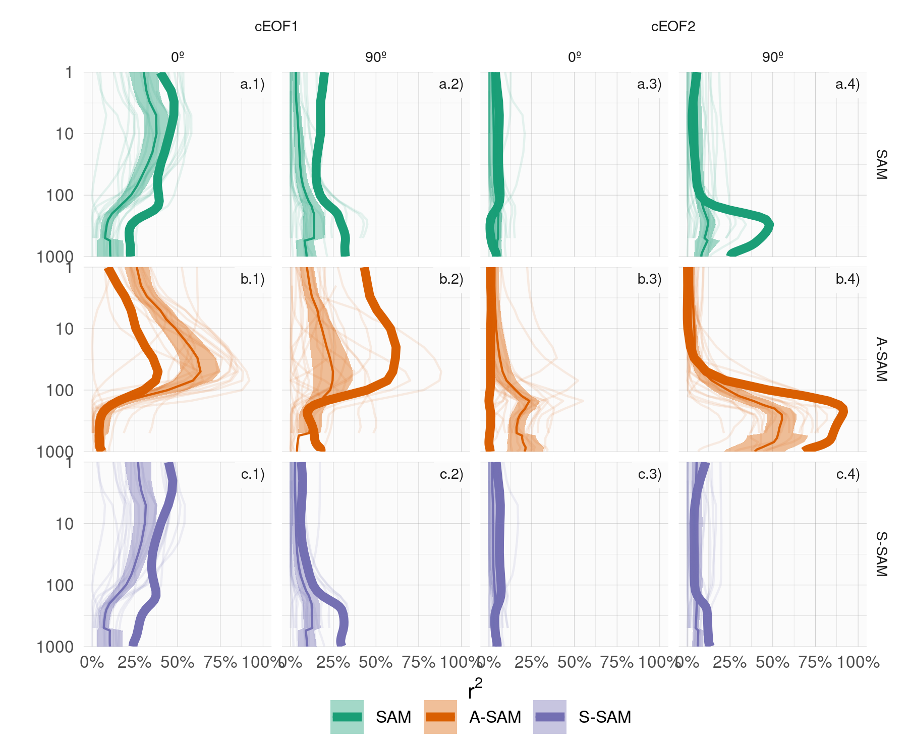
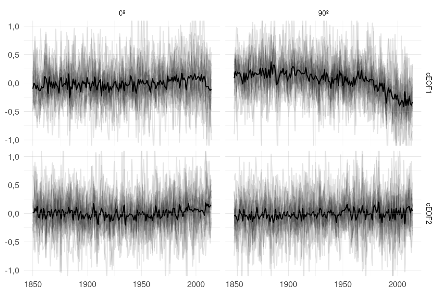

**TODO: Cambiar la nomenclatura de real e imaginaria a fase de 0º y 90º.**

# Análisis de estos modos en los modelos de CMIP6

El análisis previo estudió la circulación zonalmente asimétrica en los datos de reanálisis.
Sin embargo, el estudio de tendencias y variabilidad de estos modelos se ve limitada por la corta longitud de los datos observacionales y la posible inhomogeneidad del reanálisis al cambiar la densidad y tipo de observaciones; un problema que afecta particularmente al hemisferio sur.
Además, es imposible abordar la atribución de las tendencias observadas utilizando únicamente observaciones.

Estas limitaciones motivan la inclusión de datos de modelos climáticos.
En este capítulo se analiza la habilidad de los modelos del sexto Proyecto de Intercomparacion de Modelos Acoplados (CMIP6) y del Proyecto de Intercomparación de Modelos de Detección y Atribución (DAMIP) de capturar estos modos y sus principales características.
Al contar con corridas mucho más largas y múltiples miembros por modelo, es posible evaluar las tendencias a largo plazo con mayor robustez.
Utilizando los modelos incluidos en DAMPI, además podemos avanzar en la atribución de las tendencias observadas.

## Métodos

### Datos

El CMIP6 es un proyecto que organiza numerosos centros de modelado climático para establecer protocolos comunes para realizar experimentos de modelado.
DAMIP es una componente de CMIP6 que cuenta con experimentos particularmente diseñados para realizar estudios de atribución.

Table: (\#tab:modelos)Modelos analizados y la cantidad de miembros para cada experimento.

|Modelo                                                                                 | historical| hist-GHG| hist-nat| hist-aer| hist-stratO3|
|:--------------------------------------------------------------------------------------|----------:|--------:|--------:|--------:|------------:|
|AWI-CM-1-1-MR [@CMIP6.CMIP.AWI.AWI-CM-1-1-MR]                                          |         10|        0|        0|        0|            0|
|FGOALS-g3 [@CMIP6.CMIP.CAS.FGOALS-g3; @CMIP6.DAMIP.CAS.FGOALS-g3]                      |         12|        3|        3|        0|            0|
|CanESM5 [@CMIP6.CMIP.CCCma.CanESM5; @CMIP6.DAMIP.CCCma.CanESM5]                        |         50|       50|       50|       10|           10|
|CNRM-CM6-1 [@CMIP6.CMIP.CNRM-CERFACS.CNRM-CM6-1; @CMIP6.DAMIP.CNRM-CERFACS.CNRM-CM6-1] |         60|       10|       10|       10|            0|
|CNRM-ESM2-1 [@CMIP6.CMIP.CNRM-CERFACS.CNRM-ESM2-1]                                     |         21|        0|        0|        0|            0|
|ACCESS-ESM1-5 [@CMIP6.CMIP.CSIRO.ACCESS-ESM1-5; @CMIP6.DAMIP.CSIRO.ACCESS-ESM1-5]      |         80|        3|        3|        0|            0|
|ACCESS-CM2 [@CMIP6.CMIP.CSIRO-ARCCSS.ACCESS-CM2; @CMIP6.DAMIP.CSIRO-ARCCSS.ACCESS-CM2] |         10|        3|        3|        0|            0|
|IPSL-CM6A-LR [@CMIP6.CMIP.IPSL.IPSL-CM6A-LR; @CMIP6.DAMIP.IPSL.IPSL-CM6A-LR]           |         66|       10|       10|       10|           10|
|MIROC6 [@CMIP6.CMIP.MIROC.MIROC6; @CMIP6.DAMIP.MIROC.MIROC6]                           |        100|       50|       50|        3|           10|
|HadGEM3-GC31-LL [@CMIP6.CMIP.MOHC.HadGEM3-GC31-LL; @CMIP6.DAMIP.MOHC.HadGEM3-GC31-LL]  |         10|        5|       10|        4|            0|
|UKESM1-0-LL [@CMIP6.CMIP.MOHC.UKESM1-0-LL; @CMIP6.CMIP.NIMS-KMA.UKESM1-0-LL]           |         30|        0|        0|        0|            0|
|MPI-ESM1-2-HR [@CMIP6.CMIP.MPI-M.MPI-ESM1-2-HR]                                        |         20|        0|        0|        0|            0|
|MPI-ESM1-2-LR [@CMIP6.CMIP.MPI-M.MPI-ESM1-2-LR]                                        |         60|        0|        0|        0|            0|
|GISS-E2-1-G [@CMIP6.CMIP.NASA-GISS.GISS-E2-1-G; @CMIP6.DAMIP.NASA-GISS.GISS-E2-1-G]    |         24|       10|       20|        0|            5|
|CESM2 [@CMIP6.CMIP.NCAR.CESM2; @CMIP6.DAMIP.NCAR.CESM2]                                |         22|        3|        3|        0|            0|
|NorCPM1 [@CMIP6.CMIP.NCC.NorCPM1]                                                      |         60|        0|        0|        0|            0|
|NESM3 [@CMIP6.CMIP.NUIST.NESM3]                                                        |         10|        0|        0|        0|            0|
|E3SM-1-0 [@CMIP6.CMIP.E3SM-Project.E3SM-1-0; @CMIP6.DAMIP.E3SM-Project.E3SM-1-0]       |         10|        3|        0|        0|            0|
|INM-CM5-0 [@CMIP6.CMIP.INM.INM-CM5-0]                                                  |         20|        0|        0|        0|            0|
|BCC-CSM2-MR [@CMIP6.DAMIP.BCC.BCC-CSM2-MR]                                             |          0|        3|        3|        3|            0|
|MRI-ESM2-0 [@CMIP6.DAMIP.MRI.MRI-ESM2-0]                                               |         20|        5|        5|        2|            3|
|NorESM2-LM [@CMIP6.DAMIP.NCC.NorESM2-LM]                                               |          0|        3|        3|        0|            0|
|GFDL-CM4 [@CMIP6.DAMIP.NOAA-GFDL.GFDL-CM4]                                             |          0|        0|        3|        0|            0|
|GFDL-ESM4 [@CMIP6.DAMIP.NOAA-GFDL.GFDL-ESM4]                                           |          0|        1|        3|        0|            0|

Los modelos usados se listan en la Tabla \@ref(tab:modelos) se listan todos los modelos y la cantidad de miembros de cada uno.
Usamos todos los modelos de CMIP6 con 5 o más miembros en las corridas históricas ("historical") y todos los modelos en los experimentos que contienen únicamente el efecto de los gases de efecto invernadero ("hist-GHG"), variabilidad natural sin forzantes antropogénicos ("hist-nat") y sólo el efecto de el ozono estratosférico ("hist-stratO3").

Para calcular los cEOFs y evaluar su desempeño, concatenamos todos los miembros para computar un único set de cEOFs para cada modelo y experimento.
Este método trata $k$ simulaciones de $n$ años como una única simulación de $k\times n$ años.
Luego, calculamos los cEOFs siguiendo la metodología de la Sección \@ref(ceof-metodo).
El resultado es que cada modelo y experimento tiene un único patrón espacial (complejo) por cEOF pero una serie temporal (compleja) por miembro.

Para que sea comparable al ERA5, computamos los cEOFs para el período moderno, entre 1979 y 2014 (el último año disponible para todos los miembros).

Como se explicó anteriormente, los cEOFs no están definidos unívocamente ya que aceptan cualquier rotación en el plano complejo análogamente a como los EOFs aceptan cambios de signo.
Los cEOFs computados en ERA5 fueron rotados para maximizar la correlación con el ozono estatosférico o el ENSO como se describe en la Sección \@ref(ceof-metodo).
Para los modelos de CMIP, rotamos los cEOFs para maximizar la correlación espacial de los patrones con el correspondiente cEOF de ERA5.
Esto busca que la localización del patrón sea parecido al observado.

## Comparación con los modos observados

Previo a otros análisis, es encesario evaluar la capacidad de los modelos de capturar las propiedades del los cEOFs observados.
Para esto estudiamos los modelos de las corridas históricas.

(ref:comparacion-r2-cap) $r^2$ de los patrones espaciales de cada modelo con ERA5 para cada cEOF.

La Figura \@ref(fig:comparacion-r2) muestra el $r^2$ de los modelos para los dos cEOFs.
Casi todos los modelos tienen una $r^2$ mayor a 0,75, indicando que los modelos logran capturar la estructura espacial de los cEOFs correctamente.
Todos los modelos capturan ligeramente mejor el cEOF1 que el cEOF2.

**TODO: ¿Debería agregar la figura gigante con los cEOFs de cada modelo? Creo que es mucho**

(ref:mmm-cap) Media multimodelo (sombreado) de los campos espaciales de cada cEOF, parte y nivel. Los contornos marcan los patrones de ERA5. El $r^2$ entre ERA5 y la media multimodelo está entre paréntesis.

La Figura \@ref(fig:mmm) muestra los patrones promedio multimodelo para cada cEOF y cada parte (es decir, el promedio de los patrones espaciales de cada modelo).
El patrón medio multimodelo es muy similar similar al patrón de ERA5, con niveles de $r^2$ del orden del 90%, lo cual lo demuestra que la media multimodelo es más similar a las observaciones que los modelos individuales.

(ref:fft-ceof2-cap) Espectros de Fourier para las fases del cEOF2 y del ONI de cada modelo. En línea obscura es el espectro promedio de todos los miembros, que se muestran en líneas translúcidas. El espectro del ONI es el espectro promedio de todos los miembros de cada modelo. Los paneles están ordenados de mayor a menor según el $r^2$ entre la fase de 90º del cEOF2 y el ONI, el cual se muestra entre paréntesis en el título de cada panel.

(ref:ensofft-cap) Espectros de Fourier para los índices ENSO34 de cada modelo. En línea obscura es el espectro promedio de todos los miembros, que se muestran en líneas translúcidas. En recuadro negro, los mismos modelos recuadrados en la Figura \@ref(fig:fft-2).

### Relación con la variabilidad tropical

La Figura \@ref(fig:fft-ceof2) muestra el periodograma para el cEOF2 con una línea por miembro y una línea gruesa marcando el periodograma promedio, así como el peridiograma promedio del ONI de cada modelo.
La mayoría de los modelos tiene una periodicidad del ONI de \~3 años similar a la observada en ERA5, aunque la intensidad y período máximo varía significativamente.

Todos los los modelos que tienen una periodicidad clara en \~3 años en la parte imaginaria del cEOF2 también tienen una periodicidad del ENSO muy clara y además tienden a tener una correlación entre la parte imaginaria del cEOF2 y el ENSO más alta.
Por otro lado, ninguno de los modelos con muy baja correlación con el ENSO pero periodicidad del ENSO clara presenta periocididad clara en el cEOF2.

Sin embargo existen modelos con periodicidad del ENSO clara y correlación relativamente alta que no tienen periodicidad del cEOF2 clara.
MRI-ENSM2-0, UKESM1-0-LL, MPI-ESM1-2-LR son algunos ejemplos.

Estas observaciones sugieren que el ENSO es la fuente de periodicidad del cEOF2 en los modelos de CMIP6 pero que su capacidad para representar la periodicidad observada no sólo depende de la periodicidad del ENSO y del grado de correlación entre los índices.

De todas formas, todos los modelos tienen una correlación entre el ENSO y la fase de 90º del cEOF2 menor a la observada y en muchos de ellos la correlación es prácticamente nula.
Esto indica que si bien los modelos de CMIP6 logran capturar los cEOF, su habilidad para simular la conexión entre éste y el forzante tropical es limitada.

(ref:sst-mmm-cap) Media multimodelo de regresión de TSM con los cEOFs. El área sombreada muestra las zonas donde más de la mitad de los modelos tienen p-valor menor a 0.01. Los contornos negros muestran la regresión de TSM observada en ERA5.

Para estudiar más en detalle esa relación, evaluamos la relación entre los cEOF y las anomalías de TSM.
La Figura \@ref(fig:sst-mmm) muestra la media multimodelo de la regresión entre TSM y las dos fases de cada cEOF, marcando las zonas donde más de la mitad de los modelos tienen p-valores menores a 0.01.
Los modelos de CMIP6 reproducen los patrones de regresión de la fase de 90º del cEOF2 relativamente bien.
Se observa un exceso de señal en el Pacífico ecuatorial en la fase de 0º del cEOF2 que probablemente se deba a que estos modos no están alineados para minimizar esta relación.
Por otro lado, la señal asociada a la parte imaginaria del cEOF1 sí muestra valores excesivamente altos no observados en ERA5.

(ref:cor-sst-regr-cap) R\^2 entre los patrones de regresión de TSM cada modelo y el patrón de regresión de TSM en ERA5.

La Figura \@ref(fig:cor-sst-regr) muestra el $r^2$ los campos de regresión de cada modelo y el campo de regresión de ERA5.
La figura confirma que lo observado para la media multimodelo se cumple para casi todos los modelos individuales.
La mayoría de los modelos tiene un campo de regresión similar a ERA5 para la fase 90º del cEOF2, y una similitud moderada para la fase de 0º.
Para ambas fases del cEOF1, las similitudes son muy bajas.

(ref:enso-phase-cmip-cap) Igual que la Figura \@ref(fig:enso-phase) pero para los modelos del CMIP6. El ajuste sinusoidal para cada modelo se realiza utilizando todos los miembros. 

(ref:arg-enso-density-cap) Estimación de densidad por núcleos de la fase del cEOF2 para primaveras con ONI menor a -0.5, entre -0.5 y 0.5, y mayor a 0.5. 

En la Sección \@ref(fuentes-ceof) argumentamos que la relación entre el ENSO y el cEOF2 se explica por una preferencia de fase cuando el forzante tropical está activo. 
Las Figuras \@ref(fig:enso-phase-cmip) muestra la relación entre el ENSO y la fase del cEOF2 para los modelos de CMIP. 
Los modelos con una correlación alta entre el cEOF2 y el ENSO muestran una relación sinusoidal similar a la observada en ERA5 con fases cercanas a +90º están asociadas a ONI positivo y viceversa. 
La Figura \@ref(fig:arg-enso-density) muestra la distribución de fases del cEOF2 para primaveras con ONI menor a -0.5, mayor a 0.5 y valores intermedios. 
Cuando el ONI está más activo, el cEOF2 tiene una preferencia de fase de $\pm90º$, mientras que cuando se encuentra más neutral, la distribución de la fase del cEOF2 es más uniforme. 
Esta relación sólo existe en los modelos con mayor relación entre el cEOF2 y el ENSO. 
En los modelos con baja correlación, como IPSL-CM6A-LR o INM-CM5-0 la fase del cEOFs es aproximadamente uniforme independientemente del valor del ONI.

### Relación con el SAM

(ref:cor-sam-cmip6-cap) Igual que la Figura \@ref(fig:sam-eof-vertical) pero para los modelos del CMIP6.

En la Figura \@ref(fig:cor-sam-cmip6) se muestra el $r^2$ entre las componentes del SAM y las fases de los cEOFs.
Las líneas translúcidas son los valores promedio de cada modelo y las áreas llenas representan el promedio multimodelo y su intervalo de confianza del 95%; la línea gruesa es el valor de ERA5.

Se observa que la relación entre el SAM y el cEOF2 en los modelos del CMIP6 es prácticamente nula en todos los niveles de la atmósfera, sugiriendo que éstos no capturan esta interacción entre el PSA2 y el SAM.
Sin embargo, sí logran capturar su relación con el A-SAM en la tropósfera; y aunque esta relación tiene menor magnitud en promedio, se observa que ciertos modelos sí consiguen correlaciones comparables con las observadas.

## Tendencias

De la sección anterior surge que los modelos de CMIP6 logran capturar la estructura espacial de los cEOFs así como su variabilidad y relación con otras componentes del sistema climático.
En esta sección, aprovechamos las corridas largas de estos modelos y los experimentos de DAMIP para estudiar las tendencias a largo plazo y sus posibles forzantes. 
Para extender las series temporales para todo el período disponible en CMIP6 y DAMIP, proyectamos los campos espaciales del período moderno en los campos desde 1850 hasta 2014.

(ref:series-largas-cap) Series temporales de anomalías estandarizadas de los cEOFs computados usando el período 1850 -- 2014. Las anomalías están computadas sobre el período 1850 -- 1900. En líneas translúcidas, las series promedio de cada modelo. En línea oscura, la media multimodelo. 

La Figura \@ref(fig:series-largas) muestra las series temporales durante todo el período.
Se observa que la fase de 0º del cEOF1 tiene una tendencia positiva comenzando al rededor de 1950, consistente con la tendencia observada en ERA5 (Fig. \@ref(fig:extended-series)).
También se observa una tendencia negativa para la fase de 90º del cEOF1. 
Ésta no es detectable en ERA5. 
El cEOF2 no presenta tendencias. 

Para tratar de atribuir esta tendencia, computamos los mismos cEOFs para experimentos de DAMIP.
La Figura \@ref(fig:ceof-damip) muestra las series temporales para los experimentos hist-GHG, hist-nat, hist-stratO3 e hist-aer junto a las corridas históricas.

Para la fase de 0º del cEOF1, ni hist-nat ni hist-aer mustran tendencias significativas, sugiriendo que la tendencia observada no se debe a variabilidad ni al forzante de los aerosoles antropogénicos. 
Por otro lado, hist-stratO3 muestra una tendencia mucho mayor a la observada e hist-GHG muestra una tendencia negativa de similar magnitud la de hist-stratO3. 
Esto sugiere que el ozono estatosférico y los gases de efecto invernadero tienen efectos contrarios sobre esta fase del cEOF1. 

Una compensación parcial similar también se observa en la fase de 90º del cEOF1, la cual presenta una tendencia negativa en hist-GHG y positiva en hist-aer. 

(ref:suma-cap)

Como una aproximación, la Figura \@ref(fig:suma) muestra la media multimodelo de la corrida histórica junto con la suma de las medias multimodelo de las corridas hist-GHG, hist-stratO3 e hist-aer.
Sorpendentemente ambas series presentan una variabilidad a largo plazo virtualmente idéntica, sugiriendo que el efecto de los forzantes es aproximadamente lineal.

## Conclusiones
